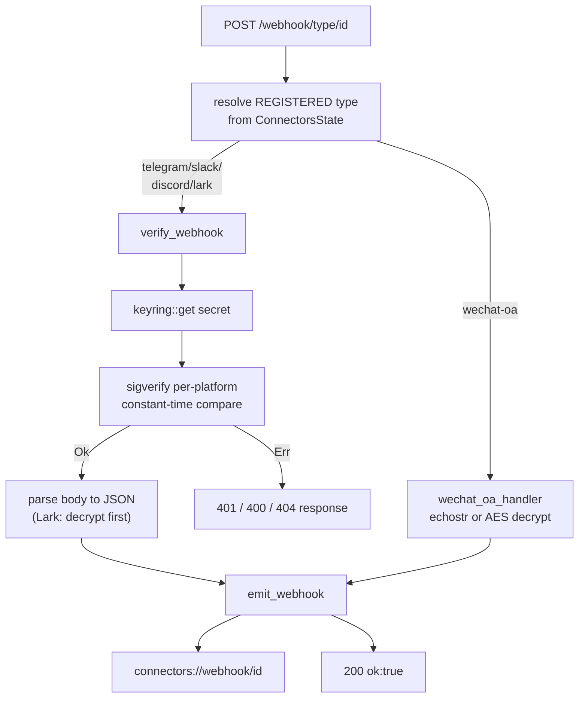
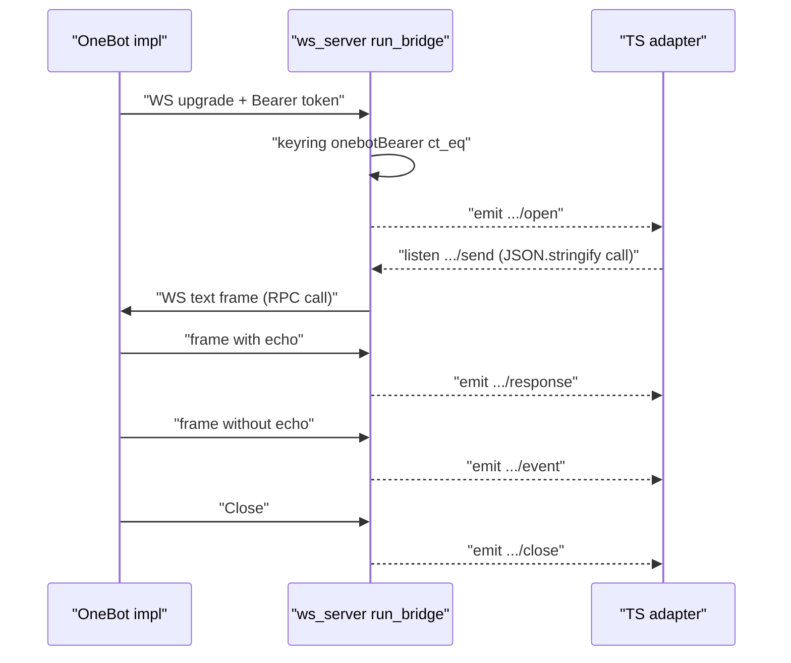

# Rust Layer

<Status variant="stable" />

<TLDR>
  Anything a connector needs that a static-export renderer cannot do safely lives in `src-tauri/src/connectors/`:
  inbound HTTP webhook reception with constant-time signature verification (`sigverify/*`), long-lived WebSocket
  sockets (OneBot reverse-WS in `ws_server.rs`, generic outbound in `ws_client.rs`, Feishu protobuf long-conn in
  `lark_ws.rs`), OS-keyring secret custody (`keyring.rs`), a per-host rate-limited HTTP client (`http_client.rs`),
  and an AES-256-GCM on-disk attachment cache (`attachments.rs`). The axum router (`axum_app.rs`) dispatches each
  `POST /webhook/{type}/{id}` by the **registered** adapter type — never the URL segment — so a spoofed path cannot
  skip verification, then emits the parsed (and for Lark, decrypted) body on `connectors://webhook/<id>`. All of it
  is reachable from the TS side through 18 `#[tauri::command]`s (`commands.rs`) registered in `lib.rs`, and surfaces
  inbound traffic on four Tauri event-channel families.
</TLDR>

<StatGrid>
  <Stat label="Rust source files" value="~14" hint="connectors/ + sigverify/" />
  <Stat label="Tauri commands" value="18" hint="registered in lib.rs:579-596" />
  <Stat label="Signature algorithms" value="5" hint="telegram / slack / discord / lark / wechat" />
  <Stat label="Event-channel families" value="4" hint="webhook / onebot / ws / lark-ws" />
</StatGrid>

This is the native floor under the TS [adapter model](./adapter-model) and the eleven
[built-in adapters](./built-in-adapters): the adapters call typed wrappers in `lib/connectors/tauri/commands.ts`,
which `invoke` the Rust commands below. Inbound frames the Rust layer emits are consumed by the transports and
fed through [inbound gating](./inbound-gating); how each adapter advertises rich content is in
[AI & A2UI](./ai-and-a2ui).

## Why Rust

Three classes of work are forced down into native code:

- **Signature verification** must run where the raw request body and the secret meet without crossing the IPC
  boundary or living in a JS heap. Each platform's scheme — Telegram's secret-token header, Slack's HMAC-SHA256
  basestring, Discord's Ed25519, Lark's token + AES decrypt, WeChat's SHA-1 + AES — is implemented in
  `sigverify/*.rs` with `subtle::ConstantTimeEq` comparisons so a wrong signature leaks no timing.
- **Long-lived sockets** — OneBot's reverse-WS server, Discord/Slack outbound gateways, and Feishu's binary
  protobuf long-connection — need a persistent native event loop. A static-export renderer has no server and would
  drop the socket on navigation; Rust owns the loop and bridges frames to the renderer via Tauri events.
- **Secret custody** lives in the OS keyring (`keyring.rs`, service `com.cognia.platforms`). App secrets such as
  Feishu's `appSecret` are read *inside* Rust (`lark_ws.rs:273-274`) so they never cross IPC.

The HTTP/WS server binds **loopback-only by default** — `connectors_start_server`'s `bind_loopback_only` flag
maps to `LOCALHOST` vs `UNSPECIFIED` (`commands.rs:68-72`) — so the webhook receiver is not exposed to the LAN
unless the operator explicitly opts in.

## The axum Webhook Receiver

`axum_app.rs` builds the router. `build_unresolved_router` (`axum_app.rs:71`) wires `/health`, the catch-all
webhook route, and the OneBot WS routes; `build_router` then attaches the resolved `ConnectorsState`, the
`EmitterExt` (the sink for `connectors://webhook/<id>`), and — in production only — the `AppHandleExt` the
reverse-WS bridge needs.

```rust
// src-tauri/src/connectors/axum_app.rs:71-76
pub fn build_unresolved_router() -> Router<ConnectorsState> {
    let base = Router::new()
        .route("/health", get(health_handler))
        .route("/webhook/{adapter_type}/{adapter_id}", any(webhook_handler));
    ws_server::register_routes(base)
}
```

`webhook_handler` (`axum_app.rs:103`) resolves the adapter's **registered** type from `ConnectorsState`,
branches WeChat-OA off to its bespoke `wechat_oa_handler` (`axum_app.rs:178` — GET `echostr` handshake + POST
`msg_signature` + AES decrypt), and otherwise calls the pure `verify_webhook` (`axum_app.rs:261`). On `Ok` it
emits the payload and returns `200`; on `Err` it returns the verifier's status (`axum_app.rs:138-144`).

The anti-spoof guard is that the URL's `{adapter_type}` segment is discarded — verification dispatches purely on
the type the adapter was registered with:

```rust
// src-tauri/src/connectors/axum_app.rs:275-281
match adapter_type.as_str() {
    "telegram" => verify_telegram(adapter_id, headers, body).await,
    "slack" => verify_slack(adapter_id, headers, body).await,
    "discord" => verify_discord(adapter_id, headers, body).await,
    "lark" => verify_lark(adapter_id, body).await,
    _ => Err((StatusCode::BAD_REQUEST, "unsupported adapter type")),
}
```

Each per-verifier reads its credential from the keyring (`verify_telegram` `secretToken` at `axum_app.rs:284`,
`verify_slack` `signingSecret` at L303, `verify_discord` `publicKey` at L329, `verify_lark`
`verificationToken` + optional `encryptKey` at L354), calls the matching `sigverify` function, and on success
parses the body to JSON. Lark's verifier additionally decrypts `{"encrypt":"<base64>"}` events before reading
the token (`axum_app.rs:367-377`), supporting both schema-2.0 (`header.token`) and legacy (top-level `token`).



## Signature Verification

`sigverify/mod.rs` declares the five verifier modules and the shared `SigError` enum (`Missing` / `Mismatch` /
`Stale`). Each verifier is `AppHandle`-free and unit-tested in isolation.

| Platform | Function (`sigverify/<file>.rs`) | Scheme | Replay guard |
| -------- | -------------------------------- | ------ | ------------ |
| Telegram | `verify_secret_token` (`telegram.rs:9`) | `X-Telegram-Bot-Api-Secret-Token` constant-time equals | — |
| Slack | `verify_v0` (`slack.rs:27`) | HMAC-SHA256 over `v0:<ts>:<body>` → `v0=<hex>` | ±300 s window → `Stale` |
| Discord | `verify_ed25519` (`discord.rs:14`) | Ed25519 over `timestamp ++ body` | — |
| Lark | `verify_token` (`lark.rs:21`) + `decrypt_body` (`lark.rs:50`) | token equals; AES-256-CBC decrypt | — |
| WeChat-OA | `verify_signature` (`wechat.rs:32`) / `verify_msg_signature` (`wechat.rs:52`) / `decrypt` (`wechat.rs:72`) | SHA-1 of sorted parts; AES-256-CBC | — |

### Telegram

A single constant-time header comparison via `subtle::ConstantTimeEq`:

```rust
// src-tauri/src/connectors/sigverify/telegram.rs:9-16
pub fn verify_secret_token(provided: Option<&str>, expected: &str) -> Result<(), SigError> {
    let provided = provided.ok_or(SigError::Missing)?;
    if provided.as_bytes().ct_eq(expected.as_bytes()).into() {
        Ok(())
    } else {
        Err(SigError::Mismatch)
    }
}
```

### Slack

Builds the `v0:<ts>:<body>` basestring, HMAC-SHA256 keyed by the signing secret, formats `v0=<hex>`, and compares
constant-time — having first rejected requests older than 300 s as `Stale`:

```rust
// src-tauri/src/connectors/sigverify/slack.rs:45-54
let base_string = format!("v0:{}:{}", timestamp, String::from_utf8_lossy(body));

let mut mac = HmacSha256::new_from_slice(signing_secret.as_bytes())
    .expect("HMAC can take key of any size");
mac.update(base_string.as_bytes());
let result = mac.finalize().into_bytes();
let expected_hex = format!("v0={}", hex::encode(result));

// Constant-time comparison
if !bool::from(
    expected_hex
        .as_bytes()
```

### Discord

The signed message is `timestamp` bytes concatenated with the body; the hex signature and public key are decoded
and verified with `ed25519_dalek::VerifyingKey::verify`:

```rust
// src-tauri/src/connectors/sigverify/discord.rs:28-35
    let signature = Signature::from_bytes(&sig_bytes);
    let verifying_key = VerifyingKey::from_bytes(&key_bytes).map_err(|_| SigError::Mismatch)?;

    // Message = timestamp bytes ++ body bytes
    let mut message = timestamp.as_bytes().to_vec();
    message.extend_from_slice(body);

    verifying_key
```

### Lark

`verify_token` is a plain equality on the event-header token; encrypted events are decrypted first. The AES key is
`SHA-256(encrypt_key)`, the IV is the first 16 bytes of the decoded ciphertext, and the body is AES-256-CBC with
PKCS#7 padding:

```rust
// src-tauri/src/connectors/sigverify/lark.rs:52-75
    let digest = Sha256::digest(encrypt_key.as_bytes());
    let key_arr: [u8; 32] = digest
        .as_slice()
        .try_into()
        .map_err(|_| SigError::Mismatch)?;

    // Base64-decode the ciphertext
    let raw = BASE64
        .decode(encrypted_b64)
        .map_err(|_| SigError::Mismatch)?;

    if raw.len() < 16 {
        return Err(SigError::Mismatch);
    }

    // IV = first 16 bytes; ciphertext = remainder
    let (iv, ciphertext) = raw.split_at(16);

    let iv_arr: [u8; 16] = iv.try_into().map_err(|_| SigError::Mismatch)?;

    // Decrypt with PKCS#7 unpadding (cbc 0.2 / cipher 0.5 API)
    let decryptor = Aes256CbcDec::new(&key_arr.into(), &iv_arr.into());
```

### WeChat-OA

The signature is the SHA-1 hex of the lexicographically sorted parts — `[token, ts, nonce]` for the GET URL
verification, `[token, ts, nonce, encrypt]` for the POST message signature. "Safe mode" then decrypts with
AES-256-CBC, strips a block-32 PKCS#7 pad manually (the pad value can exceed the AES block size), and reads the
`random(16) ++ msg_len(4 BE) ++ msg ++ appid` layout:

```rust
// src-tauri/src/connectors/sigverify/wechat.rs:94-104
    let pad = *plain.last().ok_or(SigError::Mismatch)? as usize;
    if pad == 0 || pad > 32 || pad > plain.len() {
        return Err(SigError::Mismatch);
    }
    plain.truncate(plain.len() - pad);

    // Layout: random(16) ++ msg_len(4, big-endian) ++ msg ++ appid.
    if plain.len() < 20 {
        return Err(SigError::Mismatch);
    }
    let msg_len = u32::from_be_bytes([plain[16], plain[17], plain[18], plain[19]]) as usize;
```

## OneBot Reverse-WS Bridge

OneBot adapters dial *into* cognia rather than the other way round. `ws_server.rs:83` registers
`/ws/onebot/{adapter_id}`; the handler reads the `onebotBearer` token from the keyring and authenticates the
`Authorization: Bearer …` header — when no token is configured the upgrade is accepted (development no-auth), and
when one is present it is compared constant-time, else `401` (`ws_server.rs:97-124`).

Once upgraded, `run_bridge` (`ws_server.rs:142`) splits the socket and:

- subscribes `connectors://onebot/<id>/send` (the TS adapter emits `JSON.stringify(call)`; the listener decodes
  one level and forwards the call as a WS text frame, `ws_server.rs:150-158`), evicting any prior connection's
  listener on reconnect;
- emits `connectors://onebot/<id>/open` (`ws_server.rs:174`);
- classifies each inbound frame with `route_frame` — frames carrying an `echo` field are API responses → `/response`,
  frames without are event pushes → `/event` (`ws_server.rs:190-195`);
- emits `connectors://onebot/<id>/close` on disconnect (`ws_server.rs:217`), but only if it is still the registered
  connection (a newer reconnect must not be torn down).

```rust
// src-tauri/src/connectors/ws_server.rs:190-195
                let topic = match route_frame(text) {
                    FrameRoute::Response => format!("connectors://onebot/{adapter_id}/response"),
                    FrameRoute::Event => format!("connectors://onebot/{adapter_id}/event"),
                    FrameRoute::Drop => continue,
                };
                let _ = app.emit(&topic, text.to_string());
```



## Generic Outbound WS

`ws_client.rs` is the proxy-aware outbound WebSocket client behind the Discord gateway and Slack Socket Mode
transports. `open_ws` (`ws_client.rs:47`) dials the target (honouring the proxy config when active and not on the
bypass list), returns a stable UUIDv4 handle, and runs two pumps: an mpsc → sink outbound pump and an inbound pump
that emits `connectors://ws/<id>/message`. `ws_send` (`ws_client.rs:162`) pushes onto the handle's channel;
`ws_close` (`ws_client.rs:175`) sends a Close and drops the handle. Lifecycle events ride
`connectors://ws/<id>/{open,message,close}`.

## Lark Protobuf Long-connection

Feishu's long connection speaks a binary protobuf framing (`pbbp2.Frame`) the generic passthrough cannot decode,
so `lark_ws.rs` is a dedicated client. The frame is a manual `prost::Message` derive — no `.proto` / `build.rs`:

```rust
// src-tauri/src/connectors/lark_ws.rs:74-75
#[derive(Clone, PartialEq, ::prost::Message)]
pub struct Header {
```

`open` (`lark_ws.rs:272`) reads `appId` / `appSecret` from the keyring and spawns a self-reconnecting loop with
exponential backoff (`1000 * 2^attempts`, capped at 32 s). `connect_and_run` (`lark_ws.rs:329`) POSTs
`{AppID,AppSecret}` to the endpoint, receives `{URL,ClientConfig}`, dials the URL verbatim, runs a keepalive ping
(default 120 s), and `Frame::decode`s each binary message. `handle_frame` (`lark_ws.rs:444`) reassembles chunked
payloads by `message_id`/`sum`/`seq`, inflates gzip, emits complete `event`/`card` envelopes on
`connectors://lark-ws/<id>/event`, and acks each data frame with a `200` Response built by `build_ack`:

```rust
// src-tauri/src/connectors/lark_ws.rs:137-140
fn build_ack(mut frame: Frame, biz_rt_ms: i64) -> Frame {
    frame.set_header(H_BIZ_RT, biz_rt_ms.to_string());
    let resp = serde_json::json!({ "code": 200, "headers": {}, "data": null });
    frame.payload = serde_json::to_vec(&resp).unwrap_or_default();
```

## OS Keyring

`keyring.rs` wraps the `keyring` crate's OS backend under service `com.cognia.platforms` (`keyring.rs:12`),
keying each secret by account `<adapter_id>:<credential>` (`keyring.rs:14`). `set` (L24), `get` (L33 — `NoEntry`
maps to `None`), and `delete` (L45 — `NoEntry` is success) are the primitives; `list` (L60) probes each supplied
account name and returns the subset that exist, because OS keyrings give no reliable enumeration. The attachment
master key is the one entry stored under an **empty** `adapter_id` and account `attachment-master-key`.

## HTTP Client (rate-limited)

`http_client.rs:77` `http_request` is the outbound HTTP path for every adapter that doesn't need a socket. It
keys a per-host token bucket of 30 requests/second (`DEFAULT_MAX_TOKENS = 30`, `http_client.rs:21-24`) and
rejects over-budget hosts before dialing, applies a 30 s default timeout, and routes through the shared proxy
config unless the URL is on the bypass list.

## Encrypted Attachment Cache

`attachments.rs` caches remote media on disk, encrypted at rest. `fetch_attachment` (`attachments.rs:40`) derives
the cache key as `SHA-256("<adapter_id>:<remote_ref>")` → `<key>.enc`; on a cache hit it decrypts and returns
without touching the network:

```rust
// src-tauri/src/connectors/attachments.rs:54-58
    if enc_path.exists() {
        let plaintext = decrypt_file(&enc_path)?;
        std::fs::write(&raw_path, &plaintext)
            .map_err(|e| format!("cache write failed: {e}"))?;
        return Ok(AttachmentRef {
```

On a miss it `reqwest::get`s the source, AES-256-GCM-encrypts with a 12-byte random nonce prepended to the
ciphertext, and writes both the `.enc` blob and the decrypted copy. The master key is 32 bytes from `OsRng`,
auto-generated into the keyring on first use.

## Tauri Command Surface

`commands.rs` exposes exactly 18 `#[tauri::command]`s — the only entry points the renderer can reach. They are
registered in `src-tauri/src/lib.rs:579-596` (alongside `.manage(ConnectorsState)`), and called through the typed
wrappers in `lib/connectors/tauri/commands.ts`.

| Line | Rust command | TS wrapper |
| ---- | ------------ | ---------- |
| `commands.rs:17` | `connectors_register_adapter` | `connectorsRegisterAdapter` |
| `commands.rs:27` | `connectors_unregister_adapter` | `connectorsUnregisterAdapter` |
| `commands.rs:37` | `connectors_health` | `connectorsHealth` |
| `commands.rs:57` | `connectors_start_server` | `connectorsStartServer` |
| `commands.rs:88` | `connectors_stop_server` | `connectorsStopServer` |
| `commands.rs:109` | `connectors_keyring_set` | `connectorsKeyringSet` |
| `commands.rs:118` | `connectors_keyring_get` | `connectorsKeyringGet` |
| `commands.rs:126` | `connectors_keyring_delete` | `connectorsKeyringDelete` |
| `commands.rs:134` | `connectors_keyring_list` | `connectorsKeyringList` |
| `commands.rs:146` | `connectors_http_request` | `connectorsHttpRequest` |
| `commands.rs:155` | `connectors_ws_open` | `connectorsWsOpen` |
| `commands.rs:164` | `connectors_ws_send` | `connectorsWsSend` |
| `commands.rs:170` | `connectors_ws_close` | `connectorsWsClose` |
| `commands.rs:182` | `connectors_lark_ws_open` | `connectorsLarkWsOpen` |
| `commands.rs:190` | `connectors_lark_ws_close` | `connectorsLarkWsClose` |
| `commands.rs:199` | `connectors_attachment_fetch` | `connectorsAttachmentFetch` |
| `commands.rs:216` | `connectors_lark_upload_file` | `connectorsLarkUploadFile` |
| `commands.rs:233` | `connectors_lark_upload_image` | `connectorsLarkUploadImage` |

`connectors_start_server` takes a `bind_loopback_only` flag that selects `LOCALHOST` vs `UNSPECIFIED`
(`commands.rs:68-72`), and the `connectors_ws_send` command is wrapped in a `perf::guard` so outbound throughput
shows up in the performance dashboard.

## Event Channels

The renderer never polls — the Rust layer pushes inbound traffic and lifecycle on four Tauri event-channel
families. Channels prefixed below with a leading `…` substitute the `<id>`.

| Channel | Emitter | Meaning |
| ------- | ------- | ------- |
| `connectors://webhook/<id>` | `axum_app.rs:47` | a verified (Lark: decrypted) webhook body |
| `connectors://onebot/<id>/open` · `/event` · `/response` · `/close` | `ws_server.rs:174,190-195,217` | reverse-WS lifecycle + routed frames (listens on `…/send`) |
| `connectors://ws/<id>/open` · `/message` · `/close` | `ws_client.rs:122,139,149` | generic outbound WS lifecycle + inbound text |
| `connectors://lark-ws/<id>/event` · `/close` | `lark_ws.rs:479,312` | Feishu long-conn event envelope + terminal close |

## Related

<Cards>
  <Card title="Built-in Adapters" href="./built-in-adapters" description="The eleven TS adapters that call these Rust commands." />
  <Card title="Adapter Model" href="./adapter-model" description="The PlatformAdapter contract the native layer sits under." />
  <Card title="Inbound Gating" href="./inbound-gating" description="Where the frames emitted here are gated before the bus." />
  <Card title="AI & A2UI" href="./ai-and-a2ui" description="How each adapter advertises rich content over these transports." />
</Cards>
