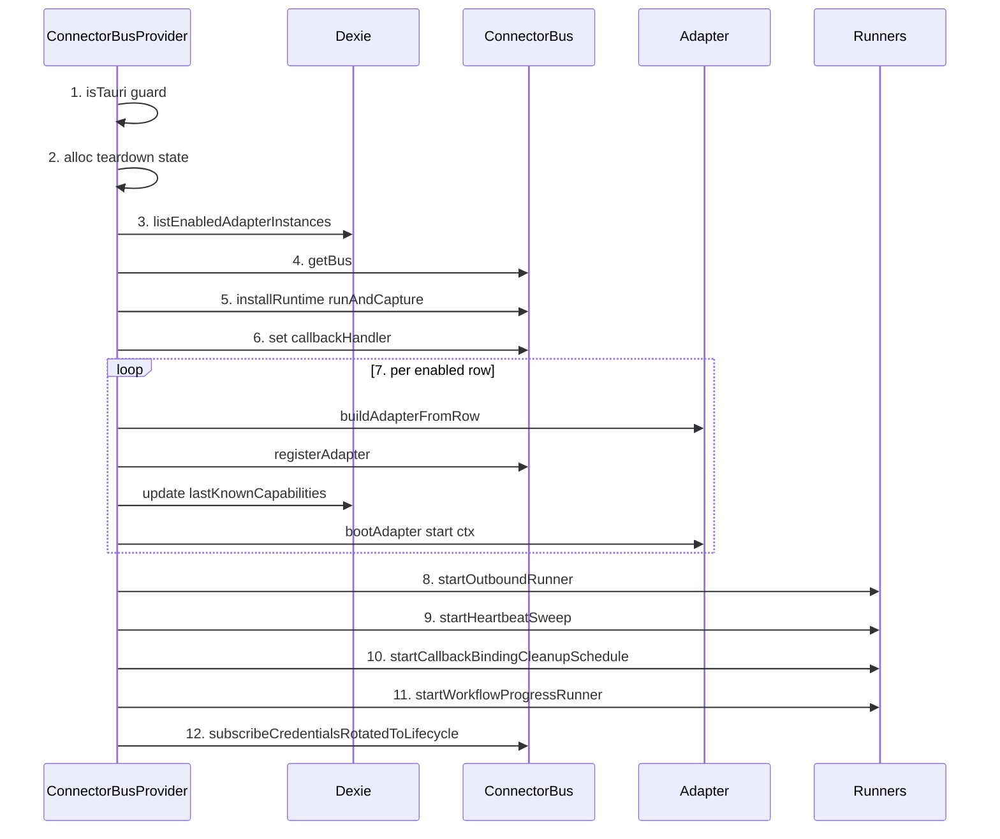
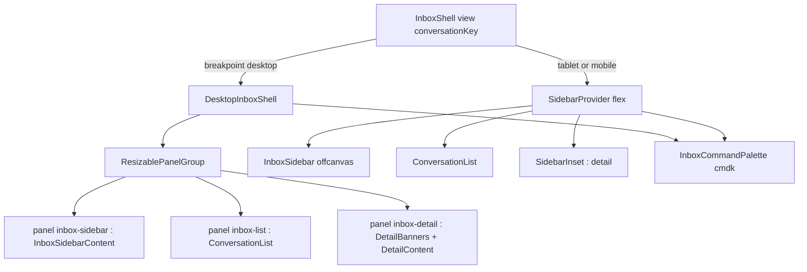
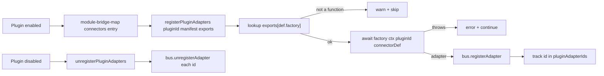

# Inbox UI & Plugin Extension

<Status variant="stable" />

<TLDR>
The Platform Connectors UI is anchored by a single Tauri-only React provider —
`ConnectorBusProvider` — whose one `useEffect` runs a strict twelve-step
bootstrap that boots the bus singleton, wires the runtime + callback handler,
registers and starts every enabled adapter, and launches four background
runners. Everything the operator sees (the three-pane Inbox shell, the
seven-tab Connections settings, mode switcher, draft editor, outbound pill) is
a thin reactive view over Dexie tables via `useLiveQuery`. Plugins extend the
fleet by declaring `connectors` in their manifest; `registerPluginAdapters`
builds each factory's adapter and hands it to the same bus — no new transport,
no privileged path.
</TLDR>

<StatGrid>
  <Stat label="Connections tabs" value="7" />
  <Stat label="Bootstrap steps" value="12" />
  <Stat label="Inbox panes" value="3" />
  <Stat label="Plugin contract fields" value="5" />
</StatGrid>

## The Bootstrap Spine: ConnectorBusProvider

`ConnectorBusProvider({ children })`
(`components/connectors/connector-bus-provider.tsx:54`) is the spine of the
whole subsystem. It renders nothing but `<>{children}</>` — all behaviour lives
in one `useEffect` that fires once on mount. The provider is a strict no-op in
web mode: `if (!isTauri()) return` (`connector-bus-provider.tsx:56`) bails
before any work, because every connector transport (axum, keyring) is a Rust
shim that only exists in the Tauri shell.

The bootstrap is an **ordered twelve-step sequence**:

1. **Tauri guard** — `if (!isTauri()) return` (`connector-bus-provider.tsx:56`).
2. **Teardown state** — allocate the `AbortController`, `cancelled` flag, and
   `startedAdapters` array the cleanup closure later reads
   (`connector-bus-provider.tsx:58-63`).
3. **List enabled rows** — `listEnabledAdapterInstances()` inside a `try/catch`
   that swallows a `NotFoundError` (stale IndexedDB schema) instead of crashing
   the app (`connector-bus-provider.tsx:148-167`).
4. **Acquire the bus** — `const bus = getBus()` returns the process singleton
   (`connector-bus-provider.tsx:170`).
5. **Install the runtime** —
   `installRuntime(bus, { runAndCapture: runAndCaptureAssistantReply })` wires
   the ai-run branch to a real Claude turn (`connector-bus-provider.tsx:177`).
6. **Wire the callback handler** —
   `bus.callbackHandler = defaultConnectorCallbackHandler` so inbound
   interactive events project onto the matching A2UI surface
   (`connector-bus-provider.tsx:183`).
7. **Adapter registration loop** — for each enabled row:
   `buildAdapterFromRow` → `bus.registerAdapter` → refresh
   `lastKnownCapabilities` → `bootAdapter`
   (`connector-bus-provider.tsx:187-212`).
8. **Start the outbound runner** —
   `startOutboundRunner({ adapters, signal: ac.signal })`
   (`connector-bus-provider.tsx:217-218`).
9. **Start the heartbeat sweep** — one consolidated `startHeartbeatSweep()`
   timer services every running adapter (`connector-bus-provider.tsx:225-226`).
10. **Start the callback-binding cleanup schedule** —
    `startCallbackBindingCleanupSchedule()` prunes expired bindings daily
    (`connector-bus-provider.tsx:234-235`).
11. **Start the workflow progress runner** —
    `startWorkflowProgressRunner()` fans IM-triggered workflow runs back out
    through the outbound queue (`connector-bus-provider.tsx:241-242`).
12. **Subscribe credentials-rotated → lifecycle** —
    `subscribeCredentialsRotatedToLifecycle()`, unhooked via the same
    `AbortController` (`connector-bus-provider.tsx:250-255`).

Steps 5, 6 and 8–11 — the runtime/callback wiring and the four runner starts:

```ts
// components/connectors/connector-bus-provider.tsx:177-183
installRuntime(bus, { runAndCapture: runAndCaptureAssistantReply })
bus.callbackHandler = defaultConnectorCallbackHandler
```

```ts
// components/connectors/connector-bus-provider.tsx:217-242
const adapters = new Map(bus.listAdapters().map((a) => [a.id, a]))
void startOutboundRunner({ adapters, signal: ac.signal })
if (!cancelled) heartbeatSweep = startHeartbeatSweep()
if (!cancelled) cleanupHandle = startCallbackBindingCleanupSchedule()
if (!cancelled) stopWorkflowProgressRunner = startWorkflowProgressRunner()
```

### bootAdapter — per-adapter lifecycle

`bootAdapter(adapter, row, bus)` (`connector-bus-provider.tsx:77-146`) drives a
single adapter through its full lifecycle: `buildAdapterContext` →
`adapter.start(ctx)` → `registerRunningAdapter` (with a `restart` closure that
re-reads the persisted row so a credential rotation takes effect without an app
restart) → audit `adapter.started` → fire one immediate `recordHeartbeatNow`
so the Health view has a fresh snapshot for this (re)boot. A `start()` failure
is isolated: it audits `adapter.error` with `reason: "start_failed"`, aborts
the per-adapter signal, and returns `false` without poisoning the loop.

### Cleanup

The effect's return closure (`connector-bus-provider.tsx:258-296`) sets
`cancelled = true`, calls `ac.abort()`, disposes the cleanup/heartbeat/workflow
handles, then walks `listRunningAdapters()` to `unregisterRunningAdapter` each
(auditing `adapter.stopped`). A defensive second pass stops any bare handle in
`startedAdapters` that never made it into the registry, so no transport leaks.



## The Inbox Shell

`InboxShell()` (`components/inbox/inbox-shell.tsx:183`) is a responsive
three-pane layout — sidebar / conversation list / detail — switched by the
shared `useBreakpoint()` hook. `InboxView = "all" | "by-adapter" |
"by-platform" | "conversation"` (`inbox-shell.tsx:41`) drives the sidebar
highlight and the list filter.

- **Desktop (≥ 1024 px)** — `DesktopInboxShell` renders a
  `ResizablePanelGroup` (`inbox-shell.tsx:123`) whose three panels
  (`inbox-sidebar` / `inbox-list` / `inbox-detail`) are draggable and whose
  sizes seed from / persist through `useInboxLayoutStore`. The shadcn
  `<Sidebar>` chrome is *not* rendered; its inner content
  (`<InboxSidebarContent />`) lives in panel 1, but `SidebarProvider` is still
  mounted so the hidden `SidebarTrigger`s keep a valid `useSidebar()` context.
- **Tablet (768–1023 px)** — `SidebarProvider` + flex layout; the sidebar
  starts collapsed (`defaultOpen={!isTablet}`) to free space for the detail
  pane.
- **Mobile (< 768 px)** — a single-pane stack toggled by `conversationKey`:
  `showList = !isMobile || !conversationKey` and
  `showDetail = !isMobile || Boolean(conversationKey)`
  (`inbox-shell.tsx:212-213`). The sidebar becomes an offcanvas Sheet.

`InboxCommandPalette` (cmdk) is mounted in **both** the desktop and the
tablet/mobile layouts.



### Mode switcher

`ModeSwitcher({ conversationKey, sessionId, currentMode, onModeChange })`
(`components/inbox/mode-switcher.tsx:38`) renders a badge-trigger dropdown of
`ALL_MODES` (auto / manual / draft). `handleSelect` (`mode-switcher.tsx:47`)
does two things: it `upsertByConversationKey` into `conversationOverrides`,
then best-effort `invoke("claude_interrupt", { session_id })` to kill any
in-flight stream so a running auto-mode turn does not keep writing after the
operator switches to manual or draft. The invoke is wrapped in a swallowing
`try/catch` — it is a safety valve, not a hard gate.

### Draft editor

`DraftEditor({ draft, onClose })` (`components/inbox/draft-editor.tsx:28`)
renders when a pending draft exists for a conversation. It uses
`useDraftApproval` to expose editable `text` / `markdown` segments (image /
file / voice and A2UI segments render read-only). On approve, the
`beforeApprove` hook enqueues the edited segments onto the outbound queue with
provenance `source: "draft-approved"`:

```tsx
// components/inbox/draft-editor.tsx:31-39
beforeApprove: async ({ segments: edited }) => {
  if (!draft.outboundPreview) return
  await enqueueOutbound({
    adapterId: draft.outboundPreview.conversationRef.adapterId,
    conversationKey: draft.conversationKey,
    request: { ...draft.outboundPreview, segments: edited },
    source: "draft-approved",
  })
},
```

### Outbound status pill

`OutboundStatusPill({ jobId })` (`components/inbox/outbound-status-pill.tsx:45`)
`useLiveQuery`'s `outboundQueue.get(jobId)` and maps the row's status through
`STATUS_CONFIG` (`outbound-status-pill.tsx:34-43`) for its five states —
`pending` / `sending` / `sent` / `failed` / `deadlettered`. A `failed` job
gets a retry button whose `handleRetry` resets the row to `status: "pending"`
with a fresh `nextAttemptAt`. The companion `OutboundSourceBadge`
(`outbound-status-pill.tsx:113`) surfaces provenance: a `workflow`-sourced job
links to `/workflows/{workflowId}/runs/{runId}#node-{nodeId}`; `manual` and
`draft-approved` render as plain colored badges; `ai-run` (the dominant path)
renders nothing.

## Connections Settings

`ConnectionsSection()`
(`components/settings/connections/connections-section.tsx:55`) is the settings
home for the subsystem. The active tab is URL-synced via the
`?connectionsTab=` query param and falls back to `overview`. It wires **seven
tabs** (`TAB_IDS`, `connections-section.tsx:41-49`):

> Note: the file header comment says "Phase 1 ships 4 tabs"
> (`connections-section.tsx:8-13`) but the code wires seven — the header is
> stale. A web-mode `Alert` renders when `usePlatform() !== "tauri"`
> (`connections-section.tsx:69` / `:81`), since the connectors only run in the
> Tauri shell.

| Tab | id | Trigger | Content |
| --- | --- | --- | --- |
| Overview | `overview` | `connections-section.tsx:90` | `OverviewTab` (`:98-99`) |
| Adapters | `adapters` | `connections-section.tsx:91` | `AdaptersTab` (`:101-102`) |
| Conversations | `conversations` | `connections-section.tsx:92` | `ConversationsTab` (`:104-105`) |
| Inbox | `inbox` | `connections-section.tsx:93` | `InboxTab` (`:107-108`) |
| Outbound | `outbound` | `connections-section.tsx:94` | `OutboundTab` (`:110-111`) |
| Audit | `audit` | `connections-section.tsx:95` | `AuditTab` (`:113-114`) |
| Capability | `capability` | `connections-section.tsx:96` | `CapabilityMatrixTab` (`:116-117`) |

## Live Data Bindings

Almost every connector UI surface is a thin reactive projection over Dexie via
`useLiveQuery` — no imperative refresh, no manual subscription. The bus and
runners write the tables; the UI re-renders.

| Table | Index / key | Consumer (reads via useLiveQuery) |
| --- | --- | --- |
| `sessions` | — | conversation-list, page-client |
| `messages` | `[sessionId+createdAt]` | preview / unread counters |
| `conversationOverrides` | conversationKey | mode map (written by mode-switcher) |
| `connectorDrafts` | `[conversationKey+createdAt]` | draft-banner |
| `outboundQueue` | jobId | outbound-status-pill |
| `adapterInstances` | id | inbox-sidebar |
| `connectorCallbackBindings` | — | debug inspector |

## Plugin Adapter Extension

Plugins join the connector fleet by declaring `connectors` entries in their
manifest. The renderer-side bridge
(`lib/plugin/bridge/connectors-bridge.ts:124`) is intentionally thin: it only
discovers factories and wires them; policy, FIFO queuing, and retries all flow
through the existing bus/runner machinery unchanged. Plugin adapters run in the
renderer (TypeScript), exactly like built-in adapters, and reach Rust transport
primitives through the same `lib/connectors/tauri/commands.ts` shims.

`registerPluginAdapters(pluginId, manifest, exports)`
(`connectors-bridge.ts:61`) reads `manifest.connectors`, looks up each def's
`factory` in the plugin's `exports`, awaits the factory, and registers the
resulting adapter with the bus, collecting the ids into the module-level
`pluginAdapterIds` map (`connectors-bridge.ts:50`):

```ts
// lib/plugin/bridge/connectors-bridge.ts:72-95
for (const def of defs) {
  const factoryFn = exports[def.factory]
  if (typeof factoryFn !== "function") {
    console.warn(`[connectors-bridge] plugin ${pluginId}: factory "${def.factory}" not found in exports — skipping`)
    continue
  }
  let adapter: PlatformAdapter
  try {
    adapter = await (factoryFn as AdapterFactory)({ pluginId, connectorDef: def })
  } catch (err) {
    console.error(`[connectors-bridge] plugin ${pluginId}: factory "${def.factory}" threw —`, err)
    continue
  }
  bus.registerAdapter(adapter)
  ids.push(adapter.id)
}
```

`unregisterPluginAdapters(pluginId)` (`connectors-bridge.ts:102`)
`bus.unregisterAdapter`s every id the plugin owns and deletes the map entry.
Both are wired into the plugin lifecycle through
`lib/plugin/contracts/module-bridge-map.ts:163-173`, which routes the
`connectors` manifest field to `register`/`unregister` on plugin
enable/disable — the manager supplies `moduleExports` from the loader's cache
because the factory lookup is by exported name, not by per-entry importer.

### The PluginConnectorDef contract

Each entry in `manifest.connectors` (referenced from `PluginManifest.connectors`
at `types/plugin/plugin.ts:555`) is a five-field `PluginConnectorDef`
(`types/plugin/plugin.ts:928-942`):

```ts
// types/plugin/plugin.ts:928-942
export interface PluginConnectorDef {
  /** Platform kind string (e.g. "telegram", "discord", or a custom string). */
  type: string
  /** Name of the exported factory function from the plugin's main entrypoint. */
  factory: string
  /** JSON Schema (draft-07) describing the per-instance settings shape. */
  configSchema: object
  /** Default trigger policy (optional — overridden by bus defaults if absent). */
  defaultTrigger?: Record<string, unknown>
  /** Transport modes this adapter supports. */
  transportModes: string[]
}
```



## Related

<Cards>
  <Card title="Connector Bus" href="./connector-bus" description="The singleton the provider boots: registration, dispatch pipeline, callback handler." />
  <Card title="Outbound Queue" href="./outbound-queue" description="The FIFO queue the draft editor enqueues into and the status pill subscribes to." />
  <Card title="Health & Audit" href="./health-audit" description="Heartbeat sweep + audit trail the bootstrap and lifecycle write into." />
  <Card title="Subsystem Index" href="./index" description="Platform Connectors overview and schema versions." />
  <Card title="Plugin System" href="../plugin-system" description="Manifest, lifecycle, and the module bridge map that routes connectors." />
  <Card title="Connector Adapter Dev Guide" href="../../plugin-dev/connector-adapters" description="How to author a plugin connector adapter and its PluginConnectorDef." />
</Cards>
