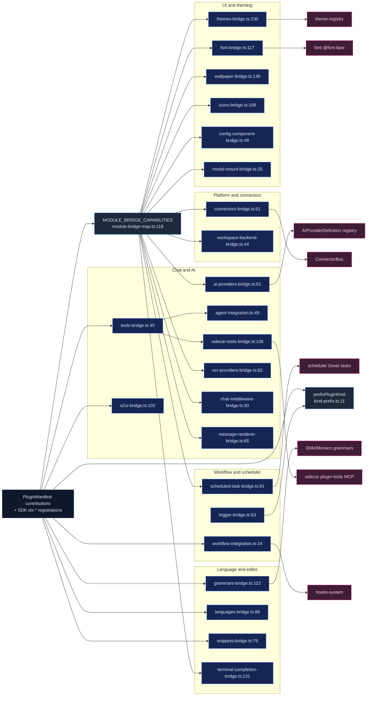

# Contribution bridges

<Status variant="experimental" />

<TLDR>
  A bridge is the seam between plugin-declared contributions — static `manifest.*` extension-point
  arrays or imperative SDK `ctx.*` registrations — and a host subsystem, adapting the declared shape
  into the host's native interface and registering it keyed by `pluginId` for idempotent teardown.
  Most async bridges share a uniform `register(manifest, installRoot, { importer })` plus
  `unregister(pluginId)` contract, dispatched generically by `PluginManager` through the field-driven
  table `MODULE_BRIDGE_CAPABILITIES` (`module-bridge-map.ts:118`), which gates each entry on
  `manifest[manifestField]?.length` and normalizes 11 signatures behind one await loop (`:84-110`).
  VS Code-style bridges (grammars, icons, languages, snippets) are storage-only registries driven by
  `vscode-loader`/`context.ts`, not by this table; `index.ts` (`:5-22`) only re-exports the four class
  bridges (A2UI, Tools, Agent, Workflow); `prefixPluginKind` (`kind-prefix.ts:11`) namespaces
  contributed workflow-node, trigger, and catalog ids.
</TLDR>

<StatGrid>
  <Stat label="Bridge files" value="26" hint="lib/plugin/bridge/ TS, excl. tests" />
  <Stat label="Async dispatch entries" value="11" hint="MODULE_BRIDGE_CAPABILITIES (module-bridge-map.ts:118)" />
  <Stat label="Re-exported class bridges" value="4" hint="A2UI · Tools · Agent · Workflow (index.ts:5-22)" />
  <Stat label="VS Code storage bridges" value="4" hint="grammars · icons · languages · snippets" />
  <Stat label="Dispatch tables" value="2" hint="module-bridge-map (async) + capability-bridge-map (sync overlay)" />
  <Stat label="Teardown key" value="pluginId" hint="idempotent unregister per plugin" />
</StatGrid>

## What It Is

A bridge is the seam between what a plugin *declares* and what the host *runs*. A plugin declares
contributions in two ways: statically, as extension-point arrays on its manifest (`manifest.themes`,
`manifest.connectors`, `manifest.aiProviders`, …), or imperatively, by calling an SDK `ctx.*`
registration from inside `activate()` (`ctx.agent.registerTool`, `ctx.a2ui.registerComponent`, …).
A bridge takes that declared shape, optionally lazy-imports a factory `entry` from the plugin's
install root, adapts it into the host's native interface, and registers it into the host's live
registry — always keyed by `pluginId` so teardown is idempotent.

Most async bridges expose the same contract:

```ts title="Uniform async bridge contract"
register(
  manifest: PluginManifest,
  installRoot: string,
  { importer }: { importer: ModuleImporter },
): Promise<{ registered: number; errors: BridgeError[] }>

unregister(pluginId: string): void | Promise<void>
```

`PluginManager` never calls these bridges by name. It walks the field-driven table
`MODULE_BRIDGE_CAPABILITIES` (`module-bridge-map.ts:118`), gating each entry on
`manifest[manifestField]?.length` and normalizing all 11 signatures behind a single await loop
(`:84-110`). VS Code-style bridges (grammars, icons, languages, snippets) are *not* in this table —
they are storage-only registries driven by `vscode-loader`/`context.ts`. The barrel `index.ts`
(`:5-22`) only re-exports the four class bridges (A2UI, Tools, Agent, Workflow).

`prefixPluginKind` (`kind-prefix.ts:11-16`) namespaces every contributed workflow-node, trigger, and
catalog id so two plugins can never collide: `trigger.foo` becomes `trigger.${pluginId}.foo`
(the leading `trigger.` is preserved), and everything else becomes `${pluginId}.${rawKind}`.

## Bridge catalog

| File | Consumes | Feeds | Key export(s) `:line` |
| --- | --- | --- | --- |
| `index.ts` | — | re-export barrel | `:5-22` |
| `kind-prefix.ts` | raw kind strings | id namespacing | `prefixPluginKind` `:11` |
| `tools-bridge.ts` | `PluginTool` (SDK `registerTool`) | renderer agent (`AgentTool`) + plugin store | `PluginToolsBridge` `:30`, `registerTool` `:45`, `convertToAgentTool` `:108`, `jsonSchemaToZod` `:177` |
| `sidecar-tools-bridge.ts` | enabled plugins' tools (store) | SDK sidecar `cognia-plugin-tools` MCP | `buildPluginToolsManifest` `:108`, `buildTerminalDockManifestEntries` `:61` |
| `agent-integration.ts` | plugin tools + modes (store) | agent tools/modes merge | `PluginAgentBridge` `:43`, `getPluginTools` `:49`, `getPluginModes` `:76`, `executeTool` `:114`, `mergeWithBuiltinTools` `:337` |
| `a2ui-bridge.ts` | `PluginA2UIComponent` / `A2UITemplateDef` (SDK) | A2UI catalog + surface lifecycle hooks | `PluginA2UIBridge` `:35`, `registerComponent` `:102`, `registerTemplate` `:206`, `createSurfaceFromTemplate` `:247`, `dispose` `:332` |
| `ai-providers-bridge.ts` | `manifest.aiProviders[]` | host `AIProviderDefinition` registry | `registerAiProvidersForPlugin` `:61`, `adaptLlmToHost` `:138`, `adaptEmbeddingToHost` `:176` |
| `ocr-providers-bridge.ts` | `manifest.ocrProviders[]` | OCR registry | `registerOcrProvidersForPlugin` `:62` |
| `workspace-backend-bridge.ts` | `manifest.workspaceBackends[]` | `WorkspaceProvider` registry | `registerWorkspaceBackendsForPlugin` `:44` |
| `message-renderer-bridge.ts` | `manifest.messageRenderers[]` | chat message-part renderer registry | `registerMessageRenderersForPlugin` `:65`, `isReservedPartType` `:56` |
| `connectors-bridge.ts` | `manifest.connectors[]` (factory in exports) | `ConnectorBus` adapters | `registerPluginAdapters` `:61`, `unregisterPluginAdapters` `:102` |
| `chat-middleware-bridge.ts` | `manifest.chatMiddlewares[]` | chat-middleware registry (exec gated off) | `registerChatMiddlewaresForPlugin` `:30` |
| `terminal-completion-bridge.ts` | `manifest.terminalCompletionProviders[]` + SDK | terminal completion registry (ADR-0039) | `registerTerminalCompletionProvidersForPlugin` `:131`, `adaptPluginCompletionProvider` `:59` |
| `scheduled-task-bridge.ts` | `manifest.scheduledTasks[]` | scheduler Dexie tasks (type `plugin`) | `registerScheduledTasksForPlugin` `:91`, `toTaskTrigger` `:60` |
| `modal-mount-bridge.ts` | `manifest.modalMounts[]` | plugin modal store | `registerModalMountsForPlugin` `:25` |
| `config-component-bridge.ts` | `manifest.configComponent` | per-plugin settings panel (on demand) | `loadConfigComponent` `:49`, `invalidateConfigComponentForPlugin` `:90` |
| `font-bridge.ts` | `manifest.fonts[]` | `<style>` `@font-face` + font-registry | `applyPluginFonts` `:117`, `revertPluginFonts` `:205`, `buildFontFaceRule` `:236` |
| `wallpaper-bridge.ts` | `manifest.wallpapers[]` | wallpaper registry (picker) | `applyPluginWallpapers` `:139`, `revertPluginWallpapers` `:173` |
| `themes-bridge.ts` | `manifest.themes[]` + `themePacks[]` | theme-registry + theme-pack-registry | `PluginThemesBridge` `:225`, `registerPluginThemes` `:230`, `registerPluginThemePacks` `:293`, `sanitizeCssVariables` `:119` |
| `grammars-bridge.ts` | `contributes.grammars[]` (TextMate) | Shiki/Monaco grammar store | `registerGrammar` `:122`, `unregisterGrammarsByPlugin` `:177`, `findGrammarByScopeName` `:210` |
| `icons-bridge.ts` | `contributes.iconThemes[]` | icon system + Monaco file-icon | `registerIconTheme` `:108`, `resolveFileIcon` `:172` |
| `languages-bridge.ts` | `contributes.languages[]` | language/mime detection + Monaco | `registerLanguage` `:88`, `detectLanguage` `:156` |
| `snippets-bridge.ts` | `contributes.snippets[]` (VS Code JSON) | Monaco completion + slash palette | `registerSnippetFile` `:79`, `listSnippetsForLanguage` `:139` |
| `trigger-bridge.ts` | plugin-emitted trigger events (SDK) | workflow orchestrator `dispatchTrigger` | `dispatchPluginTrigger` `:53` (uses `prefixPluginKind` `:57`) |
| `workflow-integration.ts` | plugin hooks (store) | hooks-system dispatch (chat/workflow/export/RAG lifecycle) | `PluginWorkflowIntegration` `:18`, `processMessageBeforeSend` `:24`, `getPluginWorkflowIntegration` `:176` |
| `terminal-dock-schemas.ts` | none (built-in) | JSON Schemas for 4 synthetic dock tools | `TERMINAL_DOCK_*_SCHEMA` `:24`/`:58`/`:82`/`:100`, `TERMINAL_DOCK_PLUGIN_ID` `:19` |

## The dispatch flow



## Common bridge pattern

Most async bridges follow the lazy-factory archetype. `ai-providers-bridge.ts:73-98` clears prior
state, resolves the SDK API, adapts each contribution, and records a per-plugin disposer list:

```ts title="ai-providers-bridge.ts:73-98 (lazy-factory archetype)"
unregisterAiProvidersForPlugin(pluginId)
const api = createAIProviderAPI(pluginId)
for (const def of defs) {
  try {
    const adapted = await adaptProvider(def, pluginId, installRoot, importer, options)
    const unregister = api.registerProvider(adapted)
    unregistrars.push(unregister)
    registered++
  } catch (err) {
    errors.push({ pluginId, providerId: def.id, message })
  }
}
unregistrarsByPlugin.set(pluginId, unregistrars)
```

Three roles recur in every async bridge:

- **subscribe/resolve** — `adaptProvider` (`:100-113`) dynamic-imports `installRoot`/`entry` and looks
  up the named factory.
- **transform** — `adaptLlmToHost` (`:138`) wraps a buffered `complete()` into an
  `AsyncIterable<AIChatChunk>`.
- **register + cleanup** — `api.registerProvider` returns a disposer; teardown runs
  `unregisterAiProvidersForPlugin` (`:207-218`).

`themes-bridge.ts:240-271` shows the collected-errors variant: each contribution is resolved with
`resolveContribution` then registered with a namespaced id `${pluginId}.${contributionId}`, the loop
never throws, and errors are collected; `unregisterPluginThemes(pluginId)` (`:280`) is idempotent.

The `kind-prefix` namespacing is visible at the trigger seam:

```ts title="trigger-bridge.ts:57"
const prefixedKind = prefixPluginKind(pluginId, kind)
const registration = findAnyTriggerVersion(prefixedKind)
await dispatchTrigger({ workflowId, kind: prefixedKind as never, payload, originAt })
```

## Notable bridges

- **chat-middleware-bridge (`:30`)** — registers each `manifest.chatMiddlewares[]` with
  `priority`/`timeoutMs` (`:49-55`). Registration is not execution: the runner
  `runChatMiddlewareChain` fires only behind a default-off flag
  (`lib/claude/chat-middleware/feature-flag.ts`; `module-bridge-map.ts:216-232`). Disable clears the
  breaker (`:65`).
- **tools-bridge vs sidecar-tools-bridge** — in-process (`PluginToolsBridge:30`, JSON-Schema to Zod at
  `:177`, an `AgentTool` with a live `execute` at `:108-152`) versus out-of-process
  (`buildPluginToolsManifest:108` flattens enabled plugins' tools, strips the `execute` fn, the sidecar
  builds an MCP server and round-trips via `plugin_tool_exec`). A single `ctx.agent.registerTool()`
  lights up both.
- **workflow-integration (`PluginWorkflowIntegration:18`)** — fans plugin lifecycle *hooks* through the
  hooks-system (not custom nodes); `processMessageBeforeSend:24-49`.
- **connectors-bridge (`:61`)** — invokes each `manifest.connectors[].factory` (looked up in plugin
  exports `:73-87`), calls `bus.registerAdapter` (`:89`), and tracks adapter ids per plugin (`:50`) for
  teardown (`:102`).
- **ai-providers-bridge (`:61`)** — adapts buffered `complete`/`embed` into a streaming
  `AIProviderDefinition`; the provider id is namespaced `${pluginId}:${def.id}` (`:115`).
- **a2ui-bridge (`PluginA2UIBridge:35`)** — registers components into the A2UI catalog wrapped in a
  context-injecting HOC (`createWrappedComponent:157`) with a `role="alert"` degraded fallback
  (`:177-186`); `dispose` at `:332`.
- **config-component-bridge (`loadConfigComponent:49`)** — on-demand; lazy-imports
  `manifest.configComponent.entry`, cached per `pluginId` (`:74`), with a null fallback to the generic
  config form (`:76-81`) and invalidation on disable/reload (`:90`).

## Gotchas

- **Registration is not execution (default-off)** — chat-middleware registers on enable but runs only
  behind the feature flag (`chat-middleware-bridge.ts:14-16`); terminal-dock tools appear only when
  `settings.terminal.exposeDockToAgents` is true (`sidecar-tools-bridge.ts:64`, default off `:49`);
  scheduled tasks honour `def.defaultEnabled === false` by pausing the new row
  (`scheduled-task-bridge.ts:128-130`).
- **Two dispatch tables** — `module-bridge-map.ts` (11 async/asset bridges) versus
  `capability-bridge-map.ts` (synchronous inline-def overlay capabilities). The VS Code-style storage
  bridges (grammars, icons, languages, snippets) are in neither — they are driven by
  `vscode-loader`/`context.ts`. The header (`module-bridge-map.ts:24-27`) notes these 7 bridges were
  built and tested but silently no-op'd until wired.
- **Field-driven gating + synthetic keys** — dispatch gates on `manifest[manifestField]?.length`;
  capabilities with no union tag (workspace-backend, message-renderer, chat-middleware, modal-mount,
  density-preset) use synthetic keys (`:148-162`).
- **terminal-dock-schemas is not a plugin** — it is a built-in capability
  (`TERMINAL_DOCK_PLUGIN_ID = "cognia:builtin:terminal-dock"`, `:19`) surfaced through the plugin-tools
  wire and dispatched renderer-side by the `terminal_dock_` prefix (`:21-22`).
- **Async unregister** — the scheduler's `unregister` is async (it deletes Dexie rows,
  `module-bridge-map.ts:273-275`); the manager awaits all of them.
- **Idempotency / re-enable** — bridges clear prior plugin state at the top of `register`
  (`ai-providers-bridge.ts:73`; font/wallpaper replace-not-append `:142-143`). Class bridges keep
  test-only `__reset…ForTesting` singletons.
- **Reserved namespaces / collisions** — `message-renderer-bridge` rejects host-reserved `partType`s
  (`:46-54`); grammars/languages throw on cross-plugin id collision (`grammars-bridge.ts:152`,
  `languages-bridge.ts:110`); a2ui warns-and-overwrites (`a2ui-bridge.ts:106-112`); themes sanitize CSS
  vars against `</style>` injection (`themes-bridge.ts:143`) and reject path-traversal in
  `vscodeJsonPath` (`:55-62`).

## Next

<Cards>
  <Card title="Contracts & registries" href="./contracts-and-registries" description="The MODULE_BRIDGE_CAPABILITIES / capability-bridge-map tables and the host registries bridges feed" />
  <Card title="Context API (ctx)" href="./context-api" description="The ctx.* registration surface that imperative bridges consume from activate()" />
  <Card title="Core runtime" href="./core-runtime" description="The PluginManager lifecycle that drives bridge register/unregister at enable/disable" />
</Cards>
