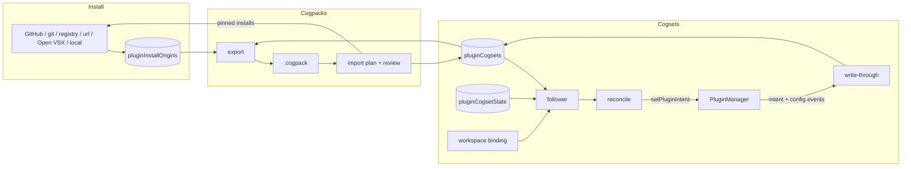

# Cogsets, cogpacks & install origins

<Status variant="experimental" />

<TLDR>
A **cogset** is a named set of plugins that run together. Switching is exclusive: its members, the host's always-on set and their required dependencies run. Everything else is turned off. Nothing is uninstalled. A **cogpack** (`.cogpack`) is a signed zip that pins each member to an exact revision, referencing what can be fetched again and embedding the rest. Every install records its **origin** in `pluginInstallOrigins`, which is what lets a cogset be exported. Decision record: ADR-0209.
</TLDR>

<StatGrid>
  <Stat label="Dexie tables" value="4 (v235)" />
  <Stat label="Member source kinds" value="7" />
  <Stat label="Host commands" value="2 companion + 2 desktop" />
  <Stat label="Effective cogset order" value="session → workspace → global" />
</StatGrid>

## 1. Where the code lives

| Area | Path |
| --- | --- |
| Types | `types/plugin/plugin-cogset.ts` |
| Tables | `lib/db/plugin-cogsets.ts`, `lib/db/cogpack-installs.ts`, `lib/db/plugin-install-origins.ts` |
| Install origins | `lib/plugin/origin/install-origin.ts` |
| Cogset engine | `lib/plugin/cogset/` (plan, reconcile, write-through, follower, effective, bootstrap-default, actions, remote) |
| Cogpack format and import | `lib/plugin/cogpack/` (manifest, package, export, trust, resolvers, import, update-diff, plugin-tree) |
| Shared archive core | `lib/packaging/signed-zip.ts`, `lib/packaging/archive-path.ts` |
| UI | `components/plugins/cogsets/`, `components/plugins/cogpacks/`, `components/workspace/workspace-cogset-binding.tsx` |
| Boot | `components/providers/initializers/plugin-cogset-initializer.tsx`, `lib/headless/runtimes/plugin-runtime.ts` |
| Rust | `crates/cognia-plugin-runtime/src/plugin_tree.rs`, `src-tauri/src/cli_bridge/mod.rs` (`plugin_install_from_files`), `crates/cognia-plugin-runtime/src/wasm/installer.rs` (pinned git checkout) |

## 2. The whole picture



## 3. Install origins

Every host command that puts plugin files on disk is called from a module that also calls `recordInstallOrigin` (pinned by `lib/plugin/origin/install-paths.test.ts`):

| Source | Origin recorded |
| --- | --- |
| GitHub | owner, repo, subdir and the full commit; a branch or tag is resolved to its commit before downloading |
| git (prebuilt WASM) | URL and the commit the host checked out (`checkout_git_source`) |
| HTTP registry | registry URL, version, checksum |
| Signed URL bundle | bundle URL, the verified sha256, signature URL and key |
| Open VSX | namespace, name, version, VSIX sha256, target platform |
| Installer-bundled plugins | builtin |
| Local directory, WASM file, dropped VSIX, manifest import | local (not re-fetchable) |

Browser built-ins are recognized by their `builtin://` path. A missing record never breaks anything: that plugin exports embedded. On a paired client the record is sent to the host as `plugin_install_origin_record`. The host, and a backup restore, validate such a record with `parseInstallOriginRecord`, which applies the cogpack member-source checks (https, full commit, sha256) before anything is written.

## 4. Switching a cogset

`planCogsetActivation` (`lib/plugin/cogset/plan.ts`) decides everything before anything changes:

- **Target:** members ∪ always-on ∪ required-dependency closure, ordered by `resolveLoadOrder`.
- **Disable:** enabled plugins outside the target, dependents first.
- **Problems:** not installed, blocked on this host's runtime profile, a dependency that is missing (`dependency-missing`), cannot run here (`dependency-disabled`), is at the wrong version (`dependency-version`) or forms a loop (`dependency-cycle`), and a version other than the member's `expectedVersion`. Each carries structured fields the UI translates, one outcome per unmet dependency.
- **Config:** member config that differs from the plugin's current config. The plugin's own secrets are always kept.

`activateCogset` (`reconcile.ts`) then saves the outgoing cogset's current config, disables, applies config, and enables. Toggles go through `togglePluginEnabled` with the reason `cogset`. Each plugin's outcome is stored as `lastApplied`; any non-optional failure makes the result `partial`, and Retry runs it again.

While a cogset is applied, `write-through.ts` keeps it current:

- a manual enable adds a member;
- a manual disable removes one, and takes an always-on plugin out of the always-on set;
- a settings edit updates the member's config, without secrets.

## 5. Which cogset runs

The follower (`follower.ts`) computes the effective cogset: session override, else the active workspace's `pluginCogsetId`, else `globalCogsetId`. When it differs from `appliedCogsetId` it activates it. It waits while the execution broker has any run registered, and shows the wait as `pending` in the switcher. Changing workspace clears the session override. A switch from the UI asks for confirmation when agents are running, and then switches immediately.

On first run `ensureDefaultCogset` creates **Default** from the enabled plugins and marks it both global and applied, so nothing changes visibly.

## 6. The cogpack file

A zip with `manifest.json` (RFC 8785 canonical JSON) and, for embedded members, their files under `plugins/<id>/`. Every file is declared with its sha256, so the Ed25519 signature over the manifest covers the files too. Limits: 100 MB compressed, 300 MB expanded, 8192 files.

Member sources: `builtin`, `github`, `git`, `registry`, `url`, `openvsx`, `embedded`. Secret config fields are never written; only their names travel, in `secretFields`.

## 7. Importing

`planCogpackImport` verifies the file and resolves trust:

- **"Signatures required"** refuses an unsigned cogpack.
- **"Trusted publishers only"** also refuses an unknown signer.

It then previews each member at its pinned revision with the installer that already exists for its source, and compares it with what is installed. The review shows everything in one dialog:

- each member's permissions, missing binaries and conflicts;
- the secret fields to fill in;
- required dependencies the cogpack does not carry;
- which installed plugins activating it would turn off;
- an update diff, if this cogpack was imported before.

`applyCogpackImport` installs what the user approved and writes the typed secrets to the plugin config. It then creates or updates the cogset and records the import in `cogpackInstalls`. Specific cases:

- **WASM members** are installed with the grant the review showed.
- **Git members** get their capability review right after they install, since they cannot be previewed.
- **Embedded members** are installed by the host from the files (`plugin_install_from_files`), which takes the reviewed member id and refuses a tree whose manifest is another plugin, a case-only duplicate path (`PLUGIN.JSON` beside `plugin.json`), an NTFS stream, a Windows device name, or a name ending in a dot or space.

A file that cannot be opened is explained by the code of its `PackageFormatError` (`lib/packaging/archive-path.ts`): bad signature, checksum mismatch, undeclared file, unsafe path, and so on, with the technical detail underneath.

## 8. Marketplace presets

A GitHub marketplace repository can group its plugins into presets in the same `marketplace.json` that lists them (`lib/plugin/package/github-marketplace.ts`). A preset names catalog plugins by their catalog `name`:

```json
{
  "name": "acme-tools",
  "plugins": [
    { "name": "notes", "source": "./plugins/notes" },
    { "name": "pdf", "source": "./plugins/pdf" }
  ],
  "presets": [
    { "name": "Writer", "description": "Notes and PDF export", "plugins": ["notes", "pdf"] }
  ]
}
```

A preset card installs its members one after another, each through the usual pre-install review. A name the catalog does not carry is listed as missing on the card. Once the install finishes, "Save as cogset" makes the installed plugins, plus those already present, a cogset whose source is the preset. A preset pins nothing; a cogpack is the pinned, portable form.

## 9. Paired clients and backups

`pluginCogsets` and `pluginCogsetState` sync read-only to paired clients. A paired client switches with `plugin_cogset_activate`; everything else is edited on the host. Backups carry cogsets, cogpack imports, origins, the always-on set and the global choice, with plugin ids remapped on restore.

## 10. Gotchas

- A cogset pins a version only as `expectedVersion`. The auto-updater holds updates that would break the applied cogset's pins and offers them instead, but an update the user starts still moves the plugin.
- A plugin installed from a VS Code file cannot travel in a cogpack; the export dialog lists it.
- Deleting a cogset deletes the `cogpackInstalls` rows that point at it, so importing that cogpack again creates a new cogset.
- An origin recorded for another version than the installed one is not trusted: that member is embedded.
- Presets remain catalog entries. After a preset installs, "Save as cogset" turns the installed plugins into a cogset.
