# Context API (ctx)

<Status variant="experimental" />

<TLDR>
`ctx` is the single runtime object passed to every plugin's `activate(ctx)`. It is built in two layers in `lib/plugin/core/context.ts`: `createPluginContext` (`context.ts:181`) assembles the always-on base namespaces defined inline, and `createFullPluginContext` (`context.ts:233`) layers the extended feature namespaces by spreading each `create*API(pluginId)` factory from `lib/plugin/api/` into one `FullPluginContext` (`context.ts:297-317`). Every host-touching namespace is wrapped by `createGuardedAPI` (`permission-guard.ts:777`), a Proxy that hard-requires the declared permission and routes `"confirm"`-tier permissions through the async consent broker (`permission-guard.ts:810-854`). Credential-stripping projections keep secrets out of `ctx.subscription`, `ctx.connectors`, `ctx.backup`, and `ctx.vector`.
</TLDR>

<StatGrid>
  <Stat label="Base namespaces" value="21" hint="defined inline in context.ts" />
  <Stat label="Extended namespaces" value="~30" hint="create*API factories under lib/plugin/api/" />
  <Stat label="Guarded surfaces" value="11 of ~34" hint="platform / host-touching files use createGuardedAPI" />
  <Stat label="DANGEROUS perms" value="git:write · terminal:* · connectors:send/manage · automation:*" hint="hard grant + consent" />
  <Stat label="Consent tier" value="confirm" hint="async consent broker, permission-guard.ts:810-854" />
  <Stat label="Isolation" value="id-namespacing" hint="<pluginId>:<localId> + clear*ForPlugin on disable" />
</StatGrid>

## 1. Purpose

`ctx` is the single runtime object handed to every plugin's `activate(ctx)`. It is assembled in two layers inside `lib/plugin/core/context.ts`:

- `createPluginContext` (`context.ts:181`) builds the **base context** — the always-on, locally-defined namespaces: `logger`, `storage`, `events`, `ui`, `a2ui`, `agent`, `settings`, `python`, `network`, `fs`, `clipboard`, `shell`, `db`, `shortcuts`, `contextMenu`, `tray`, `window`, `secrets`, `scheduler`, `workflow`, `dexie`.
- `createFullPluginContext` (`context.ts:233`) layers the **extended feature namespaces** by calling each `create*API(pluginId)` factory from `lib/plugin/api/` and spreading them into one `FullPluginContext` (`context.ts:297-317`). The barrel is `lib/plugin/api/index.ts`.

Host-touching namespaces are wrapped by `createGuardedAPI` (`permission-guard.ts:777`), a Proxy that intercepts each method call, hard-requires the declared permission, and — for `"confirm"`-tier permissions — routes through the async consent broker (`permission-guard.ts:810-854`).

## 2. Namespace catalog

### Base namespaces

Defined inline in `context.ts`.

| ctx.X | Source | Wraps | Gated? | Key methods (:line) |
| --- | --- | --- | --- | --- |
| `ctx.logger` | `context.ts:331` | plugin logger | no | `createLogger` |
| `ctx.storage` (base) | `context.ts:340` | localStorage | no | get/set/delete/keys/clear (`:357-381`) |
| `ctx.events` | `context.ts:389` | in-mem emitter (+ipc, bus merged `:274-278`) | no | on/off/emit/once (`:394-432`) |
| `ctx.ui` | `context.ts:456` | toasts / dialogs / statusbar | no | `showToast:483`, `showDialog:489`, `registerStatusBarItem:519` |
| `ctx.a2ui` | `context.ts:541` | useA2UIStore | no | `createSurface:545`, `updateComponents:553`, `registerComponent:574` |
| `ctx.agent` | `context.ts:588` | registry + agent-executor | manifest-checked inline | `registerTool:590`, `executeAgent:615` (`agent:control` if toolsEnabled `:630`), `runExternalAgent:662` (`agent:dispatch-external` `:668`) |
| `ctx.settings` | `context.ts:757` | useSettingsStore | no | `get:762`, `set:770`, `onChange:781` |
| `ctx.python` | `context.ts:798` | Rust `plugin_python_*` | rate-limiter | `call:801`, `eval:810`, `import:819` |
| `ctx.network` | `context.ts:865` | fetch / invokePluginApi | rate-limiter | get/post `:917`, `download:934`, `upload:973` |
| `ctx.fs` | `context.ts:991` | Rust fs gateway | rate-limiter (`fs:read`/`write`/`delete`) | `readText:1009`, `writeText:1030`, `watch:1109` |
| `ctx.clipboard` | `context.ts:1157` | navigator / Rust | rate-limiter | `readText:1160`, `writeText:1176` |
| `ctx.shell` | `context.ts:1266` | Rust shell gateway | rate-limiter | `execute:1269`, `spawn:1274`, `open:1326` |
| `ctx.db` | `context.ts:1335` | Rust SQL gateway | rate-limiter | `query:1338`, `execute:1343`, `transaction:1348` |
| `ctx.shortcuts` | `context.ts:1390` | Rust global shortcuts | no | `register:1394`, `registerMany:1430` |
| `ctx.contextMenu` | `context.ts:1447` | Rust context-menu | no | `register:1451`, `registerMany:1493` |
| `ctx.tray` | `tray-api.ts:29` | lib/tray/registry + Rust | capability-gated (`"tray"` else no-op `:14`) | `register` |
| `ctx.window` | `context.ts:1505` | Rust window cmds | no | `create:1549`, `getMain:1556`, `focus:1558` |
| `ctx.secrets` | `context.ts:1578` | Rust keyring gateway | no | store/get/delete/has (`:1580-1587`) |
| `ctx.scheduler` | `context.ts:~1592` | scheduler | no | scheduler API |
| `ctx.workflow` | `context.ts:214` | workflow node / trigger registries | no | node / trigger registration |
| `ctx.dexie` | `dexie-api.ts:40` | namespaced Dexie | namespace-enforced | `table:20`, `rawDb:31` |

### Extended namespaces

From `lib/plugin/api/`.

| ctx.X | Source | Wraps | Gated? | Key methods (:line) |
| --- | --- | --- | --- | --- |
| `ctx.session` | `session-api.ts:35` | useSessionStore + messageRepository | none | `getCurrentSession:41`, `getSession:51`, `createSession:56` |
| `ctx.project` | `project-api.ts:20` | useProjectStore | none | `getCurrentProject:23`, `createProject:38`, `updateProject:45` |
| `ctx.vector` | `vector-api.ts:36` | createVectorStore / embeddings | none | `getStore:40`, search / upsert |
| `ctx.theme` | `theme-api.ts:84` | useSettingsStore theme | none | `getTheme:87`, `setMode:98`, `setColorPreset:107` |
| `ctx.export` | `export-api.ts:83` | export utilities | none | export methods |
| `ctx.i18n` | `i18n-api.ts:19` (+loader merge `context.ts:281`) | next-intl + plugin i18n loader | none | t, getLocale, onLocaleChange (`:287`) |
| `ctx.canvas` | `canvas-api.ts:252` | canvas / artifact store | none | canvas ops |
| `ctx.artifact` | `artifact-api.ts:36` | artifact renderer registry | none | `registerRenderer` |
| `ctx.media` | `media-api.ts:1146` | media registry | none | filters / effects registration |
| `ctx.notifications` | `notification-api.ts:45` | in-mem notification center | none | `create:48` |
| `ctx.ai` | `ai-provider-api.ts:111` | dynamic provider loader | none | `registerProvider:114` |
| `ctx.extensions` | `extension-api.ts:77` | extension-point registry | governance + hasPermission cb (`:88`) | `registerExtension:83` |
| `ctx.permissions` | `permission-api.ts:112` | permission grant store | none | hasPermission, request |
| `ctx.messagePart` | `message-part-api.ts:55` | message-part-renderers | none (type-restricted `:26`) | `registerPartRenderer:30` |
| `ctx.ocr` | `ocr-api.ts:46` | lib/ocr/registry | none | `registerProvider:41`, `listRegistered:42` |
| `ctx.workspace` | `workspace-api.ts:48` | workspace-backend-registry | none | `registerBackend:38`, `listRegistered:44` |
| `ctx.modal` | `modal-api.ts:44` | plugin-modal-store | none | `openModal:33`, `openById:39`, `closeAll:41` |
| `ctx.chat` | `chat-api.ts:41` | chat-middleware registry | none | `use:44` |
| `ctx.capabilities` | `capabilities-api.ts:34` | platform detect | none (read-only flags) | returns `{tauri,mobile,web,browser,platform}` `:37` |
| `ctx.git` | `git-api.ts:173` | lib/git/commands (active repo) | `git:read` / `git:write` (DANGEROUS) | `status:179`, `commit:199`, `push:208` |
| `ctx.goals` | `goal-api.ts:103` | getGoalRuntime | `goal:read` / `goal:write` | `get:108`, `create:116`, `decomposeSubgoals:136` |
| `ctx.subscription` | `subscription-api.ts:61` | subscription/core/transport + Dexie | `subscription:read` (read-only) | `listAccounts:64`, `getUsage:76`, `onUsageUpdate:88` |
| `ctx.terminal` | `terminal-api.ts:175` | terminal dock (spawnFromDock) | `terminal:spawn`/`write`/`kill`/`completion`/`safety` (DANGEROUS) | `spawn:206`, `write:236`, `kill:243`, `classifyCommand:304` |
| `ctx.perf` | `perf-api.ts:42` | perf backend | `perf:read` (read-only) | `snapshot:44`, `hotspots:45`, `subscribe:48` |
| `ctx.connectors` | `connectors-api.ts:248` | ConnectorBus + adapterInstances | `connectors:read`/`send`/`manage` (send, manage DANGEROUS) | send / edit / delete + A2UI builder (`:35`) |
| `ctx.share` | `share-api.ts:51` | lib/share + shared-links Dexie | `share:read` / `share:create` | `create:53`, `revoke:54`, `getStats:57` |
| `ctx.backup` | `backup-api.ts:64` | buildExportEnvelope / importEnvelope | `backup:read` / `backup:write` (never API key) | `create:66`, `restore:75`, `listHistory:82` |
| `ctx.automation` | `automation-api.ts:101` | lib/automation/client (Computer Use) | `automation:read`/... (ALL DANGEROUS) | `capabilities:53`, `getFocus:54`, `readTree:56` |
| `ctx.companion` | `companion-api.ts:85` | paired-device + goal runtime | `companion:read`/`control`/`goal-control` | `listDevices:90`, `setRemoteControl:96`, `pauseGoal:114` |

Helpers (not `ctx.X`): `crypto-helpers.ts` (AES-GCM `deriveKey:17`, used by the Storage API); `message-part-renderers.ts` (the backing registry for `ctx.messagePart`).

## 3. The guard pattern

Wiring is uniform: declare a permission map, wrap the raw API with `createGuardedAPI`, the returned Proxy intercepts every method, calls `guard.require`, and optionally awaits consent. `git-api.ts:218-252`:

```ts
return createGuardedAPI(pluginId, api, {
  status: "git:read",
  log: "git:read",
  commit: "git:write",
  push: "git:write",
})
```

The guard core (`permission-guard.ts:810-854`) takes a fast synchronous path when no `"confirm"`-tier permission is involved or the method is `consentExempt` (`:821-829`); otherwise it hard-requires the grant and then awaits the consent broker per `"confirm"` permission (`:835-853`). `terminal-api.ts:310-333` shows `consentExempt` applied to sync query/subscribe helpers (`list`, `onData`, `classifyCommand`). The same permission strings are mirrored on the Rust side — `automation-api.ts:8-15` documents the two-gate stack: the TS `PermissionGuard` plus the Rust automation policy / kill-switch.

## 4. Credential-stripping projections

Several namespaces project a sanitized, credential-free view of an internal subsystem:

- `ctx.subscription` (`subscription-api.ts`): `sanitizeUsage` (`:51`) strips `rawHeaders` and `localId`; `getActiveAccountId` (`:65`) drops the resolved env bearer and returns the id only; the public type is a credential-free `AccountSummary` (`:9-12`). There is **no write surface**.
- `ctx.connectors` (`connectors-api.ts:14-24`): `connectors:read` returns a credential-free `PluginConnectorAdapterInfo` (`:82`); never the live `PlatformAdapter` or `credentialsRef`.
- `ctx.backup` (`backup-api.ts:71,:80`): `includeApiKey` is hard-forced `false` on both create and restore.
- `ctx.vector` (`vector-api.ts:53-58`): cloud providers are referenced by `configId` only; secrets stay in the OS keyring.

## 5. Snippets

(a) `share-api.ts:51-68` — declare the permission map and guard:

```ts
export function createShareAPI(pluginId: string): PluginShareAPI {
  const api: PluginShareAPI = {
    create: (input) => createShareLink(input),
    revoke: (code) => revokeShareLink(code),
    getStats: (code) => getShareStats(code),
  }
  return createGuardedAPI(pluginId, api, {
    getStats: "share:read",
    create: "share:create",
    revoke: "share:create",
  })
}
```

(b) `subscription-api.ts:50-55` — strip credentials from a usage row:

```ts
function sanitizeUsage(row: SubscriptionUsageRow | UsageSnapshot): PluginUsageSnapshot {
  const { rawHeaders: _rawHeaders, ...rest } = row as SubscriptionUsageRow
  delete (rest as { localId?: number }).localId
  return rest
}
```

(c) `terminal-api.ts:177-185` — ownership enforcement via id-namespacing:

```ts
function assertOwned(id: string): void {
  const row = useTerminalStore.getState().sessions[id]
  if (!row) throw new TerminalAccessError(`ctx.terminal: unknown session ${id}`)
  if (row.extensionId !== pluginId) throw new TerminalAccessError(`session ${id} is not owned by this plugin`)
}
```

(d) `context.ts:628-634` — inline manifest check before a tool-enabled agent run:

```ts
if (agentConfig.toolsEnabled === true) {
  const { pluginHasApiPermission } = await import("@/lib/plugin/api/permission-api")
  if (!pluginHasApiPermission(pluginId, "agent:control"))
    throw new Error('agent.executeAgent: tool-enabled runs require the agent:control permission')
}
```

## 6. Assembly diagram

```mermaid
graph TD
  ctx["ctx center<br/>context.ts:233"]

  subgraph dataGrp["data"]
    session["ctx.session<br/>session-api.ts:35"]
    project["ctx.project<br/>project-api.ts:20"]
    vector["ctx.vector<br/>vector-api.ts:36"]
    dexie["ctx.dexie<br/>dexie-api.ts:40"]
    subscription["ctx.subscription<br/>subscription-api.ts:61"]
    backup["ctx.backup<br/>backup-api.ts:64"]
  end

  subgraph aiGrp["ai"]
    agent["ctx.agent<br/>context.ts:588"]
    ai["ctx.ai<br/>ai-provider-api.ts:111"]
    goals["ctx.goals<br/>goal-api.ts:103"]
    ocr["ctx.ocr<br/>ocr-api.ts:46"]
    chat["ctx.chat<br/>chat-api.ts:41"]
  end

  subgraph uiGrp["ui"]
    ui["ctx.ui<br/>context.ts:456"]
    a2ui["ctx.a2ui<br/>context.ts:541"]
    theme["ctx.theme<br/>theme-api.ts:84"]
    canvas["ctx.canvas<br/>canvas-api.ts:252"]
    modal["ctx.modal<br/>modal-api.ts:44"]
    messagePart["ctx.messagePart<br/>message-part-api.ts:55"]
  end

  subgraph platformGrp["platform"]
    fs["ctx.fs<br/>context.ts:991"]
    shell["ctx.shell<br/>context.ts:1266"]
    terminal["ctx.terminal<br/>terminal-api.ts:175"]
    git["ctx.git<br/>git-api.ts:173"]
    automation["ctx.automation<br/>automation-api.ts:101"]
    companion["ctx.companion<br/>companion-api.ts:85"]
    connectors["ctx.connectors<br/>connectors-api.ts:248"]
    perf["ctx.perf<br/>perf-api.ts:42"]
    share["ctx.share<br/>share-api.ts:51"]
  end

  guard["createGuardedAPI<br/>permission-guard.ts:777"]

  ctx --> dataGrp
  ctx --> aiGrp
  ctx --> uiGrp
  ctx --> platformGrp

  guard -.guards.-> git
  guard -.guards.-> terminal
  guard -.guards.-> subscription
  guard -.guards.-> automation
  guard -.guards.-> connectors
  guard -.guards.-> goals
  guard -.guards.-> perf
  guard -.guards.-> share
  guard -.guards.-> backup
  guard -.guards.-> companion

  classDef data fill:#1e3a5f,stroke:#4a90d9,color:#fff
  classDef ai fill:#3d2c5c,stroke:#9b6dd6,color:#fff
  classDef uiCls fill:#1f4d3a,stroke:#4caf80,color:#fff
  classDef platform fill:#5c3a1e,stroke:#d98b4a,color:#fff
  classDef sec fill:#5c1e2c,stroke:#d94a6a,color:#fff

  class session,project,vector,dexie,subscription,backup data
  class agent,ai,goals,ocr,chat ai
  class ui,a2ui,theme,canvas,modal,messagePart uiCls
  class fs,shell,terminal,git,automation,companion,connectors,perf,share platform
  class guard sec
```



## 7. Gotchas

- `FullPluginContext` (`context.ts:141-175`) is `Omit<PluginContext, "storage"> & Omit<PluginContextAPI, "storage">` plus 14 ADR-0026 v2 namespaces intersected so the base interface stays untouched.
- Only **11 of ~34** files use `createGuardedAPI` (the platform / host-touching ones). The rest are ungated — isolation comes from id-namespacing (`<pluginId>:<localId>`) plus auto-cleanup (`clear*ForPlugin`) on disable.
- DANGEROUS perms: `git:write`, all `terminal:*`, `connectors:send`, `connectors:manage`, and every `automation:*`. Automation stacks a second Rust gate (`automation-api.ts:8-20`).
- `consentExempt` (`permission-guard.ts:791`, used in `terminal-api.ts:331`) lets sync query/subscribe helpers share a confirm-tier permission while skipping the overlay; it still requires the grant.
- Surface restrictions: automation omits host-admin ops; `subscription` / `perf` / `connectors:read` have no write surface; backup hard-forces `includeApiKey:false`; `messagePart` rejects host-owned `part.type` (`tool-`, `text`, `a2ui`, `artifact`, `canvas`); git operates only on the active bound repo (`useGitStore().rootDir`, `git-api.ts:163-167`).
- `ctx.python` is undefined for frontend-type plugins (`context.ts:199`); `ctx.dexie` is undefined unless `manifest.dexie` is declared (`context.ts:215`); `ctx.tray` is a no-op unless the `"tray"` capability is declared (`tray-api.ts:13-14`).

<Cards>
  <Card title="Plugin Core Runtime" href="./core-runtime" description="The activate/deactivate lifecycle and manifest loader that build and hand over ctx." />
  <Card title="Plugin Security" href="./security" description="createGuardedAPI, the consent broker, permission grants, and the DANGEROUS-perm two-gate stack." />
  <Card title="Plugin Bridges" href="./bridges" description="IPC, bus, and Rust gateways the host-touching ctx namespaces wrap." />
</Cards>
