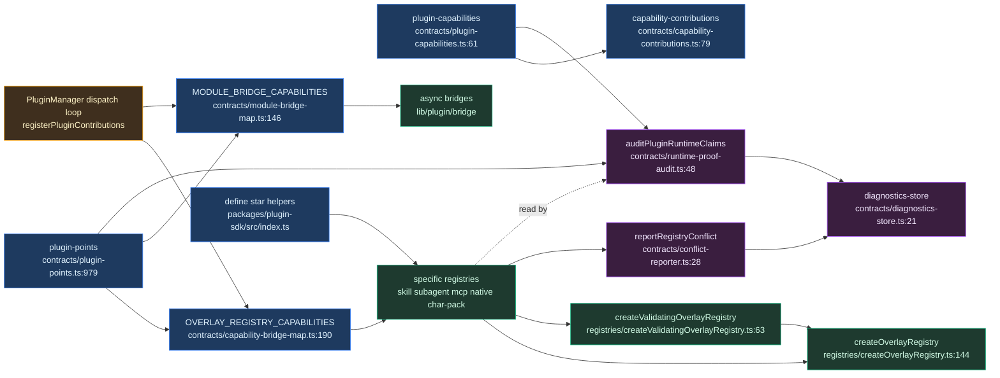

# Contracts, registries & SDK

<Status variant="experimental" />

<TLDR>
`lib/plugin/contracts/` is the declarative truth layer: `plugin-points.ts` and `plugin-capabilities.ts` catalog every extension point and capability with binding/docs/requiredTests proof fields, `capability-bridge-map.ts` and `module-bridge-map.ts` wire manifest fields to registries/bridges, and `runtime-proof-audit.ts` asserts every "implemented" surface has evidence. `lib/plugin/registries/` are typed overlay-registry stores (builtin ← plugin overlay, deduped by id); `packages/plugin-sdk/src/define/` contains the pure `define*()` type pass-throughs surfaced through the `@cognia/plugin-sdk` package root.
</TLDR>

<StatGrid>
  <Stat label="Capability contracts" value="66" />
  <Stat label="UI slots / hooks / activations" value="49 / ~150 / 26" />
  <Stat label="Runtime points" value="11" />
  <Stat label="Sync overlay capabilities" value="16" />
  <Stat label="Async module bridges" value="23" />
  <Stat label="SDK define*() helpers" value="44" />
</StatGrid>

## Purpose

`lib/plugin/contracts/` is the **declarative truth layer**: it states what a plugin may contribute and whether each declared surface is actually wired. Two canonical catalogs anchor it:

- `plugin-points.ts` — every UI-slot / hook / activation / runtime extension point, each carrying `binding`, `docs`, and `requiredTests` proof fields.
- `plugin-capabilities.ts` — the 66 `PluginCapability` contracts.

`capability-contributions.ts:79` maps a plugin's capability tags to concrete manifest entries for UI summaries. Two wiring maps connect manifest fields to runtime stores: `capability-bridge-map.ts` for synchronous overlay-registry dispatch, and `module-bridge-map.ts` for asynchronous module-loading bridges. Provability is enforced by `runtime-proof-audit.ts`, `conflict-reporter.ts`, and `diagnostics-store.ts`, which prove every "implemented" surface has evidence and report conflicts and diagnostics.

`lib/plugin/registries/` are typed in-memory stores built on the `createOverlayRegistry` substrate (builtin ← plugin overlay, deduped by id, plugin-tagged). `packages/plugin-sdk/src/define/` contains author-facing `define*()` helpers that narrow inline manifest entries. The host runtime consumes manifests and registries, not the helper functions; the helpers are public authoring affordances exported from the `@cognia/plugin-sdk` package root. Tooling can import the read-only contract catalogs and contribution-summary helpers from `@cognia/plugin-sdk/contracts` instead of reaching into `lib/plugin/contracts/*`.

## Overlay-registry pattern

`createOverlayRegistry.ts` is a leaf factory producing an isolated `Map<string, InternalEntry<T>>` closure (`createOverlayRegistry.ts:149`). Each entry carries an optional `pluginId` tag so `unregisterByPlugin` can drop all of a plugin's contributions at once (`createOverlayRegistry.ts:189-198`). Entries are deduped by storage key; the conflict policy defaults to **last-wins**, with an opt-in `first-wins-cross-plugin` mode that protects an incumbent owned by a *different* plugin while still letting the *same* plugin refresh its own entry (`createOverlayRegistry.ts:160-183`):

```ts
if (
  previous &&
  conflictPolicy === "first-wins-cross-plugin" &&
  previous.pluginId !== opts?.pluginId
) {
  onConflict?.({
    name: options?.name,
    key,
    existingPluginId: previous.pluginId,
    incomingPluginId: opts?.pluginId,
  })
  return previous
}
```

`createValidatingOverlayRegistry.ts` wraps the base factory with a sidecar `warningsById` map and a `validate(entry) => W[]` option. It stamps non-blocking `requires` warnings on register and re-runs them on `refreshAllWarnings()` (`createValidatingOverlayRegistry.ts:63-91`):

```ts
function stamp(id: string, entry: T): void {
  const warnings = options.validate(entry)
  if (warnings.length > 0) warningsById.set(id, Object.freeze(warnings))
  else warningsById.delete(id)
}
```

The entry is **always registered** regardless of warnings; `getWarnings(id)` returns `[]`, never `undefined` (`createValidatingOverlayRegistry.ts:105-107`).

## plugin-points.ts

There are four `PluginPointKind` values: `"ui-slot" | "hook" | "activation" | "runtime"` (`plugin-points.ts:13`). Each `PluginPointContract` carries `binding`, `docs`, `requiredTests`, a `status` of `"implemented" | "virtual" | "deprecated"`, and a `stability` level (`plugin-points.ts:20-49`).

| Kind | Catalog | Count | Notes :line |
| --- | --- | --- | --- |
| ui-slot | `CANONICAL_EXTENSION_POINTS` | 49 | deprecated via `UI_SLOT_OVERRIDES` (`:588`); 4 vscode slots are registration-host not JSX-mount (`:228-233`) |
| hook | `CANONICAL_HOOK_POINTS` | ~150 | 7 demoted in `DEPRECATED_HOOK_POINTS` (`:482-492`) |
| activation | `CANONICAL_ACTIVATION_PATTERNS` | 26 | `:496-531` |
| runtime | `CANONICAL_RUNTIME_POINTS` | 11 | each binds to an owning registry singleton via `RUNTIME_POINT_BINDINGS` (`:736-755`) + a reused permission (`:763-775`) |

All four merge into `PLUGIN_POINT_CONTRACTS` (`plugin-points.ts:979-984`). Validation emits `PluginPointDiagnostic` codes — `plugin.point.unknown` / `alias` / `deprecated` / `virtual` / `permission_denied` (`plugin-points.ts:62-86`) — via `validateExtensionPoint` (`:1096`), `validateHookPoint` (`:1176`), and `validateActivationEvent` (`:1209`). `EXTENSION_POINT_ALIASES` resolve legacy ids (`plugin-points.ts:276-288`).

Each runtime point binds directly to the registry singleton that owns it (`plugin-points.ts:736-741`):

```ts
const RUNTIME_POINT_BINDINGS: Record<CanonicalRuntimePoint, string> = {
  "workflow.node": "lib/workflow/nodes/registry.ts:registerNodeExecutor",
  "provider.ai-llm": "lib/plugin/api/ai-provider-registry.ts:registerLlmProvider",
  "chat.middleware": "lib/claude/chat-middleware/registry.ts:registerChatMiddleware",
}
```

The bridge maps are **not** keyed by point-id; they are keyed by manifest field / capability tag and reference the same registry singletons the runtime-point bindings name. `capability-bridge-map.ts` (`OVERLAY_REGISTRY_CAPABILITIES`) holds the 16 synchronous overlay capabilities with a uniform `register(id, def, { pluginId })` / `unregisterByPlugin(pluginId)` shape; `defineOverlayCapability<E>` is the single variance bridge. `module-bridge-map.ts` (`MODULE_BRIDGE_CAPABILITIES`) holds the 20 asynchronous bridges, each normalized to `register(ctx) => Promise<void>` / `unregister(pluginId)`. Both expose their `*_CAPABILITY_KEYS` via `Object.keys`.

## Provable contribution

`auditPluginPointContracts()` walks every contract; for `status === "implemented"` it asserts `binding`, `docs`, and `requiredTests` are non-empty, yielding a `proofStatus` of `"verified" | "missing_proof" | "not_applicable"`. `auditPluginCapabilityContracts()` does the same for the 59 capabilities, additionally requiring `builtinContributionPaths` for tools / commands / hooks. `runtime-proof-audit.ts:auditPluginRuntimeClaims()` composes both, plus hand-authored `RUNTIME_RISK_AUDITS`, into one `PluginRuntimeClaimsAuditReport`.

`diagnostics-store.ts` is a module-level `Map<pluginId, PluginPointDiagnostic[]>` with pub/sub — `recordPluginPointDiagnostic` / `getAllPluginPointDiagnostics` / `subscribePluginPointDiagnostics` (`diagnostics-store.ts:21-60`). `recordSilentFailure` branches on `expected`: web-mode-without-Tauri produces a debug log, while desktop produces a warning plus a `plugin.silent-failure` diagnostic (`diagnostics-store.ts:79-98`).

`conflict-reporter.ts:reportRegistryConflict` routes `plugin.conflict.rejected` against the losing plugin (`conflict-reporter.ts:28-38`); it is the `onConflict` sink for `first-wins-cross-plugin` registries:

```ts
export function reportRegistryConflict(info: RegistryConflictInfo): void {
  const owner = info.winnerPluginId ?? "another plugin"
  recordPluginPointDiagnostic(info.pluginId, {
    code: "plugin.conflict.rejected",
    severity: "warning",
    pointKind: "runtime",
    pointId: info.attemptedId,
    message: `${info.registry} ${info.attemptedId} is already provided by ${owner}`,
  })
}
```

## Registry catalog

| Registry file | Stores | SDK `define*` | Key exports :line |
| --- | --- | --- | --- |
| `skill-registry.ts` | `PluginSkillDef` (plain) | `defineSkill` | `registerSkill :19`, `unregisterSkillsByPlugin :23`, `listSkillIds :29` |
| `mcp-server-preset-registry.ts` | `PluginMcpServerPresetDef` (plain) | `defineMcpServerPreset` | `registerMcpServerPreset :29`, `listMcpServerPresetIds :39` |
| `native-anthropic-tool-registry.ts` | `PluginNativeAnthropicToolDef` (plain) + beta headers | `defineNativeAnthropicTool` | `registerNativeAnthropicTool :28`, `computeAnthropicBetaHeaders :79` |
| `subagent-registry.ts` | `PluginSubagentDef` (plain) | `defineSubagent` | `registerSubagent :29`, `listSubagentEntries :44` |
| `character-pack-registry.ts` | `PluginCharacterPackDef` (validating) | `defineCharacterPack` | `registerCharacterPack :51`, `refreshAllPackWarnings :58`, `getPackCharacterByRuntimeId :122`, `buildOverlayCharacterId :162` |
| `agent-team-template-registry.ts` | `PluginAgentTeamTemplateDef` (validating) | `defineAgentTeamTemplate` | `registerAgentTeamTemplate :132`, `validateTemplateRequires :88`, `getTemplateWarnings :161` |
| `workflow-template-registry.ts` | `PluginWorkflowTemplateDef` (validating) | `defineWorkflowTemplate` | `registerWorkflowTemplate :111`, `validateWorkflowTemplateRequires :77`, `getWorkflowTemplateWarnings :124` |
| `shared-memory-adapter-registry.ts` | `PluginSharedMemoryAdapterDef` (plain) | `defineSharedMemoryAdapter` | `registerSharedMemoryAdapter :24`, `unregisterSharedMemoryAdaptersByPlugin :28` |
| `command-safety-registry.ts` | `ToolRules` per pluginId (plain, merge) | (none — `ctx.terminal` imperative) | `registerPluginCommandRules :30`, `getPluginCommandRulesets :48` |
| `pet-achievement-registry.ts` | `PluginPetAchievementDef` (plain, data-only condition DSL) | (manifest `petAchievements`) | `registerPetAchievement`, `compilePluginAchievement`, `listCompiledPluginAchievements` |
| `pet-item-registry.ts` | `PluginPetItemDef` (plain, data-only) | (manifest `petItems`) | `registerPetItem`, `projectPluginItem`, `listProjectedPluginItems` |
| `createOverlayRegistry.ts` | factory — substrate | — | `createOverlayRegistry :144` |
| `createValidatingOverlayRegistry.ts` | factory — requires-warning wrapper | — | `createValidatingOverlayRegistry :63` |

## Desktop-pet integration surface

The pet subsystem (ADR-0058) exposes four coordinated plugin surfaces:

- **`ctx.pet`** (capability `pet`; permissions `pet:read` / `pet:interact`, `lib/plugin/api/pet-api.ts`) — read the PII-safe pet summary, subscribe to sanitized events, emit nurture interactions, and grant XP/coin rewards. Rewards are rate-limited (token buckets `pet:interact` / `pet:emit`) and clamped against a per-plugin daily budget (50 XP / 100 coins, `lib/plugin/api/pet-budget.ts`); lifecycle kinds are not emittable.
- **Hooks** — `onPetInteract`, `onPetLevelUp`, `onPetEvolved`, `onPetAchievementUnlocked`, `onPetUnwell`, dispatched fire-and-forget by `lib/pet/runtime/pet-controller.ts`. Payloads carry no event meta (PII red-line); radar/passive kinds never dispatch.
- **UI slots** — `pet.console.tab` (a host-owned "Plugins" tab in the /pet console, shown only while a contribution exists) and `pet.panel.actions` (interaction-panel action row, limit 4). Context bag: `level` / `stage` / `mood` / `condition`.
- **Workflow nodes** — the built-in `trigger.pet.event` (levelUp / evolved / achievementUnlocked / unwell, runner in `lib/workflow/runtime/pet-event-trigger.ts`) and `action.pet.interact`.

`plugins/pet-daily-quests` is the end-to-end reference (quest board in the console tab, rewards through the budgeted API, goal hook integration).

## SDK define*() catalog

All helpers are pure type pass-throughs **except** `defineCharacterPack`, which validates eagerly. The package exposes every supported helper from the root barrel; source-file-shaped `define/<name>` imports are intentionally not exported.

| Helper group | Examples | Produces |
| --- | --- | --- |
| Agent and workflow | `defineAgentTool`, `defineGuardrail`, `defineContextProvider`, `defineChatMiddleware`, `defineToolRoute`, `defineSkill`, `defineSubagent`, `defineAgentTeamTemplate`, `defineWorkflowTemplate`, `defineWorkflowNode`, `defineWorkflowTrigger` | Agent SDK tools, guardrails, context providers, chat middleware, semantic tool routing, teams, subagents, workflow nodes/triggers/templates |
| Runtime and integration | `defineConnector`, `defineWorkspaceBackend`, `defineMcpServerPreset`, `defineNativeAnthropicTool`, `defineExternalAgentPreset`, `defineExternalAgentAdapter`, `defineRoutingStrategy`, `defineDeploymentFilter`, `defineProtocolAdapter`, `defineAuthProvider`, `defineUriHandler` | Connector and workspace adapters, MCP/native-tool overlays, external-agent presets/adapters, provider-routing extensions, auth and deep-link handlers |
| UI and shell | `defineViewContainer`, `defineView`, `defineWebview`, `defineMessageRenderer`, `defineModalMount`, `defineTerminalCompletionProvider`, `defineQuickAction`, `defineTrayItem` | Rail containers, tree/custom views, sandboxed webviews, message renderers, modal mounts, terminal completions, command/composer/tray quick actions |
| Appearance and resources | `defineTheme`, `defineThemePack`, `defineDensityPreset`, `defineFontContribution`, `defineWallpaper` | Theme colors, theme packs, density presets, bundled fonts, bundled wallpapers |
| Policy and usage | `defineConfiguration`, `defineExporter`, `defineImporter`, `defineSharedMemoryAdapter`, `defineBalanceAdapter`, `defineLimitsSource`, `defineImRateSource`, `defineCompactionStrategy` | Config schemas, import/export providers, memory backing stores, usage/balance/rate-limit/compaction sources |

## Data flow



## Gotchas

- **Validating vs plain overlay.** Only `character-pack`, `agent-team-template`, and `workflow-template` use `createValidatingOverlayRegistry`; the rest are plain. Warnings are non-blocking — the entry registers regardless — so sibling overlay mutations must call `refreshAll*Warnings()` to clear stale missing-dependency warnings (wired at `capability-bridge-map.ts:165-176`).
- **Capability vs module bridge map.** `capability-bridge-map.ts` is synchronous inline-def overlay capabilities (`:151-156`); `module-bridge-map.ts` is async module-loading capabilities normalized behind one `register(ctx) => Promise` / `unregister` (`:84-110`). Bespoke wiring (modes / commands / themes / lsp / a2ui) lives in neither (`capability-bridge-map.ts:10-16`). Field-driven module bridges are now canonical capability tags, and dispatch still gates on `manifest[manifestField]?.length` (`module-bridge-map.ts:113-117`).
- **Audit "proof" is field-presence, not reachability.** The audit checks that proof strings are non-empty; real reachability is enforced by the separate static slot-audit script that branches on `REGISTRATION_HOST_EXTENSION_POINTS` / `hostKind` (`plugin-points.ts:222-233`).
- **first-wins-cross-plugin is opt-in.** The default is last-wins; the plain id-keyed registries here silently last-wins on a cross-plugin id collision.

<Cards>
  <Card title="Bridges" href="./bridges" description="The async module-loading bridges that connect manifest fields to runtime subsystems." />
  <Card title="Core runtime" href="./core-runtime" description="The PluginManager dispatch loop that drives capability and module bridges." />
  <Card title="Security" href="./security" description="Permission gating, trust, and the diagnostics that back conflict and silent-failure reporting." />
</Cards>
