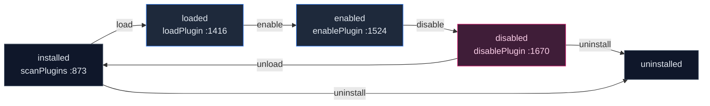
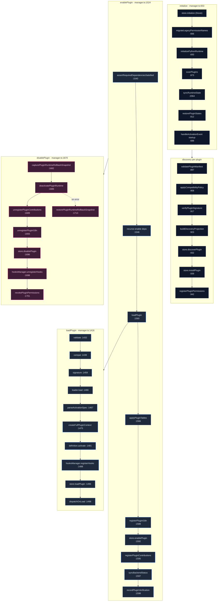

# Core runtime

<Status variant="experimental" />

<TLDR>
  The core runtime (`lib/plugin/core/`) is the lifecycle engine of the plugin platform. Its center is
  `PluginManager` (`manager.ts:364`), a lazy per-shell singleton (`getPluginManager`
  `manager.ts:317`, `initializePluginManager` `manager.ts:336`) configured by
  `resolvePluginRuntimeBootstrap` (`bootstrap.ts:21`), which picks the browser-vs-Tauri profile and
  refuses to run in a non-main window. The manager wires four collaborators in its constructor
  (`manager.ts:381`) — `PluginLoader`, `PluginRegistry`, a `PluginLifecycleHooks` manager, and lazy
  A2UI/Themes bridges — then walks each plugin through a status machine **installed → loaded →
  enabled → disabled → uninstalled**. Discovery (`scanPlugins` `manager.ts:873`) validates, compat-
  checks, and signature-checks every manifest before writing to the Zustand `usePluginStore`;
  `enablePlugin` (`manager.ts:1524`) gates dependencies, applies Dexie tables + i18n, and registers
  contributions; every reverse path captures a rollback snapshot.
</TLDR>

<StatGrid>
  <Stat label="Source files" value="16" hint="lib/plugin/core/ TS, excl. tests" />
  <Stat label="Status states" value="5" hint="installed · loaded · enabled · disabled · uninstalled" />
  <Stat label="Collaborators" value="4" hint="loader · registry · hooks · lazy bridges (manager.ts:381)" />
  <Stat label="Overlay registries" value="5" hint="tools · components · templates · modes · commands (registry.ts)" />
  <Stat label="Plugin runtimes" value="4" hint="frontend JS · WASM · VS Code extension · Python (stub off-Tauri)" />
  <Stat label="Browser builtins" value="15" hint="static in-bundle list (browser-builtin-registry.ts:55)" />
</StatGrid>

## What It Is

`lib/plugin/core/` is where a plugin becomes *alive*. Everything else in the plugin platform — the
`ctx.*` API, the contribution bridges, the security guard, the marketplace — hangs off the lifecycle
that `PluginManager` drives. The manager is the single owner of plugin state transitions: it is the
only code that calls a plugin's `activate(context)`, registers its contributions, applies its Dexie
tables, and tears it all back down on disable or uninstall.

The runtime is shell-aware. `resolvePluginRuntimeBootstrap` (`bootstrap.ts:21`) inspects the host —
browser, Tauri desktop, or a secondary window — and produces a `PluginManagerConfig`. A non-main
window is refused outright, so only one manager instance ever drives discovery and loading.

## Per-file Catalog

| File | Purpose | Key exports (`:line`) |
| --- | --- | --- |
| `index.ts` | Barrel re-export of the core surface | re-exports `index.ts:5-26` |
| `bootstrap.ts` | Resolve shell → `PluginManagerConfig` (browser/Tauri, gate non-main window) | `resolvePluginRuntimeBootstrap` `:21` |
| `manager.ts` | Central lifecycle orchestrator + singleton/factory | `PluginManager` `:364`; `getPluginManager` `:317`; `createPluginManager` `:332`; `initializePluginManager` `:336`; `__resetPluginManagerForTesting` `:353`; `resolveGovernanceMode` `:118`; `PluginEnableError` `:255`; `PluginDependencyError` `:277`; `PLUGIN_ENABLE_FAILED_EVENT` `:299` |
| `loader.ts` | Dynamic module loading per type + timed teardown | `PluginLoader` `:66`; `DEFAULT_TEARDOWN_TIMEOUT_MS` `:25`; `DirtyTeardownReason`/`DirtyTeardownRecord` `:41`/`:43` |
| `registry.ts` | Contribution store (tools/components/templates/modes/commands) | `PluginRegistry` `:54` (facade over 5 `createOverlayRegistry`) |
| `descriptor.ts` | Build the UI-facing `ExtensionDescriptor` from a manifest | `buildExtensionDescriptor` `:87`; `derivePluginInstallRootKind` `:20` |
| `context.ts` | Build the `PluginContext`/`FullPluginContext` API object | `createPluginContext` `:181`; `createFullPluginContext` `:233`; `isFullPluginContext` `:323`; `teardownPluginWorkflowRegistrations` `:2170`; type `FullPluginContext` `:141` |
| `compatibility.ts` | Semver host/node/python gating → diagnostics | `evaluatePluginCompatibility` `:119`; `CompatibilityRuntime` `:15`; `CompatibilityDiagnostic` `:5` |
| `validation.ts` | Manifest + config schema/value validation | `validatePluginManifest` `:289`; `validatePluginConfig` `:1167`; `parseManifest` `:1311` |
| `verification.ts` | Build immutable `PluginVerificationSnapshot` + capability proofs | `createPluginVerificationSnapshot` `:35`; `collectCapabilityRuntimeProofs` `:14` |
| `transport.ts` | Typed IPC gateway to Rust `plugin_api_invoke` (retry/compat) | `invokePluginApi` `:92`; `invokePluginApiBatch` `:142`; `PluginGatewayError` `:52` |
| `policy-runtime.ts` | Push persisted policy → manager/verifier/updater singletons | `applyPluginPolicyToRuntime` `:55` |
| `plugin-asset-resolver.ts` | Cross-runtime asset/path join + Tauri `convertFileSrc` resolver | `createPluginAssetResolver` `:45`; `joinPluginPath` `:28` |
| `logger.ts` | Lazy plugin-system logger map (init-cycle safe) | `loggers` `:192`; `createPluginSystemLogger` `:123`; `pluginLogger` `:179` |
| `browser-builtin-registry.ts` | Static list of 15 in-bundle builtin plugins (browser profile) | `getBrowserBuiltinRegistry` `:148`; `getBrowserBuiltinRegistryEntry` `:155` |
| `load-order.ts` | Dependency topo-sort + cycle/block/degrade resolution | `resolveLoadOrder` `:114`; `LoadOrderBlockReason` `:23`; `LoadOrderPluginInput` `:29` |

## The Status Machine

A plugin moves through five states. Discovery seeds it at **installed**; enabling drives it forward
through **loaded → enabled**; disable, unload, and uninstall reverse the path, each with a captured
rollback snapshot so a partial failure can be undone.



## The Lifecycle Flow (ordered)

The manager runs each transition as an ordered, line-numbered pipeline. The diagram below traces a
plugin from boot through enable, with the disable/rollback return path on the right.



`deactivatePluginRuntime` (`manager.ts:1686`) calls the plugin's `definition.deactivate()`
(`manager.ts:2262`) and then `loader.unload` (`manager.ts:2282`). On any error inside the disable
path, the captured snapshot is replayed by `restorePluginRuntimeRollbackSnapshot` (`manager.ts:1713`)
so the plugin is left in a consistent state.

## Context Built and Passed to `activate`

The hinge of the whole lifecycle is `loadPlugin` building a `FullPluginContext` and handing it to the
plugin's `activate`. The returned hooks (if any) are kept for later fan-out.

```ts
// manager.ts:1475-1481
const context = createFullPluginContext(plugin, this, { enableDebug })
this.contexts.set(pluginId, context)
let hooks: PluginHooks | undefined
if (typeof definition.activate === "function") {
  hooks = (await definition.activate(context)) || undefined
}
```

## The Contribution Registry

`PluginRegistry` (`registry.ts:54`) is a thin facade over five `createOverlayRegistry` instances —
one each for tools, components, templates, modes, and commands. The conflict policy is
**first-wins-cross-plugin**: a later cross-plugin registrant for the same id is rejected and reported
as `plugin.conflict.rejected`; a same-plugin re-register simply refreshes the entry
(`registry.ts:10-17`).

```ts
// registry.ts:55-59
private tools = createOverlayRegistry<PluginTool>({
  name: "tools",
  conflictPolicy: "first-wins-cross-plugin",
  onConflict: makeConflictHandler("tool"),
})
```

Templates are namespaced `<pluginId>:<id>` (`registry.ts:150`) so two plugins can ship a template of
the same local name without colliding.

## Dependency Load Order

`resolveLoadOrder` (`load-order.ts:114`) computes a safe enable order via a Kahn topological sort over
the dependency graph. Cycles are detected with Tarjan SCC (`load-order.ts:61`); a blocked set is grown
to a fixpoint (`load-order.ts:144-175`) so any plugin transitively depending on a blocked one is also
held back.

```ts
// load-order.ts:193-203
const queue = survivors.filter((id) => (indegree.get(id) ?? 0) === 0)
const order: string[] = []
while (queue.length > 0) {
  const id = queue.shift()!
  order.push(id)
  for (const dependent of dependents.get(id) ?? []) {
    const next = (indegree.get(dependent) ?? 0) - 1
    indegree.set(dependent, next)
    if (next === 0) queue.push(dependent)
  }
}
```

## Compatibility Gating

`evaluatePluginCompatibility` (`compatibility.ts:119`) checks the manifest's `engines` (host / node /
python) against the running runtime and emits diagnostics. When the host version fails
`engines.cognia` it pushes the code `compat.cognia_engine_mismatch` (`compatibility.ts:139-150`). The
governance mode then decides the outcome: **block** rejects on any error diagnostic, while **warn**
logs and proceeds (`manager.ts:708-743`).

## The Extension Descriptor

`buildExtensionDescriptor` (`descriptor.ts:87`) projects a manifest into the UI-facing shape settings
panels render. `availableOperations` is *derived* from the install root kind (`descriptor.ts:51`): a
builtin plugin never offers uninstall, a dev plugin gains reload, and a marketplace plugin gains
update.

```ts
// descriptor.ts:97-122 (shape)
{
  id, version, source,
  identity: { canonicalId, observedSources, activeSource },
  resolvedPath,
  installRoot: { kind, path },
  entrypoints,
  declaredCapabilities,
  compatibility: { status, diagnostics },
  availableOperations,
}
```

## How Core Connects to the Rest of the Platform

- **Isolated runtimes via the loader.** `loadWasmDefinition` / `unloadWasmPlugin` (`loader.ts:11`,
  `:152` / `:605`) and `loadVscodeDefinition` / `unloadVscodeExtension` (`loader.ts:12`, `:136` /
  `:608`) drive the WASM and VS Code hosts. WASM is preloaded at install time via
  `invoke("plugin_wasm_load")` (`manager.ts:1393`).
- **Transport.** Every desktop API call flows `invokePluginApi` → `invoke("plugin_api_invoke")`
  (`transport.ts:114`), wired from `context.ts`.
- **Security.** The manager registers each plugin with `getPermissionGuard().registerPlugin`
  (`manager.ts:1913`) and revokes on disable/uninstall (`manager.ts:1701`, `:1761`, `:1845`).
  Signatures go through `verifyPluginSignature` (`manager.ts:1880`); WASM capability grants through
  `applyWasmCapabilityGrant` (`manager.ts:1373`); rate limits through `getPluginRateLimiter().check`
  inside `context.ts`.
- **Bridges.** `registerPluginContributions` (`manager.ts:3144`) registers modes/commands,
  slash commands, themes via `PluginThemesBridge`, the 16 `OVERLAY_REGISTRY_CAPABILITIES`
  (`manager.ts:3223`), the 20 `MODULE_BRIDGE_CAPABILITIES` (`manager.ts:3252`), LSP servers
  (`manager.ts:3269`), and skill→character attach (`manager.ts:3347`).
- **Dexie.** `applyPluginTables` / `removePluginTables` (`manager.ts:1566` / `:1838`) add and drop a
  plugin's namespaced tables; `ctx.dexie` is exposed only when the manifest declares it
  (`context.ts:215`).

## Gotchas

- **Browser vs Tauri builtin split.** The browser profile ships 15 static builtins
  (`browser-builtin-registry.ts:55`) loaded via their entry `load()` when the path starts with
  `builtin://` (`loader.ts:172-182`); Tauri instead discovers via `invoke("plugin_scan_directory")`
  (`manager.ts:883`).
- **Idempotency.** Load and enable early-return when the plugin is already in the target state
  (`loader.ts:83`, `manager.ts:1424`, `:1532`); `loadingPromises` dedups concurrent loads
  (`loader.ts:88`); all `unregister*` paths are no-ops for a plugin that was never registered.
- **Error isolation and rollback.** Install is step-tracked via `InstallTransactionState`
  (`manager.ts:213`) and unwound by `performInstallRollback` (`manager.ts:1253`); disable/unload
  capture a `PluginRuntimeRollbackSnapshot` (`capture` `:568`, `restore` `:589`). Per-contribution
  failures are caught and logged, never thrown (`manager.ts:2456`, `:2492`, `:2520`).
- **Teardown is timed, not cancellable.** WASM/VS Code unload runs under `withTimeout` (5 s,
  `loader.ts:25`); a timeout calls `recordSilentFailure` and sets the `dirtyTeardowns` flag
  (`loader.ts:617-647`).
- **Governance override.** `COGNIA_PLUGIN_POINT_GOVERNANCE_MODE` (`warn` | `block`) overrides the
  default (`manager.ts:118`); in `block` mode a blocked activation throws in `parseActivationSpec`
  (`manager.ts:1965`).
- **Logger is lazy on purpose.** The logger map uses `Object.defineProperty` getters
  (`logger.ts:25-43`) to dodge a Jest CJS init-order cycle.
- **Python off-Tauri is a stub.** Outside Tauri, the Python runtime is a warn-only stub
  (`loader.ts:278-292`).
- **`importModule` is a wrapped `eval`.** It tries three strategies — Tauri asset protocol →
  `fetch` + `eval` → script tag — and `require()` is unsupported (`loader.ts:439`, `:480`).

## Next

<Cards>
  <Card title="Context API (ctx)" href="./context-api" description="The capability surface createFullPluginContext assembles and hands to activate()" />
  <Card title="Security & permissions" href="./security" description="The guard, consent, signature verification, and rate limiter the manager wires in" />
  <Card title="Sandbox, messaging & WASM" href="./messaging-and-sandbox" description="The loader's JS/WASM/VS Code runtimes, transport vs cross-plugin IPC, the message bus" />
</Cards>
