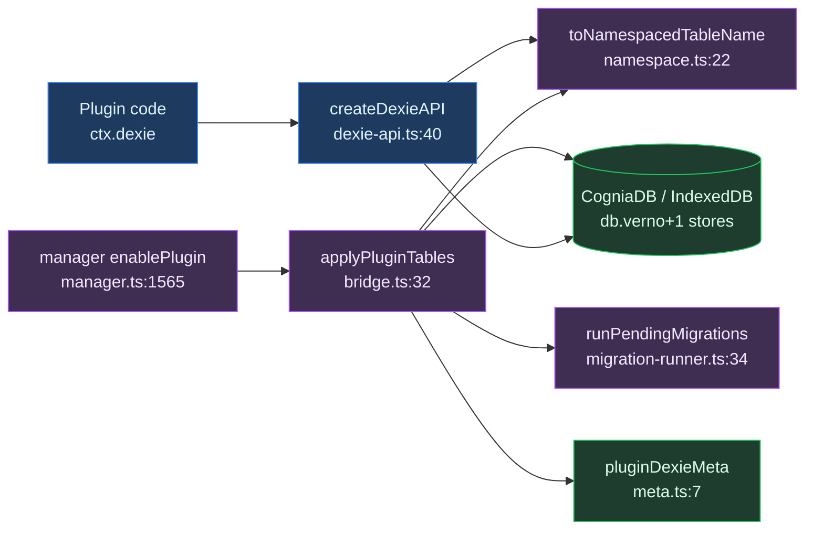
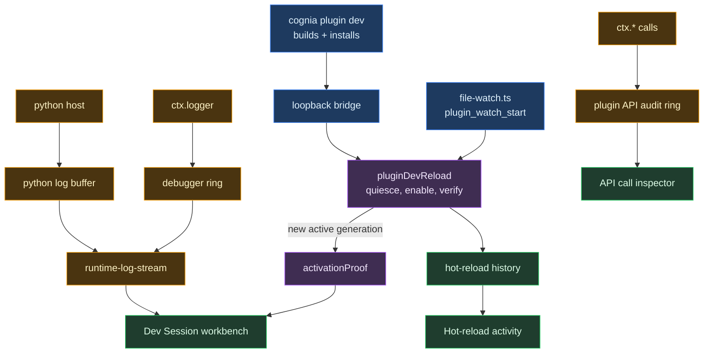

# Storage & devtools

<Status variant="experimental" />

<TLDR>
Plugins get collision-proof IndexedDB tables in the single shared `CogniaDB` Dexie instance. Table names are stored as `<pluginId>:<tableName>` (`namespace.ts:11`), and every enable/disable that changes the table set bumps the global Dexie schema version (`bridge.ts:60`). A separate developer-mode surface watches a locally-sourced plugin's directory (`file-watch.ts`), reloads it through the one verified path the CLI also uses (`plugin-dev-reload.ts`), and merges what it logs into one stream (`runtime-log-stream.ts`). The app never builds: `cognia plugin dev` does that.
</TLDR>

<StatGrid>
  <Stat label="Tables per plugin" value="≤ 20" hint="MAX_TABLES_PER_PLUGIN — namespace.ts:14" />
  <Stat label="Namespace separator" value=":" hint="PLUGIN_TABLE_NAMESPACE_SEPARATOR — namespace.ts:11" />
  <Stat label="Watch debounce" value="300 ms" hint="DEFAULT_DEBOUNCE_MS — file-watch.ts" />
  <Stat label="Reload verify timeout" value="20 s" hint="timeoutMs — plugin-dev-reload.ts" />
  <Stat label="Log ring per plugin" value="1000 / 500" hint="debugger.ts / python log-buffer.ts" />
  <Stat label="API audit ring" value="500" hint="MAX_RECENT_AUDIT_EVENTS — interface-catalog.ts" />
</StatGrid>

The module has two halves. **Part A (Dexie)** is a production path: it gives every plugin private, namespaced tables inside the one shared Dexie database so two plugins can never collide on a table name. **Part B (devtools)** is a developer-mode path: a file watcher, a verified reload, and the readouts that show what a plugin under development is actually doing.

---

## Part A — Dexie tables

### Purpose and pipeline

Plugins get namespaced IndexedDB tables inside the single shared `CogniaDB` Dexie instance so two plugins never collide. Physical table names are stored as `<pluginId>:<tableName>` (`namespace.ts:11`, `namespace.ts:22`).

The end-to-end pipeline:

1. The manager reads `manifest.dexie`.
2. `applyPluginTables` (`bridge.ts:32`) performs `close → version(N+1).stores(patch) → open`, bumping the schema version.
3. The registration is recorded in the `pluginDexieMeta` core table (`meta.ts`, `bridge.ts:65`).
4. The plugin then calls scoped operations through `ctx.dexie = createDexieAPI(...)` (`dexie-api.ts:40`), wired into the plugin context at `context.ts:216`.
5. Optional manifest migrations run once per version bump via `runPendingMigrations` (`migration-runner.ts:34`).

Wiring sites: `applyPluginTables` runs pre-`activate()` at `manager.ts:1565`; `removePluginTables` at `manager.ts:1838`; `createDexieAPI` at `context.ts:216` (only when `getDb()` is available).

### Namespacing

Every table operation routes through the helpers in `namespace.ts` — the single source of truth (`namespace.ts:6`).

```ts
// namespace.ts:22-24
export function toNamespacedTableName(pluginId: string, tableName: string): string {
  return `${pluginId}${PLUGIN_TABLE_NAMESPACE_SEPARATOR}${tableName}`
}
```

The separator is `":"` and `MAX_TABLES_PER_PLUGIN = 20` (`namespace.ts:11`, `namespace.ts:14`). `fromNamespacedTableName` reverses the mapping and returns `null` for un-prefixed core tables (`namespace.ts:30`), which is how the scoped API rejects cross-plugin and core-table access.

### Applying tables (schema bump)

```ts
// bridge.ts:60-70
const nextVersion = db.verno + 1
await db.close()
db.version(nextVersion).stores(patch)
await db.open()
await putPluginDexiaMeta({
  pluginId,
  tableNames: namespacedNames,
  dexieVersion: nextVersion,
  appliedAt: Date.now(),
})
```

`applyPluginTables` is idempotent: it returns early if the table set is unchanged (`bridge.ts:46`). Removal with `retentionMode "purge"` nulls the stores in the same close/open cycle (`bridge.ts:89`). It throws above `MAX_TABLES_PER_PLUGIN = 20` (`bridge.ts:37`), and a changed table set requires `removePluginTables` first (`bridge.ts:28`).

### Migrations

Migrations are driven by the plugin's own manifest version, not by the Dexie schema version.

```ts
// migration-runner.ts:39-52
const pending = migrations
  .filter((m) => m.toVersion > ctx.previousVersion && m.toVersion <= ctx.currentVersion)
  .sort((a, b) => a.toVersion - b.toVersion)
for (const mig of pending) {
  const fn = ctx.upgradeHandlers[mig.upgrade]
  if (!fn) throw new Error(`Migration upgrade function ${mig.upgrade} not found`)
  await fn(tx)
}
```

`MigrationContext` carries `previousVersion` and `currentVersion` — the plugin's manifest versions (`migration-runner.ts:15`). A migration's `toVersion` targets a manifest version, never the Dexie `verno`.

### The scoped API

```ts
// dexie-api.ts:59-74
table<T, K = unknown>(name: string): Dexie.Table<T, K> {
  const namespacedName = toNamespacedTableName(pluginId, name)
  const parsed = fromNamespacedTableName(namespacedName)
  if (!parsed || parsed.pluginId !== pluginId) {
    throw new Error(`Plugin ${pluginId} attempted to access table ${name}`)
  }
  return db.table<T, K>(namespacedName)
}
```

`rawDb()` returns a `Proxy` that re-routes `table` and `transaction` through `resolveTableName`, rejecting any cross-plugin or core-table access (`dexie-api.ts:76`). Both `table()` and the `rawDb()` Proxy enforce the same guard (`dexie-api.ts:48`, `dexie-api.ts:67`).

### Schema-version model

Two decoupled axes:

- **Global Dexie `db.verno`** — one monotonic version for the whole `CogniaDB`. Every enable/disable that changes the table set bumps it by one (`bridge.ts:60`, `bridge.ts:94`) and persists the new value as `dexieVersion` on `PluginDexieMeta` (`lib/db/plugin-types.ts:151`). `pluginDexieMeta` is itself a core table keyed by `&pluginId, appliedAt` (`schema.ts:1052`, `schema.ts:226`).
- **Per-plugin manifest version** — drives migrations only. `MigrationContext` carries `previousVersion` / `currentVersion`, the plugin's own manifest versions (`migration-runner.ts:15`).

Dexie schema versioning (structural) and plugin migration versioning (data) are independent: one is about the physical IndexedDB schema of the shared database; the other is about transforming a single plugin's rows.

### Dexie write path



---

## Part B — devtools

### Purpose

A developer-mode surface for a plugin under active development. It is small on
purpose: the authority for building, installing and reloading is the
`cognia plugin dev` CLI, and the app's job is to verify and to show.

- **developer mode** (`developer-mode.ts`) is the single gate. Build mode and a
  legacy `localStorage` flag are folded into one persisted value at boot, so the
  devtools section and Creator can never disagree about whether developer
  surfaces exist.
- **file watch** (`file-watch.ts`) watches a locally-sourced plugin's install
  directory and, after a 300 ms debounce, puts it through the same verified
  reload the CLI uses.
- **the log ring** (`debugger.ts`) keeps every line a plugin writes through
  `ctx.logger`, tagged with the lifecycle generation it came from.
- **the runtime log stream** (`runtime-log-stream.ts`) merges that ring with the
  Python host's buffer into one time-ordered view, and names the runtimes that
  have no output channel at all.

### Per-file map

| File | Purpose | Key exports |
| --- | --- | --- |
| `developer-mode.ts` | The one persisted developer-mode flag, plus the one-way boot migration off the legacy signals | `isDeveloperModeEnabled`, `useDeveloperMode`, `setDeveloperModeEnabled`, `migrateDeveloperMode` |
| `debugger.ts` | Per-plugin, per-generation log ring capped at 1000 entries. `createDebugContext` wraps `ctx.logger` so every plugin log mirrors into it | `getPluginDebugger`, `startSession`, `log` / `getLogs` / `onLog`, `createDebugContext` |
| `file-watch.ts` | In-app watcher: eligibility per runtime, exact path attribution, debounce, reload through the verified path | `startPluginFileWatch`, `watchEligibility`, `resolveWatchedPluginId` |
| `runtime-log-stream.ts` | Merged reader over the frontend ring and the Python buffer, tagged by runtime | `getPluginRuntimeLogs`, `subscribePluginRuntimeLogs`, `logSourcesFor` |

### Where the reload authority lives

The app does not build. `cognia plugin dev` builds and installs, then asks the
renderer to reload and prove it, over the loopback bridge. That request lands in
`lib/cli-bridge/handlers/plugin-dev-reload.ts`, which quiesces the plugin,
re-enables it, and waits for the lifecycle coordinator to report a **new active
generation** before returning an `activationProof`. Only that counts as success.
An install event, a file change, or an emitted reload signal do not.

`file-watch.ts` uses the same handler, so an in-app reload is held to the same
proof as a CLI one. What it cannot do is build. `wasm` and `vscode-extension`
plugins report `needs-build`, because editing their source produces no new
artifact and reloading would re-activate the same bytes while appearing to work.

### What the panes show

`components/plugins/devtools/plugin-devtools-pane.tsx` mounts three things: the
**Dev Session workbench** (stage timeline, activation proof, attempt
diagnostics, merged runtime logs), the **watch card** (which plugins are
watched, and for each one that is not, why), and **hot-reload activity** (one row
per install, uninstall and verified reload, saying which driver did it).

The workbench's Advanced tab adds the **API call inspector** (every `ctx.*` call
with its permission verdict, read unsampled from the audit ring), the
**lifecycle table**, the **trigger audit**, and **extension-point diagnostics**.



### What used to be here

Recorded so it is not rebuilt. A previous generation of this surface shipped a
`PluginDevServer`, a `PluginProfiler`, a `DevExtensionController`, a
`ManagedIdeDevMode`, a console tap, and a `PluginHotReload` manager, driven by a
nine-tab `PluginDevtoolsPanel`. None of it had a production caller. The panel had
no mount, and the modules were reachable only from each other and from a barrel
nothing imported.

`PluginDevServer` is worth naming. It exposed `getUrl()`, `getWebSocketUrl()`
and `connectedClients` for a server that did not exist:
`plugin_dev_server_start` set an in-memory `running = true` and returned. The
debugger's breakpoints were equally notional, and their condition evaluator
built a `new Function` from a user string.

They were removed along with their Tauri commands. The file watcher underneath
was real, and is what `file-watch.ts` now drives.

---

## Gotchas

- **Struct arguments live under `args`** — `plugin_watch_start(app, args: WatchStartArgs)` takes one struct, so Tauri reads it from the `args` key. The module `file-watch.ts` replaced sent a flat `{ paths }`, which leaves `args` absent and the command rejects before any watcher exists. `lib/plugin/core/context.ts` documents the same trap for `plugin_show_notification`.
- **Only a new active generation is success** — an install event says a bundle landed on disk, a file change says bytes moved, and neither says the plugin activated. Anything that reports success without an `activationProof` is reporting something else.
- **Watch eligibility is per runtime, and the reason is shown** — `dev` and `local` sources are watched for `frontend`, `python` and `hybrid`. `wasm` and `vscode-extension` are reported `needs-build` in the UI rather than silently skipped, because a plugin that never reloads is otherwise indistinguishable from a broken watcher.
- **Namespace collision avoidance** — every table operation goes through the `namespace.ts` helpers as a single source of truth (`namespace.ts:6`). `dexie-api` rejects bare access to core tables or other plugins' tables in both `table()` and the `rawDb()` Proxy (`dexie-api.ts:48`, `dexie-api.ts:67`). `applyPluginTables` is idempotent on unchanged sets but throws above `MAX_TABLES_PER_PLUGIN = 20` (`bridge.ts:37`); a changed set requires `removePluginTables` first (`bridge.ts:28`).

---

<Cards>
  <Card title="Core runtime" href="./core-runtime" description="Manifest, lifecycle, and the enable/disable pipeline that drives applyPluginTables and hot reload." />
  <Card title="Context API" href="./context-api" description="How ctx.dexie and the rest of the plugin context are assembled and gated." />
  <Card title="Messaging & sandbox" href="./messaging-and-sandbox" description="The sandbox the dev-extension hot path re-initializes on every reload." />
</Cards>
