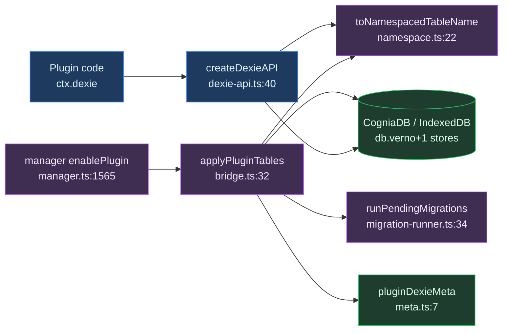
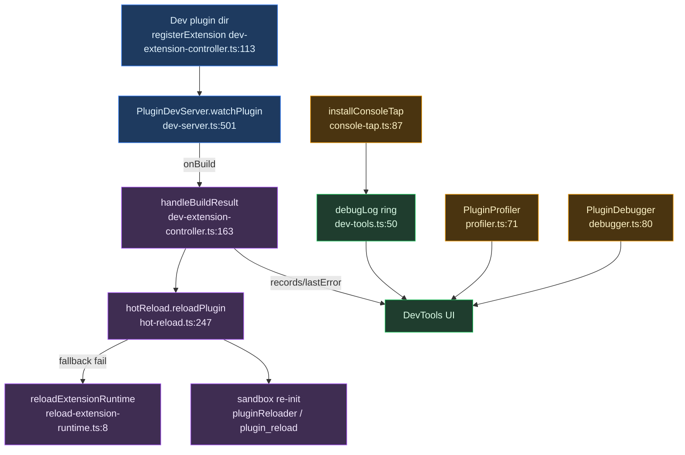

# Storage & devtools

<Status variant="experimental" />

<TLDR>
Plugins get collision-proof IndexedDB tables in the single shared `CogniaDB` Dexie instance — table names are stored as `<pluginId>:<tableName>` (`namespace.ts:11`) and every enable/disable that changes the table set bumps the global Dexie schema version (`bridge.ts:60`). A separate dev-only surface (`hot-reload.ts:63`, `dev-server.ts:77`, `profiler.ts:71`, `debugger.ts:80`, `console-tap.ts:87`) watches, builds, hot-reloads, and instruments a plugin under active development without restarting the app.
</TLDR>

<StatGrid>
  <Stat label="Tables per plugin" value="≤ 20" hint="MAX_TABLES_PER_PLUGIN — namespace.ts:14" />
  <Stat label="Namespace separator" value=":" hint="PLUGIN_TABLE_NAMESPACE_SEPARATOR — namespace.ts:11" />
  <Stat label="Dev server port" value="9527" hint="default — dev-server.ts:100" />
  <Stat label="Hot-reload debounce" value="300 ms" hint="debounceMs default — hot-reload.ts" />
  <Stat label="Debug log ring" value="1000 / 500" hint="debugger.ts:317 / dev-server.ts:284" />
  <Stat label="Reconnect attempts" value="5 (backoff)" hint="dev-server.ts:261" />
</StatGrid>

The module has two halves. **Part A (Dexie)** is a production path: it gives every plugin private, namespaced tables inside the one shared Dexie database so two plugins can never collide on a table name. **Part B (devtools)** is a dev-only path: a Tauri-hosted dev server, hot reload, console tap, debugger, and profiler that only light up for a plugin you are actively developing.

---

## Part A — Dexie tables

### Purpose and pipeline

Plugins get namespaced IndexedDB tables inside the single shared `CogniaDB` Dexie instance so two plugins never collide. Physical table names are stored as `<pluginId>:<tableName>` (`namespace.ts:11`, `namespace.ts:22`).

The end-to-end pipeline:

1. The manager reads `manifest.dexie`.
2. `applyPluginTables` (`bridge.ts:32`) performs `close → version(N+1).stores(patch) → open`, bumping the schema version.
3. The registration is recorded in the `pluginDexieMeta` core table (`meta.ts`, `bridge.ts:65`).
4. The plugin then calls scoped operations through `ctx.dexie = createDexieAPI(...)` (`dexie-api.ts:40`), wired into the plugin context at `context.ts:216`.
5. Optional manifest migrations run once per version bump via `runPendingMigrations` (`migration-runner.ts:34`).

Wiring sites: `applyPluginTables` runs pre-`activate()` at `manager.ts:1565`; `removePluginTables` at `manager.ts:1838`; `createDexieAPI` at `context.ts:216` (only when `getDb()` is available).

### Namespacing

Every table operation routes through the helpers in `namespace.ts` — the single source of truth (`namespace.ts:6`).

```ts
// namespace.ts:22-24
export function toNamespacedTableName(pluginId: string, tableName: string): string {
  return `${pluginId}${PLUGIN_TABLE_NAMESPACE_SEPARATOR}${tableName}`
}
```

The separator is `":"` and `MAX_TABLES_PER_PLUGIN = 20` (`namespace.ts:11`, `namespace.ts:14`). `fromNamespacedTableName` reverses the mapping and returns `null` for un-prefixed core tables (`namespace.ts:30`), which is how the scoped API rejects cross-plugin and core-table access.

### Applying tables (schema bump)

```ts
// bridge.ts:60-70
const nextVersion = db.verno + 1
await db.close()
db.version(nextVersion).stores(patch)
await db.open()
await putPluginDexiaMeta({
  pluginId,
  tableNames: namespacedNames,
  dexieVersion: nextVersion,
  appliedAt: Date.now(),
})
```

`applyPluginTables` is idempotent: it returns early if the table set is unchanged (`bridge.ts:46`). Removal with `retentionMode "purge"` nulls the stores in the same close/open cycle (`bridge.ts:89`). It throws above `MAX_TABLES_PER_PLUGIN = 20` (`bridge.ts:37`), and a changed table set requires `removePluginTables` first (`bridge.ts:28`).

### Migrations

Migrations are driven by the plugin's own manifest version, not by the Dexie schema version.

```ts
// migration-runner.ts:39-52
const pending = migrations
  .filter((m) => m.toVersion > ctx.previousVersion && m.toVersion <= ctx.currentVersion)
  .sort((a, b) => a.toVersion - b.toVersion)
for (const mig of pending) {
  const fn = ctx.upgradeHandlers[mig.upgrade]
  if (!fn) throw new Error(`Migration upgrade function ${mig.upgrade} not found`)
  await fn(tx)
}
```

`MigrationContext` carries `previousVersion` and `currentVersion` — the plugin's manifest versions (`migration-runner.ts:15`). A migration's `toVersion` targets a manifest version, never the Dexie `verno`.

### The scoped API

```ts
// dexie-api.ts:59-74
table<T, K = unknown>(name: string): Dexie.Table<T, K> {
  const namespacedName = toNamespacedTableName(pluginId, name)
  const parsed = fromNamespacedTableName(namespacedName)
  if (!parsed || parsed.pluginId !== pluginId) {
    throw new Error(`Plugin ${pluginId} attempted to access table ${name}`)
  }
  return db.table<T, K>(namespacedName)
}
```

`rawDb()` returns a `Proxy` that re-routes `table` and `transaction` through `resolveTableName`, rejecting any cross-plugin or core-table access (`dexie-api.ts:76`). Both `table()` and the `rawDb()` Proxy enforce the same guard (`dexie-api.ts:48`, `dexie-api.ts:67`).

### Schema-version model

Two decoupled axes:

- **Global Dexie `db.verno`** — one monotonic version for the whole `CogniaDB`. Every enable/disable that changes the table set bumps it by one (`bridge.ts:60`, `bridge.ts:94`) and persists the new value as `dexieVersion` on `PluginDexieMeta` (`lib/db/plugin-types.ts:151`). `pluginDexieMeta` is itself a core table keyed by `&pluginId, appliedAt` (`schema.ts:1052`, `schema.ts:226`).
- **Per-plugin manifest version** — drives migrations only. `MigrationContext` carries `previousVersion` / `currentVersion`, the plugin's own manifest versions (`migration-runner.ts:15`).

Dexie schema versioning (structural) and plugin migration versioning (data) are independent: one is about the physical IndexedDB schema of the shared database; the other is about transforming a single plugin's rows.

### Dexie write path



---

## Part B — devtools

### Purpose

A dev-only surface for a plugin under active development:

- a Tauri **dev server** (`dev-server.ts`) that watches, builds, and serves over a WebSocket;
- **hot reload** (`hot-reload.ts`) that re-instantiates a changed plugin without an app restart;
- a **console tap** (`console-tap.ts`) capturing browser `console.*` into the debug ring;
- a **debugger** (`debugger.ts`) with breakpoints, watches, call stack, and logs;
- a **profiler** (`profiler.ts`) with timings, memory, and a flame graph;
- a **DevExtensionController** (`dev-extension-controller.ts`) orchestrating `build → reload → rollback` for an unpacked plugin dir.

`dev-tools.ts` holds the shared in-memory primitives (debug ring, hook inspector, manifest validator, mock context).

### Per-file map

| File | Purpose | Key exports `:line` |
| --- | --- | --- |
| `index.ts` | Barrel re-export | `index.ts:5-61` |
| `dev-tools.ts` | In-memory primitives: debug-log ring, hook-call inspector, plugin inspector, mock ctx, strict manifest validator | `setDebugMode` / `isDebugEnabled` / `debugLog` / `getDebugLogs` `:33,43,50,96`; `inspectPlugin` / `inspectAllPlugins` `:228,256`; `createMockPluginContext` `:368`; `validateManifestStrict` `:481`; `PluginDevTools` `:612` |
| `console-tap.ts` | Patches `console.{log,info,warn,error,debug}` into the `debugLog` ring; install-once | `installConsoleTap` `:87`; `uninstallConsoleTap` `:120`; `isConsoleTapInstalled` `:131` |
| `debugger.ts` | Runtime debug: sessions, breakpoints, call frames, watch exprs, log ring + handlers; `createDebugContext` wraps `ctx.logger` | `PluginDebugger` `:80`; `getPluginDebugger` / `resetPluginDebugger` `:509,516`; `log` `:317`; `createDebugContext` `:441` |
| `profiler.ts` | Perf/memory profiling: start/end profile, sessions, summaries, hotspots, flame graph | `PluginProfiler` `:71`; `getPluginProfiler` / `resetPluginProfiler` `:452,459`; `withProfiling` `:467`; `startProfile` / `endProfile` `:118,144` |
| `hot-reload.ts` | HMR manager: Tauri file-watch, debounce, state preserve/restore, reload via loader+reloader or Tauri cmd | `PluginHotReload` `:63`; `getPluginHotReload` / `resetPluginHotReload` `:503,512`; `reloadPlugin` `:247`; `startWatching` `:125` |
| `hot-reload.client.ts` | `"use client"` React hook over the singleton | `usePluginHotReload` `:6` |
| `reload-extension-runtime.ts` | Disable→enable cycle to re-instantiate via manager | `reloadExtensionRuntime` `:8` |
| `dev-server.ts` | Tauri dev server client: WS connect+reconnect, build, console-log buffer, commands | `PluginDevServer` `:77`; `getPluginDevServer` / `resetPluginDevServer` `:614,621`; `buildPlugin` `:333`; `start` / `stop` `:123,170` |
| `dev-server.client.ts` | `"use client"` React hook over the singleton | `usePluginDevServer` `:6` |
| `dev-extension-controller.ts` | Orchestrates `build → hot-reload → re-enable` rollback, per-plugin records | `DevExtensionController` `:47`; `DevExtensionRecord` `:27`; `registerExtension` `:113`; `handleBuildResult` `:163` |

### Hot reload, deep dive

`PluginHotReload.startWatching` collects paths only for plugins whose `source` is `"dev"` or `"local"`, calls the Tauri `plugin_watch_start` command, and listens for `plugin:file-change` (`hot-reload.ts:139`). `handleFileChange` debounces per plugin (`debounceMs` default 300) and then fires `reloadPlugin` (`hot-reload.ts:201`).

```ts
// hot-reload.ts:247-268 — re-instantiation core
if (this.config.preserveState) await this.preservePluginState(pluginId)
await this.invalidateModuleCache(pluginId)
if (this.pluginLoader && this.pluginReloader) {
  const definition = await this.pluginLoader(pluginId)
  await this.pluginReloader(pluginId, definition)
} else {
  await invoke("plugin_reload", { pluginId })
}
```

State is round-tripped via the `localStorage` key `cognia-plugin-storage:<id>` plus the Tauri `plugin_get_state` / `plugin_set_state` commands (`hot-reload.ts:336`). Cache invalidation bumps the `__plugin_cache_<id>` window stamp and calls `plugin_invalidate_cache` (`hot-reload.ts:400`).

`reload-extension-runtime.ts` is the concrete reloader handed to the controller:

```ts
// reload-extension-runtime.ts:8-16
if (plugin.status === "enabled") {
  await manager.disablePlugin(plugin.manifest.id, "dev-reload")
}
await manager.enablePlugin(plugin.manifest.id, "dev-reload")
```

`DevExtensionController.handleBuildResult`: on a successful build it calls `hotReload.reloadPlugin`; if that fails it falls back to the injected `reloadHandler` (disable→enable), flips `fallbackMode` to `"re-enable"`, and records a `"rollback"` lifecycle stage (`dev-extension-controller.ts:199`).

### Dev server

`PluginDevServer` is a **client** to a Tauri-hosted dev server — there is no Node HTTP server in the static export. `start()` invokes `plugin_dev_server_start`, opens a `ws(s)://host:port/ws` WebSocket, and listens to the Tauri `plugin:dev-server` event (`dev-server.ts:131`). The default port is `9527` (`dev-server.ts:100`).

It serves build results (`plugin_build`, `dev-server.ts:333`), plus reload / update / inspect / command messages, with a `DevConsoleMessage` log buffer capped at 500 (`dev-server.ts:284`). Auto-reconnect uses exponential backoff up to 5 attempts (`dev-server.ts:261`). The React client `dev-server.client.ts:6` subscribes via `onConsoleLog` (keeping the last 100) plus `onMessage`.

### Console tap, profiler, debugger

**console-tap** (`console-tap.ts:87`) is browser-only. It wraps each console level into `debugLog(pluginId, level, "console", message, data)` (`console-tap.ts:105`), auto-enabling debug mode (`console-tap.ts:97`). It installs once; the disposer restores the originals (`console-tap.ts:120`).

**profiler**: `startProfile` / `endProfile` capture `performance.now()` deltas plus `usedJSHeapSize` memory deltas (`profiler.ts:118`, `profiler.ts:394`), nesting via a `profileStack`. `getSummary` aggregates per-operation stats and the top-10 hotspots (`profiler.ts:247`); `getFlameGraphData` builds the flame tree (`profiler.ts:330`). `withProfiling` wraps sync and async functions (`profiler.ts:467`).

```ts
// profiler.ts:467-483 — wrap any fn with timing + memory capture
const result = withProfiling(profiler, "render", () => renderHeavyView())
const async = await withProfiling(profiler, "ingest", () => ingestBatch(rows))
```

**debugger**: a singleton ring of `LogEntry` per plugin, capped at `maxLogEntries = 1000` (`debugger.ts:317`); the `error` level captures `new Error().stack` (`debugger.ts:330`). Breakpoints match by a location glob plus an optional condition compiled with `new Function` (`debugger.ts:398`); watches evaluate expressions in a limited scope (`debugger.ts:284`). `createDebugContext` wraps `ctx.logger` so every plugin log mirrors into the debug ring (`debugger.ts:441`). `dev-tools.ts` adds an orthogonal hook-call inspector (`recordHookCall` / `getHookCalls`, `dev-tools.ts:149,177`) plus lightweight `startMeasure` / `endMeasure` (`dev-tools.ts:281,295`).

### Dev-extension hot path



---

## Gotchas

- **`.client.ts` vs `.ts` split** — `dev-server.ts` and `hot-reload.ts` are env-agnostic singleton managers that invoke Tauri; the `.client.ts` variants carry `"use client"` and are React-hook wrappers (`dev-server.client.ts:1`, `hot-reload.client.ts:1`). Import the `.client` files only from React components.
- **Dev-only gating** — hot reload watches only plugins where `source` is `"dev"` or `"local"` (`hot-reload.ts:140`), and `HotReloadConfig.enabled` defaults to `false` (`hot-reload.ts:77`). `DevExtensionController.registerExtension` short-circuits to `unsupported_env` when not on desktop (`dev-extension-controller.ts:114`). The dev server is entirely Tauri-backed, so in-browser Logs / Bus tabs stay empty — which is exactly why the console tap exists.
- **Namespace collision avoidance** — every table operation goes through the `namespace.ts` helpers as a single source of truth (`namespace.ts:6`). `dexie-api` rejects bare access to core tables or other plugins' tables in both `table()` and the `rawDb()` Proxy (`dexie-api.ts:48`, `dexie-api.ts:67`). `applyPluginTables` is idempotent on unchanged sets but throws above `MAX_TABLES_PER_PLUGIN = 20` (`bridge.ts:37`); a changed set requires `removePluginTables` first (`bridge.ts:28`).

---

<Cards>
  <Card title="Core runtime" href="./core-runtime" description="Manifest, lifecycle, and the enable/disable pipeline that drives applyPluginTables and hot reload." />
  <Card title="Context API" href="./context-api" description="How ctx.dexie and the rest of the plugin context are assembled and gated." />
  <Card title="Messaging & sandbox" href="./messaging-and-sandbox" description="The sandbox the dev-extension hot path re-initializes on every reload." />
</Cards>
