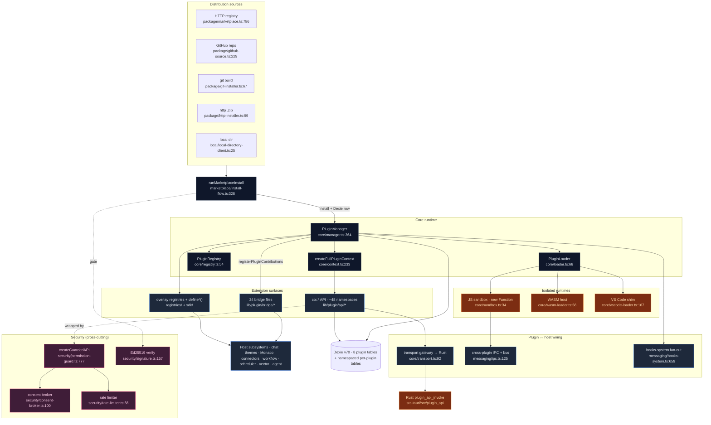

# Plugin system

<Status variant="experimental" />

<TLDR>
  A plugin in Cognia is a signed, manifest-described bundle that the host loads into an isolated
  runtime and grants a **capability-scoped API** (`ctx`). The central orchestrator is
  `PluginManager` (`lib/plugin/core/manager.ts:364`) — a lazy singleton that walks every plugin
  through `discover → validate → compat-gate → verify-signature → load → activate → enable →
  register-contributions`, with snapshot-based rollback at every step. Plugins extend the app three
  ways: by **calling** the `ctx.*` API (≈48 permission-gated namespaces assembled in
  `lib/plugin/core/context.ts:233`), by **declaring contributions** that 34 *bridge files*
  (`lib/plugin/bridge/`) project into host subsystems (chat, themes, fonts, Monaco, connectors,
  workflows, scheduler…), and by **registering typed items** into overlay registries via `define*()`
  SDK helpers. Every host-touching call passes through `createGuardedAPI`
  (`lib/plugin/security/permission-guard.ts:777`): explicit-grant check, per-call consent for
  dangerous permissions, and a token-bucket rate limiter. JS runs in a `new Function` sandbox; WASM
  runs in a Rust wasmtime host; full VS Code extensions run through a sidecar shim.
</TLDR>

<StatGrid>
  <Stat label="Source files" value="~150" hint="lib/plugin/ TS, excl. tests" />
  <Stat label="ctx.* namespaces" value="~48" hint="32 in lib/plugin/api + base namespaces in context.ts" />
  <Stat label="Contribution bridges" value="34" hint="lib/plugin/bridge/ TS files, excl. tests" />
  <Stat label="Extension points" value="49 + ~150" hint="UI slots + hooks (+26 activation, +11 runtime) in plugin-points.ts" />
  <Stat label="Permissions" value="~55 (22 dangerous)" hint="PluginPermission union, types/plugin/plugin.ts:262" />
  <Stat label="Core Dexie tables" value="8" hint="plugins · permissions · reviews · analytics · jobs · dexieMeta · skillUsage · marketplaceSources (schema v70)" />
  <Stat label="Plugin runtimes" value="4" hint="frontend JS · WASM component · VS Code extension · character pack" />
  <Stat label="Manifest" value="v1" hint="Zod-validated, validatePluginManifest" />
</StatGrid>

## What It Is

Cognia ships a real plugin platform, not a script hook. Third-party (and first-party in-tree)
code extends the app without forking it, under explicit per-permission user consent. A plugin can:

- **Call host capabilities** through `ctx.*` — chat, vector search, the agent, the filesystem,
  the terminal, git, connectors, computer-use automation, the companion device, and more.
- **Contribute surfaces** declared in its manifest — themes, fonts, wallpapers, icon themes,
  TextMate grammars, languages, snippets, message-part renderers, A2UI components, config panels,
  modal mounts, AI/OCR/workspace providers, connector adapters, chat middlewares.
- **Register typed items** via the SDK — skills, subagents, MCP-server presets, native Anthropic
  tools, agent-team templates, workflow templates, character packs.
- **Run scheduled jobs** through the [Scheduler](../scheduler), emit workflow triggers, and listen
  to ~150 lifecycle hooks (chat send/receive, tool use, twin ingest, team events, …).

First-party plugins live in-tree under `plugins/` (`computer-use`, `github-delivery`,
`clipboard-history`, `screenshot`, `web-tools`, …) and are loaded by the same manager as
marketplace plugins — the only difference is their install source.

## Where It Lives

```
lib/plugin/
  core/          # Lifecycle orchestrator: manager, loader, registry, context, descriptor,
                 #   compatibility, validation, verification, transport, sandbox, wasm-*, vscode-loader
  api/           # The ctx.* surface — 32 *-api.ts namespaces + index barrel
  bridge/        # 34 bridge files projecting plugin contributions into host subsystems
  contracts/     # Declarative truth: plugin-points, capabilities, bridge maps, runtime-proof audit
  registries/    # Typed overlay-registry stores (skills, subagents, presets, templates, …)
  sdk/           # define*() author-facing typed helpers
  security/      # permission-guard, consent-broker, signature, rate-limiter, wasm-grant, migration
  package/       # Sources: marketplace, github, git, http installers + dependency/conflict resolution
  marketplace/   # install-flow.ts — the dialog-agnostic install orchestrator
  lifecycle/     # backup, update, rollback
  local/         # "Load unpacked" local-directory install
  messaging/     # message-bus, ipc (cross-plugin RPC), hooks-system, constants
  dexie/         # Namespaced per-plugin IndexedDB tables + migration runner
  devtools/      # Dev-only: hot-reload, dev-server, console-tap, debugger, profiler
  vscode-shim/   # VS Code extension host: manifest-adapter, rpc-dispatcher, lm/languages/webview/monaco
  lsp/           # LSP server registry, bootstrap, binary policy, Tauri client adapter
  character-pack/# .cognia-pack.json content packs
  scheduler/ commands/ operator/ auth/ launcher/   # scheduled tasks, command bus, computer-use, auth

lib/db/  plugins · plugin-permissions · plugin-reviews · plugin-analytics ·
         plugin-scheduled-jobs · plugin-types   (schema v70)

components/plugins/   # Settings UI, marketplace grid, audit panel, devtools
src-tauri/src/plugin_api/   # Rust gateway: plugin_api_invoke, wasm host, vscode host, signature verify
```

## Module Map

Each box is a documentation page. Read the per-module page for line-accurate internals.

<Cards>
  <Card title="Core runtime" href="./core-runtime" description="PluginManager lifecycle (discover→validate→verify→load→activate→enable), loader, registry, descriptor, compatibility gating, load-order topo-sort, transport gateway" />
  <Card title="Context API (ctx)" href="./context-api" description="The ~48 ctx.* namespaces, how context.ts assembles them, the createGuardedAPI pattern, credential-stripping projections" />
  <Card title="Contribution bridges" href="./bridges" description="34 bridge files projecting manifest/SDK contributions into chat, themes, fonts, Monaco, connectors, workflows; the module-bridge-map dispatch loop; kind-prefix namespacing" />
  <Card title="Contracts, registries & SDK" href="./contracts-and-registries" description="plugin-points catalog, capability/module bridge maps, the overlay-registry substrate, the 9 typed registries, define*() helpers, runtime-proof audit" />
  <Card title="Security & permissions" href="./security" description="The 5-stage chain: declared perms → consent → guard → rate limit → Ed25519 signing; dangerous-by-default; trusted-publisher anchor; permission migration" />
  <Card title="Sandbox, messaging & WASM" href="./messaging-and-sandbox" description="The new Function JS sandbox, the Node --permission launcher, transport vs cross-plugin IPC, the message bus, the hooks-system fan-out, WASM loader/runtime" />
  <Card title="Packaging, marketplace & lifecycle" href="./packaging-and-lifecycle" description="Four install sources, the runMarketplaceInstall step machine, dependency resolution, conflict detection, backup/update/rollback with rotation" />
  <Card title="Storage (Dexie) & devtools" href="./dexie-and-devtools" description="Per-plugin namespaced IndexedDB tables, migration runner, the dev-server, hot-reload, console-tap, debugger, profiler" />
  <Card title="VS Code extensions & LSP" href="./vscode-and-lsp" description="Running real .vsix extensions via the sidecar shim, manifest adaptation, the 24 Monaco language providers, LSP registry + binary policy, character packs" />
</Cards>

## End-to-End Architecture



## The Lifecycle in One Line

```mermaid
flowchart LR
  D["discover<br/>scanPlugins :873"] --> V["validate<br/>validation.ts:289"]
  V --> C["compat gate<br/>compatibility.ts:119"]
  C --> S["verify signature<br/>signature.ts:157"]
  S --> EN["enablePlugin<br/>manager.ts:1524"]
  EN --> L["loadPlugin<br/>manager.ts:1416"]
  L --> CX["build ctx + activate()<br/>context.ts:233"]
  CX --> RC["register contributions<br/>manager.ts:2404"]
  RC -. disable .-> RB["rollback snapshot restore<br/>manager.ts:1670"]
```



Every state transition is idempotent and rollback-guarded: load/enable early-return if already in
the target state, concurrent loads dedup through a promise map, and a failed enable replays its
`unregister*ByPlugin` cleanup so one bad theme or skill can't block the rest.

## Plugin Runtimes

| Type | Loaded by | Isolation | Notes |
| --- | --- | --- | --- |
| `frontend` (JS) | `core/loader.ts` 3-strategy `eval`/builtin closure | `new Function` sandbox + Node `--permission` re-exec for out-of-process entries | The default; `require()` is unsupported |
| `wasm` (component) | `core/wasm-loader.ts` → Rust wasmtime | Rust host + WASI preopen grant ledger | Browser fallback in `wasm-runtime.ts` (jco path is a structured stub) |
| `vscode-extension` | `core/vscode-loader.ts` → Node sidecar | Sidecar process, RPC-dispatched `vscode.*` | Real `.vsix` support; 24 Monaco language providers |
| character pack | `character-pack/local-pack-store.ts` | content only (no code) | `.cognia-pack.json`, scanned on boot |

## What Changed Since the Old Doc

The single-page doc this section replaces drifted from the implementation. Concrete corrections:

| Claim in the old doc | Reality | Source |
| --- | --- | --- |
| "API namespaces: 11" | The `ctx` object exposes **~48** namespaces; **32** `*-api.ts` files alone | `lib/plugin/core/context.ts:233`, `lib/plugin/api/` |
| "Dexie tables: 5" | **8** plugin-owned core tables (the original 5 + `pluginDexieMeta` v27, `pluginSkillUsage`, `pluginMarketplaceSources`), plus unlimited per-plugin namespaced tables; schema is now **v70** | `lib/db/schema.ts:148`, `:226`, `:1052`, `:1204`, `:1808` |
| "Sandbox: Worker · postMessage RPC bridge" | JS plugins run in a **`new Function`/`AsyncFunction`** sandbox with permission-gated globals — **not** a Web Worker / postMessage channel. OS-level isolation is the separate Node `--permission` re-exec launcher | `lib/plugin/core/sandbox.ts:223`, `lib/plugin/launcher/launchPluginJs.ts:107` |
| (implied) one API surface | There are **two** distinct RPC surfaces — `transport.ts` (renderer→Rust gateway) and `messaging/ipc.ts` (cross-plugin IPC with circuit breakers) — plus the `message-bus` event bus | `lib/plugin/core/transport.ts:92`, `lib/plugin/messaging/ipc.ts:465` |
| (absent) WASM + VS Code | Two further runtimes exist: a Rust wasmtime WASM host and a Node-sidecar VS Code extension shim running real `.vsix` extensions with 24 Monaco language providers | `lib/plugin/core/wasm-loader.ts:56`, `lib/plugin/core/vscode-loader.ts:167` |
| (absent) signing detail | Plugins are verified with **Ed25519**; the trusted-publisher anchor is **build-time-injected** and seeds to `[]` when unset (no spoofable empty-key publisher) | `lib/plugin/security/signature.ts:85`, `:157` |

## Trust & Sandbox Boundaries

- **Consent is per-call for dangerous permissions.** `confirmDangerousByDefault` is `true`
  (`permission-guard.ts:254`): the ~22 `DANGEROUS_PERMISSIONS` (`shell:execute`, `filesystem:write`,
  all `terminal:*`, all `automation:*`, `connectors:send`, …) prompt the user on every invocation
  rather than being silently granted at install.
- **The guard has no wildcard.** `check()` does an exact `grants.get(pluginId)?.get(permission)`
  lookup — there is no `*:allow` expansion anywhere (`permission-guard.ts:402`).
- **Signing gates load, not just install.** With `trustedPublishersOnly` on and no build-time
  pubkey, *every* plugin is rejected — the anchor is `[]`, never a spoofable empty-key publisher
  (`signature.ts:85`).
- **The JS sandbox is soft; the WASM host and the Node launcher are hard.** In-process JS isolation
  is a permission-gated globals surface, not an OS boundary. WASI preopens are fail-closed (an empty
  grant is a hard throw), and the Node `--permission` launcher omits a flag entirely rather than
  passing `*` when a scope is empty.
- **Web mode degrades, never crashes.** WASM, the transport gateway, signature crypto, and the VS
  Code shim all return warn-stubs outside Tauri; read-only marketplace previews still work in-browser.

## Next

<Cards>
  <Card title="Core runtime" href="./core-runtime" description="Start here: how a plugin is discovered, validated, and activated" />
  <Card title="Context API (ctx)" href="./context-api" description="The capability surface plugins call into" />
  <Card title="Security & permissions" href="./security" description="The guard, consent, and signing model" />
  <Card title="Scheduler" href="../scheduler" description="Where plugin scheduled jobs run" />
</Cards>
