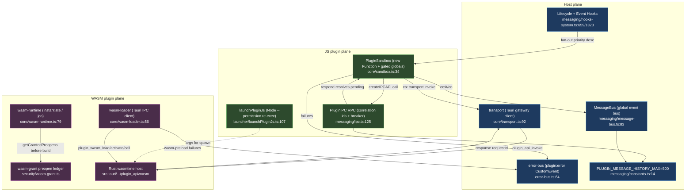

# Sandbox, messaging & WASM

<Status variant="experimental" />

<TLDR>
Plugins never run with raw host privileges. JS plugins evaluate through `PluginSandbox` (`lib/plugin/core/sandbox.ts:34`) — a permission-gated globals surface fed to `new Function` / `AsyncFunction`, never ambient `eval`. OS-level isolation is a separate Node 24 `--permission` re-exec (`lib/plugin/launcher/launchPluginJs.ts:107`). WASM plugins split into a Tauri-IPC client (`lib/plugin/core/wasm-loader.ts:56`) and a browser fallback bounded by the `wasm-grant` preopen ledger (`lib/plugin/core/wasm-runtime.ts:79`). Traffic rides two RPC surfaces — renderer→Rust `transport.ts` and plugin↔plugin `ipc.ts` — plus a typed `message-bus.ts` event bus, all sharing `PLUGIN_MESSAGE_HISTORY_MAX = 500` (`messaging/constants.ts:14`).
</TLDR>

<StatGrid>
  <Stat label="JS isolation" value="new Function" hint="no Web Worker; gated globals as named args" />
  <Stat label="OS bound" value="Node --permission" hint="re-exec, fail-safe deny" />
  <Stat label="RPC surfaces" value="2 + 1 bus" hint="transport · ipc · message-bus" />
  <Stat label="Error codes" value="8" hint="transport gateway" />
  <Stat label="System events" value="18" hint="SystemEvents predefined" />
  <Stat label="History cap" value="500" hint="PLUGIN_MESSAGE_HISTORY_MAX" />
</StatGrid>

## 1. Purpose

Plugins never run with raw host privileges. JS plugins execute through `PluginSandbox` (`lib/plugin/core/sandbox.ts`), which hand-builds a permission-gated globals surface and evaluates code via `new Function` / `AsyncFunction` rather than ambient `eval`. A separate Node `--permission` re-exec launcher (`lib/plugin/launcher/launchPluginJs.ts`) bounds the filesystem / network / child-process surface at the OS level.

WASM plugins take a parallel path. `wasm-loader.ts` is a thin Tauri-IPC client to the Rust `wasmtime` host; `wasm-runtime.ts` is the browser-side `WebAssembly.instantiate` / `@bytecodealliance/jco` fallback, bounded by the `wasm-grant` preopen ledger.

Inter-plugin and plugin↔host traffic flows over messaging: `messaging/ipc.ts` is request/response RPC with correlation ids, circuit breakers, and timeouts; `messaging/message-bus.ts` is the global typed event bus; `constants.ts` holds the shared history cap. The hooks system (`messaging/hooks-system.ts`) fans lifecycle / app events out to every plugin in priority order, and `error-bus.ts` collects plugin errors.

`transport.ts` is the Tauri `plugin_api_invoke` gateway client (renderer→Rust), distinct from cross-plugin IPC. There is **no Web Worker** — JS isolation is `new Function` plus the Node `--permission` re-exec, not `postMessage`.



## 2. sandbox.ts — the in-process JS sandbox

`PluginSandbox` does **not** spawn a Web Worker. It builds an allowlist `Set<string>` from declared permissions (`buildAllowedAPIs`, `sandbox.ts:49`) — always-on `console` / `JSON` / `Math` / `Promise` / `Date` / `Map` (`:53-72`); permission-gated `fetch` / `Headers` for `network:fetch` (`:77`), `WebSocket` (`:84`), `navigator.clipboard` (`:88`), and `indexedDB` (`:98`).

It then synthesizes sandboxed globals (`createSandboxedGlobals`, `:112`): a prefixed-logger `console` (`:137`); `setTimeout` clamped to `config.timeout || 30000` (`:151-157`); `setInterval` floored at `100ms` (`:160-167`); a permission-gated `fetch` that injects an `X-Plugin-Id` header (`:169-185`); and a `plugin:<id>:`-prefixed `localStorage` proxy gated on `database:read` / `database:write` (`:187-214`).

Code runs by injecting the globals as named function arguments:

```ts
execute<T>(code: string, context: Record<string, unknown> = {}): T {
  const safeContext = { ...this.sandboxedGlobals, ...context }
  const argNames = Object.keys(safeContext)
  const argValues = Object.values(safeContext)
  const fn = new Function(...argNames, `"use strict"; return (${code})`)
  return fn(...argValues) as T
}
```

That is `sandbox.ts:223-241`. `executeAsync` (`:246`) wraps the body in an `AsyncFunction` and races it against a timeout (`:262-267`). `executeCode(language, code)` (`:301`) is the separate heavy web sandbox (Pyodide / Worker) — gated on `sandbox:web-execute` (`:302`) and delegated to `@/lib/sandbox/web` (`:304`).

## 3. transport vs ipc vs message-bus

Two RPC surfaces plus one event bus.

### A. transport.ts — renderer→Rust gateway

The request envelope is `PluginApiInvokeRequest` (`transport.ts:25`): `{sdkVersion, pluginId, requestId, api, payload, timeoutMs?, context?}`. The response is `PluginApiInvokeResponse<T>` (`:35`): `{requestId, success, data?, error?, runtimeVersion, compat}`. The `requestId` is a `crypto.randomUUID()` (`createRequestId`, `:77`). Only `TIMEOUT` / `INTERNAL` are retried (`shouldRetry`, `:84`), with `retryDelayMs * attempt` backoff (`:127`):

```ts
const response = await invoke<PluginApiInvokeResponse<T>>("plugin_api_invoke", { request })
if (response.success) return response.data as T
const error = response.error ?? { code: "INTERNAL", message: "Unknown plugin gateway error" }
if (attempt <= retries && shouldRetry(error.code)) { await sleep(retryDelayMs * attempt); continue }
throw new PluginGatewayError({ code: error.code })
```

Error codes (`transport.ts:3`):

| Code | Meaning | Retried |
| --- | --- | --- |
| `INVALID_REQUEST` | Malformed envelope | no |
| `PERMISSION_REQUIRED` | Permission not yet granted | no |
| `PERMISSION_DENIED` | Permission denied | no |
| `NOT_SUPPORTED` | API not available in this shell | no |
| `NOT_FOUND` | Target / resource missing | no |
| `CONFLICT` | State conflict | no |
| `TIMEOUT` | Gateway timed out | yes |
| `INTERNAL` | Unknown gateway error | yes |

The batch path `invokePluginApiBatch` calls `plugin_api_batch_invoke` (`:142`).

### B. ipc.ts — cross-plugin RPC

The `IPCMessage` envelope (`ipc.ts:63`) is `{id, type, channel, senderId, targetId?, payload, timestamp, replyTo?}`, where `type` is one of four kinds: `request | response | broadcast | event`. Request/response RPC is served entirely by `call()` / `expose()` (below) — a one-way `send()` and a fire-and-forget `broadcast()` round out the surface. (A `sendAndWait`/`respond` request-reply twin once lived here but was removed: the reply path was structurally dead — `respond` was never on the plugin-facing `PluginIPCAPI` and the receiver never got the `requestId` to correlate a reply, so every façade-level `sendAndWait` hung to timeout. `call()` + `expose()` is the supported request-response path.)

`createIPCAPI(pluginId).call` (`:807`) routes to `PluginIPC.call` (`:465`), which looks up `exposedMethods.get(targetPluginId).get(methodName)` (`:472-480`), guards a per-`(target::method)` circuit breaker (`:482-485`, `getBreaker` `:544`), races `withTimeout(handler)` against abort (`:518-520`), records success / failure (`:524` / `:534`), and emits `recordSilentFailure` once on a `closed → open` transition (`:565-575`):

```ts
const breaker = this.getBreaker(targetPluginId, methodName)
if (!breaker.canPass()) throw new CircuitOpenError(targetPluginId, methodName)
if (options.signal?.aborted) throw new IPCAbortError("aborted before dispatch")
```

Aborts (`IPCAbortError`, name `"AbortError"`, `:56`) are **not** charged to the breaker (`:528-532`). History is capped at `maxHistory ?? PLUGIN_MESSAGE_HISTORY_MAX` (`:154`). `validateMessage` rejects payloads over `maxMessageSize` (1MB) (`:638-647`).

### C. message-bus.ts — typed event bus

A `BusEvent` (`message-bus.ts:15`) is `{id, type, source, payload, timestamp, metadata?}`. `emit` (`:107`) records → logs → delivers; `deliverEvent` (`:262`) collects exact, RegExp-pattern, and `"*"` subscriptions, sorts by priority descending (`:290`), runs each in its own `try/catch` (`:292-302`), and prunes once-only subscriptions (`:304-307`). `createEventAPI(pluginId)` is at `:518`.

`SystemEvents` (`:59`) predefines 18 types:

| Group | Events |
| --- | --- |
| Plugin lifecycle | `PLUGIN_LOADED` · `PLUGIN_ENABLED` · `PLUGIN_DISABLED` · `PLUGIN_UNLOADED` · `PLUGIN_ERROR` |
| Session | `SESSION_CREATED` · `SESSION_SWITCHED` · `SESSION_DELETED` |
| Agent | `AGENT_STARTED` · `AGENT_COMPLETED` · `AGENT_ERROR` |
| Messaging | `MESSAGE_SENT` · `MESSAGE_RECEIVED` |
| App / UI | `THEME_CHANGED` · `SETTINGS_CHANGED` · `APP_READY` · `APP_CLOSING` |

`constants.ts`: `PLUGIN_MESSAGE_HISTORY_MAX = 500` (`:14`) unifies the IPC and MessageBus caps.

## 4. hooks-system.ts

Three classes.

**`HookDispatcher`** (`hooks-system.ts:249`) carries a priority enum `HookPriority {CRITICAL=100, HIGH=75, NORMAL=50, LOW=25, DEFERRED=0}` (`:153`). `registerHook` returns an unsubscribe (`:274`). `executeHook` runs parallel (`Promise.allSettled`, `:363`) or sequential with `stopOnFirst` / `continueOnError` (`:371-382`); middleware runs `before` / `after` / `error` (`:225`); `executePipeline` chains transforms (`:467`). Ordering is priority descending then `pluginId.localeCompare` (`getSortedHooks`, `:523-527`).

**`PluginLifecycleHooks`** (`:659`): `registerHooks` (`:667`); `dispatchOnLoad` / `Enable` / `Disable` / `Unload` (`:695-721`); `onConfigChange` (`:723`); and pipeline-style `dispatchOnMessageSend` (`:961`) / `Receive` (`:978`) / `Render` (`:995`). Team hooks fire-and-forget via `queueMicrotask` per plugin (`dispatchTeamHook`, `:875-903`) — `onTeamStart` / `onTeamPlanReady` / `onTeammateClaim` / `onTeammateRelease` / `onTeamBudgetWarn` / `onTeamComplete` / `onConsensus*` / `onSharedMemoryWrite` / `Delete` / `onTeamDelegationStart` / `Complete` (`:905-955`). Agent hooks: `onAgentStart` / `Step` / `ToolCall` / `Complete` / `Error` (`:790-857`).

**`PluginEventHooks`** (`:1323`) reads enabled plugins from `usePluginStore` (`:1346`) with a 10s timeout (`:1365`) and transforms `onBuildOptions` (shallow per-field merge, `:1608`), `onUserPromptSubmit` (block / modify, first-wins, `:1670`), `onPreToolUse` (deny / modify, `:1694`), `onPostToolUse` (`:1718`), `onPreCompact` (`:1752`), and `onPostChatReceive` (`:1785`). Failure telemetry uses `recordPluginHookError` (ring buffer of 256, `:67`); `recordPluginHookEvent` emits an agent-trace span (`:113-144`). Singletons are `getPluginLifecycleHooks` / `getPluginEventHooks` (`:2202` / `:2212`).

```ts
queueMicrotask(() => {
  const startTime = Date.now(); let caught: unknown
  try { handler(payload) }
  catch (error) { caught = error; loggers.hooks.error(`Error in plugin ${pluginId} ${name}:`, error) }
  recordPluginHookEvent({ pluginId, hookName: String(name), startTime, durationMs: Date.now()-startTime, sessionId, error: caught })
})
```

That is `hooks-system.ts:884-901`.

## 5. wasm-loader.ts + wasm-runtime.ts

`wasm-loader.ts` is the **production Tauri path**: `isWasmHostAvailable = isTauri()` (`:44`). `loadWasmDefinition` (`:56`) validates `wasmMain` and `wasm.apiVersion` (`:60-65`), returns a warn-only stub in the browser (`:67-78`), and otherwise calls `invoke("plugin_wasm_load")` (`:88`). It returns `activate → plugin_wasm_activate` (which yields the guest exports, `:100`) and `deactivate → plugin_wasm_deactivate` (`:116`). `callWasmExport → plugin_wasm_call` wraps JSON into a `list<u8>` (`:131-149`); `unloadWasmPlugin → plugin_wasm_unload` (`:155`). The heavy work — compile, capability gating, store lifetime, epoch interruption — lives in Rust under `src-tauri/src/plugin_api/wasm/`.

`wasm-runtime.ts` is the **browser-side** runtime. Its grant model resolves preopens from `getGrantedPreopens(pluginId)` (`lib/plugin/security/wasm-grant.ts`) **before** building the runtime — an empty or missing grant is a hard early failure (`:79-89`). Host-function imports are pure, with no real FS or net (`:169-182`):

```ts
const importObject: WebAssembly.Imports = {
  cognia: {
    preopen_count: () => grantedSet.size,
    preopen_at: (idx) => [...grantedSet][idx] ?? "",
    read_file: (path) => { if (!grantedSet.has(path)) throw new Error(`wasm-runtime: preopen denied for ${path}`); return memorySnapshot.get(path) ?? new Uint8Array() },
  },
}
```

`loadWasmPlugin` (`:79`) returns a `WasmPluginHandle` (`:29`) with disposed-guarded `call` / `dispose` (`:96-107`). The default factory (`:121`) sniffs the wasm magic (`looksLikeComponent`, `:152` — a 5th byte `≠ 0x01` means component) and routes to `instantiateCoreModule` (`:163`) or `loadComponent` (`:207`). The component path dynamic-imports `@bytecodealliance/jco` hidden from webpack via `Function("s","return import(s)")` (`:216`) and currently throws a structured "not yet wired" error (`:230-233`).

## 6. launchPluginJs.ts

ADR-0028 Phase 5 — re-exec a plugin JS entry under Node 24 `--permission` so the FS / net / child-process surface is bounded by the manifest's `PluginPermission[]`. The module is pure flag-construction with no I/O. `nodePermissionArgs(scope)` (`:55`) emits `--permission` and then conditionally `--allow-fs-read` / `--allow-fs-write` / `--allow-net` / `--allow-child-process` from CSV lists; **empty lists OMIT the flag** (fail-safe deny, never `*`) (`:56-69`). `deriveScopeFromManifest` (`:81`) maps coarse permissions to concrete path / host / subprocess lists with conservative empty defaults (`:89-96`). `buildLaunchArgv(entryPath, scope, extra)` (`:107`) produces `[...nodePermissionArgs, entryPath, ...extra]`.

## 7. error-bus.ts

A single typed DOM `CustomEvent` channel, `PLUGIN_ERROR_EVENT = "plugin:error"` (`:22`). The 12 stages (`:24`) are `install | install-rollback | load | enable | disable | uninstall | config | activation | permission-register | wasm-preload | hot-reload | local-install`; severity is `error | warning` (`:38`); the detail is `{pluginId, pluginName?, stage, message, severity, recoverable}` (`:40`). `dispatchPluginError` (`:64`) always logs via `loggers.plugin` (`:66-73`) regardless of subscribers, then dispatches the `CustomEvent` only when `window` is defined (`:74-75`). `subscribePluginError(handler)` (`:83`) returns an unsubscribe and is a no-op when `window` is undefined (`:84`).

## 8. Gotchas

- **No Web Worker.** JS isolation is `new Function` / `AsyncFunction` with gated globals injected as named args (`sandbox.ts:236` / `:258`). OS-level isolation is the separate Node `--permission` re-exec (`launchPluginJs.ts`); the in-process sandbox is soft.
- **Two RPC surfaces.** `transport.ts` is renderer→Rust (`plugin_api_invoke`, retries only `TIMEOUT` / `INTERNAL`, UUID `requestId`); `ipc.ts` is plugin↔plugin (in-memory, `Date.now()` + random ids, per-endpoint circuit breaker).
- **Web vs Tauri.** WASM, transport, and `executeCode` degrade in the browser: `wasm-loader` returns a warn-stub (`:67`), `wasm-runtime` runs `WebAssembly.instantiate` purely, and `error-bus` no-ops the DOM event when `window` is undefined but still logs.
- **Correlation / idempotency.** IPC pending entries are keyed by `requestId`; abort / timeout `cleanup()` deletes the pending entry (`ipc.ts:249-255`). The `requestId` stays constant across transport retries (`:98`). There are no idempotency keys — a retried transport call is a new `invoke`.
- **Counts.** IPC `type` has 4 kinds; transport has 8 error codes; `SystemEvents` has 18 predefined types; `PluginErrorStage` has 12 stages.
- **Re-entrancy.** Team hooks dispatch each plugin in `queueMicrotask` (`hooks-system.ts:875-903`). MessageBus, IPC, and hooks each wrap every handler in its own `try/catch`.
- **Shared history cap.** Both IPC and MessageBus source `PLUGIN_MESSAGE_HISTORY_MAX` (`constants.ts`); the caps historically diverged at 100 vs 500.
- **WASM grant is fail-closed early**, and the component (`jco`) path is currently a structured-error stub.

<Cards>
  <Card title="Security model" href="./security" description="Permission grants, consent, signing, and the wasm-grant preopen ledger that backs the WASM runtime." />
  <Card title="Core runtime" href="./core-runtime" description="The plugin manager, loaders, and lifecycle that mount sandboxes and dispatch hooks." />
  <Card title="Dexie & devtools" href="./dexie-and-devtools" description="Plugin-owned Dexie tables and the developer tooling around the plugin system." />
</Cards>
