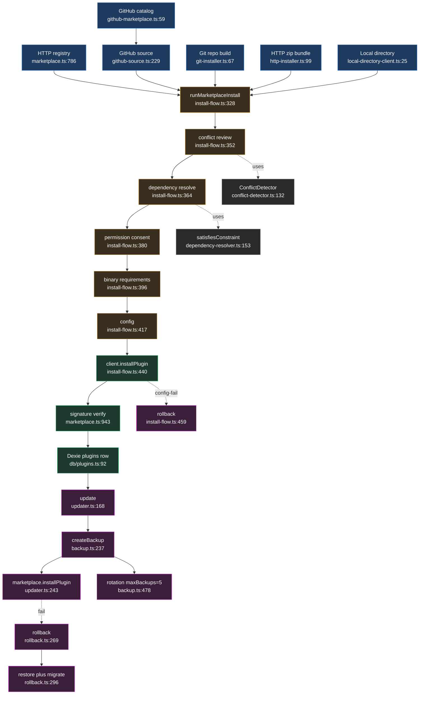

# Packaging, marketplace & lifecycle

<Status variant="experimental" />

<TLDR>
Every plugin install — HTTP registry, GitHub marketplace repo, raw git build, signed HTTP zip, or local directory — funnels through `runMarketplaceInstall` (`install-flow.ts:328`), which runs an ordered gate (manifest → conflict → dependency → permission → binary → config) before calling the source-specific `installPlugin`. No Dexie `plugins` row exists until the install step (`install-flow.ts:6-7`). Once installed, `updater.ts`, `backup.ts`, and `rollback.ts` own versioning, snapshot rotation (default 5), and restore-with-migration.
</TLDR>

<StatGrid>
  <Stat label="Install sources" value="5" />
  <Stat label="Install-flow gates" value="6 (steps 0-5)" />
  <Stat label="Conflict types" value="6" />
  <Stat label="Backups kept / plugin" value="5 (default)" />
  <Stat label="Auto-backup interval" value="24h (default)" />
  <Stat label="Signature gate" value="strict-on" />
</StatGrid>

## 1. Purpose

This subsystem is the distribution and lifecycle spine for plugins. It accepts plugins from **five sources** and feeds them all through a single, dialog-agnostic install pipeline, then keeps them up to date and reversible after install.

The five sources:

- **HTTP registry** (`marketplace.ts`) — a remote plugin registry queried over `proxyFetch`.
- **GitHub "marketplace repo"** (`github-marketplace.ts` → `github-source.ts`) — a GitHub repository shipping a `marketplace.json` catalog.
- **Direct git repos** (`git-installer.ts`) — a repo URL built locally with `cargo-component` (WASM).
- **HTTP `.zip` bundles** (`http-installer.ts`) — a bundle URL with a detached Ed25519 signature.
- **Local on-disk directory** (`local/`) — a "Load unpacked" directory containing `plugin.json`.

All UI installs funnel through `runMarketplaceInstall` (`marketplace/install-flow.ts`), which gates behind an ordered chain — manifest fetch → conflict detection (`conflict-detector.ts`) → dependency resolution (`dependency-resolver.ts`) → permission consent → binary-requirement probe → config — then calls the source-specific `installPlugin`. That source call performs the authoritative **Rust download + signature verification** before the row is promoted. Once installed (a Dexie `plugins` row exists), the lifecycle managers handle versioning: `updater.ts` (backup → download → install → verify), `backup.ts` (snapshot + rotation), `rollback.ts` (backup → disable/unload → restore → migrate → load/enable → verify).

## 2. `install-flow.ts` — `runMarketplaceInstall`

The entry point is `runMarketplaceInstall(opts)` at `install-flow.ts:328`. It is **dialog-agnostic**: every interactive decision is injected as a callback (`install-flow.ts:81-162`), so the same flow drives the desktop dialog, tests, and headless paths. **No Dexie row is created until step 4** (`install-flow.ts:6-7`).

| # | Step | Line | Behavior |
| --- | --- | --- | --- |
| 0 | Resolve manifest | `:336-349` | `client.getPlugin(pluginId)`; `null` → `failed`/`install` (`:340`); throw → `failed`/`install` (`:344`) |
| 1 | Conflict review | `:352-358` | `detectConflicts()` (`:352`); if conflicts, `requestConflictReview()`; cancel → `cancelled`/`conflict` (`:356`) |
| 1.5 | Dependency review | `:364-377` | `resolveDependencyIssues()` (`:364`); missing/conflicts with no callback → `cancelled`/`dependencies` (`:371`); cancel → `:375` |
| 2 | Permission review | `:380-391` | only if declared/optional perms non-empty; cancel → `cancelled`/`permission` (`:389`) |
| 2.5 | Binary requirements | `:396-409` | `resolveMissingBinaries()` (`:396`); no callback → `cancelled`/`binary-requirements` (`:403`); cancel → `:407` |
| 3 | Config | `:417-431` | only if `hasConfigSchema`; `requestConfig()`; cancel → `cancelled`/`config` (`:420`); value captured (`:429`) |
| 4 | Install | `:439-447` | `client.installPlugin(pluginId, version)` (`:440`); throw → `failed`/`install` (`:445`) |
| 5 | Persist config | `:449-487` | `setPluginConfig()` (`:451`); on failure → post-install rollback (`:459-480`); rollback failure → `failed`/`install-rollback` (`:474`) |
| — | Success | `:489` | `{ status: "installed", pluginId }` |

The result is a discriminated union — `installed` | `cancelled{stage}` | `failed{stage, message}` (`install-flow.ts:172-175`) — so callers can branch on exactly where the flow stopped.

The conflict step reads as follows (`install-flow.ts:351-358`):

```ts
const conflict = await detectConflicts(pluginId, manifest)
if (conflict) {
  const decision = await opts.requestConflictReview(conflict)
  if (decision === "cancel") return { status: "cancelled", stage: "conflict" }
}
```

`detectConflicts` (`install-flow.ts:191`) first checks for an id-collision → emits a `high`-severity `alreadyInstalled:${version}` conflict (`:200`), then delegates to `ConflictDetector.detectForPlugin`, mapping each detector's `error`/`warning`/`info` to `high`/`medium`/`low` (`:228-235`). The default post-install rollback lazily resolves `getPluginManager().rollbackInstallation` (`:504-523`) and returns `null` if the manager has not been bootstrapped (`:516`).

## 3. Sources

| Source | File | Input | How it fetches | Key fn `:line` |
| --- | --- | --- | --- | --- |
| HTTP registry | `marketplace.ts` | registry URL + `pluginId` | `proxyFetch(registryUrl/plugins)`; Rust `plugin_install` / `plugin_download_version` | `getPlugin :584`, `searchPluginsStrict :526`, `installPlugin :786` |
| GitHub marketplace repo | `github-marketplace.ts` | owner/repo ref | GitHub contents API for `marketplace.json` (3 candidate paths `:12-16`), parses `plugins[]` | `fetchMarketplaceCatalog :59`, `fetchAllSourceEntries :110` |
| GitHub source (per-plugin) | `github-source.ts` | `owner/repo[@ref][/sub]` or URL | `fetchGithubFile` via contents API (base64-decode `:130-142`); install via Rust `installPluginFromGithub` | `parseGithubPluginRef :63`, `fetchGithubPluginPreview :176`, `makeGithubMarketplaceClient :229` |
| Git repo (WASM build) | `git-installer.ts` | `repoUrl` + branch | Tauri `plugin_wasm_install_from_git` — shallow clone + `cargo component build` | `installFromGit :67` |
| HTTP zip bundle | `http-installer.ts` | `bundleUrl` (+ `signatureUrl`, `expectedPublicKeyBase64`) | Tauri `plugin_wasm_install_from_url`; Ed25519 verify; records `trustedPublishers` | `installFromUrl :99`, `previewBundleManifest :89`, `isPublisherKeyTrusted :157` |
| Local directory | `local/install-from-directory.ts` | absolute `sourceDir` with `plugin.json` | Tauri `plugin_install_from_directory`; preview via `preview_local_manifest` | `installPluginFromDirectory :45`, `previewLocalManifest :94` |
| Local (client adapter) | `local/local-directory-client.ts` | `sourceDir` | wraps the two above into a `{ getPlugin, installPlugin }` client | `createLocalDirectoryClient :25` |

The GitHub marketplace repo and the per-plugin GitHub source compose: the catalog client (`github-marketplace.ts:59`) lists entries, and each entry resolves to a per-plugin GitHub client (`github-source.ts:229`) that fetches the manifest and drives the Rust install.

## 4. `dependency-resolver.ts`

`DependencyResolver.resolve()` (`:226`) walks declared dependencies recursively (`resolveRecursive :255`). For each dependency it checks the **installed map first** (`:275`), else does a `pluginProvider` marketplace lookup (`:308`), else pushes the dependency onto `missing` (`:344`). Circular dependencies are detected via a `visiting` set and produce a **warning, not a throw** (`:266-269`). The final install order is a topological sort via Kahn's algorithm (`calculateInstallOrder :369` — in-degree map + zero-degree queue, `:396-411`).

Constraint failures are split by where they come from: an installed version that fails its constraint becomes a `conflict` (`:289-297`); a marketplace version that fails first tries the `versionProvider` for an alternative (`:322-333`). Success means **no missing and no conflicts** (`:249`):

```ts
result.success = result.missing.length === 0 && result.conflicts.length === 0
```

`satisfiesConstraint` (`:153`) supports `^`, `~`, `>=`, `>`, `<=`, `<`, the `" - "` range, exact pins, and `*` via `parseConstraint` (`:84`). The install-flow uses `satisfiesConstraint` **directly** (`install-flow.ts:311`) for its lighter `resolveDependencyIssues` check, rather than running the full recursive resolver.

## 5. `conflict-detector.ts`

`ConflictDetector.detectAll()` (`:103`) runs **six checks** across all installed plugins; `detectForPlugin(id)` (`:132`) runs the same checks pairwise of one candidate against every other plugin. The conflict types (`ConflictType :27-35`):

| Type | Severity | Detector `:line` | Trigger |
| --- | --- | --- | --- |
| version | error/warning | `:172` | dependency constraint unsatisfiable (`:204`) or mutually-exclusive constraints (`:218`) |
| namespace | error | `:255` | same namespace (defaults to `pluginId`, `:260`) claimed by ≥2 plugins |
| command | warning | `:290` | same command id registered by ≥2 plugins |
| shortcut | warning | `:325` | normalized shortcut collision (`normalizeShortcut :357`) |
| capability | info | `:365` | ≥2 plugins declare an exclusive `themes` capability (`:367`) |
| resource | warning | `:397` | shared resource path |

The pipeline can proceed when there are no errors — `canProceed = errors.length === 0` (`:127`). Each type has a suggested auto-resolution (`generateAutoResolutions :473-565`): command → `skip`, shortcut → `rebind`, namespace → `prefix`, version → `upgrade`/`downgrade`, capability → `disable`, resource → `prioritize`.

The version detector tests each requirement against the installed dependency's version (`:200`):

```ts
const unsatisfied = requirements.filter(
  (req) => !satisfiesConstraint(installedDep.manifest.version, req.constraint),
)
```

## 6. `catalog-entry.ts` + `marketplace.ts`

`PluginRegistryEntry` (`marketplace.ts:30-55`) is the registry's wire shape: `id` / `name` / `version` / `latestVersion` / `downloads` / `rating` / `tags` / `categories` / `verified` / `featured` / `manifest` / `downloadUrl` / `checksum` / `source`. The query API on `PluginMarketplace` (`:513`) exposes `searchPlugins` / `searchPluginsStrict` (`:572` / `:526`, building a `URLSearchParams` `:531-540` then `proxyFetch`), `getPlugin` (`:584`, `404` → `null` `:598`), and `getVersions` (`:612`, Rust `plugin_marketplace_versions` on desktop `:620-622`).

`buildExtensionCatalogEntry` (`catalog-entry.ts:83`) merges a `PluginRegistryEntry` with the installed `Plugin` into an `ExtensionCatalogEntry`: it derives `installed` / `enabled` (`:102-103`), computes compatibility from descriptor diagnostics plus lifecycle diagnostics (`buildLifecycleDiagnostics :15` — surfaces `lifecycle.reload.failed_after_update` `:30` and failed-action warnings `:42`), and appends `"rollback"` to `availableOperations` when both a last-known-good and a failed snapshot exist (`buildCatalogOperations :64-81`).

## 7. `lifecycle/` — backup + rollback + updater

### `updater.ts`

`update()` (`:168`) runs four steps: **Step 1** backup if configured (`createBackup` with reason `pre-update`, `:212`), **Step 2** verify the target version exists in the marketplace (`:229-233`), **Step 3** `marketplace.installPlugin` (`:243`) then project the new version and `refreshRuntimePlugins` (`:248-249`), **Step 4** verify the installed version (`:260`). It emits `UpdateProgress` stages `checking` | `downloading` | `backing_up` | `installing` | `verifying` | `complete` | `error` (`:40-47`). On failure it returns a result with the error and does **no auto-restore**. Auto-update runs on an interval (`:351`); `notifyOnly` instead dispatches `plugin:updates-available` (`:370`).

```ts
const backupResult = await getPluginBackupManager().createBackup(pluginId, {
  reason: "pre-update",
  metadata: { targetVersion },
})
```

### `backup.ts`

`createBackup` (`:237`) calls Tauri `plugin_backup_create` (`:256`); the index is persisted to `localStorage` keyed by `backupPath` (`:91-112`). Rotation is handled by `cleanupOldBackups` (`:478`) — `while (backups.length > maxToKeep)` it pops the oldest and calls `plugin_backup_delete` (`:485-489`); the default is `maxBackupsPerPlugin: 5` (`:80`). Restore comes in three shapes — `restore` / `restoreLatest` / `restoreToVersion` (`:337` / `:388` / `:404`) — all delegating to `plugin_backup_restore` (`:364`). The auto-backup interval defaults to 24h (`:82`, `:518`).

### `rollback.ts`

`rollback(pluginId, target)` (`:269`) runs six steps: **Step 1** a pre-rollback backup (`:277-287`), **Step 2** `plugin_disable` + `plugin_unload` (`:290-291`), **Step 3** restore — either from a backup via `restoreToVersion` **or** via `marketplace.installPlugin` (`:296-309`), **Step 4** data migration (`applyMigration :316`, up/down `MigrationScripts :452-465`), **Step 5** `plugin_load` + `plugin_enable` (`:320-321`), **Step 6** verify the version matches (`:324-328`). On a throw it records `success: false` and does **no automatic re-restore** (`:343-357`). `createRollbackPlan` (`:158`) emits the 8-step ordered plan (`:174-249`) used by the UI to preview a rollback before running it.

## 8. End-to-end flow



## 9. Gotchas

- **`trustedPublishersOnly` lives elsewhere.** The knob lives in the signature subsystem, not in these directories. `policy-runtime.ts:71-72` maps `trustedPublishersOnly ?? false` onto the verifier's `trustedPublishersOnly` and inverts it to `allowUntrusted`. The verifier rejects unknown signers (`signature.ts:204`). With **no build-time anchor** it rejects everything (`signature.ts:83`).
- **Signature gate placement.** Registry installs verify **after** Rust `plugin_install` but **before** promoting the row (`marketplace.ts:935-959`); `requireSignatures` defaults strict-on (`signature.ts:113`). Disabling it still runs verification but records an Audit-Panel bypass diagnostic (`marketplace.ts:960-974`). HTTP and git installs verify **inside Rust** and return `signatureVerified` (`http-installer.ts:146`, `git-installer.ts:78`). The install-flow itself does **no** signature check — it trusts the client.
- **Where installed plugins persist.** The Dexie `plugins` table (`lib/db/plugins.ts:92` put, `:42` get, `:115` `setPluginConfig`); the install-flow reads/writes via `listPlugins` / `getPlugin` / `setPluginConfig` (`install-flow.ts:20`). On-disk WASM/files live under the Rust plugin root (`plugin_get_directory`, `marketplace.ts:888`). The backup index sits in `localStorage` (`backup.ts:91-112`); backup files themselves are written by Tauri.
- **Tauri-only vs web.** Git, HTTP, and local installs are hard desktop errors in web/Capacitor (`git-installer.ts:68`, `http-installer.ts:124`, `install-from-directory.ts:49`); `marketplace.installPlugin` returns a failure when `!isTauri()` (`marketplace.ts:867`). Read-only previews still work in-browser. `defaultDetectBinary` treats a failed detector import as "not available" so the binary gate still surfaces (`install-flow.ts:284-288`).

<Cards>
  <Card title="Security & signing" href="./security" description="trustedPublishersOnly, build-time anchor, and the signature verifier that gates registry installs." />
  <Card title="Core runtime" href="./core-runtime" description="Plugin manager, load/enable/unload, and the runtime that install-flow promotes into." />
  <Card title="Dexie & devtools" href="./dexie-and-devtools" description="The plugins table that backs install state, plus the developer tooling around it." />
</Cards>
