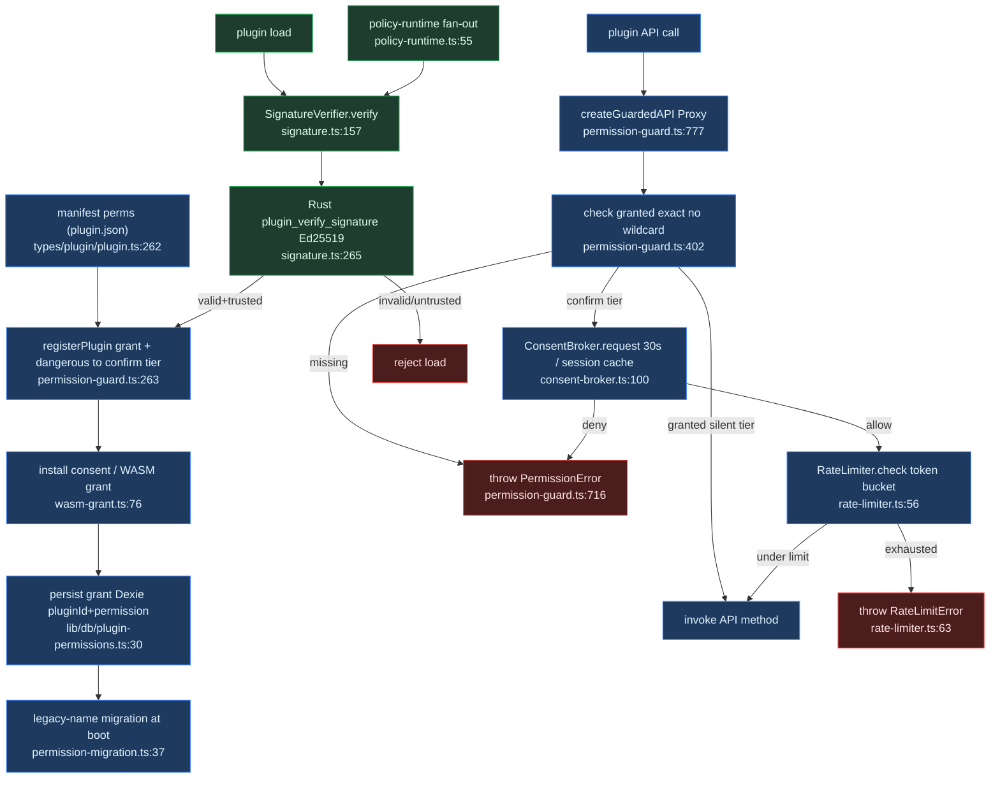

# Security & permissions

<Status variant="experimental" />

<TLDR>
A plugin's `plugin.json` declares `PluginPermission` strings (canonical union at `types/plugin/plugin.ts:262`). At registration the guard records each as `manifest`-granted and stamps `DANGEROUS_PERMISSIONS` to the `confirm` tier (`permission-guard.ts:280`). Central enforcement is `createGuardedAPI` (`permission-guard.ts:777`) — a `Proxy` wrapping every plugin-facing namespace that calls `guard.require()` on each method and routes `confirm`-tier methods through the per-call consent broker. Signature verification (`signature.ts:157`) gates load; the token-bucket rate limiter (`rate-limiter.ts:56`) caps frequency.
</TLDR>

<StatGrid>
  <Stat label="Canonical permissions" value="~55" hint="types/plugin/plugin.ts:262-318" />
  <Stat label="Dangerous permissions" value="confirm tier" hint="permission-guard.ts:177-221" />
  <Stat label="Consent timeout" value="30s auto-reject" hint="consent-broker.ts:54" />
  <Stat label="Signing" value="Ed25519" hint="signature.ts:71" />
  <Stat label="Wildcard grants" value="none" hint="exact lookup only" />
  <Stat label="Permission stores" value="3 bridged" hint="guard / Dexie / API map" />
</StatGrid>

## 1. The five-stage chain

Security is a five-stage pipeline. Declared permissions in the manifest flow into consent at install/runtime, then into guard enforcement on every gated API call, then rate limiting, then code signing and verification at load. Everything lives under `lib/plugin/security/`.

A plugin's `plugin.json` lists `PluginPermission` strings (canonical union at `types/plugin/plugin.ts:262`). At registration the guard records each one as `manifest`-granted and stamps `DANGEROUS_PERMISSIONS` to the `confirm` tier (`permission-guard.ts:280`). Central enforcement is `createGuardedAPI` (`permission-guard.ts:777`), a `Proxy` wrapping every plugin-facing API namespace, calling `guard.require()` (which throws `PermissionError`) on each method and routing `confirm`-tier methods through the per-call consent broker. Signature verification (`signature.ts`) gates load; rate limiting (`rate-limiter.ts`) caps frequency.

## 2. The guard — `permission-guard.ts`

`createGuardedAPI<T>(pluginId, api, permissionMap, { consentExempt })` returns a `Proxy` over the raw API (`permission-guard.ts:777`). On each `get`: non-functions and unmapped methods pass through (`:801`, `:806`); mapped methods return a wrapper.

The fast path (`:824-829`) keeps the synchronous gate — looping `guard.require` per permission — when `consentExempt` is set or no required permission is `confirm`-tier. Otherwise the consent path (`:835-853`) hard-requires the grant first, then defers each `confirm` permission to the broker via `checkWithConsent`, throwing `PermissionError("Consent denied")` on rejection.

```ts
// permission-guard.ts:820-829
const needsConsent =
  !consentExempt.has(prop as keyof T) &&
  permissions.some(
    (permission) => guard.getTier(pluginId, permission) === "confirm",
  )
if (!needsConsent) {
  for (const permission of permissions) {
    guard.require(pluginId, permission, context)
  }
  return (value as (...args: unknown[]) => unknown).apply(target, args)
}
```

`require()` (`:419`) calls `check()` (`:402`), which validates a grant via `isGrantValid()` (`:432`, honoring `expiresAt`). There is no wildcard `*:allow` — `check()` does an exact `grants.get(pluginId)?.get(permission)` lookup. Every check is audited (`:593`).

## 3. The consent broker — `consent-broker.ts`

Dangerous-by-default: `PermissionGuard.config.confirmDangerousByDefault: true` (`permission-guard.ts:254`) means declared `DANGEROUS_PERMISSIONS` register at the `confirm` tier (`:280-288`) so they prompt per-call. Hosts and tests pass `false` to restore silent-grant behavior.

Renderer-side, `PluginConsentBroker.request()` (`consent-broker.ts:100`) first checks the in-memory session-grant cache, otherwise dispatches a `plugin:consent-request` `CustomEvent` (`PLUGIN_CONSENT_REQUEST_EVENT` `:57`) and awaits resolution with a 30s auto-reject timeout (`DEFAULT_CONSENT_TIMEOUT_MS = 30_000` `:54`). The overlay calls `respond(requestId, { allow, persist })` (`:139`); when `persist === true && allow`, the broker adds `sessionKey(pluginId, permission)` to `sessionGrants` (`:144`).

```ts
// consent-broker.ts:100-102
async request(req: PluginConsentRequest): Promise<boolean> {
  if (this.hasSessionGrant(req.pluginId, req.permission)) return true
  const requestId = generateRequestId()
  // ... dispatch event, await respond() or timeout
}
```

Session grants clear on killswitch (`clearAllSessionGrants` `:156`), plugin disable (`clearSessionGrantsForPlugin` `:161`), and reload.

`consentExempt` is the `createGuardedAPI` parameter (`permission-guard.ts:791`) — synchronous query/subscribe helpers that share a dangerous permission skip the prompt but still require the grant. Tests inject `BrokerOptions.emit` (`:68`); `__resetPermissionGuardForTesting` (`permission-guard.ts:766`) throws outside `NODE_ENV=test`.

## 4. Signing & verification — `signature.ts` + `verification.ts`

The Ed25519 build-time public key `OFFICIAL_PLUGIN_PUBLIC_KEY` is injected from `process.env.NEXT_PUBLIC_COGNIA_PLUGIN_PUBKEY` (`signature.ts:71-73`); `isOfficialPublisherKeyConfigured()` (`:76`) reports whether it is present. An empty pubkey means no spoofable anchor (`:85-96`): `OFFICIAL_TRUSTED_PUBLISHERS` is seeded as `[]`, never as a publisher with `publicKey: ""`.

```ts
// signature.ts:85-96
const OFFICIAL_TRUSTED_PUBLISHERS: TrustedPublisher[] =
  isOfficialPublisherKeyConfigured()
    ? [
        {
          id: "cognia-official",
          name: "Cognia Official",
          publicKey: OFFICIAL_PLUGIN_PUBLIC_KEY,
          trustLevel: "official",
          addedAt: new Date("2024-01-01T00:00:00.000Z"),
          domains: ["cognia.app"],
        },
      ]
    : []
```

`PluginSignatureVerifier.verify()` (`signature.ts:157`) reads `signature.json` / `plugin-signature.json` (`readSignatureFile` `:453`); if absent and `requireSignatures` is set (default `true` `:113`) it rejects. It checks expiry (`:178`) and crypto-verifies via the Rust `invoke("plugin_verify_signature")` (`:265`). If the signer is not trusted and `trustedPublishersOnly` is on (`:204`) it rejects; otherwise it warns. `SignatureConfig` is pushed by `policy-runtime.ts:66-73`.

For detached Ed25519, `verifyDetachedBundleSignature()` (`:533`) invokes Rust `plugin_verify_detached_signature` plus `plugin_public_key_fingerprint` (`:548-555`); browser mode degrades to `valid: false` with reason `"host-unavailable"` (`:538`). Helpers: `shortFingerprint()` (`:582`), `signPlugin` (`:349`), `generateKeyPair` (`:371`).

`verification.ts` is a separate concern — capability runtime proofs. `createPluginVerificationSnapshot()` (`verification.ts:35`) attaches `capabilityProofs` for `media` / `canvas` / `ai-provider` (`RUNTIME_PROOF_CAPABILITIES` `:12`).

## 5. Rate limiting — `rate-limiter.ts`

A token bucket per `(plugin, operation)` pair: `PluginRateLimiter.buckets` is a `Map<pluginId, Map<operation, TokenBucket>>` (`rate-limiter.ts:50`). `check()` (`:56`) refills lazily by elapsed seconds × `refillPerSecond`, throws `RateLimitError` if fewer than one token remains (`:63`), and otherwise decrements.

```ts
// rate-limiter.ts:56-68
check(pluginId: string, operation: string): void {
  const limit = this.limits[operation]
  if (!limit) return
  const bucket = this.getBucket(pluginId, operation, limit)
  this.refill(bucket, limit)
  if (bucket.tokens < 1) throw new RateLimitError(pluginId, operation)
  bucket.tokens -= 1
}
```

`DEFAULT_RATE_LIMITS` (`:29`):

| Operation | Capacity | Refill / sec |
| --- | --- | --- |
| `process:spawn` | 5 | 0.1 |
| `network:fetch` | 60 | 1 |
| `python:eval` | 10 | 0.2 |

Rate-limiter keys use legacy `fs:*` / `db:*` operation names, separate from the canonical `filesystem:*` / `database:*` permission strings.

## 6. Persistence & migration — `permission-migration.ts` + `permission-requests.ts`

Granted decisions persist in the Dexie `pluginPermissions` table, one row per `[pluginId+permission]` composite key (`lib/db/plugin-permissions.ts:1-6`), storing `decision` / `expiresAt` / `grantedBy` / `grantedAt`.

`migrateLegacyPermissionNames()` (`permission-migration.ts:37`) runs at manager bootstrap. It rewrites legacy aliases via `LEGACY_TO_CANONICAL` (`{ fs:read → filesystem:read, fs:write → filesystem:write }` `:22`) by revoking and re-calling `setPermission`, preserving fields (`:44-52`); it is idempotent and records a diagnostic per rewrite (`:53`).

`permission-requests.ts` is a centralized single-active-plus-queue manager. `PluginPermissionRequest` (`:11`) is `{ id, pluginId, permission, reason?, kind: "manifest" | "api", timestamp }`. `requestPluginPermission()` (`:68`) enqueues and returns a `Promise<boolean>` in a resolvers map; `resolvePluginPermission(id, granted)` (`:83`) resolves it and dequeues the next request (`:90`). `subscribePermissionRequests` (`:108`) feeds the UI overlay.

## 7. WASM capability grants — `wasm-grant.ts`

A headless writer applying `WasmCapabilityGrantDecision` `{ pluginId, grantedPermissions[], grantedPreopens[] }` (`wasm-grant.ts:20`). `applyWasmCapabilityGrant()` (`:76`) grants each permission into the guard, revokes any stale removed permission (`:90-94`), and persists WASI preopens to a `localStorage` ledger keyed `cognia:wasm-plugin:preopens` (`:36`). It returns `{ permissions, preopens }` for the Rust `plugin_wasm_load`. `getGrantedPreopens()` (`:115`) reapplies on relaunch; `clearWasmCapabilityGrant()` (`:124`) wipes on uninstall.

## 8. Policy fan-out — `policy-runtime.ts`

Policy fan-out pushes the persisted `PluginPolicySnapshot` `{ governance, signatureRequired, trustedPublishersOnly?, autoUpdate }` (`policy-runtime.ts:30`) into three runtime singletons. `applyPluginPolicyToRuntime()` (`:55`):

1. `PluginManager.setPluginPointGovernanceMode` (`:58`)
2. `PluginSignatureVerifier.setConfig({ requireSignatures, trustedPublishersOnly, allowUntrusted: !trustedPublishersOnly })` (`:66-73`)
3. `PluginUpdater.configureAutoUpdate` (`:82`, 24h, notify-only)

The snapshot is persisted to `localStorage` under `cognia.plugins.policy` and applied at boot plus on each `Settings → Plugins → Policy` toggle, each wrapped in `try/catch` for not-yet-booted singletons.

## 9. Permission taxonomy

The canonical type is the `PluginPermission` union at `types/plugin/plugin.ts:262-318` (~55 strings), mirrored as the runtime validator `VALID_PERMISSIONS` in `lib/plugin/core/validation.ts:63`. Categories come from `PERMISSION_GROUPS` (`permission-guard.ts:83-119`).

| Group | Representative permissions |
| --- | --- |
| filesystem | `filesystem:read`, `filesystem:write` |
| network | `network:fetch` |
| clipboard | `clipboard:read`, `clipboard:write` |
| media | `media:*` |
| database | `database:read`, `database:write` |
| settings / session | `settings:*`, `session:*` |
| terminal | `terminal:spawn`, `terminal:write` |
| git | `git:read`, `git:write` |
| goal / connectors | `goal:write`, `connectors:send`, `connectors:manage` |
| share / backup | `share:create`, `backup:write` |
| automation / companion | `automation:*`, `companion:control` |
| misc | `notification`, `secrets:read`/`secrets:write`, `agent:control`, `agent:dispatch-external`, `python:execute`, `sandbox:web-execute`, `subscription:read`, `perf:read` |

### Dangerous permissions

`DANGEROUS_PERMISSIONS` (`permission-guard.ts:177-221`) are stamped to the `confirm` tier at registration:

| Permission | Permission |
| --- | --- |
| `shell:execute` | `process:spawn` |
| `python:execute` | `filesystem:write` |
| `secrets:write` | `agent:dispatch-external` |
| `terminal:spawn` | `terminal:write` |
| `git:write` | `connectors:send` |
| `connectors:manage` | `share:create` |
| `backup:write` | all six `automation:*` |
| `companion:control` | — |

Note: `companion:goal-control` is **not** dangerous — it is a subset of `goal:write` (`:218-219`).

## 10. Least-privilege network egress

`network:fetch` is the consent capability, while `manifest.networkAccess` is
the resource policy. Legacy `allowedDomains` entries restrict hosts. New
`rules` entries additionally require the HTTP method and URL pathname to match:

```json
{
  "networkAccess": {
    "rules": [
      {
        "domain": "observability.example.com",
        "methods": ["GET"],
        "paths": ["/api/logs/*", "/api/metrics/*"]
      }
    ]
  }
}
```

The renderer enforces the policy in web/mobile runtimes and mirrors it into the
Rust host for desktop/headless defense-in-depth. `get`, `fetch`, `download`, and
`upload` all pass through the same policy. Outbound URLs, non-credential
headers, and bodies also pass through the host PII gate. Recognized PII is
redacted by default; set `piiPolicy: "block"` for fail-closed behavior and use
`dataClassification` to label the audit entry.

### Rust parity

The `cognia plugin lint` CLI at `crates/cognia-cli/src/cmd_lint.rs` hard-codes `VALID_PERMISSIONS` / `VALID_CAPABILITIES` / `VALID_PLUGIN_TYPES`. The contract test `lib/plugin/contracts/rust-capability-parity.test.ts:52` reads both the Rust and TS `validation.ts` lists and asserts they match.

## 10. End-to-end flow



## 11. Gotchas

- **Keyring backend dependency.** Secrets plus signature/WASM routing go through Rust `invoke()`. On a keyring build without a real OS backend, OS secrets evaporate on restart.
- **Dangerous-by-default.** `confirmDangerousByDefault` is `true` (`permission-guard.ts:254`); tests and hosts passing `false` revert to silent grants.
- **Signature empty-anchor.** If `NEXT_PUBLIC_COGNIA_PLUGIN_PUBKEY` is unset, `OFFICIAL_TRUSTED_PUBLISHERS` is `[]` (`signature.ts:85`); with `trustedPublishersOnly` on, all plugins are rejected. Never reintroduce a `publicKey: ""` publisher.
- **Test auto-consent / reset.** Tests inject `BrokerOptions.emit` (`consent-broker.ts:68`); use `__resetPermissionGuardForTesting` (`permission-guard.ts:766`) plus `resetPluginConsentBroker` / `resetPluginRateLimiter` / `resetPluginSignatureVerifier`.
- **Rust parity drift.** A new permission added to the types and `validation.ts` but not to `crates/cognia-cli/src/cmd_lint.rs` fails `rust-capability-parity.test.ts:52`.
- **Three parallel stores.** The guard's in-memory `grants` (sync `check`), the Dexie `pluginPermissions` table (remembered decisions), and the API-permission map in `permission-api.ts:18` are distinct. `wasm-grant.ts` and `permission-migration.ts` bridge them.

<Cards>
  <Card title="Context & API" href="./context-api" description="The guarded ctx namespaces a plugin receives." />
  <Card title="Packaging & lifecycle" href="./packaging-and-lifecycle" description="Manifest, install consent, signing at load." />
  <Card title="Messaging & sandbox" href="./messaging-and-sandbox" description="WASM preopens and sandboxed execution." />
</Cards>
