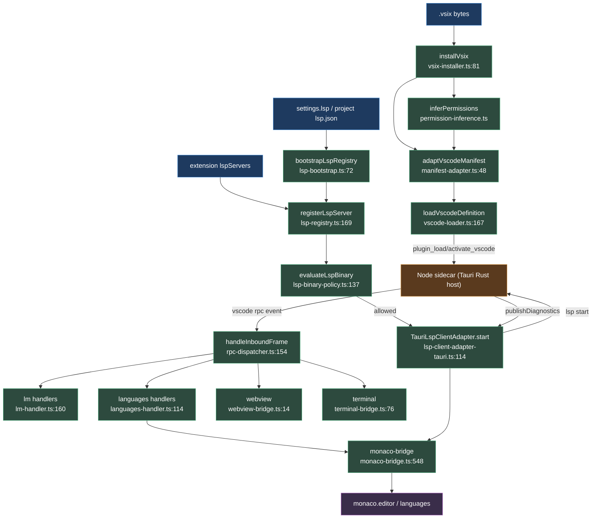

# VS Code extensions & LSP

<Status variant="experimental" />

<TLDR>
Cognia runs **real** VS Code extensions through a shim. Extension code executes in a Node sidecar managed by Tauri Rust; the renderer is a thin IPC client. A `.vsix` is extracted (`vsix-installer.ts:81`), its VS Code manifest mapped to a Cognia `PluginManifest` (`manifest-adapter.ts:48`) with statically-inferred permissions (`permission-inference.ts`), and `vscode-loader.ts:167` delegates `activate`/`deactivate` to Tauri commands. Every sidecar-initiated `vscode.*` call arrives as a Tauri event and is routed by `rpc-dispatcher.ts:154` to method-keyed handlers — `vscode.lm` → Cognia AI, `vscode.languages.*` → Monaco, plus webview/terminal/chat/document bridges. LSP servers resolve through the registry, are gated by `lsp-binary-policy.ts:137`, spawn in the sidecar, and surface diagnostics back into Monaco. Browser mode returns warn-stubs (`vscode-loader.ts:182`).
</TLDR>

<StatGrid>
  <Stat label="Manifest API" value="vscode.*" hint="lm, languages, commands, tasks, chat, webview, terminal, workspace" />
  <Stat label="Monaco providers" value="24" hint="completion…linkedEditingRange, monaco-bridge.ts:646-1126" />
  <Stat label="vsix cap" value="200 MB" hint="MAX_FULL_VSIX_BYTES, vsix-installer.ts:33" />
  <Stat label="LSP channel" value="1" hint="cognia.lsp-service multiplexed by ownerId" />
  <Stat label="Doc pool" value="50 models" hint="file-doc-pool.ts MAX_MODELS=50" />
  <Stat label="Pack schema" value="v2" hint="CHARACTER_PACK_FILE_SCHEMA_VERSION, schema.ts:28" />
</StatGrid>

## 1. Purpose

Cognia runs real VS Code extensions through a shim. Extension code executes in a Node sidecar (`sidecar/vscode-ext-host/`) managed by Tauri Rust (`src-tauri/src/plugin_api/vscode/`); the renderer is a thin IPC client.

A `.vsix` is extracted by `vsix-installer.ts` → its VS Code manifest mapped to a Cognia `PluginManifest` by `manifest-adapter.ts` (with `permission-inference.ts` statically deriving Cognia permissions) → `vscode-loader.ts` delegates `activate`/`deactivate` to Tauri commands → every sidecar-initiated `vscode.*` call arrives as a Tauri event routed by `rpc-dispatcher.ts` to method-keyed handlers:

- `lm-handler.ts` — `vscode.lm` Language Model API → Cognia AI
- `languages-handler.ts` + `monaco-bridge.ts` — `vscode.languages.*` providers + diagnostics/decorations → Monaco
- `webview-bridge.ts` — `createWebviewPanel`
- `terminal-bridge.ts` — `createTerminal`
- `chat-participant-registry.ts` — `vscode.chat` → virtual Characters
- `file-doc-pool.ts` — `openTextDocument`

LSP servers resolve through `lsp-registry` / `lsp-bootstrap` / `lsp-user-servers`, gated by `lsp-binary-policy`, spawn in the sidecar via `lsp-client-adapter-tauri`, and surface diagnostics back into Monaco. Browser mode returns warn-stubs (`vscode-loader.ts:182`).

## 2. vscode-shim deep dive

### vscode-loader.ts

`vscode-loader.ts` (`lib/plugin/core/vscode-loader.ts`) — `loadVscodeDefinition(manifest, pluginPath)` (`:167`) builds a `PluginDefinition`; it requires `vscodeMain` or theme-only contributions (`:171`) and a populated `vscodeExtension.identifier` (`:176`). Non-Tauri → warn stub (`:182`); theme-only → no sidecar (`:198`).

Real path: `plugin_load_vscode` (`:220`), subscribe events (`:229`), `activate` → `plugin_activate_vscode` returning `VscodeActivateResult` with `registeredCommands`, `registeredWebviewViews`, `registeredLanguageProviders`, and `sidecarPid` (`:129`, `:242`), `deactivate` → `plugin_deactivate_vscode` (`:263`).

`ensureDispatcherConfigured()` (`:40`) is a one-time bootstrap that wires the dispatcher transport (`:47`), the `lm-handler` default-model resolver (`:58`), `installVscodeRpcHandlers()` (`:68`), lazy-imports `monaco-editor` + `configureMonacoBridge` (`:73`–`:93`, ~3 MB, dormant on failure `:94`), then runs LSP migration + `bootstrapLspRegistry()` (`:105`–`:118`). `invokeVscodeRpc` (`:288`) proxies renderer↔sidecar via `plugin_invoke_vscode_rpc`; `unloadVscodeExtension` (`:312`) tears down.

### manifest-adapter.ts

`manifest-adapter.ts` — pure, I/O-free (`:8`). `adaptVscodeManifest(input)` (`:48`) → `VsCodeExtensionAdapterResult`. The id is `publisher.name` via `canonicalId` (`:159`); `mapActivationEvent` (`:193`) rewrites `*`→`startup` (`:197`), `onLanguage:*`→`startup`+warning (`:203`), collapses `onDebug*`→`onDebugResolve:*` (`:219`), and preserves the raw events in `vscodeExtension.activationEvents` (`:103`); `inferCapabilities` (`:255`) maps contributes → `PluginCapability[]` (`:262`–`:271`). `runtimeCompatibility.browser` is blocked when `main` is present (`:136`).

```ts
// manifest-adapter.ts:114
const manifest: PluginManifest = {
  id,
  name: displayName,
  type: "vscode-extension",
  capabilities,
  permissions,
  activationEvents: cogniaActivation,
  vscodeMain: pkgJson.main,
  vscodeExtension: vscodeExtensionBlock,
}
```

### rpc-dispatcher.ts

`rpc-dispatcher.ts` — renderer-side JSON-RPC with a method-keyed **global** registry (not `pluginId`-scoped, `:16`). `configureRpcDispatcher({ sendResponse, listen })` (`:61`), `registerMethod(method, handler)` (`:90`), and `subscribeToVscodeEvents(pluginId)` listens on `vscode://rpc/${pluginId}` (`:118`, `:128`). `handleInboundFrame` (`:154`) parses the frame, looks up the handler, and replies via `plugin_vscode_send_response`; an unknown method → JSON-RPC `-32601` (`:177`), a handler throw → `-32000` (`:200`).

### lm-handler.ts

`lm-handler.ts` — backs `vscode.lm`. Three canonical Claude models live in `BASE_MODELS` (`:59`; opus-4-7 / sonnet-4-6 / haiku-4-5). `handleSelectChatModels` (`:160`) filters by `vendor` / `family` / `version` / `id` selector (`:169`); `handleSendChatRequest` (`:178`) issues a non-streaming `generateText` via `getProviderModel({ provider: "anthropic" })` (`:190`–`:203`, streaming deferred `:13`). `handleRegisterChatModelProvider` / `…McpServerDefinitionProvider` / `…Tool` (`:243`, `:268`, `:296`) record tokens in a `providerRegistry` Map; `unregisterAllLmFor` (`:324`) clears them. The default model is set via `configureLmHandler` (`:132`), fallback `claude-sonnet-4-6` (`:157`).

### monaco-bridge.ts

`monaco-bridge.ts` — bridges the `vscode.languages.*` / editor API to Monaco (1300 lines). `configureMonacoBridge({ monacoApi, dispatchRpc })` (`:548`). Editor tracking is `notifyEditorMounted` / `Unmounted` / `ActiveEditorChanged` / `SelectionChanged` / `ContentChanged` (`:561`–`:603`), with `getActiveEditorSnapshot` (`:616`).

24 provider registrars each mint a `nanoid` token and route invocations back to the sidecar via `dispatchRpc`: completion (`:646`), hover (`:666`), definition (`:682`), references (`:700`), formatting / range-formatting (`:716`, `:732`), codeLens (`:751`), codeActions (`:767`), rename (`:786`), documentSymbol (`:807`), inlineCompletion (`:829`), signatureHelp (`:849`), workspaceSymbol (`:875`), color (`:908`), foldingRange (`:937`), selectionRange (`:953`), documentLink (`:973`), onTypeFormatting (`:989`), semanticTokens + range (`:1006`, `:1026`), inlayHints (`:1046`), call/type-hierarchy (`:1062`, `:1094`), linkedEditingRange (`:1126`).

`setDiagnostics` (`:1155`) maps to `monaco.editor.setModelMarkers`; `registerDecorationType` / `setDecorations` (`:1172`, `:1190`); `unregisterByToken` / `unregisterByExtension` (`:1200`, `:1216`). Coordinate conversions go through `lsp-protocol-adapter` (`:31`–`:62`).

```ts
// monaco-bridge.ts:652
const disposable = monacoApi!.languages.registerCompletionItemProvider(req.selector, {
  provideCompletionItems: async (model, position) => {
    const result = await dispatchRpc!(req.extensionId, "provideCompletionItems", {
      token,
      uri: model.uri,
      position: monacoPositionToVscode(position),
    })
    return vscodeCompletionResultToMonaco(result)
  },
})
```

### Other handlers

- `webview-bridge.ts` (`:2`) — `createWebviewPanel` / `registerWebviewViewProvider` state machine; reuses the artifact iframe sandbox (`HostFrame` / `attachHostFrame`) and polyfills `acquireVsCodeApi()` (`:14`–`:23`).
- `terminal-bridge.ts` (`:2`) — `createTerminal` → `ctx.shell.spawn` child + a `vscode.terminal.output` sink; there is **no** xterm/TTY, only RPC stdin/stdout (`:15`).
- `pty-bridge-adapter.ts` (`:4`) — production injection wiring `terminal-bridge` to a real PTY (`lib/terminal/session.ts`).
- `languages-handler.ts` (`:2`) — `languages:*` / `window:*` RPC → `monaco-bridge`; `PROVIDER_REGISTRY` is the kind→registrar table for all 24 (`:53`–`:78`).
- `chat-participant-registry.ts` (`:2`) — `chat.createChatParticipant` → a virtual Character with id `vscode-chat:${pluginId}:${id}` written into the Dexie `characters` table (`:7`, `:128`); invocation is deferred (`:11`).
- `file-doc-pool.ts` (`:2`) — an LRU `file://`→Monaco `ITextModel` pool capped at `MAX_MODELS=50` (`:11`).
- `permission-inference.ts` (`:1`) — a pure `@babel/parser` AST walk; `MODULE_PERMISSION_MAP` (`:40`) maps modules → perms: `fs`→`filesystem:read/write` (`:45`), `child_process`→`process:spawn`+`shell:execute` (`:49`), `http`/`https`→`network:fetch` (`:57`), `ws`/`net`→`network:websocket` (`:61`); a minified-fallback string scan lowers confidence; the sidecar runtime `require()` interceptor is authoritative (`:8`–`:11`).
- `vsix-installer.ts` (`:1`) — `installVsix(ArrayBuffer)` (`:81`) → `VsixInstallResult` with `pkgJson`, `files` Map, `sha256`, `themes`, `lspBinaryCandidates`, and `bundleFormat` (`:52`); JSZip extracts `extension/` (`:39`); a 200 MB cap `MAX_FULL_VSIX_BYTES` (`:33`) applies vs 10 MB theme-only; reuses `importVscodeThemeJson` (`:28`); throws on empty / over-cap / non-ZIP / missing manifest / missing publisher or name (`:71`–`:79`).

### vscode-shim per-file table

| File | Backs | Key exports `:line` |
| --- | --- | --- |
| `vscode-loader.ts` | extension lifecycle | `loadVscodeDefinition:167`, `invokeVscodeRpc:288`, `unloadVscodeExtension:312`, `isVscodeHostAvailable:155` |
| `manifest-adapter.ts` | VSCode manifest→Cognia | `adaptVscodeManifest:48`, `mapActivationEvent:193` |
| `rpc-dispatcher.ts` | extension-host JSON-RPC | `configureRpcDispatcher:61`, `registerMethod:90`, `subscribeToVscodeEvents:118`, `handleInboundFrame:154` |
| `lm-handler.ts` | `vscode.lm` | `handleSelectChatModels:160`, `handleSendChatRequest:178`, `configureLmHandler:132` |
| `monaco-bridge.ts` | `vscode.languages.*`+editor | `configureMonacoBridge:548`, 24 `register*Provider:646-1155`, `setDiagnostics:1155`, `getActiveEditorSnapshot:616` |
| `languages-handler.ts` | `languages:*`/`window:*` RPC | `PROVIDER_REGISTRY:53`, `handleLanguagesRegister:114` |
| `webview-bridge.ts` | `createWebviewPanel` | `attachHostFrame:14` |
| `terminal-bridge.ts` | `createTerminal` | `configureTerminalBridge`, `TerminalRecord:76` |
| `pty-bridge-adapter.ts` | real PTY injection | prod `ShellSpawnFn` adapter`:4` |
| `chat-participant-registry.ts` | `vscode.chat` | `handleCreateChatParticipant:115` |
| `file-doc-pool.ts` | `openTextDocument` | LRU pool `MAX_MODELS=50` |
| `permission-inference.ts` | manifest→perms | `inferPermissions`, `MODULE_PERMISSION_MAP:40` |
| `vsix-installer.ts` | `.vsix` extract | `installVsix:81`, `MAX_FULL_VSIX_BYTES=200MB:33` |
| `setup-handlers.ts` | method table | `installVscodeRpcHandlers:44` |
| `lsp-protocol-adapter.ts` | Monaco↔VSCode↔LSP coords | pure converters |
| `lsp-workspace-manager.ts` | `workspaceFolders` | `ensureWorkspace`/`flushDocument`/`resolveWorkspaceFolder:27` |

## 3. LSP

| File | Purpose | Key exports `:line` |
| --- | --- | --- |
| `lsp-bootstrap.ts` | app-init wiring (idempotent) | `bootstrapLspRegistry:72`; `defaultResolveEditorServers:160` (layers builtin←settings.lsp←project `.cognia/lsp.json`); subscribes settings/project changes `:173` |
| `lsp-registry.ts` | renderer orchestrator; tracks `${ownerId}:${serverId}` | `configureLspRegistry:127`, `registerLspServer:169` (gates policy `:197`, spawns `:232`), `unregisterByOwner:280`, `getLspServerForLanguage:296`, `registerPluginLspServers:310`, `lspServerKey:357` |
| `lsp-user-servers.ts` | editor-side sync from resolver | `editorEligibleServers:36` (drops pure builtins), `syncUserLspServers:50` (`confirmedConsent:true` `:80`), `USER_LSP_PLUGIN_PATH:28` |
| `lsp-client-adapter-tauri.ts` | prod `LspClientAdapter`→sidecar | `TauriLspClientAdapter:64`, `start:114`/`stop:146`/`request:192` over `LSP_TAURI_CHANNEL_ID="cognia.lsp-service":37`; `install()` registers `lsp:publishDiagnostics:84` |
| `lsp-binary-policy.ts` | spawn allow/deny gate (pure, Dexie audit) | `evaluateLspBinary:137` → `LspBinaryEvaluation` with `allowed`, `requiresPrompt`, `reason` `:45`; `configureLspBinaryPolicy:101` |

### Flow

`bootstrapLspRegistry` (loader `:111`) → `defaultResolveEditorServers` layers builtin←user(`settings.lsp`)←project → `editorEligibleServers` drops pure builtins (the editor spawns eagerly; pure builtins stay agent-only to avoid noisy "crashed" states, `lsp-user-servers.ts:8`–`:18`) → `syncUserLspServers` → `registerLspServer`.

The registry runs `evaluateLspBinary` (`:197`): a trusted-publisher binary that lives inside the plugin dir → allow; otherwise `requiresPrompt` (consent) unless dev-mode `unsignedLspAllowed`. On allow → `TauriLspClientAdapter.start` sends `lsp:start` over `cognia.lsp-service` via `invokeVscodeRpc` → the sidecar spawns the real LSP process. The server's `publishDiagnostics` → the adapter routes by `lspServerKey` (`:95`) → `lspPublishDiagnosticsToBridgePayload` → `monaco-bridge.setDiagnostics` → `monaco.editor.setModelMarkers`. Completion/hover flows Monaco → `dispatchRpc` / `adapter.request` → sidecar → LSP.

## 4. character-pack (ADR-0030)

| File | Role | `:line` |
| --- | --- | --- |
| `schema.ts` | `.cognia-pack.json` file format | `CHARACTER_PACK_FILE_SCHEMA_VERSION = 2` `:28`; v1 still readable `:31` |
| `local-pack-store.ts` | scan-on-boot of local `.cognia-pack.json` (NOT plugins) | `LOCAL_PACK_PLUGIN_ID="local:imported":51`; web-mode no-op `:22` |
| `diff-pack-update.ts` | Selective Apply Update partial Dexie patch (pure) | preserved-fields policy + `nextSnapshot:21` |
| `editor-projection.ts` | pure form→pack-shape projections | `classifyCharacterSource:20`, `filterCharacters:30`, `buildPersona:61`, `buildVoiceProfile:85` |
| `character-voice.ts` | `voiceProfile`→partial TTS settings (never mutates `AppSettings`) | `resolveCharacterVoice`; `<provider>Voice` switch `:9` |
| `platform-availability.ts` | `availableOnPlatforms` gate | `currentRuntimeProfile:14`, `isAvailableOnProfile:22` |
| `validate-requires.ts` | `requires` dependency check at register (warn-only) | `PackRequiresValidationResult:37` |

## 5. scheduler + commands + operator

- `scheduler/scheduled-task-registry.ts` — in-memory plugin scheduled-task defs: `registerScheduledTaskDefsForPlugin:40`, `unregisterScheduledTaskDefsByPlugin:59`, `subscribeScheduledTaskDefs:77`.
- `scheduler/scheduler-plugin-executor.ts` — handler store keyed `${pluginId}:${handlerName}:21`: `registerPluginTaskHandler:28`, `getPluginTaskHandler:44`.
- `commands/registry.ts` — unified command bus backing `vscode.commands.register`/`execute`/`getCommands:5`; `CommandHandler:22`, `CommandRegistration:24`.
- `commands/tasks-registry.ts` — `vscode.tasks.*` backing store (npm/gulp/cargo providers) `:4`; execution delegated to `ctx.shell.spawn:12`.
- `operator/action-types.ts` — unified Computer Use action vocabulary `OperatorActionType` (16 members) `:16`; `Coordinate:34`, `ClickAction`/`ScrollAction`/`DragAction:39-66`.
- `operator/coordinates.ts` — Anthropic CU coord scaling (≤1568px long edge) `:4`; `getScaleFactor:25`, `computeScaledDisplay:51`, `unscaleCoordinate:67`; `ModelClass = "legacy"|"opus-4-7":23`.

## 6. End-to-end flow



## 7. Gotchas

- **Supported `vscode.*` APIs**: `lm` (non-streaming only — streaming deferred `lm-handler.ts:13`); `languages.*` (24 providers via `monaco-bridge`); `commands`, `tasks`, `chat` (registration only — participant invocation not wired `chat-participant-registry.ts:11`); `webview`, `terminal` (RPC stdin/stdout, **no** xterm TTY `terminal-bridge.ts:15`); `workspace.openTextDocument` / `workspaceFolders`. **Stubbed/unsupported**: `onDebug*` → mapped but raises `NotSupportedError` at runtime (`manifest-adapter.ts:222`); `onLanguage:*` deprecated → rewritten to `startup` (`:203`). **Browser mode** = warn-stub for everything with a `main` bundle (`vscode-loader.ts:182`, manifest `browser:blocked` `:136`).
- **lsp-binary-policy**: allow-without-prompt only when the publisher Ed25519 fingerprint is in the `trustedPublishers` ledger **and** the binary is inside the plugin install dir (`:146`); trusted-but-outside, unknown fingerprint, or no fingerprint → `requiresPrompt` consent (`:152`–`:169`). Dev-mode `settings.developer.unsignedLspAllowed` / `lsp.unsignedAllowed` flips deny→allow+prompt (`:178`–`:192`); it never relaxes if settings are unreadable. Every decision is audited to `automationAuditLog` best-effort (`:194`). User-added servers get `USER_LSP_PLUGIN_PATH = <app_data>/cognia/user-lsp` (`lsp-user-servers.ts:28`) — real binaries live outside it → forces a prompt by design, but `syncUserLspServers` passes `confirmedConsent:true` (`:80`).
- **Sidecar dependency**: all extension code + LSP processes run in the Node sidecar; the renderer is IPC-only. `monaco-editor` is lazy-imported (~3 MB) and LSP providers stay dormant if it fails to load (`vscode-loader.ts:94`). The single `cognia.lsp-service` channel multiplexes all LSP traffic (no per-extension channel), disambiguated by `ownerId`. Editor eligibility: pure builtin LSPs are agent-only; the editor only spawns user/project/overridden servers to avoid noisy "crashed" states (`lsp-user-servers.ts:8`–`:18`).

<Cards>
  <Card title="Plugin bridges" href="./bridges" description="A2UI ⇄ IM and the host-side bridges plugins project surfaces through." />
  <Card title="Core runtime" href="./core-runtime" description="Plugin manager, loader, and lifecycle that drives vscode-loader." />
  <Card title="Context API" href="./context-api" description="The gated ctx.* namespaces extensions and plugins call into." />
</Cards>
