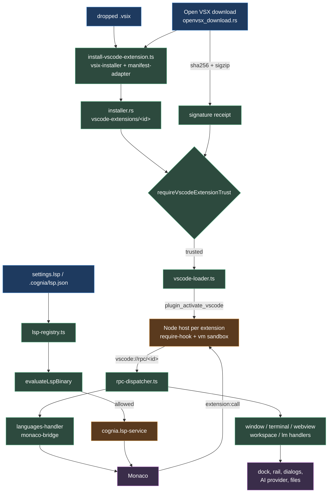

# VS Code extensions & LSP

<Status variant="experimental" />

<TLDR>
Cognia runs **real** VS Code extensions as plugins on the desktop. A `.vsix` from Open VSX (signature checked against a pinned key) or a dropped file (trusted by the user, one extension at a time) is unpacked by the Rust runtime into `<data>/cognia/vscode-extensions/<id>`, and its manifest is adapted into a Cognia `PluginManifest`. Each running extension gets its own Node host (`sidecar/vscode-ext-host`) that mounts the VS Code 1.91 API. The host's calls reach the renderer as JSON-RPC and land on Cognia's own services: Monaco for language features, the terminal dock for terminals and tasks, the extension rail for webviews, the configured AI provider for `vscode.lm`. What Cognia does not provide (debug, SCM, notebooks, tests, comments, menus, keybindings, tree views, ESM bundles) is declared, shown on the plugin's page, and refused with a reason. Browser and mobile builds cannot run extensions.
</TLDR>

<StatGrid>
  <Stat label="API level" value="1.91.0" hint="SHIM_VSCODE_API_VERSION, what vscode-languageclient requires" />
  <Stat label="API members" value="316 / 66" hint="implemented / labelled unsupported, 0 missing (vscode-api-coverage.generated.json)" />
  <Stat label="Provider kinds" value="28" hint="PROVIDER_REGISTRY in languages-handler.ts" />
  <Stat label="Hosts" value="1 per extension" hint="a crash takes down one extension" />
  <Stat label="Restarts" value="5" hint="1 s·2ⁿ backoff capped at 30 s, host-supervisor.ts" />
  <Stat label="vsix cap" value="200 MB" hint="MAX_FULL_VSIX_BYTES, vsix-installer.ts" />
</StatGrid>

## 1. Where things live

| Layer | Path | Owns |
| --- | --- | --- |
| Rust runtime | `crates/cognia-plugin-runtime/src/vscode/` | install (`installer.rs`), Open VSX download and signature check (`openvsx_download.rs`), host processes (`host.rs`), Mementos (`memento.rs`), the Tauri commands (`commands.rs`, behind `tauri-host`) |
| Extension host | `sidecar/vscode-ext-host/src/` | `host.ts` (JSON-RPC on stdio), `extension-runner.ts` (sandbox and lifecycle), `require-hook.ts` (module gate), `vscode-shim/` (the API, one file per namespace) |
| Renderer | `lib/plugin/vscode-shim/` | install, manifest adaptation, the RPC dispatcher and every handler the host calls |
| Loader | `lib/plugin/core/vscode-loader.ts` | turns an installed extension into a `PluginDefinition`, configures the dispatcher and Monaco once |
| Types | `types/plugin/plugin-vscode.ts` | `VsCodeExtensionBlock` (the `vscodeExtension` manifest block), unsupported contributions, contributed commands |
| UI | `components/plugins/detail/plugin-vscode-compat-section.tsx`, `components/plugins/vscode/`, `components/extensions/` | compatibility section, window presenter (messages, quick input, progress), webview frames |

## 2. Install

Every install goes through `install-vscode-extension.ts`, so manifest adaptation cannot be skipped.

- **Open VSX** (`openvsx-install-flow.ts`). The Rust command `plugin_vscode_download_vsix` downloads the `.vsix` and its SHA-256, and checks the `.sigzip`: a raw Ed25519 signature over the whole file, verified against Open VSX's key, which is pinned in Cognia (`OPENVSX_SIGNING_KEY`), never read from the registry. A signature that does not match, or one the registry advertises that cannot be read, stops the install. A verified download is remembered in the Rust state, and installing it writes a `signature` verification receipt. The marketplace card shows **Signed by Open VSX**.
- **Dropped `.vsix`** (desktop only). It is installed with no receipt, and the dialog says it will need trust before it starts. Outside the desktop app the drop is refused with a message.
- **Development folder**. Trusted as the user's own code.

The renderer side (`vsix-installer.ts`) unpacks `extension/`, and `manifest-adapter.ts` maps `package.json` to a `PluginManifest`:

- id `publisher.name`, `type: "vscode-extension"`, `vscodeMain`, and the `vscodeExtension` block (`VsCodeExtensionBlock`) with the raw activation events, bundle format, contributed commands, configuration schema, `unsupportedContributions` and `unsupportedApis`;
- permissions inferred by `permission-inference.ts` (a Babel AST walk with a minified-code fallback): `fs` → `filesystem:read/write`, `child_process` → `process:spawn` + `shell:execute`, `http`/`https` → `network:fetch`, `net`/`ws` → `network:websocket`, `vscode.tasks.executeTask` → `terminal:spawn`.

The Rust installer writes the unpacked files to `<data>/cognia/vscode-extensions/<id>` and discards any verification receipt shipped inside the archive. Each extension's storage, Mementos and log live apart from the install, in `<data>/cognia/vscode-extension-state/<id>/{global,workspace/<hash>,log}`, so they survive updates and reinstalls. Uninstall removes the install directory, and backups include both.

### Trust before start

`PluginManager` does not run VS Code extensions through the Cognia plugin signature check (no VS Code extension carries a Cognia signature). Instead `requireVscodeExtensionTrust` lets one start when:

- its install has a `signature` receipt from a verified Open VSX download, or
- it comes from a development folder, or
- the user trusted it (the **Trust this extension** switch on its Permissions tab).

Otherwise enabling it fails with `PluginFrontendTrustError` (`reason: "unsigned-vscode-extension"`), which the plugin list shows as "trust this extension first". Extensions installed before receipts existed need to be trusted once.

## 3. Running an extension

`vscode-loader.ts` builds the plugin definition. A theme, grammar, icon theme, snippet or language-only extension runs in the renderer and starts no host. Anything with `main` is started through `plugin_activate_vscode`:

1. Rust spawns `host.js` for that one extension (`COGNIA_VSCODE_EXTENSION_ID`) with the user's proxy in its environment (proxy changes apply when the host restarts).
2. `extension:load` sends the install path, `main`, the bundle format and `grantedModules`: the sensitive Node modules the extension's live permissions allow (`commands.rs:granted_node_modules`).
3. `require-hook.ts` answers `require("vscode")` with that extension's API object and refuses any sensitive module (`fs`, `child_process`, `worker_threads`, `http`/`https`, `net`/`tls`, `ws`) not granted, with `EPERM`. A `require` is attributed by where the requiring file lives, so an extension's own `node_modules` (including a bundled `vscode-languageclient`) is gated as the extension.
4. `extension-runner.ts` runs the CommonJS bundle in a `vm` context with `queueMicrotask`, `structuredClone`, `AbortController`, `performance`, `atob`/`btoa`, `crypto` and a `process` that cannot exit the host. `fetch` and `WebSocket` work only with `network:fetch` / `network:websocket`, checked per call. ESM bundles are refused with a reason.
5. Before `activate`, the renderer sends the workspace folders, configuration, installed extensions and window state, and the host awaits them.

**Activation** (`activation-triggers.ts`). An enabled extension starts at launch only for `*`, `onStartupFinished` or contributed views. Otherwise it stays dormant while its contributed commands and languages are listed, and starts on `onCommand:<id>` (then runs the command), `onLanguage:<id>` (an editor opens a document of that language), or `workspaceContains:<glob>` (checked when it becomes dormant and when folders change). Other activation events are recorded as unsupported.

**Crashes** (`host-supervisor.ts`). Rust reports `host:exited` with the stderr it collected (stderr also goes to the plugin log). The supervisor reloads the extension after 1 s·2ⁿ, capped at 30 s, gives up after `MAX_RESTARTS` (5) and forgets earlier crashes after five minutes up. A host that gives up leaves the plugin in an error state until the user enables it again.

**Output channels** and the host's own warnings go to the plugin's runtime log, which the plugin pane links to.

## 4. The API and what backs it

The host mounts the VS Code 1.91 API (`sidecar/vscode-ext-host/src/vscode-shim/index.ts`). `scripts/gates/vscode-api-coverage.mjs` diffs `@types/vscode` against it into `vscode-api-coverage.generated.json` (`pnpm audit:vscode-api-coverage`): every member is implemented or listed as unsupported with a reason, and none is missing. `engine-compat.ts` reads the same report to warn about extensions that use unsupported namespaces. That warning is advisory and never blocks an install.

Calls the host makes arrive as `vscode://rpc/<pluginId>` events. `rpc-dispatcher.ts` routes them by method to the handlers `setup-handlers.ts` installs, and replies through `plugin_vscode_send_response`. Every handler checks the request is the calling extension's own.

| API | Renderer side | Backed by |
| --- | --- | --- |
| `languages.*` providers, diagnostics, language configuration | `languages-handler.ts`, `monaco-bridge.ts`, `monaco-results.ts` | Monaco (see section 5) |
| documents and editors | `document-sync.ts`, `editor-handlers.ts`, `workspace-document-handlers.ts`, `file-doc-pool.ts` | Monaco models, confined file reads and `applyEdit` writes |
| messages, quick pick, input box, progress, status bar, dialogs | `window-handlers.ts`, `window-ui-store.ts`, `native-dialogs.ts` | `components/plugins/vscode/` presenter, toasts, `statusbar.*` slots, Tauri dialogs |
| `window.state`, `activeColorTheme` | `window-environment.ts` | window focus and activity (inactive after 10 s idle), the app theme |
| terminals, `Pseudoterminal` | `terminal-handlers.ts`, `extension-pty-session.ts` | tabs in the terminal dock |
| tasks | host `tasks.ts`, `lib/plugin/commands/tasks-registry.ts` | shell and process tasks run in a dock terminal, custom executions in an extension terminal |
| webview panels and views | `webview-handlers.ts`, `webview-bridge.ts`, `webview-document.ts` | the extension rail, sandboxed frames with `acquireVsCodeApi()` |
| `workspace.fs`, `findFiles`, file watchers, folders | `workspace-file-handlers.ts`, `root-watchers.ts` | file access confined to project folders, `filesystem:read/write` |
| configuration | `configuration-handlers.ts`, `vscode-configuration-schema.ts` | each plugin's config store, `contributes.configuration` defaults |
| `extensions.all/getExtension`, `activate()` | `extensions-handlers.ts` | the plugin manager |
| commands | `runtime-handlers.ts` | `lib/plugin/commands/registry.ts` (contributed titles, categories, `when`) |
| `env` (clipboard, `openExternal`, `asExternalUri`, URI handler) | `env-handlers.ts` | Tauri clipboard and opener, Cognia deep links |
| `vscode.lm` | `lm-handler.ts` | the provider and model the user configured, as vendor `cognia`, streaming. Needs `ai:chat`, the plugin rate limit and the PII gate. Extensions never bring their own key |
| `vscode.chat` participants | `chat-participant-registry.ts` | registered as virtual characters (`vscode-chat:<pluginId>:<id>`). Not invoked yet |
| secrets, Mementos | `runtime-handlers.ts`, `memento.rs` | the secret store, files in the extension's state directory |

`unavailable-methods.ts` lists host methods the renderer cannot serve. It is empty while every method is backed.

## 5. Language features

**Providers.** `vscode.languages.register*Provider` sends `languages:register` with a token the host minted. `languages-handler.ts` looks the kind up in `PROVIDER_REGISTRY` (28 kinds, kept equal to the host's list by its test) and registers it with Monaco. When Monaco asks, `monaco-bridge.ts` sends `extension:call {extensionId, token, method, callId, payload}` back to that host. Disposing the registration unregisters it.

**Documents.** `document-sync.ts` keeps each host's documents in step with Monaco (`workspace:documentOpened/Changed/Closed`, `window:editorsChanged`). The host keeps them as real `TextDocument`s, and a provider call made against a newer version waits for that edit. Cancellation from Monaco reaches the provider's `CancellationToken`.

**Diagnostics.** A `DiagnosticCollection` sends `languages:setDiagnostics` / `clearDiagnostics`, which become Monaco markers.

**Language servers in extensions.** Most language extensions use `vscode-languageclient`. It runs unchanged: its `child_process` is the extension's `process:spawn`, the server process is the extension's own, and the client's providers and diagnostics take the path above. `tests/host-languageclient.test.mjs` runs a real `vscode-languageclient` against `tests/fixtures/echo-lsp.mjs` on the built host, with the client's dependencies copied into the fixture the way an unbundled extension ships them, and checks the registrations, the server's diagnostics, completion and hover.

**Grammars, themes, snippets, languages.** Contributed languages are registered with Monaco (`contributed-languages-monaco.ts`). Themes and icon themes go through the theme bridges. Grammars color code in chat and previews (`grammars-bridge.ts`, Shiki), not in the Monaco editor. A dormant extension's grammars, themes and snippets appear once it runs.

## 6. Not supported (labelled)

Each item is typed, shown in the plugin detail's **VS Code compatibility** section (`plugin-vscode-compat-section.tsx`), and pinned by tests.

**Contributions** (`VsCodeUnsupportedContribution`, from `manifest-adapter.ts:vscodeUnsupportedContributions`):

| Value | Meaning |
| --- | --- |
| `debuggers` | `contributes.debuggers` / `breakpoints`. Cognia has no debugger |
| `notebooks` | `contributes.notebooks` / `notebookRenderer` |
| `menus` | menu entries other than `commandPalette`. The commands still run from the command lists |
| `keybindings` | no shortcut is bound |
| `views` | tree views, view containers, welcome content. Only webview views are shown, in the extension rail |
| `editor-grammars` | grammars color chat and previews, not the code editor |
| `extension-pack` | the listed extensions are not installed with it |
| `esm-bundle` | an ES module bundle cannot start. The host loads CommonJS, as VS Code 1.91 does |

**API namespaces** (`unsupportedApis`, found in the extension's code): `debug`, `scm`, `tests`, `comments`, `notebooks`. Their registrations return inert disposables, their events never fire, and calls that would act throw `NotSupportedError` with the reason. The host reports each unsupported member once per extension (`vscode:unsupportedApi`), and the plugin log names it.

**Other gaps:** chat participants are registered but not invoked, task problem matchers are ignored, and `createTelemetryLogger` sends nothing. `Terminal.processId` is the shell's process id for a terminal running on this machine, and `undefined` for an extension's `Pseudoterminal`.

**Browser and mobile.** There is no extension host. The Open VSX origin is hidden, a dropped `.vsix` is refused, and an installed extension with `main` loads as a stub that marks itself in the plugin list.

## 7. Cognia's own language servers

Separate from extensions, the editor runs language servers the user or project configures (`lib/plugin/lsp/`):

| File | Role |
| --- | --- |
| `lsp-bootstrap.ts` | `bootstrapLspRegistry` layers builtin ← `settings.lsp` ← project `.cognia/lsp.json`, and follows settings and project changes |
| `lsp-user-servers.ts` | `editorEligibleServers` drops pure builtins (agent-only, to avoid noisy "crashed" states), `syncUserLspServers` registers the rest |
| `lsp-registry.ts` | `registerLspServer` / `registerPluginLspServers` (servers a plugin manifest declares), keyed `${ownerId}:${serverId}` |
| `lsp-client-adapter-tauri.ts` | `TauriLspClientAdapter` over the one `cognia.lsp-service` channel, multiplexed by owner. Routes `lsp:publishDiagnostics` to Monaco markers |
| `lsp-monaco-runtime.ts` | `registerLspMonacoProviders` registers only the providers an initialized server declared |
| `vscode-shim/lsp-binary-policy.ts` | `evaluateLspBinary` gates a plugin-declared server binary |

**Binary policy.** A binary outside the plugin's install directory always prompts. One inside prompts until the user approves that exact `(pluginId, path)`, and again if its SHA-256 changes. The plugin's own claims about its publisher are never evidence. `settings.lsp.unsignedAllowed` (dev) turns a prompt into allow-with-prompt. Every decision is written to `automationAuditLog`. User-added servers are registered with `confirmedConsent: true`, as the user configured them.

This policy covers servers Cognia spawns. A server an extension starts itself (as `vscode-languageclient` does) is the extension's `child_process`, gated by its `process:spawn` permission.

## 8. End-to-end flow

```mermaid
graph TD
  OVSX["Open VSX download<br/>openvsx_download.rs"] --"sha256 + sigzip"--> RECEIPT["signature receipt"]
  DROP["dropped .vsix"] --> INSTALL
  OVSX --> INSTALL["install-vscode-extension.ts<br/>vsix-installer + manifest-adapter"]
  INSTALL --> RUST["installer.rs<br/>vscode-extensions/&lt;id&gt;"]
  RUST --> TRUST{"requireVscodeExtensionTrust"}
  RECEIPT --> TRUST
  TRUST --"trusted"--> LOAD["vscode-loader.ts"]
  LOAD --"plugin_activate_vscode"--> HOST["Node host per extension<br/>require-hook + vm sandbox"]
  HOST --"vscode://rpc/&lt;id&gt;"--> DISP["rpc-dispatcher.ts"]
  DISP --> LANG["languages-handler<br/>monaco-bridge"]
  DISP --> WIN["window / terminal / webview<br/>workspace / lm handlers"]
  LANG --> MONACO["Monaco"]
  MONACO --"extension:call"--> HOST
  WIN --> APP["dock, rail, dialogs,<br/>AI provider, files"]
  SETTINGS["settings.lsp / .cognia/lsp.json"] --> REG["lsp-registry.ts"]
  REG --> POL["evaluateLspBinary"]
  POL --"allowed"--> LSP["cognia.lsp-service"]
  LSP --> MONACO

  classDef entry fill:#1e3a5f,stroke:#4a90d9,color:#fff
  classDef bridge fill:#2d4a3e,stroke:#5cb88a,color:#fff
  classDef sidecar fill:#5a3a1e,stroke:#d99a4a,color:#fff
  classDef sink fill:#3a2d4a,stroke:#a45cb8,color:#fff
  class OVSX,DROP,SETTINGS entry
  class INSTALL,RUST,TRUST,LOAD,DISP,LANG,WIN,REG,POL,RECEIPT bridge
  class HOST,LSP sidecar
  class MONACO,APP sink
```

## 9. Testing

- **Host** (`pnpm sidecar:vscode:test`, which builds `dist/` first): `tests/host-*.test.mjs` drive the built `host.js` over stdio with fixture extensions under `tests/fixtures/` (providers, documents, window, terminals, tasks, webviews, workspace, `vscode.lm`, the sandbox, and `vscode-languageclient` with `echo-lsp.mjs`). The other suites test one module each.
- **Rust**: `cargo test -p cognia-plugin-runtime --features tauri-host --lib -- vscode::` covers install, uninstall, the state directory, signatures and receipts, and host stderr and exit.
- **Renderer**: co-located Jest suites under `lib/plugin/vscode-shim/` and the plugin detail components. The coverage gate is `pnpm audit:vscode-api-coverage`.

## 10. character-pack (ADR-0030)

| File | Role | `:line` |
| --- | --- | --- |
| `schema.ts` | `.cognia-pack.json` file format | `CHARACTER_PACK_FILE_SCHEMA_VERSION = 2` `:28`; v1 still readable `:31` |
| `local-pack-store.ts` | scan-on-boot of local `.cognia-pack.json` (NOT plugins) | `LOCAL_PACK_PLUGIN_ID="local:imported":51`; web-mode no-op `:22` |
| `diff-pack-update.ts` | Selective Apply Update partial Dexie patch (pure) | preserved-fields policy + `nextSnapshot:21` |
| `editor-projection.ts` | pure form→pack-shape projections | `classifyCharacterSource:20`, `filterCharacters:30`, `buildPersona:61`, `buildVoiceProfile:85` |
| `character-voice.ts` | `voiceProfile`→partial TTS settings (never mutates `AppSettings`) | `resolveCharacterVoice`; `<provider>Voice` switch `:9` |
| `platform-availability.ts` | `availableOnPlatforms` gate | `currentRuntimeProfile:14`, `isAvailableOnProfile:22` |
| `validate-requires.ts` | `requires` dependency check at register (warn-only) | `PackRequiresValidationResult:37` |

## 11. scheduler + commands + operator

- `scheduler/scheduled-task-registry.ts` — in-memory plugin scheduled-task defs: `registerScheduledTaskDefsForPlugin:40`, `unregisterScheduledTaskDefsByPlugin:59`, `subscribeScheduledTaskDefs:77`.
- `scheduler/scheduler-plugin-executor.ts` — handler store keyed `${pluginId}:${handlerName}:21`: `registerPluginTaskHandler:28`, `getPluginTaskHandler:44`.
- `commands/registry.ts` — unified command bus backing `vscode.commands.register`/`execute`/`getCommands:5`; `CommandHandler:22`, `CommandRegistration:24`.
- `commands/tasks-registry.ts` — the task providers VS Code extensions register, and `fetchTasks` across them. Running a task happens in the extension's host (section 4).
- `operator/action-types.ts` — unified Computer Use action vocabulary `OperatorActionType` (16 members) `:16`; `Coordinate:34`, `ClickAction`/`ScrollAction`/`DragAction:39-66`.
- `operator/coordinates.ts` — Anthropic CU coord scaling (≤1568px long edge) `:4`; `getScaleFactor:25`, `computeScaledDisplay:51`, `unscaleCoordinate:67`; `ModelClass = "legacy"|"opus-4-7":23`.

## 12. Gotchas

- **Trust is per extension, and the receipt is per install.** Reinstalling from Open VSX writes a fresh receipt. Installing a dropped `.vsix` over a signed install replaces the directory, receipt included, so that copy needs the user's trust.
- **Permissions decide modules at load.** `grantedModules` is computed when the host starts, because `require()` is synchronous. Granting a permission later takes effect when the extension restarts.
- **Proxy** settings are read when a host starts.
- **One host per extension.** `vscode.extensions.getExtension(other).exports` is not shared across hosts. `activate()` on another extension starts it in its own host.
- **Desktop only.** Everything with `main` needs the Tauri runtime. `isVscodeHostAvailable()` is the check the UI uses.

<Cards>
  <Card title="Plugin bridges" href="./bridges" description="A2UI ⇄ IM and the host-side bridges plugins project surfaces through." />
  <Card title="Core runtime" href="./core-runtime" description="Plugin manager, loader, and lifecycle that drives vscode-loader." />
  <Card title="Context API" href="./context-api" description="The gated ctx.* namespaces extensions and plugins call into." />
</Cards>
