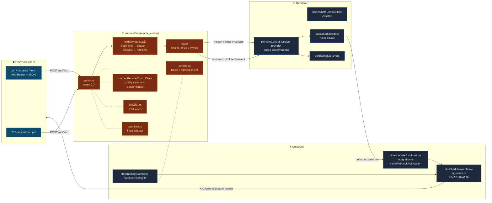
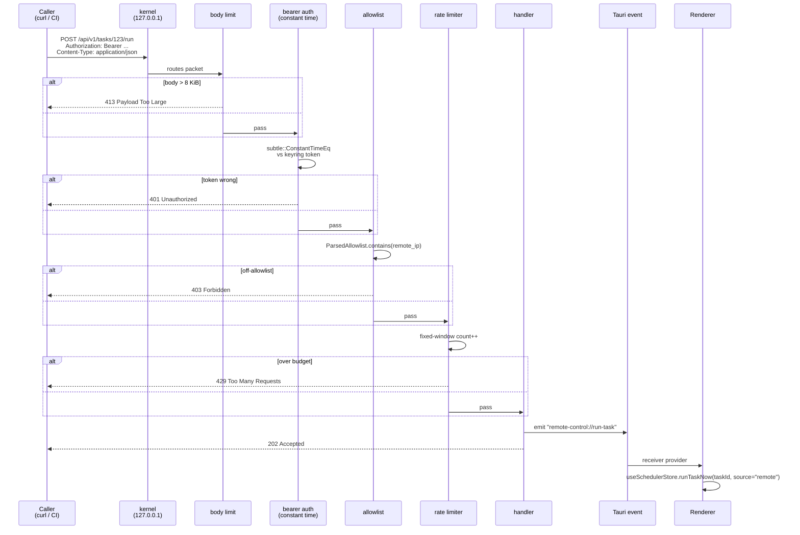

# Remote Control

<Status variant="stable" />

<TLDR>
  Tauri Rust starts an axum 0.7 HTTP server bound to 127.0.0.1:&lt;port&gt; (default 47821), exposing 3 v1
  endpoints: health / trigger task / trigger event. Bearer + IP allowlist + rate limiting + 8 KiB body limit.
  Outbound direction adds HMAC-SHA256 + custom headers to scheduler webhook channels. Secrets go to the OS
  keyring (`com.cognia.remote-control`).**Off by default**, opt-in to enable.
</TLDR>

<StatGrid>
  <Stat label="Inbound endpoints" value="3" hint="/api/v1/health · /api/v1/tasks/:id/run · /api/v1/events" />
  <Stat label="Default port" value="47821" hint="127.0.0.1 binding only" />
  <Stat label="Body limit" value="8 KiB" hint="tower-http RequestBodyLimitLayer" />
  <Stat label="Default rate limit" value="60/min" hint="fixed-window per-token" />
</StatGrid>

## Use Cases

| Scenario | Trigger |
| -------- | ------- |
| CI job starts a chat | `POST /api/v1/tasks/&lt;taskId&gt;/run`, cognia scheduler executes the task |
| External sync completion notification | `POST /api/v1/events` with body `{ eventType: "backup:needed", eventSource: "external" }` |
| Webhook receiver authentication | Outbound webhook carries `X-Cognia-Signature: sha256=<hex>` — receiver validates HMAC |
| Personal script automation | curl + bearer token simple scripts |
| Cloudflare Tunnel | (Future) axum app stays the same, only a sidecar process is added |

**Not suitable for**: LAN direct connection (127.0.0.1 only by design), public internet exposure (out of scope this cycle), scenarios requiring bidirectional streaming (request/response only).

## Architecture Diagram



## Key Modules and File Paths

### Rust Layer

| File | Purpose |
| ---- | ------- |
| `src-tauri/src/remote_control/mod.rs` | `RemoteControlState` — Tauri-managed; holds `ServerHandle` |
| `src-tauri/src/remote_control/server.rs` | axum app + middleware stack + 3 endpoints; graceful shutdown via `watch` |
| `src-tauri/src/remote_control/allowlist.rs` | IPv4 CIDR matcher (bare IP / `127.0.0.1/32` / `10.0.0.0/8`) |
| `src-tauri/src/remote_control/rate_limit.rs` | `FixedWindowRateLimiter` — per-token 60/min default |
| `src-tauri/src/remote_control/keyring.rs` | `read_token` / `write_token` / `read_signing_secret` / `write_signing_secret` |
| `src-tauri/src/remote_control/commands.rs` | 12 Tauri commands (status / start / stop / set/clear token / update config / ...) |
| `src-tauri/src/remote_control/types.rs` | `RemoteControlConfig` / `RemoteControlStatus` / `RemoteControlError` |

### Renderer Layer

| File | Purpose |
| ---- | ------- |
| `types/remote-control/index.ts` | Mirrored Rust types + `validateCidrOrIp` |
| `lib/scheduler/webhook-outbound-config.ts` | `getWebhookOutboundConfig()` — reads keyring (desktop only) + Zustand |
| `lib/scheduler/webhook-signature.ts` | Web Crypto HMAC-SHA256 (~30 lines); shared between production and tests |
| `lib/scheduler/notification-integration.ts` | Existing `sendWebhookNotification`; added `opts: { signingSecret?, headers? }` |
| `components/settings/remote-control/remote-control-section.tsx` | Tabbed shell; 4 tabs (Overview / Inbound / Outbound / Events) |
| `components/providers/remote-control-receiver.tsx` | Top-level provider; listens for `remote-control://*` Tauri events |

## Control Flow: HMAC Verification (Inbound)



## Control Flow: HMAC Signing (Outbound)

```mermaid
sequenceDiagram
  participant S as Scheduler
  participant Cfg as webhook-outbound-config
  participant K as OS keyring
  participant Sig as webhook-signature
  participant Net as fetch
  participant Recv as Receiver

  S->>Cfg: getWebhookOutboundConfig()
  Cfg->>K: fetch outbound-signing-secret (desktop only)
  K-->>Cfg: secret or null
  Cfg-->>S: { signingSecret?, headers? }

  S->>S: JSON.stringify(payload) once<br/>—— same body used on every retry
  alt signingSecret exists
    S->>Sig: hmacSha256Hex(secret, body)
    Sig-->>S: hex digest
    S->>S: add header X-Cognia-Signature: sha256=<hex>
  end
  S->>S: merge opts.headers (first) + Content-Type: application/json (last; overrides)
  loop up to 3 times
    S->>Net: POST url, headers, body
    alt 2xx
      Net-->>Recv: delivery success
    else 5xx / timeout
      Net-->>S: failure
      S->>S: exponential backoff + jitter
    end
  end

  Recv->>Recv: HMAC(local-secret, raw body) =?= header
  alt mismatch
    Recv-->>S: reject
  else match
    Recv-->>Recv: process webhook
  end
```

## Middleware Stack Details

From outermost to innermost:

1. **Body size limit** — `tower_http::limit::RequestBodyLimitLayer::new(8 * 1024)`; returns 413 if exceeded.
2. **Bearer auth** — reads `Authorization: Bearer <token>` header; `subtle::ConstantTimeEq` constant-time comparison against keyring token; returns 401 if not equal.
3. **IPv4 CIDR allowlist** — `ParsedAllowlist.contains(remote_ip)`; returns 403 if not matched. Default is `127.0.0.1/32`.
4. **Fixed-window rate limit** — per-token 60 req/min (configurable); returns 429 if exceeded.

If any middleware rejects the request, it never reaches the handler; the handler only receives requests that are authenticated + allowlisted + within rate limit quota.

## Endpoint Contract

| Method | Path | Behavior |
| ------ | ---- | -------- |
| `GET` | `/api/v1/health` | Returns `{ ok: true, version }`. **Requires auth** to avoid leaking version numbers to unauthenticated scanners. |
| `POST` | `/api/v1/tasks/:id/run` | Emits `remote-control://run-task` Tauri event; renderer calls `runTaskNow(taskId, source="remote")`; returns 202. |
| `POST` | `/api/v1/events` | Emits `remote-control://emit-event`; renderer calls `emitSchedulerEvent(eventType, data, eventSource)`; returns 202. |

`/events` request body shape:

```json
{
  "eventType": "backup:needed",
  "eventSource": "external",
  "data": { "any": "json" }
}
```

`/tasks/:id/run` request body is optional; if present, `payload` is passed as an argument to `runTaskNow`.

## Database Tables

Remote control itself **does not introduce new Dexie tables**:

- Inbound token / outbound secret — OS keyring (service `com.cognia.remote-control`, accounts `inbound-token` / `outbound-signing-secret`).
- Configuration — Zustand `useRemoteControlStore` + `tauri-plugin-store` (port / allowlist / rate limit / custom headers).
- Call logs — Rust-side `RemoteControlStatus.lastCallAt` + in-memory ring buffer, pushed to the Overview tab via `remote-control://inbound-call`.
- Triggered task executions — uses the existing `taskExecutions` table (tag `triggerSource = "remote"`).

## Configuration Options and Extension Points

### Settings → Remote Control (four tabs)

| Tab | Content |
| --- | ------- |
| `Overview` | Start/stop / bound port / call count / recent call list (ring buffer) |
| `Inbound` | Enable toggle (guarded by `isTauri()`), `Generate token`, port, CIDR allowlist input, rate limit ceiling |
| `Outbound` | "Set / clear signing secret" button, custom headers list (merge order: opts.headers first, `Content-Type` last) |
| `Events` | Event documentation + a test sender |

### Inbound Startup Gate

- `inbound.enabled` defaults to `false`.
- The Switch is disabled until `Generate token` is clicked.
- The `lib.rs:setup` auto-start path only runs when `inbound.enabled === true` **and** a token exists in the keyring.
- Missing token returns `TokenMissing` → renderer shows "Please regenerate token".

### `TaskExecutionTriggerSource = "remote"`

`runTaskNow` accepts an optional `source`; remotely triggered runs show a "remote" badge in history (distinct from cron / manual / event).

## Related Subsystems

<Cards>
  <Card title="Scheduler" href="./scheduler" description="The engine that actually runs tasks and receives events" />
  <Card
    title="MCP Server in Tauri"
    href="./mcp-server-tauri"
    description="Same axum pattern — local 127.0.0.1 + Bearer + path-based"
  />
  <Card
    title="Companion API"
    href="./companion-api"
    description="Same HTTP server family; oriented toward phone clients"
  />
  <Card
    title="Backup & Data"
    href="./backup-and-data"
    description="Remotely triggered backup:needed events trigger automatic backups"
  />
</Cards>

## Related ADRs

- [ADR 0005 — Remote Control Subsystem](../adr/0005-remote-control)
- [ADR 0008 — External Bridge](../adr/0008-external-bridge) (shared axum instance concept)
- [ADR 0009 — Platform Connectors](../adr/0009-platform-connectors) (outbound webhook signature reference)

## Known Limitations

- **Single token**: One bearer token per instance; per-token rate limiting is in place but all tokens have equal privileges. Multiple tokens + scopes is future work.
- **No public internet exposure**: 127.0.0.1 binding is hardcoded. A future ADR plans to add a Cloudflare Tunnel sidecar without changing the axum app itself.
- **Per-task signing secret**: Currently a single global key signs all webhooks. Per-task override may be added later.
- **Request/response only**: No WebSocket / SSE push support.
- **Receiver TLS validation is user responsibility**: cognia does HMAC, but receivers still need to pin TLS themselves.
- **Threat model**: Defends against same-host processes that cannot read the keyring, off-loopback attackers, and body-replay against webhook receivers; **does not defend** against same-host attackers who can read the OS keyring (any cognia API key is equally exposed), malicious browser extensions inside the cognia webview, or outbound MITM (requires receiver to pin TLS).
