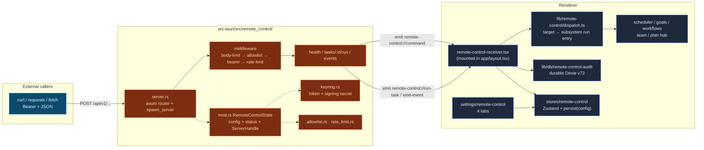

# Remote Control

<Status variant="stable">fully activated — inbound dispatch live · outbound signing wired · durable audit</Status>

<TLDR>
  The Tauri Rust backend starts an [axum](https://docs.rs/axum) HTTP server bound to
  `127.0.0.1:<port>` (default **47821**) that exposes `/api/v1` endpoints — health, run a scheduler
  task, fire a scheduler event, and a **generic `POST /commands/:target`** that dispatches into any
  execution subsystem (scheduler, goals, workflows, agent team, plan hub). Rust stays a thin ingress:
  it authenticates and emits a `remote-control://command` event; the renderer's
  `lib/remote-control/dispatch.ts` registry routes by target into each subsystem's existing headless
  run entry. Every request passes a hardened middleware gate: **Host-header allowlist + Origin
  rejection** (DNS-rebinding mitigation) → 8&nbsp;KiB body limit → IPv4 CIDR allowlist → constant-time
  bearer auth → **read/write capability gate** → fixed-window rate limit, with an **Idempotency-Key**
  replay cache and `Content-Security-Policy: default-src 'none'` on every response. The outbound half
  is now wired: scheduler webhooks and any configured **egress endpoints** are signed with the
  [Standard Webhooks](https://www.standardwebhooks.com/) scheme. Every inbound dispatch and outbound
  delivery is recorded to a durable Dexie audit table (`remoteControlAudit`, schema v72). Secrets live
  in the OS keyring; the listener is **off by default**.
</TLDR>

<StatGrid>
  <Stat label="Inbound endpoints" value="3" hint="/health · /tasks/:id/run · /events" />
  <Stat label="Default port" value="47821" hint="127.0.0.1 only — types.rs:43" />
  <Stat label="Body limit" value="8 KiB" hint="RequestBodyLimitLayer — server.rs:46" />
  <Stat label="Default rate limit" value="60 / min" hint="fixed window — types.rs:45" />
  <Stat label="Tauri commands" value="8" hint="commands.rs — registered lib.rs:597" />
  <Stat label="Bearer token" value="256-bit" hint="2× UUIDv4 hex — keyring.rs:70" />
</StatGrid>

## What It Is

Remote Control is the smallest of Cognia's three [external API](../companion-api) surfaces. Because
`next.config.ts` forces `output: "export"`, `app/api/` does not exist at runtime — every server
endpoint is Rust, not a Next.js route. This listener gives **local scripts and CI jobs** a way to
drive a running Cognia install over plain HTTP without writing a plugin or learning the MCP
toolchain:

- Kick off a scheduled chat from a CI job → `POST /api/v1/tasks/<taskId>/run`.
- Fire a `backup:needed` event when an external sync finishes → `POST /api/v1/events`.
- Authenticate an outbound webhook so the receiver can verify it really came from this install
  (the outbound HMAC half — built, pending wiring).

It is deliberately **loopback-only**. The listener binds `Ipv4Addr::LOCALHOST` (`server.rs:83`) and
the default allowlist is `127.0.0.1/32`; LAN and public-internet exposure are explicitly out of
scope (a future Cloudflare Tunnel sidecar can front it without touching the axum app). For a phone
that drives the desktop, see the [Companion API](../companion-api) instead — a different server with
device JWTs and off-loopback binding.

## Two Halves

| Direction | Lives in | Transport | Auth | Status |
| --- | --- | --- | --- | --- |
| **Inbound** | `src-tauri/src/remote_control/` + `lib/remote-control/dispatch.ts` | axum HTTP on `127.0.0.1:47821` | Host/Origin + bearer + IPv4 CIDR + read/write capability | live — dispatches to scheduler / goals / workflows / team / plan |
| **Outbound** | `lib/remote-control/outbound/` + keyring | scheduler webhook channel + egress endpoints | Standard Webhooks HMAC-SHA256 | wired into `sendWebhookNotification` + `publishOutboundEvent` |

<Callout type="info">
  Activation update (2026-06-03). The three dead wiring paths from earlier drafts are now closed:

  1. **`RemoteControlReceiver` is mounted** in `app/layout.tsx` (inside the desktop providers, no-op
     off Tauri), so inbound requests actually dispatch — including the new `remote-control://command`
     event routed through `lib/remote-control/dispatch.ts`.
  2. **Outbound signing is wired.** `sendWebhookNotification` now delivers through
     `lib/remote-control/outbound/delivery.ts`, signing each delivery with the Standard Webhooks
     header trio (`webhook-id` / `webhook-timestamp` / `webhook-signature`) and the user's custom
     headers; it also fans the event to any configured egress endpoints. The legacy
     `X-Cognia-Signature` hex helper was retired.
  3. **A `"remote"` `TaskExecutionTriggerSource`** now tags remote-dispatched scheduler runs so they
     are distinguishable in execution history.
</Callout>

## Architecture at a Glance



## Module Map

| Module page | Source | Covers |
| --- | --- | --- |
| [Rust Listener](./rust-listener) | `server.rs` | `spawn_server`, the axum router, the four-stage middleware (correct order), endpoint handlers, graceful shutdown, the `RequestObserver` hook |
| [Security Model](./security) | `allowlist.rs`, `rate_limit.rs`, `keyring.rs` | IPv4 CIDR matching, fixed-window rate limiting, keyring storage, token generation, threat model |
| [State &amp; Commands](./state-and-commands) | `mod.rs`, `types.rs`, `commands.rs`, `lib.rs` | `RemoteControlState`, wire types, the 8 Tauri commands, managed-state wiring, setup auto-start gate |
| [Renderer &amp; Settings](./renderer-and-settings) | `types/`, `lib/tauri/`, `stores/`, `components/` | mirrored types, invoke wrappers, the Zustand store, the receiver provider, the 4-tab settings section |
| [Outbound Webhooks](./outbound-webhooks) | `lib/scheduler/webhook-*.ts`, `notification-integration.ts`, `event-integration.ts` | HMAC signing helper, outbound config, the real retry loop, event emission, the not-yet-wired status |

## Endpoint Contract

| Method | Path | Behavior | Code |
| --- | --- | --- | --- |
| `GET` | `/api/v1/health` | `{ ok: true, version }`. **Requires auth** — the middleware gate runs on every route, so the version is never leaked to an unauthenticated prober. | `server.rs:138` |
| `POST` | `/api/v1/tasks/:id/run` | Emits `remote-control://run-task` with `{ taskId, payload? }`; returns `202 Accepted`. Body optional. | `server.rs:145` |
| `POST` | `/api/v1/events` | Emits `remote-control://emit-event` with `{ eventType, eventSource?, data? }`; `400` if `eventType` is missing/empty; otherwise `202`. | `server.rs:162` |
| `POST` | `/api/v1/commands/:target` | Validates `target` against the known set, generates a `runId`, honors `Idempotency-Key`, emits `remote-control://command` with `{ target, args, runId }`; returns `202` with the `runId`. Targets: `scheduler.task.run`, `scheduler.event`, `workflow.run`, `goal.create`, `goal.continue`, `team.dispatch`, `plan.run`. | `server.rs` |

All routes additionally require a loopback `Host` header and reject any request carrying `Origin`/`Referer` (DNS-rebinding mitigation); trigger routes require a `write`-capability token. A separate local axum ingress — the Visual Workflows webhook router (`workflow_register_trigger`) — is unrelated to this listener; the two are independent.

```bash
# Trigger a scheduler task from a script (desktop must be running + listener enabled)
curl -X POST http://127.0.0.1:47821/api/v1/tasks/my-task-id/run \
  -H "Authorization: Bearer $COGNIA_REMOTE_TOKEN" \
  -H "Content-Type: application/json" \
  -d '{ "payload": { "reason": "ci-nightly" } }'

# Fire a scheduler event
curl -X POST http://127.0.0.1:47821/api/v1/events \
  -H "Authorization: Bearer $COGNIA_REMOTE_TOKEN" \
  -H "Content-Type: application/json" \
  -d '{ "eventType": "backup:needed", "eventSource": "external" }'
```

## Related Subsystems

<Cards>
  <Card title="Scheduler" href="./scheduler" description="The engine that actually runs tasks and consumes events" />
  <Card title="External API (Companion)" href="./companion-api" description="The sibling axum surface — device JWTs, off-loopback, mobile-oriented" />
  <Card title="External Bridge / MCP" href="./external-bridge" description="The third axum listener — JSON-RPC to a Node sidecar for coding agents" />
</Cards>

## Related ADRs

- [ADR-0005 — Remote Control Subsystem](../../adr/0005-remote-control) — the originating design
- [ADR-0008 — External Bridge](../../adr/0008-external-bridge) — shared axum-on-loopback pattern
- [ADR-0009 — Platform Connectors](../../adr/0009-platform-connectors) — outbound webhook signature reference
