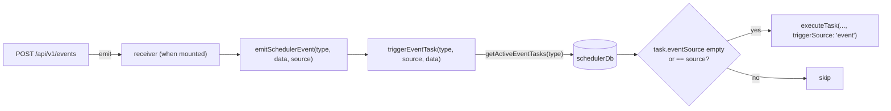

# Outbound Webhooks

<Status variant="beta">signing + config built and tested · not yet wired into the send path</Status>

<TLDR>
  Remote Control's outbound half is meant to HMAC-sign scheduler webhook deliveries and attach custom
  headers so a receiver can verify the call really came from this install. The two building blocks —
  `webhook-signature.ts` (Web Crypto HMAC-SHA256 → `sha256=<hex>`) and `webhook-outbound-config.ts`
  (keyring secret + store headers) — are fully implemented and unit-tested. **But the live sender,
  `sendWebhookNotification(url, payload)`, does not consume them**: it takes no `opts`, adds no
  signature header, merges no custom headers, and re-serializes the body on every retry. This page
  documents both the wired send path and the not-yet-connected signing layer honestly.
</TLDR>

<Callout type="warn">
  **Built vs wired.** Treat `signWebhookBody`, `buildWebhookSignatureHeader`, and
  `getWebhookOutboundConfig` as a complete, tested capability that is **not** invoked by the delivery
  code. Their only non-test consumer would be `sendWebhookNotification`, and it does not call them.
  The settings UI can store a signing secret and headers today; they take effect only once the sender
  is updated to pull `getWebhookOutboundConfig()` and apply the header.
</Callout>

## Signing Helper — `lib/scheduler/webhook-signature.ts`

A ~50-line Web Crypto module. `signWebhookBody` HMAC-SHA256s the body with the secret and returns
lowercase hex; `buildWebhookSignatureHeader` wraps it in the `sha256=<hex>` shape used by GitHub /
Stripe / Slack-style receivers. It works in the browser, in the Tauri WebView, and under Node 18+
(jest polyfills `crypto.subtle`).

```ts
// lib/scheduler/webhook-signature.ts:26
export async function signWebhookBody(body: string, secret: string): Promise<string> {
  if (!secret) throw new Error("signWebhookBody: secret is required")
  const key = await crypto.subtle.importKey("raw", encoder.encode(secret), HMAC_ALGORITHM, false, ["sign"])
  const signature = await crypto.subtle.sign(HMAC_ALGORITHM.name, key, encoder.encode(body))
  return bytesToHex(new Uint8Array(signature))
}

// :39
export async function buildWebhookSignatureHeader(body: string, secret: string): Promise<string> {
  return `sha256=${await signWebhookBody(body, secret)}`
}
```

It throws on an empty secret on purpose — callers are expected to *skip* signing rather than sign with
`""`. The module's only importer today is its own `.test.ts`, which checks the output against a
Python-computed reference vector.

## Outbound Config — `lib/scheduler/webhook-outbound-config.ts`

`getWebhookOutboundConfig()` assembles `{ signingSecret?, headers? }`. Headers come from the Zustand
store synchronously; the secret comes from the OS keyring on desktop only.

```ts
// lib/scheduler/webhook-outbound-config.ts:31
export async function getWebhookOutboundConfig(): Promise<WebhookOutboundConfig> {
  const headers = headersFromStore() // config.outbound.defaultHeaders → record, empty names dropped
  const signingSecret = await readSigningSecret()
  return {
    headers: Object.keys(headers).length > 0 ? headers : undefined,
    signingSecret: signingSecret ?? undefined,
  }
}

// :57  — the isTauri guard + keyring read
async function readSigningSecret(): Promise<string | null> {
  if (!isTauri()) return null
  try {
    const secret = await remoteControlGetSigningSecret()
    return secret && secret.length > 0 ? secret : null
  } catch {
    return null
  }
}
```

On web, `signingSecret` is always `undefined` (headers may still populate from the store). The
`useWebhookSigningState()` hook (`:77`) resolves this once on mount so the Outbound tab can show
whether signing is enabled.

## The Real Send Path — `lib/scheduler/notification-integration.ts`

`notifyTaskEvent` (`:44`) is the scheduler's notification fan-out. The desktop and toast channels go
through the Unified Notification Center; the webhook branch (`:81`) fires only when the task's
channels include `"webhook"` and `task.notification.webhookUrl` is set, calling
`sendWebhookNotification(url, payload)` — **with no third argument**.

```ts
// lib/scheduler/notification-integration.ts:185
async function sendWebhookNotification(url: string, payload: Record<string, unknown>): Promise<void> {
  const MAX_RETRIES = 3
  const BASE_DELAY = 1000
  const TIMEOUT_MS = 10000
  for (let attempt = 0; attempt <= MAX_RETRIES; attempt++) {   // up to 4 total attempts
    const controller = new AbortController()
    const timer = setTimeout(() => controller.abort(), TIMEOUT_MS)
    try {
      const response = await fetch(url, {
        method: "POST",
        headers: { "Content-Type": "application/json" }, // ← fixed; no merge, no signature
        body: JSON.stringify(payload),                   // ← re-stringified each attempt
        signal: controller.signal,
      })
      clearTimeout(timer)
      if (!response.ok) throw SchedulerError.webhookFailed(url, response.status)
      return
    } catch {
      clearTimeout(timer)
      if (attempt === MAX_RETRIES) throw SchedulerError.webhookFailed(url, /* … */)
      const delay = BASE_DELAY * Math.pow(2, attempt) + Math.random() * 500 // 1s,2s,4s + jitter
      await new Promise((resolve) => setTimeout(resolve, delay))
    }
  }
}
```

Facts to document precisely:

- **3 retries = 4 total attempts** (`attempt <= MAX_RETRIES`).
- **Exponential backoff + jitter**: `1000 * 2^attempt + random()*500` → ~1 s, 2 s, 4 s.
- **Every non-2xx is retried**, not just `5xx` — there is no 4xx/5xx distinction; timeouts and network
  errors are retried too.
- **The body is re-serialized every attempt** (`JSON.stringify` inside the loop), so a once-and-reuse
  guarantee does **not** hold today.
- **Headers are a fixed `{ "Content-Type": "application/json" }`** — no `X-Cognia-Signature`, no
  custom-header merge.

These same limits are surfaced read-only to the Outbound settings tab via `WEBHOOK_DELIVERY_LIMITS`
(`:22`):

```ts
// notification-integration.ts:22
export const WEBHOOK_DELIVERY_LIMITS = { retries: 3, baseDelayMs: 1000, timeoutMs: 10_000 } as const
```

`testNotificationChannel("webhook", url)` (`:240`) reuses the exact same path with a `{ test: true }`
payload — also unsigned.

## Scheduler Events — `lib/scheduler/event-integration.ts`

The inbound `/api/v1/events` endpoint ultimately drives `emitSchedulerEvent`, which delegates to the
scheduler's targeted task trigger:

```ts
// lib/scheduler/event-integration.ts:56
export async function emitSchedulerEvent(
  eventType: SchedulerEventType,
  data?: Record<string, unknown>,
  eventSource?: string
): Promise<void> {
  const scheduler = getTaskScheduler()
  await scheduler.triggerEventTask(eventType, eventSource, data)
}
```

`triggerEventTask` (`task-scheduler.ts:1267`) queries active tasks by `eventType` at the DB layer,
then filters by `eventSource` — a task matches if it has no `eventSource` (wildcard) or its source
equals the emitted one:

```ts
// lib/scheduler/task-scheduler.ts:1273
const eventTasks = await schedulerDb.getActiveEventTasks(eventType)
for (const task of eventTasks) {
  if (!task.trigger.eventSource || task.trigger.eventSource === eventSource) {
    // merge { event: { type, source, data } } into payload, then:
    await this.executeTask(taskWithPayload, 0, { triggerSource: "event" })
  }
}
```

<Callout type="info">
  **There is no `"remote"` trigger source.** `TaskExecutionTriggerSource`
  (`types/scheduler/index.ts:56`) has exactly six variants — `schedule`, `run-now`, `retry`, `event`,
  `dependency`, `catch-up`. A remotely-fired event runs as `"event"`, distinguished only by its
  `eventSource` string (e.g. `"external"`), not by a dedicated trigger source. Earlier drafts that
  promised a `"remote"` badge describe behavior that does not exist.
</Callout>



## Wiring Checklist (to make outbound signing live)

1. Change `sendWebhookNotification` to accept `opts?: { signingSecret?; headers? }`.
2. Stringify the body once; merge `opts.headers` first, then force `Content-Type: application/json`.
3. When `opts.signingSecret` is set, add `X-Cognia-Signature: ${await buildWebhookSignatureHeader(body, secret)}` on every retry.
4. Have `notifyTaskEvent` compute `opts` once via `getWebhookOutboundConfig()` and pass it down.

Until then, this page reflects the shipped behavior: the scheduler webhook channel delivers an
unsigned, fixed-header JSON POST with retry + backoff.

## Next

<Cards>
  <Card title="Renderer & Settings" href="./renderer-and-settings" description="The Outbound tab that stores the secret and headers" />
  <Card title="Scheduler" href="../scheduler" description="The engine behind triggerEventTask and notifyTaskEvent" />
</Cards>
