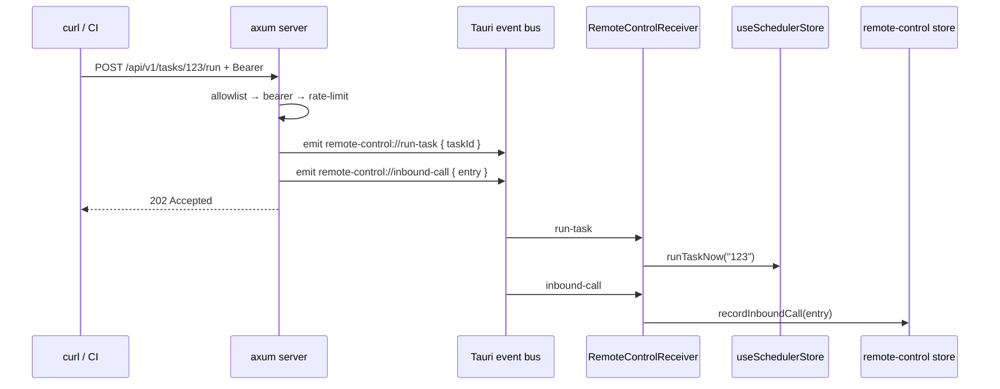

# Renderer &amp; Settings

<Status variant="beta">types · lib/tauri · stores · components — receiver not mounted</Status>

<TLDR>
  `types/remote-control/index.ts` mirrors the Rust camelCase structs and adds `validateCidrOrIp`
  (returns an i18n key). `lib/tauri/remote-control.ts` is eight thin `transport.call` wrappers.
  `stores/remote-control/store.ts` is a Zustand store that persists **only `config`**, mirrors
  mutations to Rust, and holds a 20-entry inbound-call ring buffer. `remote-control-receiver.tsx`
  would route the three Tauri events into the scheduler and the store — but it is **not mounted in
  `app/layout.tsx`**. The settings section is a four-tab shell driven by a `?remoteControlTab=` URL
  param, gated `desktopOnly` in the system nav group.
</TLDR>

## Mirrored Types — `types/remote-control/index.ts`

Every interface matches the Rust wire shape one-to-one (`RemoteControlConfig`, `…InboundConfig`,
`…OutboundConfig`, `…OutboundHeader`, `RemoteControlStatus`, `RemoteControlInboundCallLog`,
`TriggerTaskRequest`, `EmitEventRequest`). Constants pin the defaults and the ring-buffer cap:

```ts
// types/remote-control/index.ts:104
export const DEFAULT_REMOTE_CONTROL_PORT = 47821
export const DEFAULT_REMOTE_CONTROL_ALLOWLIST = ["127.0.0.1/32"]
export const DEFAULT_REMOTE_CONTROL_RATE_LIMIT_PER_MIN = 60
export const REMOTE_CONTROL_RECENT_CALLS_LIMIT = 20 // ring-buffer cap
```

`validateCidrOrIp` (`:135`) accepts a bare IPv4 or an IPv4 CIDR and returns an **i18n key string** on
failure (`null` on success) so it can drop straight into `domain-list-input`'s `validate` prop:

```ts
// types/remote-control/index.ts:135
export function validateCidrOrIp(raw: string): string | null {
  const trimmed = raw.trim()
  if (!trimmed) return "settings.remoteControl.inbound.allowlistEmpty"
  const cidrMatch = trimmed.match(/^(\d{1,3})\.(\d{1,3})\.(\d{1,3})\.(\d{1,3})(?:\/(\d{1,2}))?$/)
  if (!cidrMatch) return "settings.remoteControl.inbound.allowlistInvalid"
  // octets 0–255, prefix 0–32 → else allowlistInvalid
  return null
}
```

`isLoopbackAllowlistEntry` (`:153`) returns true only for exactly `127.0.0.1` or `127.0.0.1/32`; the
Inbound tab uses it to surface a "non-loopback entry" warning.

## Invoke Wrappers — `lib/tauri/remote-control.ts`

Eight functions, each a single `transport.call<T>(name, args?)`. There is no `isTauri()` guard here —
guarding is the store's job, and `transport.call` itself routes Tauri IPC on desktop vs the companion
HTTP transport on mobile.

```ts
// lib/tauri/remote-control.ts:49
export async function remoteControlUpdateConfig(config: RemoteControlConfig): Promise<void> {
  await transport.call<void>("remote_control_update_config", { config })
}
```

| Function | Command string |
| --- | --- |
| `remoteControlGetStatus` | `remote_control_get_status` |
| `remoteControlStart` / `remoteControlStop` | `remote_control_start` / `remote_control_stop` |
| `remoteControlGetToken` / `remoteControlRotateToken` | `remote_control_get_token` / `…_rotate_token` |
| `remoteControlUpdateConfig` | `remote_control_update_config` |
| `remoteControlSetSigningSecret` / `remoteControlGetSigningSecret` | `…_set_signing_secret` / `…_get_signing_secret` |

`remoteControlGetSigningSecret` is the one called by the outbound config helper right before a webhook
delivery, so the secret never lives in a TS store — see [Outbound Webhooks](./outbound-webhooks).

## Zustand Store — `stores/remote-control/store.ts`

Rust is the durable source of truth; the store provides snappy first paint and mirrors mutations back
down. State is `{ config, status, recentCalls, isHydrating, lastError }`. Every mutating action sets
optimistically, then — only on desktop — calls the matching Tauri command.

```ts
// stores/remote-control/store.ts:237  — recordInboundCall ring buffer
const next = [entry, ...s.recentCalls].slice(0, REMOTE_CONTROL_RECENT_CALLS_LIMIT)
```

The persist config keeps **only `config`** — status, errors, hydration flag, and the ring buffer are
all derived/live and never written to disk; the signing secret is never in the persisted shape at all
(only the `hasSigningSecret` boolean mirror inside `config.outbound`):

```ts
// stores/remote-control/store.ts:260
{
  name: "cognia-remote-control",
  partialize: (state) => ({ config: state.config }), // status / recentCalls / errors NOT persisted
}
```

`hydrate()` (`:119`) is a no-op off Tauri; on desktop it pulls `remoteControlGetStatus()` and keeps
the prior status if the call returns undefined. Selectors (`:272`) expose `selectInboundConfig`,
`selectOutboundConfig`, `selectStatus`, `selectRecentCalls`.

## Receiver Provider — `components/providers/remote-control-receiver.tsx`

This client provider would own the three Tauri-event listeners for the app lifetime, routing each to
the right place:

```ts
// remote-control-receiver.tsx:44
const off1 = await listen<TriggerTaskRequest>("remote-control://run-task", (event) => {
  const taskId = event.payload?.taskId
  if (!taskId) return
  void useSchedulerStore.getState().runTaskNow(taskId) // tagged source = remote
})
// "remote-control://emit-event"   → emitSchedulerEvent(eventType, data, eventSource)
// "remote-control://inbound-call" → useRemoteControlStore.getState().recordInboundCall(payload)
```

<Callout type="error">
  **This provider is currently orphaned.** `RemoteControlReceiver` is imported only by its own test —
  `app/layout.tsx` mounts ~20 other providers but not this one. As committed, the Rust server still
  accepts requests and increments `inbound_calls_total` / `last_call_at` (surfaced via
  `remote_control_get_status`), but **no renderer listener fires**: a remote `run-task` does not call
  `runTaskNow`, a remote `emit-event` does not reach `emitSchedulerEvent`, and the live recent-calls
  ring buffer stays empty. Mount `&lt;RemoteControlReceiver&gt;` in `app/layout.tsx` to activate the
  inbound dispatch path.
</Callout>

## Settings Section — `components/settings/remote-control/`

The shell (`remote-control-section.tsx`) mirrors `data/data-section.tsx`: it reads/writes a
`?remoteControlTab=` URL param via `useRouter` + `useSearchParams` and renders four
`Tabs` panels. It carries no `isTauri()` gate itself — desktop gating is per-tab (Overview shows a
desktop-only hint; Inbound returns a notice block) and at the nav level.

```ts
// remote-control-section.tsx:14
const REMOTE_CONTROL_TAB_PARAM = "remoteControlTab"
type RemoteControlTabId = "overview" | "inbound" | "outbound" | "events"
```

| Tab | File | Highlights |
| --- | --- | --- |
| **Overview** | `tabs/overview-tab.tsx` | running state + `http://127.0.0.1:<boundPort>` endpoint, total calls, last-call time, the recent-calls list, and a "send test event" button |
| **Inbound** | `tabs/inbound-tab.tsx` | token reveal/copy/rotate, the enable Switch (disabled until a token exists), port input (1024–65535, fallback 47821), CIDR allowlist via `DomainListInput`, rate-limit input (1–6000), and a real `fetch(.../health)` self-test |
| **Outbound** | `tabs/outbound-tab.tsx` | signing-secret set/clear, custom-headers editor, and a read-only retry-config card from `WEBHOOK_DELIVERY_LIMITS` |
| **Events** | `tabs/events-tab.tsx` | a catalog of 13 scheduler event types, each with an "Emit Test" button |

The Inbound tab wires `validateCidrOrIp` into the allowlist input and strips the
`settings.remoteControl.inbound.` prefix in `errorRender` before feeding the key to `t(...)`:

```tsx
// inbound-tab.tsx:227 (DomainListInput)
validate={validateCidrOrIp}
errorRender={(key) => t(key.replace("settings.remoteControl.inbound.", ""))}
```

### Nav placement

The section id `"remote-control"` sits in the **system** group, after Observability and before
External Bridge, flagged `desktopOnly` (`settings-nav-config.ts:432`):

```ts
// settings-nav-config.ts:432
{ id: "remote-control", labelKey: "remoteControl", descriptionKey: "remoteControl",
  group: "system", icon: RadioTowerIcon, desktopOnly: true }
```

## End-to-End Inbound Flow (when the receiver is mounted)



## Next

<Cards>
  <Card title="Outbound Webhooks" href="./outbound-webhooks" description="The signing helper, outbound config, and the real (unsigned) send path" />
  <Card title="State & Commands" href="./state-and-commands" description="The Rust side these wrappers and the store talk to" />
</Cards>
