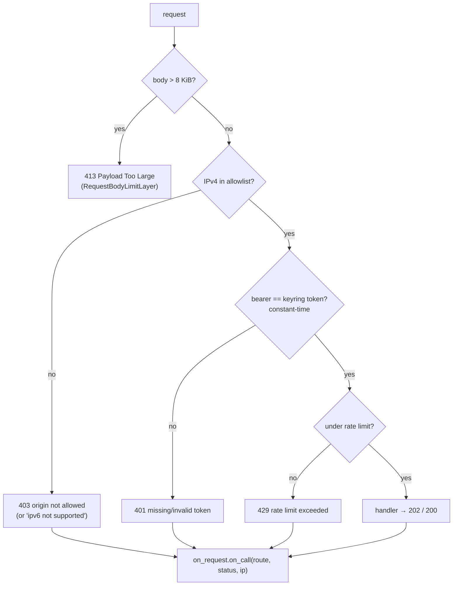

# Rust Listener

<Status variant="stable">server.rs · 278 lines</Status>

<TLDR>
  `spawn_server` (`server.rs:72`) binds `127.0.0.1:<port>`, builds a three-route axum `Router`, wraps
  it in one `from_fn_with_state` middleware plus an outer `RequestBodyLimitLayer`, and spawns the
  serve task with graceful shutdown driven by a `tokio::sync::watch` channel. The single middleware
  function runs the gate in the order **allowlist → bearer → rate-limit** (the body limit is an outer
  tower layer applied first). Every completed request calls back into a `RequestObserver` so the
  owning state can bump counters and push a call-log entry to the renderer.
</TLDR>

## Spawn and Router

`spawn_server` parses the allowlist, binds the TCP listener, assembles `AppState`, and returns a
`ServerHandle { bound_port, shutdown }`. Passing `port: 0` yields an OS-assigned ephemeral port,
read back from `listener.local_addr()` so the caller records the real port.

```rust
// src-tauri/src/remote_control/server.rs:100
let app = Router::new()
    .route("/api/v1/health", get(health))
    .route("/api/v1/tasks/:id/run", post(run_task))
    .route("/api/v1/events", post(emit_event))
    .layer(from_fn_with_state(state.clone(), middleware))
    .layer(RequestBodyLimitLayer::new(BODY_LIMIT_BYTES)); // 8 * 1024, server.rs:46
```

`AppState` (`server.rs:54`) is `Clone` and carries the `AppHandle`, an `Arc<String>` token, the
parsed allowlist, the rate limiter, and the `Arc<dyn RequestObserver>`:

```rust
// server.rs:54
#[derive(Clone)]
struct AppState {
    app_handle: AppHandle,
    token: Arc<String>,
    allowlist: Arc<ParsedAllowlist>,
    rate_limiter: Arc<FixedWindowRateLimiter>,
    on_request: Arc<dyn RequestObserver>,
}
```

## The Middleware Gate — Real Ordering

There is exactly **one** middleware function (`server.rs:192`). Because tower `.layer()` calls wrap
outermost-last, the `RequestBodyLimitLayer` (added after the `from_fn` layer) is the **outermost**
stage — it rejects oversized bodies with `413` before the function even runs. Inside the function the
checks run in this order:



<Callout type="info">
  **Allowlist runs before bearer auth.** Earlier prose (and even the stale module-header comment at
  `server.rs:9-13`) listed bearer before the allowlist. The executable order at `server.rs:202-250`
  is allowlist (1) → bearer (2) → rate limit (3). Treat the running code as authoritative.
</Callout>

### Stage 1 — IPv4 allowlist with IPv6 canonicalization

The allowlist is IPv4-only. An IPv6 caller (which can include `::1` from a client that opened an
`AF_INET6` socket against `127.0.0.1`) is first mapped to IPv4; an unmappable IPv6 address is
rejected outright.

```rust
// server.rs:205
let canonical = match remote_ip {
    IpAddr::V4(v4) => v4,
    IpAddr::V6(v6) => match v6.to_ipv4_mapped() {
        Some(v4) => v4,
        None => {
            state.on_request.on_call(&route, StatusCode::FORBIDDEN, remote_ip);
            return error_body(StatusCode::FORBIDDEN, "ipv6 not supported");
        }
    },
};
if !state.allowlist.contains(canonical) {
    state.on_request.on_call(&route, StatusCode::FORBIDDEN, remote_ip);
    return error_body(StatusCode::FORBIDDEN, "origin not allowed");
}
```

### Stage 2 — constant-time bearer auth

The `Authorization: Bearer <token>` header is compared against the keyring token with a length
pre-check and `subtle::ConstantTimeEq`, so a wrong token cannot be distinguished by timing.

```rust
// server.rs:235
let expected = state.token.as_bytes();
let supplied = supplied_token.as_bytes();
if expected.len() != supplied.len() || expected.ct_eq(supplied).unwrap_u8() == 0 {
    state.on_request.on_call(&route, StatusCode::UNAUTHORIZED, remote_ip);
    return error_body(StatusCode::UNAUTHORIZED, "invalid token");
}
```

### Stage 3 — rate limit

A single `try_acquire()` against the fixed-window limiter; over budget returns `429`. See
[Security Model](./security) for the window semantics.

## Endpoint Handlers

| Handler | Lines | Returns |
| --- | --- | --- |
| `health` | `server.rs:138` | `200` `{ ok: true, version: env!("CARGO_PKG_VERSION") }` |
| `run_task` | `server.rs:145` | emits `RUN_TASK_EVENT` with `{ task_id, payload? }` → `202`; emit failure → `500` |
| `emit_event` | `server.rs:162` | `400` if body missing or `event_type` blank; else emits `EMIT_EVENT_EVENT` → `202` |

The two write handlers do **not** touch the scheduler directly — they emit a Tauri event and return
immediately, so an external caller never blocks on task execution. The event names are constants
asserted against the frontend listener strings by a unit test (`server.rs:274`):

```rust
// server.rs:43
pub const RUN_TASK_EVENT: &str = "remote-control://run-task";
pub const EMIT_EVENT_EVENT: &str = "remote-control://emit-event";
```

`run_task` tolerates a missing body via `Option<Json<…>>` and `unwrap_or_default()`, so a bare
`POST` with no JSON still triggers the task:

```rust
// server.rs:145
async fn run_task(
    State(state): State<AppState>,
    Path(task_id): Path<String>,
    payload: Option<Json<TriggerTaskRequestBody>>,
) -> impl IntoResponse {
    let body = payload.map(|Json(b)| b).unwrap_or_default();
    let event = RunTaskEvent { task_id, payload: body.payload };
    if let Err(error) = state.app_handle.emit(RUN_TASK_EVENT, event) {
        log::warn!("remote-control failed to emit run-task event: {error}");
        return error_body(StatusCode::INTERNAL_SERVER_ERROR, "emit failed");
    }
    accepted()
}
```

## Graceful Shutdown

The serve task is spawned with `with_graceful_shutdown` listening on a `watch` receiver. `stop()` on
the owning state (`mod.rs:158`) drops/fires the sender, the future resolves, and axum drains in
flight requests before exiting.

```rust
// server.rs:108
let (tx, mut rx) = watch::channel(());
tokio::spawn(async move {
    let server = axum::serve(
        listener,
        app.into_make_service_with_connect_info::<SocketAddr>(),
    );
    let result = server
        .with_graceful_shutdown(async move {
            let _ = rx.changed().await; // resolves when the sender fires or is dropped
        })
        .await;
    if let Err(error) = result {
        log::warn!("remote-control server exited with error: {error}");
    }
});
```

`into_make_service_with_connect_info::<SocketAddr>()` is what makes the caller's IP reachable via
`ConnectInfo<SocketAddr>` inside the middleware — without it the allowlist could not see the remote
address.

## The RequestObserver Hook

Every code path in the middleware — accept or reject — ends with `on_request.on_call(route, status,
ip)`. This is the seam by which the owning `RemoteControlState` keeps its counters current and pushes
a call-log entry to the renderer (see [State &amp; Commands](./state-and-commands)).

```rust
// server.rs:63
pub trait RequestObserver: Send + Sync + 'static {
    fn on_call(&self, route: &str, status: StatusCode, remote_ip: IpAddr);
}
```

## Next

<Cards>
  <Card title="Security Model" href="./security" description="The allowlist matcher, the rate limiter, and keyring-backed secrets" />
  <Card title="State & Commands" href="./state-and-commands" description="Who owns spawn_server, and the Tauri command surface that drives it" />
</Cards>
