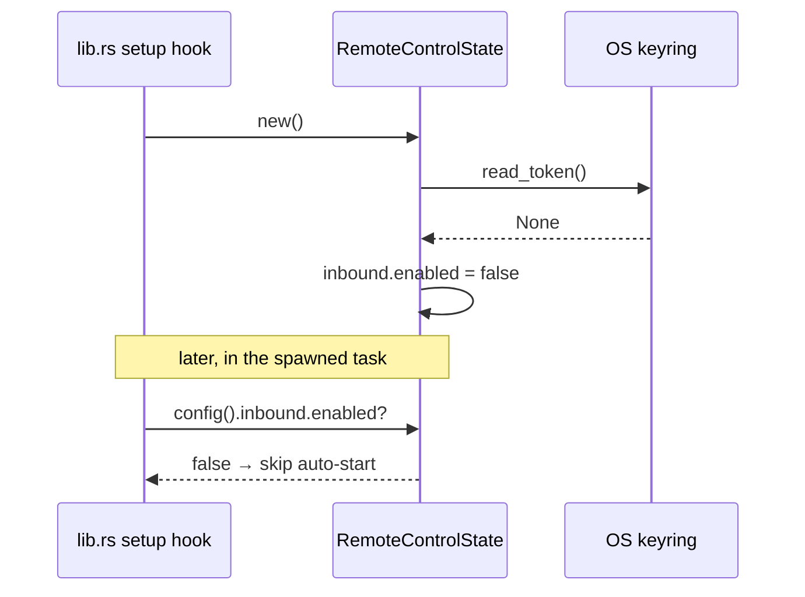

# State &amp; Commands

<Status variant="stable">mod.rs · types.rs · commands.rs · lib.rs</Status>

<TLDR>
  `RemoteControlState` (`mod.rs:46`) is the Tauri-managed singleton that owns the config, the live
  status, and the `Option<ServerHandle>`. It exposes `start` / `stop`, presence-recording helpers,
  and an `observe` callback that feeds the request observer. `types.rs` defines the camelCase wire
  shapes (serde `rename_all = "camelCase"`) that match the renderer types verbatim. `commands.rs`
  exposes **8** Tauri commands; `lib.rs` manages the state, registers all eight, and runs a setup
  hook that auto-starts the listener only when it was persisted enabled (which itself implies a token
  exists).
</TLDR>

## RemoteControlState

The state is a `Mutex<RemoteControlInner>` wrapping `{ config, status, server: Option<ServerHandle> }`.
`new()` (`mod.rs:56`) reconciles persisted config against the keyring at boot: if no token exists it
forces `inbound.enabled = false`, and it reflects whether a signing secret is present.

```rust
// mod.rs:56
pub fn new() -> Self {
    let mut config = RemoteControlConfig::default();
    let has_token = matches!(keyring::read_token(), Ok(Some(_)));
    if !has_token {
        config.inbound.enabled = false; // can't auto-start without a token
    }
    let has_signing_secret = matches!(keyring::read_signing_secret(), Ok(Some(_)));
    config.outbound.has_signing_secret = has_signing_secret;
    // ...
}
```

### Lifecycle: start / stop

`start` (`mod.rs:116`) reads the token from the keyring (erroring `TokenMissing` if absent), refuses
to double-start, builds the `RequestObserver`, and calls `server::spawn_server`. On success it records
the bound port and flips `inbound_running` / `enabled` true.

```rust
// mod.rs:116
pub async fn start(&self, app_handle: AppHandle) -> Result<(), RemoteControlError> {
    let token = keyring::read_token()
        .map_err(RemoteControlError::Keyring)?
        .ok_or(RemoteControlError::TokenMissing)?;
    // refuse if already running → AlreadyRunning(port)
    // spawn_server(...) → ServerHandle
    // status.inbound_running = true; status.bound_port = Some(...); config.inbound.enabled = true
}
```

`stop` (`mod.rs:158`) takes the `ServerHandle` and fires its watch sender, resolving the graceful
shutdown future; `NotRunning` if there was no handle.

### Counters and the observer bridge

`observe` (`mod.rs:173`) builds an `InboundCallEntry` (uuid + RFC-3339 timestamp + route + status +
remote IP), bumps `inbound_calls_total` and `last_call_at` under the lock, and emits
`remote-control://inbound-call` to the renderer ring buffer.

```rust
// mod.rs:194
let _ = app_handle.emit("remote-control://inbound-call", entry);
```

The observer plumbing uses a small `unsafe` shim: `StateObserver` carries a `SelfPtr` raw pointer to
the `RemoteControlState`. This is sound because the state is owned by Tauri's `manage()` for the whole
process lifetime, so the pointer never dangles (`mod.rs:204-238`). The two presence helpers —
`record_token_presence` and `record_signing_secret_presence` — keep the status flags honest, and
`update_config` deliberately **preserves** the live `has_signing_secret` flag so a renderer mutation
can't lie about whether a secret is set:

```rust
// mod.rs:88
pub fn update_config(&self, next: RemoteControlConfig) {
    let mut inner = self.inner.lock();
    let preserved_has_secret = inner.config.outbound.has_signing_secret;
    inner.config = next;
    inner.config.outbound.has_signing_secret = preserved_has_secret; // keyring is the only authority
}
```

## Wire Types — `types.rs`

Every struct uses `#[serde(rename_all = "camelCase")]` so the JSON shape matches
`types/remote-control/index.ts` with no translation step. The defaults encode the off-by-default,
loopback-only posture:

```rust
// types.rs:38
impl Default for RemoteControlConfig {
    fn default() -> Self {
        Self {
            inbound: RemoteControlInboundConfig {
                enabled: false,
                port: 47821,
                allowlist: vec!["127.0.0.1/32".to_string()],
                rate_limit_per_min: 60,
            },
            outbound: RemoteControlOutboundConfig {
                has_signing_secret: false,
                default_headers: Vec::new(),
            },
        }
    }
}
```

`RemoteControlError` (`types.rs:113`) is a `thiserror` enum — `AlreadyRunning`, `NotRunning`,
`TokenMissing`, `Keyring`, `Bind`, `Persist`, `InvalidConfig` — with a custom `Serialize` that emits
the error *message string*, matching how `tts::keyring` and `scheduler::commands` surface errors to
Tauri.

## The Eight Tauri Commands — `commands.rs`

All commands are async and return `Result<_, RemoteControlError>`; each delegates to a state method
or a keyring helper.

| Command | Lines | Does | Returns |
| --- | --- | --- | --- |
| `remote_control_get_status` | `commands.rs:10` | snapshot of `RemoteControlStatus` | `RemoteControlStatus` |
| `remote_control_start` | `commands.rs:17` | start the listener | `()` |
| `remote_control_stop` | `commands.rs:25` | stop the listener | `()` |
| `remote_control_get_token` | `commands.rs:32` | read token + record presence | `Option<String>` |
| `remote_control_rotate_token` | `commands.rs:41` | generate + persist a new token | `String` |
| `remote_control_update_config` | `commands.rs:51` | replace config (secret flag preserved) | `()` |
| `remote_control_set_signing_secret` | `commands.rs:60` | write secret if non-empty, else clear | `()` |
| `remote_control_get_signing_secret` | `commands.rs:78` | read secret (no state) | `Option<String>` |

```rust
// commands.rs:41
pub async fn remote_control_rotate_token(
    state: State<'_, RemoteControlState>,
) -> Result<String, RemoteControlError> {
    let token = rc_keyring::generate_token();
    rc_keyring::write_token(&token).map_err(RemoteControlError::Keyring)?;
    state.record_token_presence(true);
    Ok(token)
}
```

<Callout type="warn">
  There are **8** commands, not 12. The count in some older notes is stale — `commands.rs` defines
  eight `#[tauri::command]` functions and `lib.rs` registers exactly those eight.
</Callout>

## Wiring — `lib.rs`

The module is declared (`lib.rs:28`), the state is managed for the process lifetime (`lib.rs:213`),
and all eight commands are registered in the `generate_handler!` block (`lib.rs:597-604`):

```rust
// lib.rs:213
.manage(remote_control::RemoteControlState::new())

// lib.rs:597
remote_control::commands::remote_control_get_status,
remote_control::commands::remote_control_start,
remote_control::commands::remote_control_stop,
remote_control::commands::remote_control_get_token,
remote_control::commands::remote_control_rotate_token,
remote_control::commands::remote_control_update_config,
remote_control::commands::remote_control_set_signing_secret,
remote_control::commands::remote_control_get_signing_secret,
```

### Off-by-default auto-start gate

The setup hook (`lib.rs:1033`) spawns a task that starts the listener only when the persisted config
says enabled. The "token must exist" half is enforced *transitively*: `RemoteControlState::new()`
already clears `enabled` when the keyring has no token, so checking `enabled` alone is equivalent.

```rust
// lib.rs:1041
let rc_state = app.state::<remote_control::RemoteControlState>();
if rc_state.config().inbound.enabled {
    match rc_state.start(app.clone()).await {
        Ok(()) => log::info!("remote-control inbound listener started"),
        Err(e) => log::warn!("remote-control auto-start skipped: {e}"),
    }
}
```



## Next

<Cards>
  <Card title="Renderer & Settings" href="./renderer-and-settings" description="The TS side: mirrored types, invoke wrappers, store, and the settings UI" />
  <Card title="Security Model" href="./security" description="The keyring, allowlist, and rate-limiter primitives this state composes" />
</Cards>
