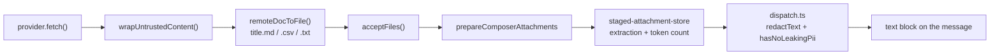

# Composer integration

## Trigger detection

`components/chat/composer-trigger.ts` already had a namespace mechanism for `@skill:` and `@preset:`. The
document providers join it, with one difference: every other namespaced kind maps 1:1 to a `TriggerKind`,
whereas all providers share the single kind `"doc"` and are told apart by which prefix the user typed.

```ts
export interface ComposerTrigger {
  kind: TriggerKind
  namespace?: string
  tokenStart: number
  tokenEnd: number
  query: string
  // …
}
```

The prefix list is read from the registry on every call rather than snapshotted at module load, so a test that
resets the registry does not leave it stale:

```ts
function chatNamespacePrefixes(): ReadonlyArray<{ prefix: string; kind: TriggerKind }> {
  return [
    ...STATIC_CHAT_NAMESPACE_PREFIXES,
    ...docsProviderPrefixes().map(({ prefix }) => ({ prefix, kind: DOC_TRIGGER })),
  ]
}
```

Namespaced prefixes are mode-dependent. The team workspace (`mentionMode="agents"`) reserves `@` for members
and gets no typed prefixes; the workflow editor gets `@node:` / `@edge:` instead.

## Panel state

`hooks/chat/use-remote-doc-search.ts` owns three things the popover's other branches do not: an account list,
a pure link-recognition fast path, and a provider that may not implement search at all.

Two ways to reach a document, in priority order:

1. **The typed query is itself a link or token.** `matchRef` resolves it synchronously — no network, and no
   account needed to *see* the row.
2. **Otherwise, keyword search** through the connected account, debounced 250 ms, capped at 20 hits, and
   sequence-guarded so a slow response cannot overwrite a newer one.

<Callout type="warn" title="The returned object is memoised">
  `composer-popover.tsx` lists this hook's result in a `useMemo` dependency array. A fresh object identity on
  every render would invalidate the whole candidate list each frame and reset the keyboard highlight while the
  user is still typing.
</Callout>

The account list is reloaded whenever the panel opens for a different provider and is deliberately not cached
across opens: connecting an account in Settings while the composer is mounted must be visible on the next `@`
without a reload.

## Picker branch

`components/chat/composer-popover.tsx` gains one `PopoverItem` member:

```ts
| {
    kind: "doc"
    providerId: string
    accountId: string
    doc: RemoteDocRef
  }
```

Each row shows a kind-specific icon, the title, and a right-aligned kind label. The footer strip shows the
active account — as plain text for a single account, as a `Select` when several are bound (with `mousedown`
stopped so choosing one does not blur the textarea and dismiss the popover).

The empty state is never just "nothing found". It is, in priority order:

| Condition | Message key |
| --- | --- |
| host cannot run this provider | `picker.hostUnsupported` |
| no account connected | `picker.noAccount` |
| the last attempt failed | `errors.<code>` |
| empty query, provider has no search | `picker.linkOnlyHint` |
| empty query, provider has search | `picker.pasteHint` |
| non-empty query, no hits | `picker.noMatches` |

## Pick handling

Adding a mentionable kind is a `registerMentionPickHandler` call, not a composer edit
(`lib/chat/mentions/pick-registry.ts`):

```ts
registerMentionPickHandler({
  kind: "doc",
  onPick: async (item, ctx) => {
    ctx.removeTriggerToken()
    await ctx.stageRemoteDoc(item)
  },
  toContextRef: () => null,
})
```

The token is dropped **before** the fetch. If the fetch then fails the user gets a toast, not a half-typed
`@lark:https://…` to delete by hand.

`toContextRef` returns `null` because this is a chip-style pick: the body arrives as an attachment whose
manifest already records the provenance, so there is no inline mention to persist on the message row.

`MentionPickContext` gained `stageRemoteDoc`. The composer binds it through a latest-value ref, because
`useRemoteDocStaging` needs `acceptFiles`, which is declared far below `onPickPopoverItem` in a 3k-line
component; the ref is written from an effect, never during render.

## Staging and delivery

`hooks/chat/use-remote-doc-staging.ts` does not invent a delivery path. Once the body is text it becomes an
ordinary `File` and rejoins the pipeline every dropped or pasted document already uses.



What that inheritance buys, without a second implementation: the PII redaction gate, the token count on the
chip, the `INLINE_TOKEN_CEILING` (12k) over-length confirmation, the attachment preview's "model view" —
verbatim what the model receives — and draft restoration.

Filenames keep the document title, dropping only what a filesystem would reject. CJK survives; an empty result
falls back to the document id rather than to a generic placeholder:

```ts
const UNSAFE_FILENAME_CHARS = /[ -/\\:*?"<>|]/g
```

Three toasts, one per outcome: a loading toast while fetching, replaced by success or by the localized error
code, plus a separate warning when `RemoteDocContent.truncated` is set so a capped spreadsheet never looks
complete.

## PII gate

No new outbound LLM or embedding call is introduced. Redaction happens where it already did — in
`lib/chat/attachments/dispatch.ts`, which runs `redactText` and `hasNoLeakingPii` over the extracted text
before it becomes a content block. Emitting `text` rather than a base64 `document` block is what keeps the
body visible to that scanner.

## Deep-link routing

`components/connectors/connector-deep-link-router.tsx` already owned the desktop, Capacitor and cold-start
plumbing for `cognia://connector/oauth/<adapterType>`. The document providers ride the same subscription with
a different scheme path, dispatched through one entry point so every host path routes identically.

The two schemes validate state differently and must not share it: the connector router checks
`sessionStorage`, while each document provider checks its own durable pending record. Parsing and completion
live outside React in `lib/docs-providers/oauth-deep-link.ts`, so the whole exchange is unit-testable and
`completeDocsOAuthDeepLink` never throws — a failed OAuth becomes a reportable outcome, not a crash.

Providers register their own completion at module load, so the router never has to know which providers exist.

## Tests

| Surface | File |
| --- | --- |
| trigger + namespace | `components/chat/composer-trigger.test.ts` |
| picker branch, empty states, account footer | `components/chat/composer-popover.test.tsx` |
| panel state, debounce, link fast path | `hooks/chat/use-remote-doc-search.test.tsx` |
| filename, untrusted wrap, toasts | `hooks/chat/use-remote-doc-staging.test.tsx` |
| pick registry coverage | `lib/chat/mentions/pick-registry.test.ts` |
| deep-link parse and completion | `lib/docs-providers/oauth-deep-link.test.ts` |
| Rust route, slug rejection, bounce page | `crates/cognia-connectors/src/axum_app.rs` |
