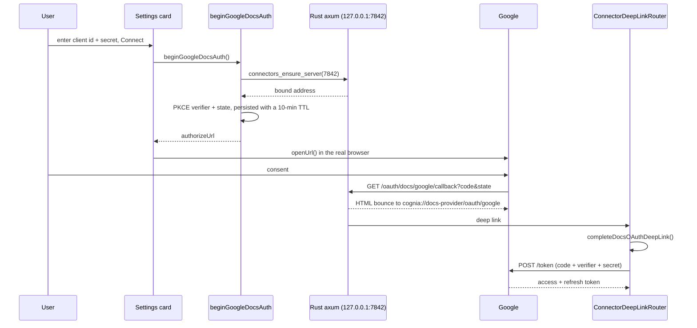

# Google provider

`lib/docs-providers/providers/google/` · prefix `@gdoc:` · kinds `doc`, `sheet`

## Why the device-code flow cannot be reused

The repository already had one Google OAuth implementation: the Drive **backup** destination
(`lib/data/destinations/google-oauth.ts`), which uses the device-code flow because it needs no redirect
listener and therefore runs unchanged on the headless brain.

That flow cannot serve this feature. Google restricts "OAuth 2.0 for TV and Limited-Input Devices" to a fixed
scope list: `email`, `openid`, `profile`, `drive.appdata`, `drive.file` and the YouTube scopes. None of the
read scopes required here is on it, so a device-code connection physically cannot read a document the user
already owns — `drive.file` sees only files this app created.

<Callout type="warn" title="The two Google connections are deliberately separate">
  Sharing a keyring key would couple them: reconnecting one would break the other's identity, and widening the
  backup connection's `drive.file` scope would hand a write-only-to-its-own-folder integration a read of the
  user's entire Drive. They live under different keyring namespaces and may be different Google accounts.
</Callout>

## Scopes and storage

```ts
export const GOOGLE_DOCS_SCOPES = [
  "https://www.googleapis.com/auth/drive.readonly",
  "https://www.googleapis.com/auth/documents.readonly",
  "https://www.googleapis.com/auth/spreadsheets.readonly",
] as const
```

All three are needed: `drive.readonly` lists and searches files and exports a Doc, but cannot read a
multi-worksheet spreadsheet; `spreadsheets.readonly` supplies per-worksheet values; `documents.readonly`
backs the structured Docs read.

| Where | What |
| --- | --- |
| keyring `docs-providers` / `google-client-secret` | OAuth client secret |
| keyring `docs-providers` / `google-tokens` | JSON access + refresh token |
| keyring `docs-providers` / `google-oauth-pending` | in-flight state, verifier and redirect URI (10-minute TTL) |
| `AppSettings.docsProviders.google` | client id, account email, connected flag, granted scopes |

The user supplies their own Google Cloud credential of type "Desktop app": the client id goes in Settings, the
secret goes to the keyring.

## The loopback flow



Three points are load-bearing:

- **The consent page opens in the system browser**, never an embedded webview — Google blocks sign-in from
  embedded webviews.
- **`connectors_ensure_server` is a new command**, not a relaxation of `connectors_start_server`. The existing
  command errors when a server is already running because it is the boot path, and a second boot is a
  lifecycle bug; the OAuth flow wants the address, not the transition. It always binds loopback-only — an
  OAuth redirect target has no business being reachable off-box.
- **State is validated against the durable pending record**, not `sessionStorage`. That is the check that
  survives an app restart mid-consent. The record is cleared whether or not the exchange succeeds, so a code
  cannot be replayed against it.

The Rust route validates the `provider` path segment against a strict slug charset (lowercase alphanumerics
and dashes, at most 32 characters) before it reaches the rendered page, because the bounce page embeds the
deep link in both an HTML attribute and a JS string literal.

`access_type=offline` and `prompt=consent` are both sent: Google issues a refresh token only on the first
consent unless the app explicitly asks to be prompted again.

## Reading

| Operation | Call |
| --- | --- |
| search | `GET /drive/v3/files?q=…` with `supportsAllDrives` and `includeItemsFromAllDrives` |
| file name | `GET /drive/v3/files/{id}?fields=name` |
| document body | `GET /drive/v3/files/{id}/export?mimeType=text/markdown` |
| spreadsheet | `GET /v4/spreadsheets/{id}` then `values:batchGet` |

**Markdown first, plain text as the documented fallback.** A deployment that does not offer markdown export
answers HTTP 400, which is the only status treated as "try `text/plain`"; anything else is a real failure.

**Sheets are read through `values:batchGet`, not Drive's CSV export.** Drive's CSV export silently returns only
the first worksheet — exactly the quiet truncation this subsystem refuses to ship. Hidden worksheets are
skipped, matching the Feishu reader. Worksheet titles are quoted into the A1 range with embedded quotes
doubled.

Search escapes the user's text before it enters a Drive `q` term:

```ts
export function escapeDriveQueryLiteral(value: string): string {
  return value.replaceAll("\\", "\\\\").replaceAll("'", "\\'")
}
```

Drive uses single-quoted literals with backslash escaping, so an unescaped quote would let the query text
change the filter's structure.

## URL recognition

`parseGoogleDocUrl` matches only the two readable kinds, tolerating the optional account segment:

```
https://docs.google.com/document/d/<id>/edit
https://docs.google.com/document/u/0/d/<id>
https://docs.google.com/spreadsheets/d/<id>/edit#gid=0
```

A `drive.google.com/file/d/<id>` link is deliberately **not** matched: its kind is unknowable without a
metadata round-trip, and `matchRef` must stay synchronous, so offering it would mean showing a picker row that
can only fail at fetch time. Presentations, forms and bare ids are rejected for the same reason — a bare
Google file id is indistinguishable from arbitrary text.

## Error mapping

`mapGoogleStatus` translates HTTP status to the provider taxonomy. HTTP 403 is ambiguous on Google's side —
it covers both "no access to this file" and quota exhaustion — so the machine-readable
`error.status === "RESOURCE_EXHAUSTED"` disambiguates it into `rateLimited` rather than `noPermission`.

A refresh that fails is surfaced as `notAuthorized` ("reconnect"), never as a network blip: `invalid_grant`
means the user revoked access or the token aged out, and telling them to retry would be wrong.
