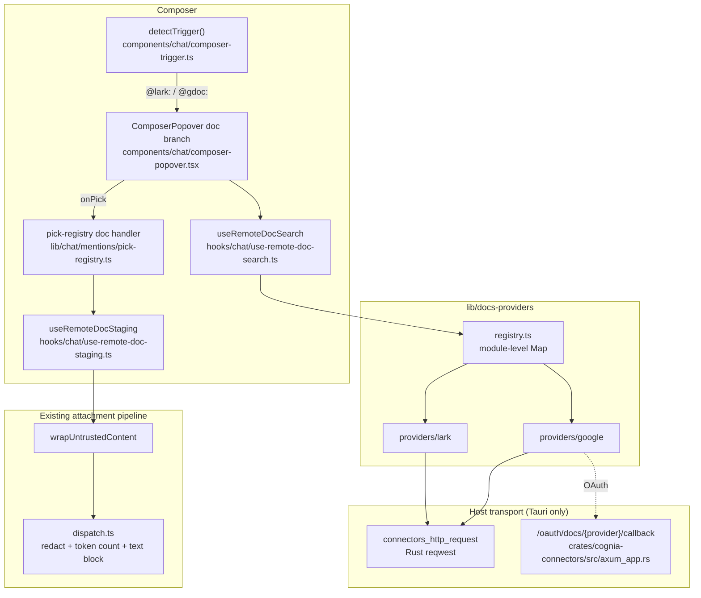

# Remote Documents

<Status variant="beta">Beta · desktop only · no Dexie schema</Status>

<TLDR>
  The composer's `@` could only reference files with a local path. Remote Documents adds a peer registry —
  `lib/docs-providers/` — whose providers answer three questions about documents that live in a third-party
  cloud: is this pasted string mine (`matchRef`), what matches these keywords (`search`), and give me the body
  as text (`fetch`). Picking one in the `@lark:` / `@gdoc:` panel fetches it immediately and stages it as a
  synthesized `File`, which rejoins the ordinary attachment pipeline. Two providers ship: Feishu (docs, wiki
  nodes, spreadsheets, Bitable) borrowing a bound Lark connector's credentials, and Google Workspace (Docs,
  Sheets) on its own read-only OAuth connection. Both are desktop-only for concrete transport reasons.
</TLDR>

Decision record: [ADR-0134](/docs/adr/0134-remote-document-providers).

## Why it is not part of Platform Connectors

ADR-0009 confines `PlatformAdapter` to IM conversation semantics — `send`, `edit`, reactions, chat
management, an A2UI capability matrix. Adding `searchDocuments()` there would force Google to be modelled as
a connector with no messaging, whose `send`, `health` and `a2uiCapability` are empty stubs.

So `lib/docs-providers/` is a sibling registry, not an extension. The Feishu provider still *uses* a
connector instance's credentials, because that is where the user's Feishu account already lives — borrowing
beats a second connection the user would have to authorize and revoke separately.

## The whole path



## What each provider covers

| Provider | Prefix | Kinds | Credentials | Search |
| --- | --- | --- | --- | --- |
| Feishu / Lark | `@lark:` | doc, wiki, sheet, bitable | a bound Lark connector instance | yes (user identity required) |
| Google Workspace | `@gdoc:` | doc, sheet | its own read-only OAuth connection | yes (Drive `files.list`) |

Slides and mindnotes are excluded on both sides: neither platform offers a useful public text read, so the
picker never offers something that can only fail at fetch time.

## Delivery: fetch on pick, send as an attachment

A picked document is fetched immediately and staged as a synthesized `File`, which rejoins the pipeline every
dropped or pasted document already uses:

```
prepareComposerAttachments → staged-attachment-store → lib/chat/attachments/dispatch.ts
```

This is the decision that keeps the feature small. Inherited rather than rebuilt: the PII redaction gate, the
token count on the chip, the `INLINE_TOKEN_CEILING` (12k) over-length confirmation, the attachment preview's
"model view", and draft restoration.

The body is wrapped with `wrapUntrustedContent` (`lib/web/web-tools-core.ts`) first — a third-party document
is external data, not instructions.

<Callout type="info" title="Why not a reference the agent resolves later">
  Local `@file` mentions leave a path and let the agent's Read tool fetch on demand. A remote document has no
  path, so that model would need a per-provider tool. Feishu's only tool path (`lark.doc.fetch`, ADR-0026)
  shells to a `lark-cli` binary the user must install separately, and Google has no equivalent at all.
</Callout>

## Truncation is never silent

A Bitable app can hold hundreds of thousands of records. Every cap in `lib/docs-providers/limits.ts` sets
`RemoteDocContent.truncated` **and** appends a visible marker into the body, so the model can see that it is
reading a partial document.

| Constant | Value | Bounds |
| --- | --- | --- |
| `MAX_DOC_CHARS` | 200000 | characters kept from any body |
| `MAX_SHEET_TABS` | 10 | worksheets read per spreadsheet |
| `MAX_SHEET_ROWS` | 500 | rows read per worksheet |
| `MAX_SHEET_COLS` | 50 | columns read per worksheet |
| `MAX_BITABLE_TABLES` | 5 | tables read per Bitable app |
| `MAX_BITABLE_ROWS` | 200 | records read per table |

The composer's own `INLINE_TOKEN_CEILING` still applies on top and asks the user to confirm; these caps only
bound what is transferred in the first place.

## Desktop only, for two different concrete reasons

`DocsProvider.hosts` is `["tauri"]` on both providers, and the reasons are physical rather than policy:

- **Feishu** — `open.feishu.cn` sends no CORS headers, so only the Rust `connectors_http_request` bridge can
  reach it.
- **Google** — its APIs are CORS-friendly, but the installed-app OAuth flow permits only a loopback redirect,
  and the loopback listener is the Rust connectors server.

Intentional dormancy is labelled on all three axes (CLAUDE.md rule 7): the type records it (`DocsProvider.hosts`),
the UI explains it (the picker renders `picker.hostUnsupported`, the settings card renders
`settings.desktopOnly`), and a test pins that the registry yields nothing on web, mobile and headless
(`lib/docs-providers/registry.test.ts`).

## Files

| Concern | Path |
| --- | --- |
| Contracts | `lib/docs-providers/types.ts` |
| Registry | `lib/docs-providers/registry.ts`, `lib/docs-providers/index.ts` |
| Caps + truncation markers | `lib/docs-providers/limits.ts` |
| Grid to CSV rendering | `lib/docs-providers/csv.ts` |
| OAuth deep link | `lib/docs-providers/oauth-deep-link.ts` |
| Feishu provider | `lib/docs-providers/providers/lark/` |
| Google provider | `lib/docs-providers/providers/google/` |
| Shared Lark auth harness | `lib/connectors/adapters/lark/authed-api.ts` |
| Composer panel state | `hooks/chat/use-remote-doc-search.ts` |
| Attachment staging | `hooks/chat/use-remote-doc-staging.ts` |
| Settings card | `components/settings/connections/docs-providers/` |
| Rust loopback callback | `crates/cognia-connectors/src/axum_app.rs` |

## No Dexie version

Credentials live in the OS keyring and fetched bodies are ephemeral attachments, so this subsystem adds no
IndexedDB schema. Non-secret Google settings (client id, account email, granted scopes) live in
`AppSettings.docsProviders.google`.
