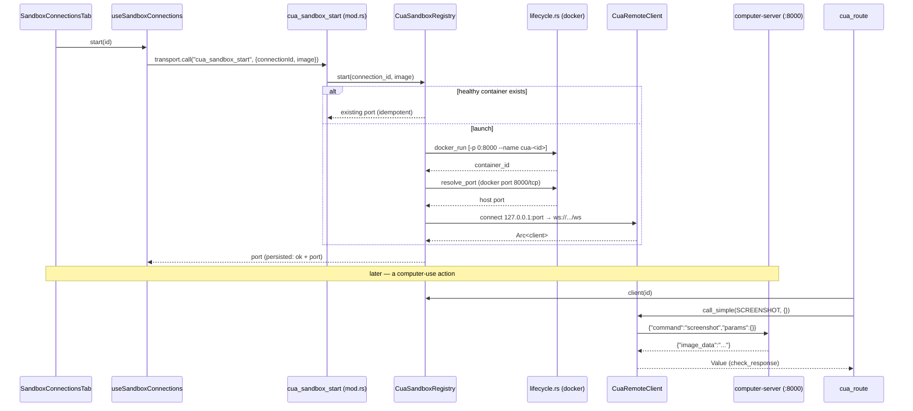

# CUA remote sandbox

<Status variant="beta" />

<TLDR>
  The CUA sandbox is a **remote computer-use target**: a `ghcr.io/trycua/cua-xfce` Docker container
  runs a `computer-server` on port 8000; cognia shells `docker` to launch and probe it, drives it over
  a WebSocket at `/ws`, and slots it behind the existing automation gate as a `Remote` `CallTarget`.
  It is **fully wired** — the container actually launches and computer-use actions route to it. The
  Tauri commands `cua_sandbox_start` / `stop` / `health` are registered (`lib.rs:693-695`); the
  registry is managed in app state and torn down on exit. Connections are a first-class Dexie entity
  (schema **v57**).
</TLDR>

## Container lifecycle — `lifecycle.rs`

The container is launched with an ephemeral host port mapped to the container's 8000, then the host
port is resolved via `docker port`.

```rust title="src-tauri/src/cua_sandbox/lifecycle.rs:27-38 (docker run args)"
pub fn run_args(spec: &SpawnSpec) -> Vec<String> {
    vec![
        "run".into(), "-d".into(), "--rm".into(),
        "-p".into(), "0:8000".into(),
        "--name".into(), spec.name.clone(),
        spec.image.clone(),
    ]
}
```

```rust title="src-tauri/src/cua_sandbox/lifecycle.rs:58-67 (resolve mapped port)"
pub async fn resolve_port(container_id: &str) -> Result<u16> {
    let out = Command::new("docker")
        .args(["port", container_id, "8000/tcp"])
        .output().await
        .map_err(|e| backend_err(format!("docker port failed: {e}")))?;
    let text = String::from_utf8_lossy(&out.stdout);
    parse_port(&text).ok_or_else(|| backend_err(format!("no mapped port: {text:?}")))
}
```

Health is a cheap `docker exec <id> true` (`lifecycle.rs:92-99`); `docker_stop` removes the
container.

## Registry — `registry.rs`

`CuaSandboxRegistry` is a process-scoped map keyed by connection id, holding each container's id,
host port, and live WS client. `start()` is **idempotent** — a healthy existing container is reused.

```rust title="src-tauri/src/cua_sandbox/registry.rs:33-47"
pub async fn start(&self, connection_id: &str, image: &str) -> Result<u16> {
    let mut map = self.inner.lock().await;
    if let Some(entry) = map.get(connection_id) {
        if docker_health(&entry.container_id).await {
            return Ok(entry.port);          // reuse healthy container
        }
        map.remove(connection_id);
    }
    let spec = SpawnSpec { image: image.to_string(), name: format!("cua-{connection_id}") };
    let container_id = docker_run(&spec).await?;
    let port = resolve_port(&container_id).await?;
    let client = CuaRemoteClient::connect("127.0.0.1", port).await?;
    map.insert(connection_id.to_string(), Entry { container_id, port, client });
    Ok(port)
}
```

The registry is created and managed at app start (`lib.rs:820-821`) and `shutdown_all()` runs on exit
(`lib.rs:1085-1088`), so containers don't leak across sessions.

## WebSocket protocol — `protocol.rs` + `remote_client.rs`

The `computer-server` speaks JSON over WS: each message is `{ "command": <string>, "params": <object> }`.
`protocol.rs` builds these from typed automation actions; a truthy `error` field signals failure.

```rust title="src-tauri/src/cua_sandbox/protocol.rs:44-51 (click mapping)"
pub fn click_request(point: Point, button: MouseButton, count: u32) -> WsRequest {
    let command = match (button, count) {
        (MouseButton::Left, c) if c >= 2 => "double_click",
        (MouseButton::Right, _) => "right_click",
        _ => "left_click",
    };
    WsRequest::new(command, json!({ "x": point.x, "y": point.y }))
}
```

`CuaRemoteClient` serializes calls through an mpsc queue — the server processes one command at a time
and replies in order, so a spawned pump task sends each request then reads the next text frame as that
request's response, with a 30 s call timeout:

```rust title="src-tauri/src/cua_sandbox/remote_client.rs:33-39 (connect + pump)"
pub async fn connect(host: &str, port: u16) -> Result<Arc<Self>> {
    let url = format!("ws://{host}:{port}/ws");
    let (stream, _) = tokio_tungstenite::connect_async(&url).await
        .map_err(|e| backend_err(format!("cua connect {url}: {e}")))?;
    let (mut sink, mut source) = stream.split();
    let (tx, mut rx) = mpsc::channel::<Job>(32);
    // spawned task: serialize → sink.send(Text) → read next Text frame as the reply
```

## Target resolution — `sandbox-target.ts`

A computer-use target is either the local host or a remote sandbox referenced by `connectionId`
(never a bare "remote" flag — the id is the convergence anchor). The resolver walks session →
character → local:

```ts title="lib/automation/sandbox-target.ts:12-29 (excerpt)"
export type ComputerUseTargetSetting = "local" | { connectionId: string } | undefined
export type ComputerUseTarget = { kind: "local" } | { kind: "remote"; connectionId: string }

export function resolveComputerUseTarget(session, character): ComputerUseTarget {
  return normalize(session) ?? normalize(character) ?? { kind: "local" }
}
```

The chat path stamps the resolved id onto the call context: in
`plugins/computer-use/src/index.ts:73-76`, when the target is remote it sets
`ctx.sandboxConnectionId = target.connectionId`, which deserializes into the Rust
`CallContext.sandbox_connection_id`.

## Local-vs-remote routing — `cua_route`

`automation/dispatcher.rs:execute_action` routes **every** driving/reading action through
`cua_route::*`. `cua_route` resolves the live client and translates to a `computer-server` WS command;
an action with no remote equivalent (e.g. element-target click) returns `UnsupportedPlatform` rather
than silently falling through to the host.



## Connection registry — Dexie v57

Connections are a first-class entity, added in **Dexie v57** (`lib/db/schema.ts:1805`,
`// v57 — Computer-Use sandbox connections`).

```ts title="lib/db/schema.ts:1626 (stores)"
sandboxConnections: "&id, name, createdAt, updatedAt",
```

`SandboxConnectionRow` (`lib/db/sandbox-connections.ts:19-38`) carries `id`, `name`,
`provider: "docker"`, `image`, `host`, `port` (0 until started), `containerId?`, and health fields
(`lastHealthStatus`, `lastHealthError?`, `lastHealthCheckAt?`) plus timestamps. CRUD helpers
(`listSandboxConnections` newest-first, `getSandboxConnection`, `putSandboxConnection`,
`deleteSandboxConnection`) live in the same file.

`hooks/automation/use-sandbox-connections.ts` is the Dexie-first reactive hook (`useLiveQuery`) plus
lifecycle wrappers — `start(id)` sets `starting`, calls `sandboxClient.start(id, row.image)`, then
writes the resolved `port` + `ok` (or `error` + message); `remove(id)` best-effort stops the
container before deleting the row. Default image is `ghcr.io/trycua/cua-xfce:latest`.

<Callout type="info">
  `SandboxProvider` is `"docker"` only today; `cloud` / `lume` are reserved for later providers
  (`sandbox-connections.ts:14-15`). Element-targeted actions and the workflow pattern nodes are
  local-only by design — UIA has no remote element references.
</Callout>

## UI + tests

The registry UI is **Settings → Automation → Sandboxes**
(`components/settings/automation/sandbox-connections-tab.tsx`, mounted in `automation-section.tsx`):
rows with a live health badge and Start / Stop / Check / Delete buttons (disabled in web mode via
`isTauri()`), plus an inline add form. See [Observability & UI](./observability-and-ui).

Tests: `lifecycle.rs:101-121` + `protocol.rs:110-167` (Rust), and the TS suites
`sandbox-target.test.ts`, `sandbox-target.e2e.test.ts`, `sandbox-client.test.ts`,
`sandbox-connections.test.ts`, `use-sandbox-connections.test.ts`,
`sandbox-connections-tab.test.tsx`.

## Next

<Cards>
  <Card title="Observability & UI" href="./observability-and-ui" description="The Sandboxes tab + health badges" />
  <Card title="Execution overview" href="./execution-overview" description="The other sandbox: tool-call isolation" />
  <Card title="Computer use" href="../computer-use" description="The wider computer-use subsystem" />
</Cards>
