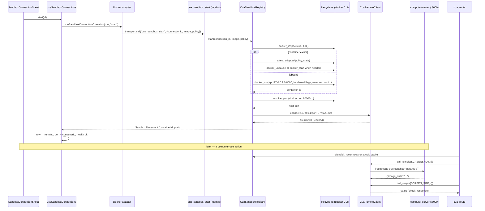

# CUA remote sandbox

<Status variant="beta" />

<TLDR>
  The CUA sandbox is a **remote computer-use target**: a `ghcr.io/trycua/cua-xfce` Docker container
  runs a `computer-server` on port 8000; cognia shells the `docker` CLI to create, start, pause, stop,
  remove and probe it, drives it over a WebSocket at `/ws`, and slots it behind the existing
  automation gate: a call whose `CallContext` carries a sandbox connection id runs in the container
  instead of on the host. It is **fully wired**. Ten `cua_sandbox_*` Tauri commands are registered
  (`src-tauri/src/lib.rs:1609-1618`), the registry is managed in app state, and on exit only the
  cached WebSocket clients are dropped: containers keep running and are adopted on the next start.
  Connections are rows in the Dexie `sandboxConnections` table.
</TLDR>

<Callout type="warn">
  Runtime capabilities are adapter-derived (`lib/sandbox/connection-capabilities.ts:74-121`). Only a
  Docker row with the `computer-server` driver has an adapter (`lib/sandbox/adapter-registry.ts:45-47`),
  and it claims create, start, suspend, resume, stop, delete, health, GUI, and workspace read/exec.
  Imported cua-cloud and Lume rows remain readable for compatibility and render their own
  instance/endpoint or VM/image fields, but every operation is false for them and the UI disables
  it. The `cua-driver` driver removes every operation whatever the provider. A Docker connection is
  therefore the only one that can back the `cua-desktop` shell/files tier, which runs commands
  through `workspaceExec` (`docker exec`) in `lib/sandbox/session-runtime.ts:522-573`.
</Callout>

The Rust module lives in `crates/cognia-automation/src/cua_sandbox/` since ADR-0067 extracted it from
`src-tauri`. `src-tauri/src/lib.rs:55` re-exports it as `cua_sandbox`, so the `generate_handler!`
entries resolve unchanged.

## Container lifecycle — `lifecycle.rs`

The container is launched with an ephemeral **loopback-only** host port mapped to the container's
8000, then the host port is resolved via `docker port`. Containers are deliberately **not** created
with `--rm` (`lifecycle.rs:8-12`): with `--rm` a stop would also destroy the container and every file
written inside it, collapsing stop and delete into one operation.

```rust title="crates/cognia-automation/src/cua_sandbox/lifecycle.rs:217-283 (docker run args, abridged)"
pub fn run_args(spec: &SpawnSpec) -> Vec<String> {
    let policy = &spec.policy;
    let mut args: Vec<String> = vec![
        "run".into(),
        "-d".into(),
        "-p".into(),
        format!("{}:0:8000", policy.publish_addr),
    ];
    // … --network / --cpus / --memory / --pids-limit when set, then per entry
    // --cap-drop, --cap-add, --tmpfs and -v, plus --security-opt no-new-privileges,
    // --read-only, the exec-user label, --user and the workspace bind mount
    args.push("--name".into());
    args.push(spec.name.clone());
    args.push(spec.image.clone());
    args
}
```

`create_args` (`lifecycle.rs:291-296`) is the same vector with `create` in place of `run` and `-d`
dropped, so a machine can be provisioned without being started.

Every flag comes from a `ContainerPolicy` whose `Default` is the hardened profile
(`lifecycle.rs:98-131`):

| Field               | Default                                        | Effect on `docker run`                                                |
| ------------------- | ---------------------------------------------- | --------------------------------------------------------------------- |
| `publish_addr`      | `127.0.0.1`                                    | `-p 127.0.0.1:0:8000`, so the control socket is never on the LAN      |
| `network_mode`      | unset                                          | Docker's default bridge, which the published WebSocket port needs     |
| `cpus`, `memory_mb` | unset                                          | uncapped                                                              |
| `pids_limit`        | `512`                                          | `--pids-limit 512`                                                    |
| `cap_drop`          | `ALL`                                          | `--cap-drop ALL`                                                      |
| `cap_add`           | `SETUID`, `SETGID`, `CHOWN`, `DAC_OVERRIDE`, `FOWNER` | one `--cap-add` each, for the root supervisord                 |
| `no_new_privileges` | `true`                                         | `--security-opt no-new-privileges`                                    |
| `read_only_rootfs`  | `true`                                         | `--read-only`                                                         |
| `tmpfs_mounts`      | `/tmp`, `/run`, `/run/lock`, `/var/log`        | one `--tmpfs` each                                                    |
| `writable_dirs`     | `/home/cua`                                    | `-v /home/cua`, an anonymous volume seeded from the image             |
| `exec_user`         | `cua`                                          | recorded as the `cognia.cua.exec-user` label, applied as `docker exec -u` |
| `entrypoint_user`   | unset                                          | no `--user`: the cua-xfce supervisord must boot as root               |
| `workspace_mount`   | unset                                          | `-v host:container` when both halves are given                        |

The renderer only ever sends `networkMode`, `cpus`, `memoryMb` and the workspace mount
(`lib/sandbox/docker-adapter.ts:83-93`). Every other `SandboxPolicyArgs` field arrives absent, and
`From<Option<SandboxPolicyArgs>>` keeps the hardened default for an absent field
(`cua_sandbox/mod.rs:71-130`).

```rust title="crates/cognia-automation/src/cua_sandbox/lifecycle.rs:373-377 (resolve mapped port)"
pub async fn resolve_port(container_id: &str) -> Result<u16> {
    let text = docker(&["port", container_id, "8000/tcp"], "docker port").await?;
    parse_port(&text)
        .ok_or_else(|| backend_err(format!("no mapped port in `docker port` output: {text:?}")))
}
```

Every subcommand goes through one `docker()` helper (`lifecycle.rs:299-318`) that fails on a non-zero
exit with Docker's stderr. The rest of the lifecycle:

- **Health** is a cheap `docker exec <id> true` (`lifecycle.rs:564-571`).
- **Stop** is `docker stop` (`lifecycle.rs:342-346`): the container and its filesystem survive.
- **Suspend** is `docker pause` (`lifecycle.rs:351-355`), which keeps memory resident so the desktop
  session is still there on resume. `docker stop` is never used as a suspend.
- **Delete** is `docker rm -f -v` (`lifecycle.rs:366-370`); `-v` also reclaims the anonymous volumes
  `writable_dirs` created.
- **Inspect** reads state and applied policy in one `docker inspect --format` round-trip
  (`lifecycle.rs:397-419`). A "no such object/container" stderr is `Ok(None)`; any other failure
  (daemon down, permission denied) stays an error so it is never mistaken for "absent".
- **Attestation.** `attest_adopted` (`lifecycle.rs:483-561`) refuses to adopt a container that is less
  confined than the requested policy (exec user, pids cap, read-only rootfs, `cap-drop ALL`,
  no-new-privileges, network, cpus, memory) and tells the user to delete and restart it.
- **Exec and file reads.** `docker_exec` (`lifecycle.rs:613-677`) passes `argv` as separate arguments,
  never a shell string, and caps each stream at 1 MiB. A timeout kills the `docker exec` client, not
  the process inside the container, and reports `timed_out` saying so. `docker_read_file`
  (`lifecycle.rs:682-714`) is a `cat` over the same channel, under the same exec user.

## Registry — `registry.rs`

`CuaSandboxRegistry` owns **only the live WebSocket clients**, in an Arc-backed map keyed by
connection id (`registry.rs:42-46`). Docker owns container state. The previous design tracked
containers in its own map and always created a new one, so a container that outlived the app kept
its name taken and `docker run --name` failed forever after (`registry.rs:9-13`). Every entry point
now asks Docker first and **adopts** what it finds:

```rust title="crates/cognia-automation/src/cua_sandbox/registry.rs:95-128"
pub async fn start(
    &self,
    connection_id: &str,
    image: &str,
    policy: ContainerPolicy,
) -> Result<SandboxPlacement> {
    let name = container_name_for_connection(connection_id);
    let container_id = match docker_inspect(&name).await? {
        Some(state) => {
            attest_adopted(&policy, &state)?;
            if state.paused {
                docker_unpause(&name).await?;
            } else if !state.running {
                docker_start(&name).await?;
            }
            state.id
        }
        None => {
            docker_run(&SpawnSpec {
                image: image.to_string(),
                name: name.clone(),
                policy,
            })
            .await?
        }
    };
    let port = resolve_port(&name).await?;
    let client = CuaRemoteClient::connect("127.0.0.1", port).await?;
    self.clients
        .lock()
        .await
        .insert(connection_id.to_string(), client);
    Ok(SandboxPlacement { container_id, port })
}
```

Adoption depends on a **deterministic container name**. `container_name_for_connection`
(`registry.rs:297-325`) lowercases the id's ASCII alphanumerics, collapses every other run into one
`-`, falls back to `cua-sandbox` for an empty result, and keeps the name within Docker's 63
characters by truncating and appending an 8-hex-digit FNV-1a hash.

The other entry points follow the same rule:

- `create` (`registry.rs:57-88`) adopts an existing container (port `0` unless it is running), or
  `docker create`s one.
- `suspend` / `resume` (`registry.rs:133-159`) drop the client before pausing, and reconnect after
  unpausing or starting.
- `stop` and `delete` (`registry.rs:163-182`) drop the client and succeed as a no-op when the
  container is already gone.
- `exec` / `read_file` (`registry.rs:200-232`) require a running, unpaused container and run under the
  exec user recorded on its label.
- `client` (`registry.rs:239-251`) **reconnects on a cold cache**. The cache is always cold after an
  app restart while the container may still be running, so a cache miss is not treated as "dead".

The registry is created at app start and managed twice from one Arc-backed clone: as Tauri state for
the `cua_sandbox_*` commands and inside `AutomationState` for the `cua_route` layer
(`lib.rs:1946-1955`). On exit, `disconnect_all()` only clears the cached clients (`lib.rs:2428-2438`,
`registry.rs:258-260`). Containers are deliberately left running, because `start` adopts them on the
next launch.

### Commands — `mod.rs`

`cua_sandbox/mod.rs` defines ten commands: `cua_sandbox_create`, `start`, `suspend`, `resume`,
`stop`, `delete`, `inspect`, `health`, `exec` (default timeout 120 s) and `read_file` (default cap
2 MiB). Placements and state come back as named-field DTOs rather than tuples. Every command is
`target: "client"` with `transports: ["internal"]` in `protocol/companion-commands.json`: Docker
orchestration belongs to the machine running the renderer and never follows an active remote host.

## WebSocket protocol — `protocol.rs` + `remote_client.rs`

The `computer-server` speaks JSON over WS: each message is `{ "command": <string>, "params": <object> }`.
`protocol.rs` builds these from typed automation actions: `left_click` / `right_click` /
`double_click`, `type_text`, `press_key` / `hotkey`, `key_down` / `key_up`, `move_cursor`, `scroll`
and `drag`, plus the parameterless reads `screenshot`, `get_cursor_position`,
`get_accessibility_tree` and `get_screen_size`.

```rust title="crates/cognia-automation/src/cua_sandbox/protocol.rs:47-54 (click mapping)"
pub fn click_request(point: Point, button: MouseButton, count: u32) -> WsRequest {
    let command = match (button, count) {
        (MouseButton::Left, c) if c >= 2 => "double_click",
        (MouseButton::Right, _) => "right_click",
        _ => "left_click",
    };
    WsRequest::new(command, json!({ "x": point.x, "y": point.y }))
}
```

`check_response` (`protocol.rs:107-116`) turns a **non-empty string** `error` field into a
`BackendError`. The module doc calls this a "truthy" field, but a non-string `error` value passes
through as success.

`CuaRemoteClient` serializes calls through an mpsc queue (capacity 32). The server processes one
command at a time and replies in order, so a spawned pump task sends each request, then reads the
next text frame as that request's response, skipping ping/pong/binary frames. Each call has a 30 s
timeout (`remote_client.rs:80-90`).

```rust title="crates/cognia-automation/src/cua_sandbox/remote_client.rs:35-77 (connect + pump, abridged)"
pub async fn connect(host: &str, port: u16) -> Result<Arc<Self>> {
    let url = format!("ws://{host}:{port}/ws");
    let (stream, _) = tokio_tungstenite::connect_async(&url)
        .await
        .map_err(|e| backend_err(format!("cua connect {url}: {e}")))?;
    let (mut sink, mut source) = stream.split();
    let (tx, mut rx) = mpsc::channel::<Job>(32);
    // spawned task (lines 43-74): serialize → sink.send(Text) → read next Text frame as the reply
    Ok(Arc::new(Self { tx }))
}
```

## Target resolution — `sandbox-target.ts`

A computer-use target is either the local host or a remote sandbox referenced by `connectionId`
(never a bare "remote" flag; the id is the convergence anchor). The resolver walks session →
character → local:

```ts title="lib/automation/sandbox-target.ts:12-29 (abridged)"
export type ComputerUseTargetSetting = "local" | { connectionId: string } | undefined
export type ComputerUseTarget = { kind: "local" } | { kind: "remote"; connectionId: string }

export function resolveComputerUseTarget(session, character): ComputerUseTarget {
  return normalize(session) ?? normalize(character) ?? { kind: "local" }
}
```

Its caller is `resolveSandboxSessionBinding` (`lib/sandbox/binding.ts:57-85`), which
`lib/claude/build-options.ts` runs per send. A remote target becomes `computerTarget: "bound"` on
that connection, and a `cua-desktop` shell tier forces `"bound"` even when the GUI axis was left
local.

The call context is stamped from that binding, not by the plugin. The computer-use plugin tools only
forward `sandboxRuntimeRef` as their origin (`plugins/computer-use/src/index.ts:298-306`).
`buildComputerUseCallContext` (`lib/plugin/api/automation-api.ts:230-273`) picks the send's runtime
ref, falling back to the session's active ref and then the host fallback, and calls
`SandboxSessionRuntime.decorateComputerUseContext` (`lib/sandbox/session-runtime.ts:395-422`). That
refuses when Computer Use is disabled for the binding or the bound desktop could not be placed,
asserts the connection's `gui` capability, and returns `sandboxConnectionId: row.id`. The value
deserializes into the Rust `CallContext.sandbox_connection_id` (`automation/commands.rs:245`), and
`remote_connection_id()` treats an empty string as local (`commands.rs:271-275`).

## Local-vs-remote routing — `cua_route`

`automation/dispatcher.rs:execute_action` (`dispatcher.rs:473-561`) routes **every** GUI
driving/reading action through `cua_route::*`, and so do the granular `desktop_*` commands in
`automation/commands.rs`. Both run inside the gated call, so permission, consent and audit wrap the
local and remote paths identically (`cua_route.rs:1-14`). `cua_route` resolves the live client and
translates to a `computer-server` WS command. An action with no remote equivalent (element-target
click, `get_focus`, `find`, `invoke_pattern`, `window_op`, `pick_at_point`) returns
`UnsupportedPlatform` rather than silently falling through to the host (`cua_route.rs:98`,
`cua_route.rs:304-363`).


```mermaid
sequenceDiagram
  participant UI as SandboxConnectionSheet
  participant Hook as useSandboxConnections
  participant Adp as Docker adapter
  participant Cmd as cua_sandbox_start (mod.rs)
  participant Reg as CuaSandboxRegistry
  participant Life as lifecycle.rs (docker CLI)
  participant WS as CuaRemoteClient
  participant Srv as computer-server (:8000)

  UI->>Hook: start(id)
  Hook->>Adp: runSandboxConnectionOperation(row, "start")
  Adp->>Cmd: transport.call("cua_sandbox_start", {connectionId, image, policy})
  Cmd->>Reg: start(connection_id, image, policy)
  Reg->>Life: docker_inspect(cua-<id>)
  alt container exists
    Reg->>Life: attest_adopted(policy, state)
    Reg->>Life: docker_unpause or docker_start when needed
  else absent
    Reg->>Life: docker_run [-p 127.0.0.1:0:8000, hardened flags, --name cua-<id>]
    Life-->>Reg: container_id
  end
  Reg->>Life: resolve_port (docker port 8000/tcp)
  Life-->>Reg: host port
  Reg->>WS: connect 127.0.0.1:port → ws://.../ws
  WS-->>Reg: Arc<client> (cached)
  Reg-->>Hook: SandboxPlacement {containerId, port}
  Hook->>Hook: row → running, port + containerId, health ok

  Note over UI,Srv: later — a computer-use action
  participant Route as cua_route
  Route->>Reg: client(id), reconnects on a cold cache
  Route->>WS: call_simple(SCREENSHOT, {})
  WS->>Srv: {"command":"screenshot","params":{}}
  Srv-->>WS: {"image_data":"..."}
  Route->>WS: call_simple(SCREEN_SIZE, {})
  WS-->>Route: Value (check_response)
```

## Connection registry — Dexie `sandboxConnections`

Connections are a first-class entity. The table is declared in `CURRENT_SCHEMA`
(`lib/db/schema.ts:542`), which is one schema version (currently **v229**, `schema.ts:420`) rather
than a per-version chain.

```ts title="lib/db/schema.ts:542 (stores)"
sandboxConnections: "&id, name, provider, state, createdAt, updatedAt",
```

`SandboxConnectionRow` (`types/sandbox/index.ts:215-249`) splits **who owns the machine** from **how
cognia talks to it**:

- `provider`: `"docker"`, `"cua-cloud"` or `"lume"` (`types/sandbox/index.ts:59`).
- `driver`: `"computer-server"` or `"cua-driver"` (`types/sandbox/index.ts:68`).
- `config`: provider-specific and discriminated by `provider` (`types/sandbox/index.ts:142-145`). The
  Docker config carries `image`, `host`, `port` (0 until started), `containerId?`, and the policy
  frozen in at create time (`networkMode`, `cpus`, `memoryMb`, `workspaceMount`).
- `state`: one of eleven normalized lifecycle states, from `uninitialized` through `error`
  (`types/sandbox/index.ts:153-164`).
- `capabilities` and `capabilitiesRevision`: the operation matrix. A row behind the current revision
  is recomputed from defaults on read.
- `credentialRef?`: a keyring pointer, only for providers that authenticate. No secret reaches Dexie.
- Health fields (`lastHealthStatus`, `lastHealthError?`, `lastHealthCheckAt?`) and timestamps.
- Four deprecated top-level mirrors (`image`, `host`, `port`, `containerId`), dual-written for the
  downgrade window after the v143 provider/driver split.

`lib/db/sandbox-connections.ts` holds the CRUD helpers. `listSandboxConnections` returns rows
newest-first and migrates each on read. The file also has `listSandboxConnectionsByProvider`,
`getSandboxConnection`, `putSandboxConnection` (which refreshes the legacy mirrors),
`deleteSandboxConnection`, `createSandboxConnectionRow` (state `uninitialized`, default capabilities),
and `updateSandboxConnectionState`, which re-reads the row and is a no-op once the row is gone.

`hooks/automation/use-sandbox-connections.ts` is the Dexie-first reactive hook (`useLiveQuery`) plus
the lifecycle actions `provision`, `start`, `suspend`, `resume`, `stop`, `refreshHealth` and `remove`.
`create` writes a Docker / `computer-server` row with the default image
`ghcr.io/trycua/cua-xfce:latest` on `127.0.0.1`. Each lifecycle action is serialized per connection,
stamps its transitional state (`creating`, `starting`, `suspending`, `resuming`, `stopping`), then
calls `runSandboxConnectionOperation` (`lib/sandbox/connection-lifecycle.ts`). That checks the
capability matrix and the forbidden states (`lib/sandbox/lifecycle-contract.ts:166-188`) before
reaching the Docker adapter and `sandboxClient`. A thrown error settles the row as `error` with the
message. `start` writes the mapped `port` and `containerId` with health `ok`. `stop` resets `port`
to 0 but keeps `containerId`, because the container survives. `remove` stamps `deleting`, attempts
the `delete` operation best-effort, and always drops the row.

<Callout type="info">
  `SandboxProvider` in `lib/db/sandbox-connections.ts` is now a deprecated alias of
  `SandboxConnectionProvider`. `cua-cloud` and `lume` are declared, but ADR-0020 records both as
  deferred and neither has an adapter. Element-targeted actions, and with them the workflow pattern
  nodes, are local-only by design: UIA has no remote element references, so `cua_route` refuses them
  for a remote target.
</Callout>

## UI + tests

The registry UI is **Settings → Automation → Sandboxes**
(`components/settings/automation/sandbox-connections-tab.tsx`, mounted in `automation-section.tsx`
and also in the device console's runtime section). Each row shows the name, a lifecycle-state badge,
a live health badge, a "no adapter" badge for rows without one, and a **Manage** button. Manage opens
`SandboxConnectionSheet`, which carries seven actions (Provision, Start, Suspend, Resume, Stop, Check
health, Delete), each gated by the row's live capability projection. Outside the desktop shell
(`isTauri()` false) every action is disabled with a desktop-only reason. An inline add form takes
name, image, host and the frozen policy (network mode, CPUs, memory, workspace mount). See
[Observability & UI](./observability-and-ui).

Rust tests: `lifecycle.rs:744-1347` (17 unit tests, plus 5 live Docker tests marked `#[ignore]`),
`protocol.rs:118-186` (8), `registry.rs:336-378` (4, container naming) and `mod.rs:353-453` (5,
policy-argument mapping). TS suites: `sandbox-target.test.ts`, `sandbox-target.e2e.test.ts`,
`sandbox-client.test.ts`, `sandbox-connections.test.ts`, `use-sandbox-connections.test.ts`,
`sandbox-connections-tab.test.tsx`, `sandbox-connection-sheet.test.tsx`, and under `lib/sandbox/`,
`docker-adapter.test.ts`, `connection-capabilities.test.ts` and `connection-lifecycle.test.ts`.

## Next

<Cards>
  <Card title="Observability & UI" href="./observability-and-ui" description="The Sandboxes tab + health badges" />
  <Card title="Execution overview" href="./execution-overview" description="The other sandbox: tool-call isolation" />
  <Card title="Computer use" href="../computer-use" description="The wider computer-use subsystem" />
</Cards>
