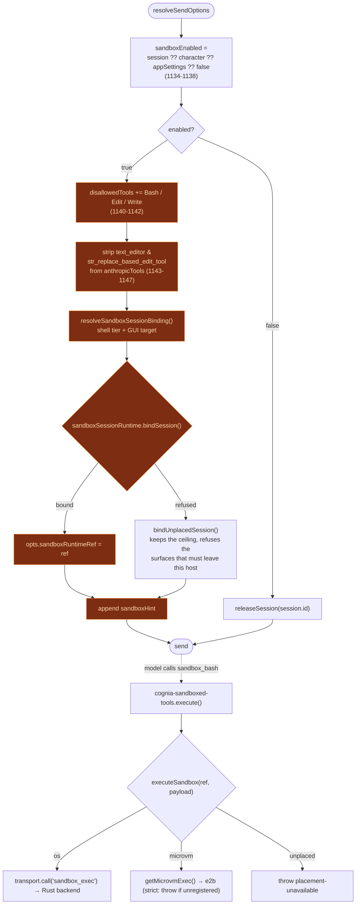

# Execution sandbox overview

<Status variant="beta" />

<TLDR>
  When a `ChatSession` has the sandbox enabled, `lib/claude/build-options.ts:resolveSendOptions`
  **removes the SDK's `Bash` / `Edit` / `Write` builtins** and the native `text_editor`, appends a
  system-prompt note, and binds tier, policy, target, and provider adapter into an immutable
  `SandboxRuntimeRef`. The model is then steered to
  four `sandbox_*` tools (from the `cognia-sandboxed-tools` plugin) that route to either the OS
  backend (T1) or the e2b microVM (T4). Tiers T2/T3 cover plugin code; T5 is a per-action policy gate
  for `computer_use`. There is **no bypass** — when a backend is unavailable the call denies.
</TLDR>

## The five tiers

T1–T5 cover orthogonal threat surfaces. Not every session touches every tier.

| Tier   | Protects                                   | Mechanism                                                          | Lives in                                                       |
| ------ | ------------------------------------------ | ----------------------------------------------------------------- | ------------------------------------------------------------- |
| **T1** | `Bash` / `Edit` / `Write` / `text_editor`  | OS-native: `bwrap` (Linux), `sandbox-exec` (macOS), runner (Win)  | [OS backends](./os-backends)                                  |
| **T2** | Plugin JS executors                        | Node 24 `--permission` re-exec from manifest permissions          | [Plugin isolation](./plugin-isolation)                       |
| **T3** | Plugin WASM modules                        | Wasmtime + WASI, preopens from the grant ledger                   | [Plugin isolation](./plugin-isolation)                       |
| **T4** | Opt-in stronger isolation for T1's tools   | e2b Firecracker microVM (per-character / per-app tier)            | [microVM & Web](./microvm-and-web)                           |
| **T5** | `computer_use` (cannot be process-sandboxed) | Per-action policy gate (app / window / url / screen-region)      | [Observability & UI](./observability-and-ui)                 |

## What turns it on — the precedence chain

The whole feature is gated by one boolean resolved in `lib/claude/build-options.ts`. The chain walks
session → character → app-settings, defaulting to **off**:

```ts title="lib/claude/build-options.ts:1134-1138"
const sandboxEnabled =
  session?.sandboxEnabled ??
  character?.sandboxEnabled ??
  appSettings?.sandboxDefaultEnabled ??
  false
```

The shell tier and the Computer Use target are resolved together into one
`SandboxSessionBinding` (`lib/sandbox/binding.ts`), each axis walking session → character →
app-settings. They are resolved together because choosing the `cua-desktop` tier means "run shell,
files AND GUI in that desktop", so it forces the GUI axis to the same connection.

That binding, plus the resolved resource policy and confinement, is then **bound once per send**
into an immutable placement record. `resolveSendOptions` puts the resulting reference on the send
envelope; it is host-only and never reaches a model provider:

```ts title="lib/claude/build-options.ts"
opts.sandboxRuntimeRef = await sandboxSessionRuntime.bindSession({
  sessionId: session.id,
  binding: sandboxBinding,
  policy: sandboxEnabled ? resolvedSandboxPolicy : null,
  confine: /* writable / readable / network ceiling */,
  sandboxEnabled,
  computerUseEnabled: computerUseAllowedForChat,
  workspaceRoot: opts.cwd,
})
```

The per-session `setActiveSandboxTier` / `setActiveSandboxPolicy` / `setActiveSandboxConfine`
registries this replaced are **gone**. They were three maps keyed by session id that each surface
read back independently, which let the tier, the ceiling and the GUI target drift apart mid-send.
One reference now carries all three — see [microVM & Web](./microvm-and-web).

### Config field map

All three config fields live on interfaces in `lib/claude/types.ts` (not `lib/db/schema.ts`):

| Field                   | Interface     | Location               | Type                          |
| ----------------------- | ------------- | ---------------------- | ----------------------------- |
| `sandboxEnabled`        | `ChatSession` | `lib/claude/types.ts:689`  | `boolean \| undefined`        |
| `sandboxEnabled`        | `Character`   | `lib/claude/types.ts:2054` | `boolean \| undefined`        |
| `sandboxDefaultEnabled` | `AppSettings` | `lib/claude/types.ts:1545` | `boolean \| undefined`        |
| `sandboxTier`           | `Character`   | `lib/claude/types.ts:2062` | `"os" \| "microvm" \| undefined` |
| `sandboxTier`           | `AppSettings` | `lib/claude/types.ts:1555` | `"os" \| "microvm" \| undefined` |

## Tool replacement

When `sandboxEnabled` is true, the SDK builtins are denied and the native editor tools are stripped
from the Anthropic tool projection — so the model **cannot** reach an unsandboxed path:

```ts title="lib/claude/build-options.ts:1139-1147"
if (sandboxEnabled) {
  const disallowed = new Set(opts.disallowedTools ?? [])
  for (const t of ["Bash", "Edit", "Write"]) disallowed.add(t)
  opts.disallowedTools = [...disallowed]
  if (Array.isArray(opts.anthropicTools)) {
    opts.anthropicTools = opts.anthropicTools.filter(
      (t) => t.name !== "text_editor" && t.name !== "str_replace_based_edit_tool"
    )
  }
```

The four `sandbox_*` replacements are **not** added here — they are already in `opts.pluginTools`
(built upstream by `buildPluginToolsManifest()` from the `cognia-sandboxed-tools` plugin). This block
only removes the unsandboxed paths and then steers the model with a system-prompt note:

```ts title="lib/claude/build-options.ts:1154-1161"
const sandboxHint =
  "Filesystem-mutating and shell tools are sandboxed in this session. Use " +
  "`sandbox_bash` / `sandbox_edit` / `sandbox_write` / `sandbox_text_editor` " +
  "(from cognia-sandboxed-tools) instead of the SDK builtins; they accept the " +
  "same shape plus an explicit writable/readable scope. The unsandboxed Bash / " +
  "Edit / Write are not available in this session."
const existing = opts.appendSystemPrompt?.trim() ?? ""
opts.appendSystemPrompt = existing ? `${existing}\n\n${sandboxHint}` : sandboxHint
```

When neither the sandbox nor Computer Use is on for the session, the binding is **released** rather
than reset, so no stale placement from a previous send survives:

```ts title="lib/claude/build-options.ts"
} else if (session?.id) {
  // Release failures are logged, not thrown: a provider that refuses to close
  // must not make the session unable to send.
  try {
    await sandboxSessionRuntime.releaseSession(session.id)
  } catch (err) {
    loggers.app.warn("sandbox runtime release failed", { sessionId: session.id, error: String(err) })
  }
  delete opts.sandboxRuntimeRef
}
```

### When the binding cannot be established

A binding can be refused by state the user changed elsewhere — a deleted sandbox connection, a
character pinned to the withdrawn `cua-desktop` tier, a microVM preflight with no remote workspace
to claim. That must not take the send down, and it must **not** silently answer "I could not
isolate this" with "then run it here, unrestricted":

```ts title="lib/claude/build-options.ts"
} catch (err) {
  loggers.app.warn("unusable sandbox binding", { sessionId: session.id, error: String(err) })
  opts.sandboxRuntimeRef = sandboxSessionRuntime.bindUnplacedSession(bindInput, err)
}
```

`bindUnplacedSession` records the placement the session *asked* for. The resolved ceiling still
clamps every surface that legitimately runs on this host, and the surfaces that were supposed to
leave it refuse at call time with `placement-unavailable`:

| Requested                             | After a failed bind                                      |
| ------------------------------------- | -------------------------------------------------------- |
| `shellTier: "os"`                     | still runs, still clamped to the resolved policy          |
| `shellTier: "microvm" \| "cua-desktop"` | `executeSandbox` throws — no host fallback              |
| `computerTarget: "local"`             | still drives the local desktop                            |
| `computerTarget: "bound"`             | `decorateComputerUseContext` throws — never retargets local |

## End-to-end flow



## Strict mode — no bypass

ADR-0028 is explicit: when a T1 backend is unavailable (Windows setup not run, `bwrap` missing,
runner exits non-zero), tool calls **deny strictly**. There is no settings toggle to turn the sandbox
off at the policy layer and no `COGNIA_SANDBOX_BYPASS` env back door. The renderer surfaces a
"Setup required" badge and a "Retry setup" button instead. The same applies to the microVM tier: if a
session resolves to `microvm` but no e2b exec is registered, the `cognia-sandboxed-tools` plugin
throws rather than silently falling back to the OS tier (see [Sandboxed tools](./sandboxed-tools)).

## Audit surface

Every OS and E2B sandbox call is recorded with a dedicated audit surface. The Rust `Surface` enum carries a
`Sandbox` variant (`src-tauri/src/automation/permission.rs:53`); the dispatcher records an
allow/deny/error `AuditEntry` for each `sandbox_exec` call and emits an `automation:event`
(`src-tauri/src/sandbox/mod.rs:99-158`). Because the sandbox owns its own strict-mode policy, the
shared permission gate short-circuits it — `Surface::Sandbox => Decision::Allow`
(`permission.rs:325`) — while the global kill-switch still blocks for defence in depth. The
Diagnostics tab renders these via `SandboxAuditCard`; see [Observability & UI](./observability-and-ui).

Each stdout and stderr stream is capped independently at 1,000,000 UTF-8 bytes. Native backends read
child pipes incrementally; E2B responses are truncated before crossing the tool boundary. Results
carry `stdout_truncated` and `stderr_truncated` and append a visible truncation marker. Audit rows also
carry effective tier/provider, refusal or termination, requested timeout, timeout state, exit code,
truncation flags, and duration in the existing fields.

## Next

<Cards>
  <Card title="OS backends (T1)" href="./os-backends" description="The Rust crate behind sandbox_exec" />
  <Card title="Sandboxed tools" href="./sandboxed-tools" description="The four sandbox_* tools" />
  <Card title="microVM & Web" href="./microvm-and-web" description="T4 e2b tier + tier router" />
</Cards>
