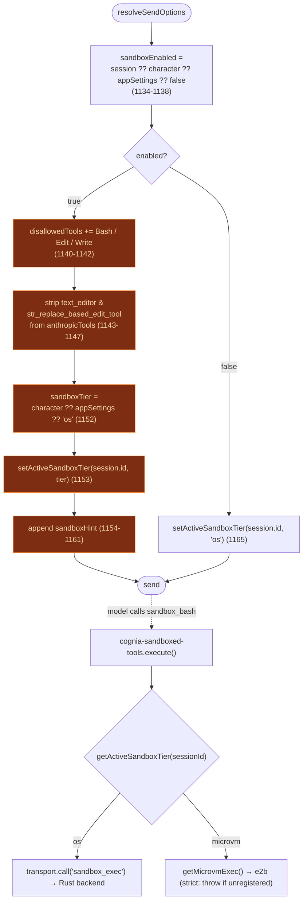

# Execution sandbox overview

<Status variant="beta" />

<TLDR>
  When a `ChatSession` has the sandbox enabled, `lib/claude/build-options.ts:resolveSendOptions`
  **removes the SDK's `Bash` / `Edit` / `Write` builtins** and the native `text_editor`, appends a
  system-prompt note, and stamps the active tier into `microvm-bridge`. The model is then steered to
  four `sandbox_*` tools (from the `cognia-sandboxed-tools` plugin) that route to either the OS
  backend (T1) or the e2b microVM (T4). Tiers T2/T3 cover plugin code; T5 is a per-action policy gate
  for `computer_use`. There is **no bypass** — when a backend is unavailable the call denies.
</TLDR>

## The five tiers

T1–T5 cover orthogonal threat surfaces. Not every session touches every tier.

| Tier   | Protects                                   | Mechanism                                                          | Lives in                                                       |
| ------ | ------------------------------------------ | ----------------------------------------------------------------- | ------------------------------------------------------------- |
| **T1** | `Bash` / `Edit` / `Write` / `text_editor`  | OS-native: `bwrap` (Linux), `sandbox-exec` (macOS), runner (Win)  | [OS backends](./os-backends)                                  |
| **T2** | Plugin JS executors                        | Node 24 `--permission` re-exec from manifest permissions          | [Plugin isolation](./plugin-isolation)                       |
| **T3** | Plugin WASM modules                        | Wasmtime + WASI, preopens from the grant ledger                   | [Plugin isolation](./plugin-isolation)                       |
| **T4** | Opt-in stronger isolation for T1's tools   | e2b Firecracker microVM (per-character / per-app tier)            | [microVM & Web](./microvm-and-web)                           |
| **T5** | `computer_use` (cannot be process-sandboxed) | Per-action policy gate (app / window / url / screen-region)      | [Observability & UI](./observability-and-ui)                 |

## What turns it on — the precedence chain

The whole feature is gated by one boolean resolved in `lib/claude/build-options.ts`. The chain walks
session → character → app-settings, defaulting to **off**:

```ts title="lib/claude/build-options.ts:1134-1138"
const sandboxEnabled =
  session?.sandboxEnabled ??
  character?.sandboxEnabled ??
  appSettings?.sandboxDefaultEnabled ??
  false
```

The tier is resolved separately. Note there is **no `session.sandboxTier`** — the chain starts at
the character:

```ts title="lib/claude/build-options.ts:1152-1153"
const sandboxTier: "os" | "microvm" = character?.sandboxTier ?? appSettings?.sandboxTier ?? "os"
setActiveSandboxTier(session?.id, sandboxTier)
```

`setActiveSandboxTier` (imported from `@/lib/sandbox/microvm-bridge` at `build-options.ts:13`) stamps
the tier so the `cognia-sandboxed-tools` plugin can read it inside its `execute()` — see
[microVM & Web](./microvm-and-web).

### Config field map

All three config fields live on interfaces in `lib/claude/types.ts` (not `lib/db/schema.ts`):

| Field                   | Interface     | Location               | Type                          |
| ----------------------- | ------------- | ---------------------- | ----------------------------- |
| `sandboxEnabled`        | `ChatSession` | `lib/claude/types.ts:689`  | `boolean \| undefined`        |
| `sandboxEnabled`        | `Character`   | `lib/claude/types.ts:2054` | `boolean \| undefined`        |
| `sandboxDefaultEnabled` | `AppSettings` | `lib/claude/types.ts:1545` | `boolean \| undefined`        |
| `sandboxTier`           | `Character`   | `lib/claude/types.ts:2062` | `"os" \| "microvm" \| undefined` |
| `sandboxTier`           | `AppSettings` | `lib/claude/types.ts:1555` | `"os" \| "microvm" \| undefined` |

## Tool replacement

When `sandboxEnabled` is true, the SDK builtins are denied and the native editor tools are stripped
from the Anthropic tool projection — so the model **cannot** reach an unsandboxed path:

```ts title="lib/claude/build-options.ts:1139-1147"
if (sandboxEnabled) {
  const disallowed = new Set(opts.disallowedTools ?? [])
  for (const t of ["Bash", "Edit", "Write"]) disallowed.add(t)
  opts.disallowedTools = [...disallowed]
  if (Array.isArray(opts.anthropicTools)) {
    opts.anthropicTools = opts.anthropicTools.filter(
      (t) => t.name !== "text_editor" && t.name !== "str_replace_based_edit_tool"
    )
  }
```

The four `sandbox_*` replacements are **not** added here — they are already in `opts.pluginTools`
(built upstream by `buildPluginToolsManifest()` from the `cognia-sandboxed-tools` plugin). This block
only removes the unsandboxed paths and then steers the model with a system-prompt note:

```ts title="lib/claude/build-options.ts:1154-1161"
const sandboxHint =
  "Filesystem-mutating and shell tools are sandboxed in this session. Use " +
  "`sandbox_bash` / `sandbox_edit` / `sandbox_write` / `sandbox_text_editor` " +
  "(from cognia-sandboxed-tools) instead of the SDK builtins; they accept the " +
  "same shape plus an explicit writable/readable scope. The unsandboxed Bash / " +
  "Edit / Write are not available in this session."
const existing = opts.appendSystemPrompt?.trim() ?? ""
opts.appendSystemPrompt = existing ? `${existing}\n\n${sandboxHint}` : sandboxHint
```

When the sandbox is **disabled**, the else branch resets the tier so a stale value from a previous
send on the same session id cannot leak forward:

```ts title="lib/claude/build-options.ts:1162-1166"
} else {
  // Sandbox disabled — make sure stale tier state from a previous send
  // on the same session id doesn't leak into the next call.
  setActiveSandboxTier(session?.id, "os")
}
```

## End-to-end flow



## Strict mode — no bypass

ADR-0028 is explicit: when a T1 backend is unavailable (Windows setup not run, `bwrap` missing,
runner exits non-zero), tool calls **deny strictly**. There is no settings toggle to turn the sandbox
off at the policy layer and no `COGNIA_SANDBOX_BYPASS` env back door. The renderer surfaces a
"Setup required" badge and a "Retry setup" button instead. The same applies to the microVM tier: if a
session resolves to `microvm` but no e2b exec is registered, the `cognia-sandboxed-tools` plugin
throws rather than silently falling back to the OS tier (see [Sandboxed tools](./sandboxed-tools)).

## Audit surface

Every OS-sandbox call is recorded with a dedicated audit surface. The Rust `Surface` enum carries a
`Sandbox` variant (`src-tauri/src/automation/permission.rs:53`); the dispatcher records an
allow/deny/error `AuditEntry` for each `sandbox_exec` call and emits an `automation:event`
(`src-tauri/src/sandbox/mod.rs:99-158`). Because the sandbox owns its own strict-mode policy, the
shared permission gate short-circuits it — `Surface::Sandbox => Decision::Allow`
(`permission.rs:325`) — while the global kill-switch still blocks for defence in depth. The
Diagnostics tab renders these via `SandboxAuditCard`; see [Observability & UI](./observability-and-ui).

## Next

<Cards>
  <Card title="OS backends (T1)" href="./os-backends" description="The Rust crate behind sandbox_exec" />
  <Card title="Sandboxed tools" href="./sandboxed-tools" description="The four sandbox_* tools" />
  <Card title="microVM & Web" href="./microvm-and-web" description="T4 e2b tier + tier router" />
</Cards>
