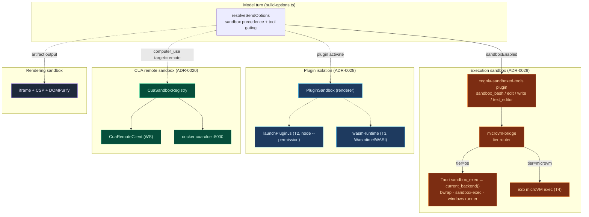

# Sandbox System

<Status variant="beta" />

<TLDR>
  "Sandbox" in cognia-next is **four distinct families**, not one runtime. The big one is the
  ADR-0028 **execution sandbox**: a five-tier hybrid (OS-native `bwrap` / `sandbox-exec` /
  Windows runner, Node 24 `--permission`, Wasmtime, e2b microVM, and a per-action policy gate)
  that confines `Bash` / `Edit` / `Write` / `text_editor` tool calls. Alongside it sit the
  **CUA remote sandbox** (a Dockerized desktop driven over WebSocket — ADR-0020), the
  **plugin isolation** stack (renderer `PluginSandbox`, T2 Node permission re-exec, T3 WASM
  runtime), and the **artifact rendering sandbox** (iframe + CSP + DOMPurify — documented in
  [Artifacts / Sandbox](../artifacts-sandbox)). This section maps each module to its source
  with line-accurate references and the **real** implementation status (which differs from the
  ADR proposal in several places).
</TLDR>

<StatGrid>
  <Stat label="Sandbox Families" value="4" hint="execution · CUA remote · plugin · rendering" />
  <Stat label="Execution Tiers" value="5" hint="T1 OS · T2 node · T3 wasm · T4 microVM · T5 policy" />
  <Stat label="OS Backends" value="3+2" hint="linux/macos/windows + uninstalled/mock" />
  <Stat label="CUA Dexie Schema" value="v57" hint="sandboxConnections table" />
</StatGrid>

## The four families

These share the word "sandbox" but are independent subsystems with different threat models and
different isolation mechanisms. Read this table first.

| Family                  | What it isolates                                          | Mechanism                                                                 | ADR  | Status                                  |
| ----------------------- | -------------------------------------------------------- | ------------------------------------------------------------------------- | ---- | --------------------------------------- |
| **Execution sandbox**   | Model tool calls (`Bash` / `Edit` / `Write` / editor)    | OS-native (`bwrap`/`sandbox-exec`/runner) · microVM · per-action policy   | 0028 | Linux/macOS real · Windows partial      |
| **CUA remote sandbox**  | Computer-use (GUI driving) on a remote desktop           | Docker `cua-xfce` container driven over WebSocket                          | 0020 | Fully wired                             |
| **Plugin isolation**    | Third-party plugin code (JS / Node / WASM)               | `PluginSandbox` globals · Node 24 `--permission` · Wasmtime/WASI          | 0028 | Renderer shipped · T2/T3 surface locked |
| **Rendering sandbox**   | One-shot model artifacts (HTML / SVG / React)            | iframe + CSP + DOMPurify (see [Artifacts / Sandbox](../artifacts-sandbox)) | —    | Stable                                  |

A fifth, the **web code-execution sandbox** (`lib/sandbox/web`), is a deliberate stub today —
covered on [microVM & Web](./microvm-and-web).

## How they fit together

## Code locations

<Files>
  <Folder name="src-tauri/src/sandbox/ (T1 — OS execution)" defaultOpen>
    <File name="mod.rs — dispatcher + sandbox_exec / sandbox_health_probe Tauri commands" />
    <File name="traits.rs — SandboxedExec trait" />
    <File name="types.rs — SandboxCommand / Policy / Result / Error / Health / NetworkPolicy" />
    <File name="policy.rs — policy_for(tool, request) pure resolver" />
    <File name="linux.rs · macos.rs · windows.rs — per-platform backends" />
    <File name="uninstalled.rs · mock.rs — fallback + test double" />
  </Folder>
  <Folder name="src-tauri/src/bin/">
    <File name="cognia-sandbox-setup.rs — Windows UAC installer (synthetic users + firewall)" />
    <File name="cognia-sandbox-runner.rs — Windows non-elevated runner (runas)" />
  </Folder>
  <Folder name="src-tauri/src/cua_sandbox/ (CUA remote)">
    <File name="mod.rs — cua_sandbox_start / stop / health" />
    <File name="lifecycle.rs · protocol.rs · registry.rs · remote_client.rs" />
  </Folder>
  <Folder name="lib/sandbox/">
    <File name="microvm-bridge.ts — tier router + microvm exec registry" />
    <File name="web/index.ts — web code-exec stub" />
  </Folder>
  <Folder name="lib/claude/">
    <File name="build-options.ts — sandbox precedence + tool gating (≈1121–1166)" />
    <File name="types.ts — sandboxEnabled / sandboxTier / accountId fields" />
  </Folder>
  <Folder name="plugins/">
    <File name="cognia-sandboxed-tools/src/index.ts — 4 sandbox_* MCP tools" />
    <File name="e2b-sandbox/src/microvm-exec.ts · workspace-backend.ts — T4" />
  </Folder>
  <Folder name="lib/plugin/ (plugin isolation)">
    <File name="core/sandbox.ts — PluginSandbox (renderer globals)" />
    <File name="launcher/launchPluginJs.ts — T2 node --permission flags" />
    <File name="core/wasm-runtime.ts — T3 Wasmtime/WASI" />
  </Folder>
  <Folder name="UI + data">
    <File name="components/chat/composer/sandbox-shield.tsx — composer indicator" />
    <File name="components/settings/sandbox/* — settings section (wired: nav + shell)" />
    <File name="components/settings/automation/sandbox-connections-tab.tsx — CUA registry UI" />
    <File name="lib/db/sandbox-connections.ts — Dexie v57 sandboxConnections" />
  </Folder>
</Files>

## Pages in this section

<Cards>
  <Card
    title="Execution sandbox overview"
    href="./execution-overview"
    description="ADR-0028 five tiers, the build-options precedence chain, tool replacement, strict mode, audit"
  />
  <Card
    title="OS backends (T1)"
    href="./os-backends"
    description="The Rust crate: traits, policy resolver, bwrap / sandbox-exec / Windows runner, with real per-platform status"
  />
  <Card
    title="Sandboxed tools plugin"
    href="./sandboxed-tools"
    description="cognia-sandboxed-tools: the four sandbox_* MCP tools that replace the SDK builtins"
  />
  <Card
    title="microVM & Web"
    href="./microvm-and-web"
    description="T4 e2b Firecracker tier, the tier router, the web code-exec stub, and consumption metadata types"
  />
  <Card
    title="Plugin isolation"
    href="./plugin-isolation"
    description="PluginSandbox renderer globals, T2 Node --permission re-exec, T3 Wasmtime/WASI runtime"
  />
  <Card
    title="CUA remote sandbox"
    href="./cua-remote-sandbox"
    description="ADR-0020 Dockerized computer-use desktop driven over WebSocket"
  />
  <Card
    title="Observability & UI"
    href="./observability-and-ui"
    description="Composer shield, diagnostics audit cards, the wired settings section, onboarding"
  />
  <Card
    title="Artifacts / Sandbox (rendering)"
    href="../artifacts-sandbox"
    description="The fourth family: iframe + CSP + DOMPurify isolation for one-shot HTML / SVG / React"
  />
</Cards>
