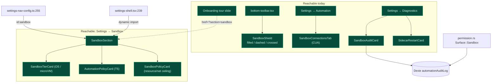

# Observability & UI

<Status variant="beta" />

<TLDR>
  All five sandbox surfaces are **shipped and reachable**: the composer **shield** indicator (3
  states), the **Diagnostics** audit-log + sidecar-restart cards, the **Automation → Sandboxes** tab
  (CUA), the **onboarding** tour slide, and the dedicated **Settings → Sandbox** section
  (health/retry + enable toggle + tier picker + resource/network ceiling editor + T5 policy editor),
  registered in the nav (`settings-nav-config.ts`) and rendered by `settings-shell.tsx`. This page
  maps each surface to its source.
</TLDR>

## Surface map



## Composer shield — shipped & wired

`components/chat/composer/sandbox-shield.tsx` renders a 3-state indicator with **shape paired to
colour** for colour-blind safety, mounted in `bottom-toolbar.tsx:101`. State comes from a pure
precedence resolver (session → character → app settings):

```ts title="components/chat/composer/sandbox-shield.tsx:34-46"
export function resolveShieldState(args: {
  session: ChatSession | null | undefined
  characterSandboxEnabled?: boolean
  characterSandboxTier?: "os" | "microvm"
  defaultEnabled?: boolean
  defaultTier?: "os" | "microvm"
}): ShieldState {
  const enabled =
    args.session?.sandboxEnabled ?? args.characterSandboxEnabled ?? args.defaultEnabled ?? false
  if (!enabled) return "off"
  const tier = args.characterSandboxTier ?? args.defaultTier ?? "os"
  return tier
}
```

- filled emerald `Shield` — sandbox on, OS tier
- dashed sky `Shield` (`[stroke-dasharray:3_2]`) — sandbox on, microVM tier
- crossed muted `ShieldOff` — sandbox off (today's default)

The health for this badge comes from `hooks/sandbox/use-sandbox-health.ts:useSandboxHealth`, which
polls the `sandbox_health_probe` Tauri command every 5 s and tolerates both `last_error` (snake) and
`lastError` (camel) shapes from serde.

## Diagnostics — shipped & wired

`components/settings/sections/diagnostics-section.tsx` mounts two ADR-0028 cards:

- **`SandboxAuditCard`** — reads the Dexie `automationAuditLog`, filters
  `row.surface === "sandbox"` (`sandbox-audit-card.tsx:39`), and shows the newest 50 rows with
  allow/deny/error colouring + duration.
- **`SidecarRestartCard`** — polls the `sidecar_restart_count` IPC every 5 s, showing the count and
  last-restart stamp.

The audit data originates in Rust: the `Surface` enum carries a `Sandbox` variant
(`src-tauri/src/automation/permission.rs:53`), and `sandbox_exec` records an `AuditEntry` for every
call (see [Execution overview](./execution-overview)).

## Automation → Sandboxes tab (CUA) — shipped & wired

`components/settings/automation/sandbox-connections-tab.tsx` is the registry UI for the CUA Docker
sandboxes (the only sandbox UI a user can currently reach via a dedicated tab). It is mounted in
`automation-section.tsx` — the `TabId` union includes `"sandboxes"` (line 77), with
`<TabsContent value="sandboxes"><SandboxConnectionsTab /></TabsContent>` (lines 131-133). Lifecycle
buttons are disabled in web mode (`isTauri()`). See [CUA remote sandbox](./cua-remote-sandbox).

## Onboarding tour slide — shipped

`components/shell/onboarding-dialog.tsx` puts sandbox first in the tour slides
(`TOUR_SLIDES[0]`, lines 61-64). The slide's CTA links to `/settings?section=sandbox`:

```ts title="components/shell/onboarding-dialog.tsx:61-64"
{ id: "sandbox", icon: ShieldCheckIcon, href: "/settings?section=sandbox" }
```

<Callout type="info">
  That href points at `?section=sandbox`, which now resolves — the section is registered in
  `settings-nav-config.ts` and rendered by `settings-shell.tsx` (see below). The deep-link works.
</Callout>

## Settings → Sandbox section — wired

`components/settings/sandbox/` ships a complete, tested section, reachable at **Settings → Sandbox**
(`?section=sandbox`):

- **`sandbox-section.tsx`** — `SandboxSection`: a health card with a tri-state badge driven by
  `useSandboxHealth()` and a "Run health probe" button (`data-testid="sandbox-retry-button"`),
  composing the cards below.
- **`sandbox-enable-card.tsx`** — the default / per-session sandbox enable toggle.
- **`sandbox-tier-card.tsx`** — the default-tier picker (OS / microVM radio group), writing
  `AppSettings.sandboxTier`.
- **`sandbox-policy-card.tsx`** — the resource/network **ceiling** editor (writable roots, CPU /
  memory caps, network policy) that the model can only narrow, never widen.
- **`automation-policy-card.tsx`** — the **T5** per-action policy editor: `allowedProcessNames`,
  `allowedWindowTitlePatterns` (regex), `allowedUrlPatterns` (regex), `forbiddenScreenRegions`
  (x/y/w/h), debounced-saved via `saveAutomationPolicy`.

How it is wired:

- `settings-shell.tsx:239` `dynamic()`-imports `SandboxSection`; the `case "sandbox"` render branch
  is at `settings-shell.tsx:516`.
- `settings-nav-config.ts:255` registers the `id: "sandbox"` NavItem (group `ai`, `desktopOnly`).
- The onboarding deep-link (`/settings?section=sandbox`) therefore resolves.

## i18n namespaces

Sandbox strings (≈45 keys in `i18n/messages/en.json`, mirrored in `zh-CN.json`) span:
`chat.composer.sandboxShield.*` (shield labels/tooltips), `settings.sandbox.*` (the section,
incl. `.tier.*` + `.automationPolicy.*` + `.policy.*`), `settings.diagnostics.sandboxAudit.*` +
`settings.diagnostics.sidecarRestart.*`, `characters.…sandbox.*` (per-character enable + tier),
`onboarding.tour.sandbox.*`, and `automation.sandboxConnections.*` + `automation.tabs.sandboxes`.

## Status summary

| Surface                                            | ADR        | Status                                            |
| -------------------------------------------------- | ---------- | ------------------------------------------------- |
| Composer shield (3-state)                          | 0028       | Shipped & wired                                   |
| Automation → Sandboxes tab (CUA)                   | 0020       | Shipped & wired                                   |
| Diagnostics: sandbox audit + sidecar restart       | 0028 P14   | Shipped & wired; Rust `Surface::Sandbox` exists   |
| Onboarding sandbox tour slide                      | 0028       | Shipped & wired; deep-link resolves               |
| Settings → Sandbox (health/retry, tier, ceiling, T5) | 0028 P7/P9 | Shipped & wired (`settings-nav-config.ts:255`)  |

## Next

<Cards>
  <Card title="Execution overview" href="./execution-overview" description="The audit + strict-mode policy behind these surfaces" />
  <Card title="CUA remote sandbox" href="./cua-remote-sandbox" description="What the Sandboxes tab manages" />
  <Card title="OS backends (T1)" href="./os-backends" description="The health string the badge reads" />
</Cards>
