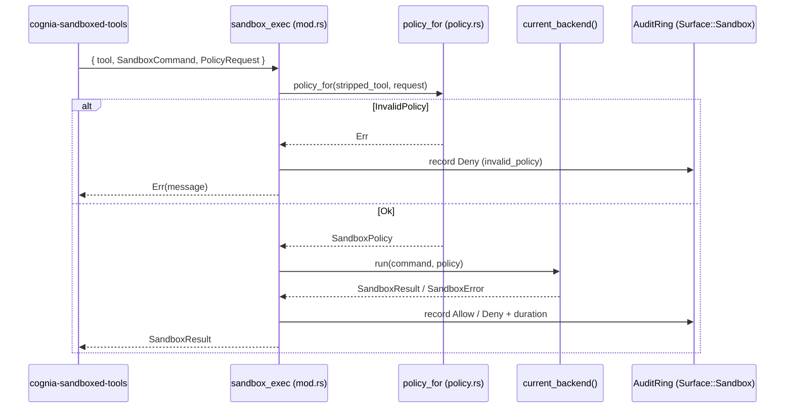

# OS backends (T1)

<Status variant="beta" />

<TLDR>
  `src-tauri/src/sandbox/` is the Tier-1 OS execution sandbox. The `sandbox_exec` Tauri command
  derives a `SandboxPolicy` from the tool name via `policy.rs:policy_for`, selects a per-platform
  backend via `current_backend()`, and runs the command under that backend. **Linux (`bwrap`) and
  macOS (`sandbox-exec`) are real, working backends**; **Windows is partial** (a two-binary
  `runas`-based runner, with the deeper restricted-token vendoring still pending). Both Tauri commands
  are registered (`lib.rs:349-350`).
</TLDR>

## The trait — `traits.rs`

Every backend implements one async trait. `health()` is live today (polled by the Settings tab);
`run()` / `first_time_setup()` are consumed by the dispatcher.

```rust title="src-tauri/src/sandbox/traits.rs:19-43"
#[async_trait]
pub trait SandboxedExec: Send + Sync {
    async fn run(
        &self,
        command: SandboxCommand,
        policy: SandboxPolicy,
    ) -> Result<SandboxResult, SandboxError>;
    /// Renderer polls this for the Settings → Sandbox status badge; the
    /// strict-mode policy then refuses tool calls when this is false.
    fn is_available(&self) -> bool;
    async fn first_time_setup(&self) -> Result<(), SandboxError>;
    fn health(&self) -> SandboxHealth;
}
```

## The data model — `types.ts`

`types.rs` holds the platform-agnostic shapes. A `SandboxPolicy` is a tagged enum keyed on the tool
(`Bash` / `Edit` / `Write` / `TextEditor`); the network policy is its own tagged enum.

| Type             | Location                 | Notes                                                                 |
| ---------------- | ------------------------ | --------------------------------------------------------------------- |
| `SandboxCommand` | `types.rs:27-54`         | `argv`, `cwd`, `env: BTreeMap`, `stdin`, `timeout` (serialized as secs) |
| `NetworkPolicy`  | `types.rs:60-79`         | `Off` (default) · `Allowlist { hosts }` · `On`                        |
| `SandboxPolicy`  | `types.rs:84-129`        | `Bash { writable, readable, network, max_cpu_seconds, max_memory_mb }` · `Edit`/`Write`/`TextEditor { target_files, readable }` |
| `SandboxResult`  | `types.rs:134-148`       | `exit_code`, `stdout`, `stderr`, `duration`, `timed_out`              |
| `SandboxError`   | `types.rs:153-181`       | `Unavailable` · `SetupRequired` · `InvalidPolicy` · `BackendFailed` · `Timeout` |
| `SandboxHealth`  | `types.rs:186-202`       | `available`, `backend`, `version`, `last_error`                       |

```rust title="src-tauri/src/sandbox/types.rs:60-73"
#[serde(tag = "kind", rename_all = "snake_case")]
pub enum NetworkPolicy {
    Off,
    Allowlist {
        #[serde(default)]
        hosts: Vec<String>,
    },
    On,
}
```

<Callout type="info">
  The doc-comment at `types.rs:191` still says the Windows backend string is `"windows-codex"`. The
  **live** string emitted by the Windows backend is `"windows-cognia-sandbox"` (`windows.rs:191`) —
  the comment is stale.
</Callout>

## The policy resolver — `policy.rs`

`policy_for` is a pure, no-I/O function that turns the stripped tool name plus a caller-supplied
`PolicyRequest` into a `SandboxPolicy`. It applies bash defaults, rejects an empty writable set, and
validates the network shape.

```rust title="src-tauri/src/sandbox/policy.rs:55-79 (bash branch)"
"bash" => {
    let network = parse_network(req.network.as_deref(), req.network_hosts)?;
    let (default_cpu, default_mem) = bash_defaults();
    let cpu = if req.max_cpu_seconds == 0 { default_cpu } else { req.max_cpu_seconds };
    let mem = if req.max_memory_mb == 0 { default_mem } else { req.max_memory_mb };
    if req.writable.is_empty() {
        return Err(SandboxError::InvalidPolicy {
            reason: "bash policy needs at least one writable dir (cwd)".into(),
        });
    }
    Ok(SandboxPolicy::Bash { writable: req.writable, readable: req.readable, network,
        max_cpu_seconds: cpu, max_memory_mb: mem })
}
```

- `bash_defaults()` (`policy.rs:45-47`) → `(300, 2048)` — 5 min CPU, 2 GB memory.
- `parse_network` (`policy.rs:109-125`) maps `"off" | "on" | "allowlist"`; `allowlist` with an empty
  host list is rejected as `InvalidPolicy`.
- Edit / Write / TextEditor reject an empty `target_files` set; an unknown tool is `InvalidPolicy`.

## Dispatch — `mod.rs`

`sandbox_exec` (`mod.rs:87-159`) is the Tauri entry point the `cognia-sandboxed-tools` plugin calls
through the renderer. It derives the policy, dispatches to `current_backend().run(...)`, and records
the outcome to the audit ring as `Surface::Sandbox`.

```rust title="src-tauri/src/sandbox/mod.rs:40-59 (backend selection)"
pub fn current_backend() -> Arc<dyn SandboxedExec> {
    #[cfg(target_os = "windows")]
    { Arc::new(windows::WindowsSandboxBackend::new()) }
    #[cfg(target_os = "macos")]
    { Arc::new(macos::MacOsSandboxBackend::new()) }
    #[cfg(target_os = "linux")]
    { Arc::new(linux::LinuxSandboxBackend::new(None)) }
    #[cfg(not(any(target_os = "windows", target_os = "macos", target_os = "linux")))]
    { Arc::new(UninstalledSandboxBackend::new()) }
}
```

```rust title="src-tauri/src/sandbox/mod.rs:66-69 (read-only health probe)"
#[tauri::command]
pub async fn sandbox_health_probe() -> Result<SandboxHealth, String> {
    Ok(current_backend().health())
}
```

<Callout type="warn">
  The header comment in `mod.rs:11-15` claims `sandbox_exec` "stays UNREGISTERED until Phase 4.2+".
  That comment is **stale** — both `sandbox::sandbox_health_probe` and `sandbox::sandbox_exec` are
  registered in `lib.rs:349-350` today.
</Callout>



## Per-platform backends

### Linux — `bwrap` (real)

`LinuxSandboxBackend` resolves a `bwrap` binary (bundled at `<resource_dir>/bwrap/bwrap` first, else
`$PATH`) and actually spawns it with namespace + bind flags, piping stdin and enforcing the timeout.

```rust title="src-tauri/src/sandbox/linux.rs:231-247 (isolation baseline)"
args.push("--unshare-user".into());
args.push("--unshare-pid".into());
args.push("--unshare-ipc".into());
args.push("--unshare-uts".into());
args.push("--die-with-parent".into());
let ro_system = ["/usr", "/lib", "/lib64", "/etc/ld.so.cache", "/etc/ld.so.conf", "/etc/alternatives"];
// each existing path is added as --ro-bind <p> <p>
args.push("--proc".into());  args.push("/proc".into());
args.push("--dev".into());   args.push("/dev".into());
args.push("--tmpfs".into()); args.push("/tmp".into());
```

```rust title="src-tauri/src/sandbox/linux.rs:314-328 (network → namespace flag)"
NetworkPolicy::Off  => args.push("--unshare-net".into()),
NetworkPolicy::On   => args.push("--share-net".into()),
NetworkPolicy::Allowlist { hosts: _ } => {
    // bwrap cannot do host-level allowlists; renderer pre-filters URLs.
    args.push("--share-net".into());
}
```

- `health().backend == "linux-bwrap"`; `version` is `"bundled"` / `"system"` / empty.
- Edit/Write/TextEditor `--bind` each **target file individually** (not the parent dir) and force
  `NetworkPolicy::Off`.
- **Caveat:** `max_cpu_seconds` / `max_memory_mb` are accepted but **not** translated into
  cgroup/rlimit flags yet.

### macOS — `sandbox-exec` (real)

`MacOsSandboxBackend` renders an SBPL profile per policy and runs
`/usr/bin/sandbox-exec -p '<profile>' -- <argv>`.

```rust title="src-tauri/src/sandbox/macos.rs:271-289 (network in SBPL)"
NetworkPolicy::Off => out.push_str("(deny network*)\n"),
NetworkPolicy::On  => out.push_str("(allow network*)\n"),
NetworkPolicy::Allowlist { hosts: _ } =>
    out.push_str("(allow network*) ;; allowlist requested; macOS degrades to On\n"),
```

- `health().backend == "macos-sandbox-exec"`, `version == "system"`.
- Edit/Write/TextEditor allow `(literal "<file>")` writes only — a single file, never a subtree.
- **Caveat:** allowlist degrades to full network at the SBPL layer (the renderer is the real host
  gate); resource caps are not enforced via SBPL.

### Windows — two binaries (partial / vendor pending)

`WindowsSandboxBackend` composes two shipped binaries: `cognia-sandbox-setup.exe` (UAC-elevated,
idempotent — creates the synthetic users `CogniaSandboxOffline` / `CogniaSandboxOnline` and the
per-SID firewall rules, then writes a marker file) and `cognia-sandbox-runner.exe` (non-elevated —
relaunches the argv under the synthetic user). `run()` is marker-gated; a fresh machine reports
`SetupRequired` until setup runs.

```rust title="src-tauri/src/sandbox/windows.rs:86-99 (online tier only for networked policies)"
let network = match policy {
    SandboxPolicy::Bash { network, .. } => network,
    SandboxPolicy::Edit { .. } | SandboxPolicy::Write { .. }
    | SandboxPolicy::TextEditor { .. } => &NetworkPolicy::Off,
};
match network {
    NetworkPolicy::Off => OFFLINE_USER,
    NetworkPolicy::On | NetworkPolicy::Allowlist { .. } => ONLINE_USER,
}
```

```rust title="src-tauri/src/bin/cognia-sandbox-runner.rs:87-100 (runas restricted relaunch)"
let mut runas_args = vec![
    format!("/user:{}", input.target_user),
    "/trustlevel:0x20000".to_string(),
];
let quoted = input.argv.iter()
    .map(|a| format!("\"{}\"", a.replace('"', "\\\"")))
    .collect::<Vec<_>>().join(" ");
runas_args.push(format!("cmd /c {quoted}"));
```

<Callout type="warn">
  Windows is the least complete backend. Known gaps: `health().backend == "windows-cognia-sandbox"`
  and `is_available()` is purely marker-file presence; the runner uses the shallow
  `runas /trustlevel:0x20000` mechanism (the deeper restricted-token + `CreateProcessAsUser`
  vendoring from `codex-rs/windows-sandbox-rs` is still pending); the runner **does not capture child
  stdout/stderr** (`cognia-sandbox-runner.rs:114-116`); and `grant_logon_as_batch` in the setup
  binary is a no-op note (`cognia-sandbox-setup.rs:133-145`).
</Callout>

### Fallback + test double

- `UninstalledSandboxBackend` (`uninstalled.rs`) — honest "no backend": `run` always `Unavailable`,
  `first_time_setup` `SetupRequired`, `health().backend == "uninstalled-<os>"`. Used on non-tier-1
  OSes.
- `MockSandboxBackend` (`mock.rs`) — records every `(command, policy)` for assertions, returns a
  canned result (LIFO override via `set_next_result`); `health().backend == "mock"`.

## Implementation-status summary

| Backend     | `health().backend` (live) | State                  | Real OS exec?                                                                 |
| ----------- | ------------------------- | ---------------------- | ---------------------------------------------------------------------------- |
| Linux       | `linux-bwrap`             | Real                   | Yes — resolves + execs `bwrap` under namespaces/timeout. Caps not enforced.  |
| macOS       | `macos-sandbox-exec`      | Real                   | Yes — execs `/usr/bin/sandbox-exec` with rendered SBPL. Allowlist → On.      |
| Windows     | `windows-cognia-sandbox`  | Partial / vendor-pending | Yes-but-shallow — `runas /trustlevel`; no stdout capture; marker-gated.     |
| Uninstalled | `uninstalled-<os>`        | Deny stub              | No — always Unavailable / SetupRequired.                                     |
| Mock        | `mock`                    | Test fixture           | No — records calls, canned results.                                          |

## Tests

In-file `#[cfg(test)]` suites cover the pure + observable surface without requiring a real sandbox at
unit time: `policy.rs:127-276` (11 tests on defaults, empty-writable rejection, network parsing),
`types.rs:227-285` (serde round-trips + tagged discriminators), `linux.rs:331-435` (argv baseline,
per-file binds, share-net, backend string), `macos.rs:299-374` (SBPL rendering, literal vs subpath,
escaping), `windows.rs:240-386` (marker gating, offline/online user selection, payload shape),
`uninstalled.rs:85-159`, `mock.rs:126-201`. Real-sandbox integration runs via
`cargo test --test sandbox_integration` on Linux + macOS (the Windows runner is skipped under CI —
UAC).

## Next

<Cards>
  <Card title="Sandboxed tools" href="./sandboxed-tools" description="The plugin that calls sandbox_exec" />
  <Card title="Execution overview" href="./execution-overview" description="How the sandbox is turned on" />
  <Card title="Observability & UI" href="./observability-and-ui" description="The health badge + audit log" />
</Cards>
