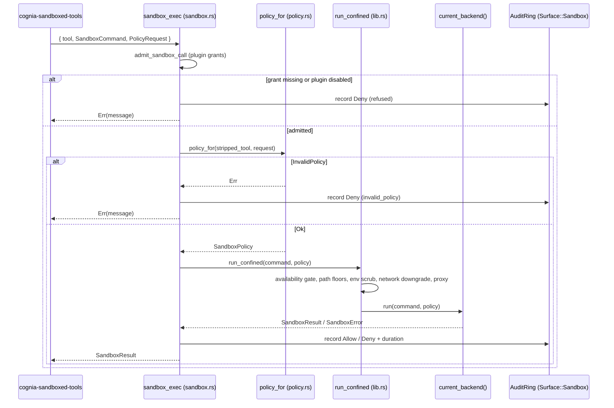

# OS backends (T1)

<Status variant="beta" />

<TLDR>
  `crates/cognia-exec-sandbox/` is the Tier-1 OS execution sandbox. It left `cognia-automation` in
  ADR-0196 so the terminal and the Python plugin host could reach it without linking the
  UI-automation stack. The `sandbox_exec` Tauri command (still in
  `crates/cognia-automation/src/sandbox.rs`) checks the plugin's grants, derives a `SandboxPolicy`
  from the tool name via `policy.rs:policy_for`, and hands off to `run_confined`, which selects a
  per-platform backend via `current_backend()`. **Linux (`bwrap`), macOS (`sandbox-exec`), and
  Windows (`cognia-sandbox-runner.exe`) are real backends**. The Windows runner is the bundled
  restricted-token + low-integrity + Job Object crate and captures stdout/stderr through its JSON
  contract. All three Tauri commands are registered (`src-tauri/src/lib.rs:762-764`). The Tauri
  command is not the only door: `cognia-sandbox-exec` calls the same `run_confined` for hosts
  without Tauri IPC, which is how the CLI and the headless brain reach the tier at all.
</TLDR>

## The trait — `traits.rs`

Every backend implements one async trait. `health()` is live today (polled by the Settings tab);
`probe_confinement()` is the on-demand active check behind `sandbox_health_check`; `run()` /
`first_time_setup()` are consumed by the dispatcher.

```rust title="crates/cognia-exec-sandbox/src/traits.rs:49-200 (abridged)"
#[async_trait]
pub trait SandboxedExec: Send + Sync {
    async fn run(
        &self,
        command: SandboxCommand,
        policy: SandboxPolicy,
    ) -> Result<SandboxResult, SandboxError>;
    /// Renderer polls this for the Settings → Sandbox status badge; the
    /// strict-mode policy then refuses tool calls when this is false.
    fn is_available(&self) -> bool;
    async fn first_time_setup(&self) -> Result<(), SandboxError>;
    fn health(&self) -> SandboxHealth;
    /// Runs real commands in the sandbox and checks confinement is enforced.
    async fn probe_confinement(&self) -> ProbeReport { /* default body */ }
}
```

## The data model — `types.rs`

`types.rs` holds the platform-agnostic shapes. A `SandboxPolicy` is a tagged enum keyed on the tool
(`Bash` / `Edit` / `Write` / `TextEditor`); the network policy is its own tagged enum.

| Type             | Location           | Notes                                                                 |
| ---------------- | ------------------ | --------------------------------------------------------------------- |
| `SandboxCommand` | `types.rs:29-58`   | `argv`, `cwd`, `env: BTreeMap`, `stdin`, `timeout` (serialized as secs) |
| `NetworkPolicy`  | `types.rs:67-79`   | `Off` (default) · `Allowlist { hosts }` · `On`                        |
| `SandboxPolicy`  | `types.rs:86-139`  | `Bash { writable, readable, network, max_cpu_seconds, max_memory_mb, max_processes }` · `Edit`/`Write`/`TextEditor { target_files, readable }` |
| `SandboxResult`  | `types.rs:144-163` | `exit_code`, `stdout`, `stderr`, `duration`, `timed_out`, `stdout_truncated`, `stderr_truncated` |
| `SandboxError`   | `types.rs:170-197` | `Unavailable` · `SetupRequired` · `InvalidPolicy` · `BackendFailed` · `Timeout` |
| `SandboxHealth`  | `types.rs:203-218` | `available`, `backend`, `version`, `last_error`                       |
| `ProbeReport`    | `types.rs:227-236` | `backend`, `confined`, `detail` — the result of `probe_confinement`   |

```rust title="crates/cognia-exec-sandbox/src/types.rs:66-79"
#[serde(tag = "kind", rename_all = "snake_case")]
pub enum NetworkPolicy {
    Off,
    Allowlist {
        #[serde(default)]
        hosts: Vec<String>,
    },
    On,
}
```

## The policy resolver — `policy.rs`

`policy_for` is a pure, no-I/O function that turns the stripped tool name plus a caller-supplied
`PolicyRequest` into a `SandboxPolicy`. It applies bash defaults, rejects an empty writable set, and
validates the network shape.

```rust title="crates/cognia-exec-sandbox/src/policy.rs:68-99 (bash branch)"
"bash" => {
    let network = parse_network(req.network.as_deref(), req.network_hosts)?;
    let (default_cpu, default_mem) = bash_defaults();
    let cpu = if req.max_cpu_seconds == 0 { default_cpu } else { req.max_cpu_seconds };
    let mem = if req.max_memory_mb == 0 { default_mem } else { req.max_memory_mb };
    let processes = if req.max_processes == 0 { BASH_DEFAULT_MAX_PROCESSES } else { req.max_processes };
    if req.writable.is_empty() {
        return Err(SandboxError::InvalidPolicy {
            reason: "bash policy needs at least one writable dir (cwd)".into(),
        });
    }
    Ok(SandboxPolicy::Bash { writable: req.writable, readable: req.readable, network,
        max_cpu_seconds: cpu, max_memory_mb: mem, max_processes: processes })
}
```

- `bash_defaults()` (`policy.rs:51-53`) → `(300, 2048)` — 5 min CPU, 2 GB memory.
- `BASH_DEFAULT_MAX_PROCESSES` (`policy.rs:60`) → `512`, the same bound the container tiers apply.
- `parse_network` (`policy.rs:128-144`) maps `"off" | "on" | "allowlist"`; `allowlist` with an empty
  host list is rejected as `InvalidPolicy`.
- Edit / Write / TextEditor reject an empty `target_files` set; an unknown tool is `InvalidPolicy`.

## Dispatch — `sandbox.rs` and `run_confined`

`sandbox_exec` (`crates/cognia-automation/src/sandbox.rs:153-278`) is the Tauri entry point the
`cognia-sandboxed-tools` plugin calls through the renderer. It first checks the plugin's
`native:filesystem` and `native:process` grants with `admit_sandbox_call` (`sandbox.rs:115`), then
derives the policy and calls `run_confined` (`crates/cognia-exec-sandbox/src/lib.rs:374-420`). It
records the outcome to the audit ring as `Surface::Sandbox`.

`run_confined` is the one confined-execution path every Rust caller goes through. In order, it
enforces the backend-availability gate (fail closed with `SetupRequired`), canonicalizes every path and
applies the forbidden-writable and forbidden-readable floors, scrubs code-injection environment
variables, downgrades a network the platform cannot enforce, and starts the filtering proxy for an
enforceable allowlist. Only then does it call `current_backend().run(...)`.

```rust title="crates/cognia-exec-sandbox/src/lib.rs:56-75 (backend selection)"
pub fn current_backend() -> Arc<dyn SandboxedExec> {
    #[cfg(target_os = "windows")]
    { Arc::new(windows::WindowsSandboxBackend::new()) }
    #[cfg(target_os = "macos")]
    { Arc::new(macos::MacOsSandboxBackend::new()) }
    #[cfg(target_os = "linux")]
    { Arc::new(linux::LinuxSandboxBackend::new(None)) }
    #[cfg(not(any(target_os = "windows", target_os = "macos", target_os = "linux")))]
    { Arc::new(UninstalledSandboxBackend::new()) }
}
```

```rust title="crates/cognia-automation/src/sandbox.rs:20-23 (read-only health probe)"
#[cfg_attr(feature = "tauri-host", tauri::command)]
pub async fn sandbox_health_probe() -> Result<SandboxHealth, String> {
    Ok(current_backend().health())
}
```


```mermaid
sequenceDiagram
  participant Plugin as cognia-sandboxed-tools
  participant Cmd as sandbox_exec (sandbox.rs)
  participant Pol as policy_for (policy.rs)
  participant Run as run_confined (lib.rs)
  participant Back as current_backend()
  participant Audit as AuditRing (Surface::Sandbox)

  Plugin->>Cmd: { tool, SandboxCommand, PolicyRequest }
  Cmd->>Cmd: admit_sandbox_call (plugin grants)
  alt grant missing or plugin disabled
    Cmd->>Audit: record Deny (refused)
    Cmd-->>Plugin: Err(message)
  else admitted
    Cmd->>Pol: policy_for(stripped_tool, request)
    alt InvalidPolicy
      Pol-->>Cmd: Err
      Cmd->>Audit: record Deny (invalid_policy)
      Cmd-->>Plugin: Err(message)
    else Ok
      Pol-->>Cmd: SandboxPolicy
      Cmd->>Run: run_confined(command, policy)
      Run->>Run: availability gate, path floors, env scrub, network downgrade, proxy
      Run->>Back: run(command, policy)
      Back-->>Cmd: SandboxResult / SandboxError
      Cmd->>Audit: record Allow / Deny + duration
      Cmd-->>Plugin: SandboxResult
    end
  end
```

## Per-platform backends

### Linux — `bwrap` (real)

`LinuxSandboxBackend` resolves a `bwrap` binary and actually spawns it with namespace + bind flags,
piping stdin and enforcing the timeout. The backend can prefer a bundled
`<resource_dir>/bwrap/bwrap`, but `current_backend()` passes no resource dir yet, so in practice it
uses the system `bwrap` on `$PATH`.

```rust title="crates/cognia-exec-sandbox/src/linux.rs:554-592 (isolation baseline, abridged)"
args.push("--unshare-user".into());
args.push("--unshare-pid".into());
args.push("--unshare-ipc".into());
args.push("--unshare-uts".into());
args.push("--die-with-parent".into());
// Detach the controlling terminal so the child cannot TIOCSTI into it.
args.push("--new-session".into());
// bwrap installs the compiled syscall filter on the child right before exec.
if let Some(fd) = seccomp_fd { args.push("--seccomp".into()); args.push(fd.to_string()); }
let ro_system = ["/usr", "/bin", "/sbin", "/lib", "/lib64", "/opt", "/etc"];
// each existing path is added as --ro-bind <p> <p>
args.push("--proc".into());  args.push("/proc".into());
args.push("--dev".into());   args.push("/dev".into());
args.push("--tmpfs".into()); args.push("/tmp".into());
```

```rust title="crates/cognia-exec-sandbox/src/linux.rs:662-682 (network → namespace flag, abridged)"
NetworkPolicy::Off => args.push("--unshare-net".into()),
NetworkPolicy::On  => args.push("--share-net".into()),
NetworkPolicy::Allowlist { hosts: _ } => {
    // Proxy-routed: shares the host network so the command can reach the
    // loopback filtering proxy. Holds only for proxy-respecting clients.
    args.push("--share-net".into());
}
```

- `health().backend == "linux-bwrap"`; `version` is `"bundled"` / `"system"` / empty.
- **An allowlist never reaches `bwrap` from `run_confined`.** The `Allowlist` branch above would
  constrain only clients that honour `HTTP(S)_PROXY`, which is not enforcement. So
  `downgrade_unenforceable_network` (`lib.rs:138-173`) turns a Linux allowlist into
  `NetworkPolicy::Off` first and prints a notice on stderr: the run gets no network rather than an
  unenforced one. Kernel enforcement (an unshared netns plus a unix-socket bridge to the proxy) is
  the documented follow-up.
- Edit/Write/TextEditor `--bind` each **target file individually** (not the parent dir) and force
  `NetworkPolicy::Off`.
- `max_cpu_seconds` / `max_memory_mb` / `max_processes` are resolved by `limits.rs` and applied to
  the `bwrap` process in a `pre_exec` hook (`RLIMIT_CPU`, `RLIMIT_AS`, and `RLIMIT_NPROC`, which the
  user namespace scopes to the sandboxed tree). The limits are inherited across `bwrap`'s exec into
  the sandboxed command; the wall-clock watchdog still remains the default timeout path.

### macOS — `sandbox-exec` (real)

`MacOsSandboxBackend` renders an SBPL profile per policy and runs
`/usr/bin/sandbox-exec -p '<profile>' -- <argv>`.

```rust title="crates/cognia-exec-sandbox/src/macos.rs:545-570 (network in SBPL, abridged)"
NetworkPolicy::Off => out.push_str("(deny network*)\n"),
NetworkPolicy::On  => out.push_str("(allow network*)\n"),
NetworkPolicy::Allowlist { hosts: _ } => match proxy_port {
    // The only reachable endpoint is the loopback filtering proxy.
    Some(port) => push_loopback_proxy_network_rule(out, port),
    // No proxy was provisioned: fail closed instead of opening the network.
    None => out.push_str("(deny network*)\n"),
},
```

- `health().backend == "macos-sandbox-exec"`, `version == "system"`.
- Edit/Write/TextEditor allow `(literal "<file>")` writes only — a single file, never a subtree.
- **Reads are allowed globally, then credential stores are denied again as the last matching
  rules.** This is not a loosening someone chose; it is what makes the sandbox work at all. A
  profile that scopes `file-read*` to a list of system prefixes aborts every confined binary on
  current macOS before it execs — `/bin/echo` under the full prefix set dies with `SIGABRT` —
  because dyld consults runtime files whose locations move across releases. The one-shot backend
  shipped with the narrow list for a while, so `sandbox_bash` returned exit `-1` with no output and
  `sandbox_health_check` reported `confined: false` while the cheap probe still said "Active".
  `sbpl.rs` now owns those rules for both the one-shot and interactive profiles so they cannot
  disagree again, and `push_baseline_secret_read_denies` anchors the deny set at `$HOME` and the app
  data directory rather than at whatever the caller declared readable.
- **An allowlist is kernel-enforced.** `run_confined` starts the filtering proxy (`net_proxy.rs`),
  points `HTTP(S)_PROXY` / `ALL_PROXY` at it and passes its port as `COGNIA_SANDBOX_PROXY_PORT`. The
  profile then allows outbound TCP only to `localhost:<port>` (`sbpl.rs:282-286`), and the proxy
  applies the host allowlist and does DNS and egress itself, so a command that skips the proxy is
  blocked by `(deny default)`. A proxy that cannot bind fails the call with `BackendFailed`.
- **Caveat:** of the resource caps only `RLIMIT_CPU` is applied on macOS, through the shared
  `pre_exec` hook, alongside the wall-clock watchdog. `RLIMIT_AS` is unreliable there and
  `RLIMIT_NPROC` would count every process the login user owns, so both are Linux-only.

### Windows — restricted-token runner (real)

`WindowsSandboxBackend` shells out to the bundled `cognia-sandbox-runner.exe` from
`crates/cognia-sandbox-runner/`. The runner launches the target with a restricted subset of the app's
own token, lowers integrity, assigns the child to a Job Object, and returns captured stdout/stderr in
a JSON result. It does **not** need elevation, separate OS accounts, or a setup marker for filesystem /
privilege / process confinement.

```rust title="crates/cognia-sandbox-runner/src/main.rs (restricted-token launch shape)"
// 1. Duplicate the caller token.
// 2. Create a restricted token and lower integrity.
// 3. Create a Job Object with kill-on-close and optional memory cap.
// 4. Spawn suspended under the restricted token, assign to the job, then resume.
```

`WindowsSandboxBackend::is_available()` now gates on the runner binary resolving next to the app
executable. The legacy `target_user` payload field remains only for JSON compatibility with older
payloads; the restricted-token runner ignores it. `cognia-sandbox-setup.exe` remains only for a
future optional per-SID Firewall follow-up; it is no longer in the critical path.

### Fallback + test double

- `UninstalledSandboxBackend` (`uninstalled.rs`) — honest "no backend": `run` always `Unavailable`,
  `first_time_setup` `SetupRequired`, `health().backend == "uninstalled-<os>"`. Used on non-tier-1
  OSes.
- `MockSandboxBackend` (`mock.rs`) — records every `(command, policy)` for assertions, returns a
  canned result (LIFO override via `set_next_result`); `health().backend == "mock"`.

## The second door — `cognia-sandbox-exec`

`run_confined` is a plain `async fn` with no Tauri parameters, but for a long time its only caller
was a `#[tauri::command]`. That made the tier desktop-only by accident rather than by decision:
`transport.call("sandbox_exec")` resolves to a Tauri `invoke`, so the CLI's stdio transport answered
`unsupported command` and no companion transport carried the name at all. A CLI session still bound
a ceiling and clamped every request against it, which is the shape of a sandbox with nothing behind
it.

`crates/cognia-exec-sandbox/src/bin/cognia-sandbox-exec.rs` is the same dispatcher body without the
Tauri plumbing. It reads one JSON document on stdin and writes one on stdout:

```text
  stdin  {"tool":"bash","command":{...SandboxCommand},"request":{...PolicyRequest}}
  stdout {"ok":true,"result":{...SandboxResult}}
       | {"ok":false,"error":{"kind":"invalid_policy","reason":"..."}}
  --health  {"ok":true,"health":{...SandboxHealth}}   (cheap, no spawn)
  --probe   {"ok":true,"probe":{...ProbeReport}}      (spawns real commands)
```

The request arrives on stdin rather than argv because it carries the caller's environment, which
routinely holds tokens, and argv is world-readable through `ps`. The exit code is 0 whenever an
envelope was produced, including a refusal and including a child that exited non-zero; a non-zero
exit means the protocol failed and stdout may be empty, so a missing envelope must never be read as
"ran fine".

Because it calls the same `run_confined`, a CLI session gets byte-identical confinement rather than
a second implementation: the availability gate, path canonicalization, the forbidden-root floor,
env scrubbing, the unenforceable-network downgrade, the filtering proxy, seccomp, rlimits and output
capping all still happen on the Rust side. The renderer side registers it through
`lib/sandbox/os-exec-bridge`; see [Execution overview](./execution-overview).

## Implementation-status summary

| Backend     | `health().backend` (live) | State                  | Real OS exec?                                                                 |
| ----------- | ------------------------- | ---------------------- | ---------------------------------------------------------------------------- |
| Linux       | `linux-bwrap`             | Real                   | Yes — resolves + execs `bwrap` under namespaces/timeout + opt-in rlimits. Allowlist → no network. |
| macOS       | `macos-sandbox-exec`      | Real                   | Yes — execs `/usr/bin/sandbox-exec` with rendered SBPL. Allowlist → kernel-pinned to the filtering proxy. |
| Windows     | `windows-cognia-sandbox`  | Real                   | Yes — bundled restricted-token + low-integrity + Job Object runner captures stdout/stderr. |
| Uninstalled | `uninstalled-<os>`        | Deny stub              | No — always Unavailable / SetupRequired.                                     |
| Mock        | `mock`                    | Test fixture           | No — records calls, canned results.                                          |

The forbidden-writable floor compares a **canonicalized** candidate against its deny roots, so those
roots carry their symlink-resolved spelling too. On macOS `/etc` is `private/etc` and `/var` is
`private/var`, and without the resolved twin a request naming `/etc` or `/var/run` as a writable
root passed the floor while `/usr` and `/bin` (real directories there) were correctly refused.

## Tests

In-file `#[cfg(test)]` suites in `crates/cognia-exec-sandbox/src/` cover the pure + observable
surface without requiring a real sandbox at unit time (`cargo test -p cognia-exec-sandbox`):
`policy.rs:146-307` (12 tests on defaults, empty-writable rejection, network parsing),
`types.rs:261-320` (serde round-trips + tagged discriminators), `linux.rs:684-1218` (argv baseline,
per-file binds, share-net, resource-limit resolution, backend string), `macos.rs:577-1006` (SBPL
rendering, literal vs subpath, escaping, the proxy-port pin), `windows.rs:358-557` (runner
availability, compatibility payload shape, stdout/stderr JSON parsing), `uninstalled.rs:89-167`,
`mock.rs:127-267`, and `traits.rs`, which drives `probe_confinement` against a scripted backend.
Real-sandbox integration runs via `cargo test -p cognia-next --test sandbox_integration`
(`src-tauri/tests/sandbox_integration.rs`) on Linux + macOS; the Windows runner crate is covered by
its own unit tests.

## Next

<Cards>
  <Card title="Sandboxed tools" href="./sandboxed-tools" description="The plugin that calls sandbox_exec" />
  <Card title="Execution overview" href="./execution-overview" description="How the sandbox is turned on" />
  <Card title="Observability & UI" href="./observability-and-ui" description="The health badge + audit log" />
</Cards>
