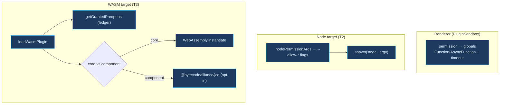

# Plugin isolation

<Status variant="beta" />

<TLDR>
  Three layers confine plugin code. `lib/plugin/core/sandbox.ts:PluginSandbox` is the shipped
  renderer-side isolation: it maps each `PluginPermission` to a concrete allowed global, wraps
  `console` / `setTimeout` / `fetch` / `localStorage`, and runs plugin code through a `Function` /
  `AsyncFunction` with explicit args and a timeout. **T2** (`launchPluginJs.ts`) translates a
  manifest's permissions into Node 24 `--permission` flags for re-execing Node-target plugins.
  **T3** (`wasm-runtime.ts`) loads WASM plugins under a runtime whose preopens come from the Dexie
  grant ledger. T2 is reached through `PluginLoader`/`PluginManager` for Node-target frontend
  plugins, and T3 reconciles manifest preopens before load plus revalidates them before every call.
</TLDR>

## Renderer isolation — `PluginSandbox`

`PluginSandbox` is constructed with the plugin id, its `PluginPermission[]`, and optional
timeout/memory caps. It derives an allow-set and a set of sandboxed globals once, in the constructor.

### Permission → API mapping

A base set of safe globals is always allowed; permissions widen the set:

```ts title="lib/plugin/core/sandbox.ts:75-103 (permission-gated APIs)"
for (const permission of permissions) {
  switch (permission) {
    case "network:fetch":
      allowed.add("fetch"); allowed.add("Headers"); allowed.add("Request"); allowed.add("Response")
      break
    case "network:websocket":
      allowed.add("WebSocket")
      break
    case "clipboard:read":
    case "clipboard:write":
      allowed.add("navigator.clipboard")
      break
    case "notification":
      allowed.add("Notification")
      break
    case "database:read":
    case "database:write":
      allowed.add("indexedDB")
      break
  }
}
```

The sandboxed globals are real wrappers, not the raw browser APIs:

- **console** — prefixed with `[Plugin:<id>]` and routed to the plugin logger (`sandbox.ts:137-149`).
- **setTimeout** — clamped to the configured max (default 30 s) (`sandbox.ts:151-158`).
- **setInterval** — floored at 100 ms to prevent CPU abuse (`sandbox.ts:160-167`).
- **fetch** — stamps an `X-Plugin-Id` header on every request (`sandbox.ts:169-185`).
- **localStorage** — namespaced to `plugin:<id>:` with per-key read/write permission checks
  (`sandbox.ts:187-214`).

### Code execution

Plugin code runs through a `Function` (or `AsyncFunction`) built with explicit argument names so the
plugin can only see the globals it was granted — no ambient scope:

```ts title="lib/plugin/core/sandbox.ts:223-241 (sync execute)"
execute<T>(code: string, context: Record<string, unknown> = {}): T {
  const safeContext = { ...this.sandboxedGlobals, ...context }
  const argNames = Object.keys(safeContext)
  const argValues = Object.values(safeContext)
  try {
    const fn = new Function(...argNames, `"use strict"; return (${code})`)
    return fn(...argValues) as T
  } catch (error) {
    throw new Error(`Plugin sandbox execution error: ${error}`)
  }
}
```

`executeAsync` (`sandbox.ts:246-273`) adds a `Promise.race` against an "Execution timeout" reject.
`executeCode(language, code)` (`sandbox.ts:301-318`) requires the `sandbox:web-execute` permission and
delegates to the web sandbox service — which is a stub today (see [microVM & Web](./microvm-and-web)).

<Callout type="info">
  `PluginSandbox` is a **soft** isolation layer: `Function`-based evaluation, permission-gated
  globals, namespaced storage. It is the in-renderer line of defence and composes with T1 — even if a
  plugin spawns a shell, the SDK builtin `Bash` is denied in sandbox-enabled sessions and the call
  routes through the `sandbox_*` tools.
</Callout>

## T2 — Node `--permission` re-exec

`lib/plugin/launcher/launchPluginJs.ts` translates a permission scope into Node 24 `--allow-*` flags
for re-execing a plugin's JS entry. Empty lists OMIT the flag (fail-safe deny), never `*`.

```ts title="lib/plugin/launcher/launchPluginJs.ts:91-112"
export function nodePermissionArgs(scope: NodePermissionScope): string[] {
  const args: string[] = ["--permission"]
  // Network and subprocess scopes fail closed via host-broker errors; Node 24
  // has no scoped host flag and child-process permission is all-or-nothing.
  if (scope.readPaths.length > 0) args.push(`--allow-fs-read=${scope.readPaths.join(",")}`)
  if (scope.writePaths.length > 0) args.push(`--allow-fs-write=${scope.writePaths.join(",")}`)
  return args
}
```

`buildLaunchArgv(entryPath, scope, extraArgs)` returns the full argv passed to
`child_process.spawn("node", argv)`. `deriveScopeFromManifest` is conservative: a declared
permission category with no concrete paths yields an empty list, so the filesystem flag is omitted
entirely. `PluginLoader.loadFrontendModule()` detects Node-target frontend plugins (`engines.node`
or `runtimeCompatibility.tauri.entrypoint === "node"`), derives the scope from `permissions` +
`fileScope`, calls `launchPluginJs()` on activate, and kills the child on deactivate/unload through
the normal `PluginManager` lifecycle.

<Callout type="info">
  Node's permission model confines the entry process. Shell-like work and network egress that needs
  host allowlist enforcement must go through brokered host APIs; the Node launcher never emits `*`,
  never emits unsupported `--allow-net`, and never widens subprocess access into
  `--allow-child-process`.
</Callout>

## T3 — Wasmtime / WASI runtime

`lib/plugin/core/wasm-runtime.ts:loadWasmPlugin` resolves the preopen set from the Dexie-backed grant
ledger **before** building the runtime, then returns a controllable `WasmPluginHandle`.

```ts title="lib/plugin/core/wasm-runtime.ts:82-102 (load + call)"
export async function loadWasmPlugin(
  pluginId: string,
  source: WasmSource,
  options: WasmRuntimeOptions = {}
): Promise<WasmPluginHandle> {
  if (!pluginId.trim()) throw new Error("loadWasmPlugin: pluginId is required")
  const preopensResolver = options.preopensResolver ?? getGrantedPreopens
  const preopens = [...(await preopensResolver(pluginId))]
  const factory = options.runtimeFactory ?? defaultWasmRuntimeFactory
  const instance = await factory({ pluginId, source, preopens })
  return { async call(method, args) {
    await verifyPreopenAllowedForCall(pluginId, preopens)
    return instance.call(method, args)
  } }
```

`PluginManager.preloadWasmComponent()` reconciles `manifest.wasm.fs.preopens` with the durable
ledger before `plugin_wasm_load`: stale ledger preopens are denied with a warning, newly declared
manifest preopens are not granted automatically, and only the intersection is passed to the host.
The old `localStorage` ledger remains as a one-time migration fallback into the `wasmGrantLedger`
Dexie table.

Two delivery paths, decided by a magic-byte heuristic (`looksLikeComponent`, `wasm-runtime.ts:152-161`):

- **Core modules** — instantiated via `WebAssembly.instantiate`. No FS/network bindings; the only host
  import is a `cognia` namespace whose `read_file` rejects any path not in the granted set:

```ts title="lib/plugin/core/wasm-runtime.ts:176-181 (grant-gated read)"
read_file: (path: string) => {
  if (!grantedSet.has(path)) {
    throw new Error(`wasm-runtime: preopen denied for ${path}`)
  }
  return memorySnapshot.get(path) ?? new Uint8Array()
},
```

- **WASI Preview-2 components** — dynamically import `@bytecodealliance/jco`. The component path
  currently surfaces a structured "not yet wired" error rather than pinning a shifting jco API
  (`wasm-runtime.ts:230-233`); callers can inject a `runtimeFactory` or ship a core module.

The grant ledger (`lib/plugin/security/wasm-grant.ts`) is authoritative — host imports are pure (no
real FS), so the worst-case blast radius is "the plugin reads its own grant".



## Tests

`lib/plugin/core/sandbox.test.ts` (permission mapping, clamping, namespaced storage, execution),
`lib/plugin/launcher/launchPluginJs.test.ts` (flag construction, omit-on-empty), and
`lib/plugin/core/wasm-runtime.test.ts` + `wasm-loader.test.ts` (preopen gating, core instantiate,
component install-hint).

## Next

<Cards>
  <Card title="microVM & Web" href="./microvm-and-web" description="The web code-exec stub PluginSandbox.executeCode reaches" />
  <Card title="Execution overview" href="./execution-overview" description="How T1–T5 compose" />
  <Card title="Plugin System" href="../plugin-system" description="The wider plugin runtime + permissions" />
</Cards>
