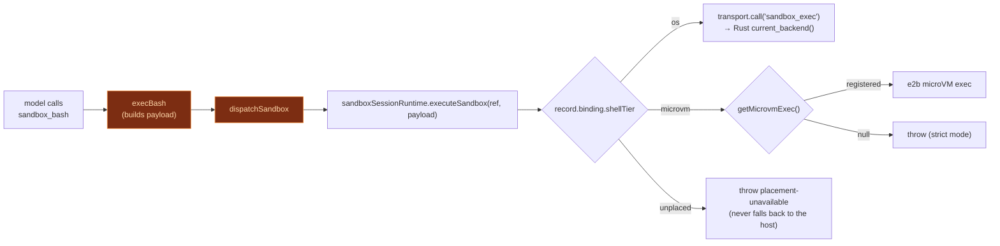

# Sandboxed tools plugin

<Status variant="beta" />

<TLDR>
  `plugins/cognia-sandboxed-tools/src/index.ts` registers four MCP tools — `sandbox_bash`,
  `sandbox_edit`, `sandbox_write`, `sandbox_text_editor` — that the model uses **instead of** the
  SDK builtins when the session has the sandbox enabled. Each call is routed by `dispatchSandbox` to
  either the OS sandbox (the `sandbox_exec` Tauri command, T1) or the e2b microVM (T4), based on the
  active tier for the session. Strict mode: a `microvm` tier with no registered exec **throws** — no
  silent fallback.
</TLDR>

## The four tools

The plugin is a frontend plugin that declares `tools` capability and the `native:filesystem` /
`native:process` permissions. On activate it registers the tools via `ctx.agent.registerTool`:

```ts title="plugins/cognia-sandboxed-tools/src/index.ts:303-311"
export const SANDBOXED_TOOL_NAMES = [
  TOOL_SANDBOX_BASH,
  TOOL_SANDBOX_EDIT,
  TOOL_SANDBOX_WRITE,
  TOOL_SANDBOX_TEXT_EDITOR,
] as const

/** SDK builtin tool names that are replaced when the sandbox is enabled. */
export const SDK_TOOLS_REPLACED_BY_SANDBOX = ["Bash", "Edit", "Write"] as const
```

| Tool                  | Replaces                       | Required args      | Scope semantics                                              |
| --------------------- | ------------------------------ | ------------------ | ----------------------------------------------------------- |
| `sandbox_bash`        | SDK `Bash`                     | `command`, `cwd`   | `writable` (defaults to `[cwd]`), `readable`, `network`     |
| `sandbox_edit`        | SDK `Edit`                     | `targetFiles`      | writes scoped to exact `targetFiles`; network always off     |
| `sandbox_write`       | SDK `Write`                    | `targetFiles`      | same shape as `sandbox_edit`                                 |
| `sandbox_text_editor` | native `text_editor`           | `targetFiles`      | Anthropic-style editor when Computer Use is disabled         |

Each tool definition is `requiresApproval: true` and `category: "automation"`. The bash schema
carries the policy knobs the model can set:

```ts title="plugins/cognia-sandboxed-tools/src/index.ts:81-93 (network knobs)"
network: {
  type: "string",
  enum: ["off", "on", "allowlist"],
  description: "Network policy. Default off.",
},
networkHosts: {
  type: "array",
  items: { type: "string" },
  description: "Required when network=allowlist.",
},
timeoutSeconds: { type: "integer", minimum: 0 },
maxCpuSeconds: { type: "integer", minimum: 0 },
maxMemoryMb: { type: "integer", minimum: 0 },
```

## Tier routing — `dispatchSandbox`

Every call funnels through `dispatchSandbox`, which hands the payload to the **runtime reference**
the send resolved (see [Execution overview](./execution-overview)). The plugin no longer looks up
per-session tier or policy state of its own: the ref names one immutable placement, and
`SandboxSessionRuntime` owns the branch to the Rust `sandbox_exec` command or the registered E2B
adapter.

```ts title="plugins/cognia-sandboxed-tools/src/index.ts"
async function dispatchSandbox(
  payload: MicrovmExecPayload,
  ctx: PluginToolContext
): Promise<SandboxResultShape> {
  return sandboxSessionRuntime.executeSandbox(requireRuntimeRef(ctx), payload)
}

/**
 * A chat send always carries its resolved placement. Callers with no send
 * envelope — workflow nodes, plan steps, External Bridge orchestration,
 * plugin-to-plugin calls — get the host OS-tier placement.
 */
function requireRuntimeRef(ctx: PluginToolContext): string {
  return ctx.sandboxRuntimeRef ?? HOST_FALLBACK_RUNTIME_REF
}
```

<Callout type="warn">
  The host fallback is a *placement*, not a bypass. When a send's binding cannot be established,
  `resolveSendOptions` does not drop the ref — it calls `bindUnplacedSession`, which keeps the
  resolved ceiling and makes the surfaces that were supposed to leave this machine (a non-`os`
  shell tier, a bound GUI target) refuse with `placement-unavailable`. A session that asked for
  isolation never silently executes on the host.
</Callout>

`execBash` builds the OS-backend payload, defaulting `writable` to `[cwd]` and the timeout to 300 s:

```ts title="plugins/cognia-sandboxed-tools/src/index.ts:179-204 (excerpt)"
async function execBash(args: BashCallInputs, ctx: PluginToolContext): Promise<SandboxResultShape> {
  const cwd = args.cwd
  const writable = args.writable && args.writable.length > 0 ? args.writable : [cwd]
  return dispatchSandbox(
    {
      tool: TOOL_SANDBOX_BASH,
      command: { argv: ["bash", "-c", args.command], cwd, env: args.env ?? {},
                 stdin: null, timeout: args.timeoutSeconds ?? 300 },
      request: { writable, readable: args.readable ?? [], targetFiles: [],
                 maxCpuSeconds: args.maxCpuSeconds ?? 0, maxMemoryMb: args.maxMemoryMb ?? 0,
                 network: args.network ?? "off", networkHosts: args.networkHosts ?? [] },
    }, ctx)
}
```

<Callout type="info">
  The edit / write / text_editor tools ship the **policy-gate contract** in V1: they build a payload
  with `argv: ["true"]` and the `targetFiles` scope, so the Rust policy gate validates the scope
  before the renderer performs its own apply-edit logic (`index.ts:206-239`). The actual diff
  application stays renderer-side.
</Callout>



## Relationship to build-options

This plugin only **provides** the tools; it does not decide when they apply. The decision is made in
`lib/claude/build-options.ts`: when `sandboxEnabled`, that file adds `Bash` / `Edit` / `Write` to
`disallowedTools`, strips the native editor tools from the Anthropic projection, and relies on the
plugin's tools already being present in `opts.pluginTools`. See
[Execution overview](./execution-overview) for the exact lines.

## i18n + slash status

The manifest ships an inline `/sandbox` slash status command in both locales
(`index.ts:322-339`), explaining that when the session enables sandbox mode the SDK builtins are
disabled and the model uses the `sandbox_*` equivalents — pointing users at Settings → Sandbox for
backend health.

## Next

<Cards>
  <Card title="OS backends (T1)" href="./os-backends" description="Where sandbox_exec runs the command" />
  <Card title="microVM & Web" href="./microvm-and-web" description="The T4 exec this plugin routes to" />
  <Card title="Execution overview" href="./execution-overview" description="When these tools replace the builtins" />
</Cards>
