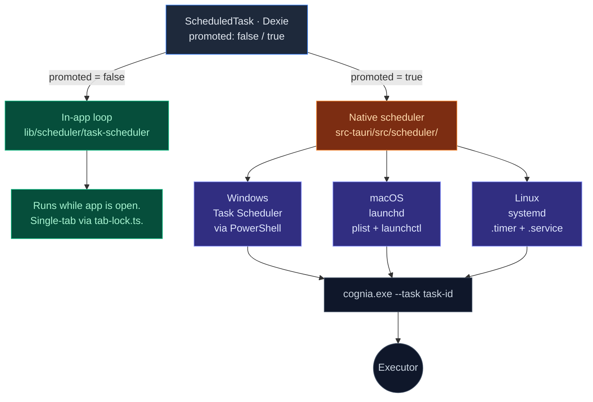

# Scheduler

<Status variant="stable" />

<TLDR>
  Two-layer scheduler — an in-app cron loop for tasks that only matter while Cognia is open, and a
  native promotion path that mirrors selected tasks to Windows Task Scheduler / launchd / systemd so
  they fire even when the app is closed.
</TLDR>

<StatGrid>
  <Stat label="Trigger types" value="4" hint="cron · interval · once · event" />
  <Stat
    label="Built-in executors"
    value="6"
    hint="claude-send · shell · script · backup · twin · plugin"
  />
  <Stat label="Native platforms" value="3" hint="Windows · macOS · Linux" />
  <Stat label="History cap" value="200" hint="per task" />
</StatGrid>

Cognia ships its own scheduler subsystem that runs in two layers:

- **In-app layer** — `lib/scheduler/` runs cron-defined tasks while the app is open.
- **Native layer** — `src-tauri/src/scheduler/` promotes tasks to the OS scheduler (Windows Task Scheduler, macOS launchd, Linux systemd) so they fire even when Cognia is closed.

Promotion is opt-in per task: lightweight tasks stay in-app; heavy or background-required tasks go native.

The full design rationale is in [ADR-0002](../adr/0002-scheduler-full-agent-resolution).

## Where it lives

```
lib/scheduler/
  index.ts                       # Public API
  task-scheduler.ts              # Core scheduling loop
  scheduler-db.ts                # Dexie tables (jobs, history)
  cron-parser.ts                 # 5/6-field cron expressions
  trigger-normalizer.ts          # Convert UI inputs → cron / interval / once
  promote-to-system.ts           # Hands a task off to the native layer
  task-templates.ts              # Reusable task definitions
  format-utils.ts                # Render schedules for the UI ("every Mon at 9:00")
  tab-lock.ts                    # Single-tab worker election
  errors.ts
  conversational-task-authoring.ts  # LLM-assisted task creation
  conversational-task-intent.ts
  notification-integration.ts    # Notify on success / failure
  event-integration.ts
  script-executor.ts             # Run user scripts safely
  executors/                     # Built-in executor implementations

src-tauri/src/scheduler/
  mod.rs
  service.rs                     # Cross-platform service trait
  windows.rs                     # Windows Task Scheduler via PowerShell
  macos.rs                       # launchd via plist + launchctl
  linux.rs                       # systemd via .timer + .service units
  metadata_store.rs              # sqlite metadata for recovery
  commands.rs                    # #[tauri::command] wrappers
  types.rs
  error.rs

components/scheduler/            # Workbench UI
app/scheduler/                   # Workbench route
```

## Task model

<TypeTable
  type={{
    id: { description: "Stable unique identifier.", type: "string", required: true },
    name: { description: "Display name.", type: "string", required: true },
    description: { description: "Optional explanation.", type: "string" },
    trigger: {
      description: "When the task should run — discriminated union (see below).",
      type: "Trigger",
      required: true,
    },
    executor: {
      description: "What the task does — discriminated union (see below).",
      type: "Executor",
      required: true,
    },
    enabled: {
      description: "If false, the task is skipped at fire time.",
      type: "boolean",
      required: true,
    },
    promoted: {
      description: "If true, the task is mirrored to the native OS scheduler.",
      type: "boolean",
      default: "false",
    },
    createdAt: { description: "ISO-8601 creation time.", type: "string", required: true },
    updatedAt: { description: "ISO-8601 last update time.", type: "string", required: true },
  }}
/>

The `Trigger` and `Executor` shapes:

```ts
type Trigger =
  | { type: "cron"; expression: string; timezone?: string }
  | { type: "interval"; everyMs: number }
  | { type: "once"; runAt: string }
  | { type: "event"; eventName: string }

type Executor =
  | { type: "claude-send"; characterId: string; messageTemplate: string }
  | { type: "shell"; command: string; cwd?: string }
  | { type: "script"; language: "js"; code: string }
  | { type: "backup"; folder: string }
  | { type: "twin-ingest"; sourceId: string }
  | { type: "twin-distill"; twinId: string }
  | { type: "plugin"; pluginId: string; jobId: string }
```

The full type set lives in `lib/scheduler/`. Adding a new executor means adding a discriminated-union member and an implementation file under `executors/`.

## Cron parser

`lib/scheduler/cron-parser.ts` implements a 5- and 6-field cron parser (with seconds when 6 fields are given). Features:

- Standard wildcards (`*`, `,`, `-`, `/`).
- Named day-of-week (`MON`, `TUE`, …).
- Named month (`JAN`, …).
- Time zone aware via the trigger's `timezone` field; defaults to system local.

The parser produces a `next(after: Date)` iterator. The scheduling loop calls `next()` to compute the next fire time, sleeps until then, runs the executor, and repeats.

## In-app vs native



Tasks default to `promoted: false`. The user can promote a task in the workbench; promotion synthesises:

- **Windows** — a Task Scheduler entry pointing at `cognia.exe --workspace <id> --task <task-id>`.
- **macOS** — a launchd `.plist` in `~/Library/LaunchAgents/`.
- **Linux** — a systemd `.timer` + `.service` unit pair under `~/.config/systemd/user/`.

`metadata_store.rs` keeps the link between the task UUID and the native task ID (PowerShell task name, plist label, systemd unit name). On task delete, the metadata store also removes the native entry.

## Tab lock

`lib/scheduler/tab-lock.ts` ensures **exactly one tab** runs the in-app loop. Implementation:

- A heartbeat row in Dexie (`schedulerLock`) updated every 5s.
- On startup, every tab checks: if the heartbeat is older than 15s, claim the lock; otherwise sleep.
- If the holder tab closes / crashes, the next tab claims within 15s.

This prevents duplicate fires when the user has Cognia open in multiple windows.

## Conversational task authoring

`conversational-task-authoring.ts` and `conversational-task-intent.ts` let the user describe a schedule in plain language ("every weekday at 9 send a stand-up reminder") and have the LLM emit a `ScheduledTask` JSON object. The intent extractor pulls structured fields; the authoring agent fills in defaults and validates.

This surfaces in the workbench's "Create with AI" panel.

## Executors

Built-in executors:

| Executor                       | Where                                                                                                                  |
| ------------------------------ | ---------------------------------------------------------------------------------------------------------------------- |
| `claude-send`                  | `executors/claude-send.ts` — sends a templated message via `claude_send`                                               |
| `shell`                        | `executors/shell.ts` → `lib/native/local-runtime.ts` → `src-tauri/src/shell.rs`; gated by trusted-workspace allow-list |
| `script`                       | `executors/script.ts` → `script-executor.ts` (sandboxed JS via `lib/sandbox/`)                                         |
| `backup`                       | `executors/backup.ts` — calls `lib/data/build-package` + encrypt                                                       |
| `twin-ingest` / `twin-distill` | `executors/twin-*.ts` — enqueue to the twin job worker                                                                 |
| `plugin`                       | `executors/plugin.ts` — invoke a plugin's scheduled job (see [Plugin system](./plugin-system))                         |

Each executor returns:

```ts
interface ExecutorResult {
  status: "success" | "failure"
  output?: string
  error?: string
  durationMs: number
}
```

Results are written to `schedulerHistory` (capped at 200 newest per task).

## Notifications

`notification-integration.ts` watches the scheduler-history stream and surfaces:

- A toast on every run (configurable, default "errors only").
- A native OS notification on failure (via `tauri-plugin-notification`).
- A badge in the menu / system tray when there are unread failures.

## Event triggers

A task can also fire on app events (e.g., "every time a new chat is created"). `event-integration.ts` subscribes to the event bus and triggers the matching tasks.

## Workbench UI

Route: `app/scheduler/`. Components: `components/scheduler/`. Tabs:

- **Tasks** — list, with quick toggle / promote / run-now / delete actions.
- **History** — combined run history across all tasks, filterable by status.
- **Templates** — pre-defined task templates from `task-templates.ts` (e.g., "Daily backup", "Weekly twin re-distill").
- **Authoring** — the "Create with AI" panel.

## Where to start contributing

| Goal                           | Files                                                                     |
| ------------------------------ | ------------------------------------------------------------------------- |
| Add a new executor             | `lib/scheduler/executors/<name>.ts` + register                            |
| Add a new trigger type         | `lib/scheduler/cron-parser.ts` (or a new parser), `trigger-normalizer.ts` |
| Add a native platform          | `src-tauri/src/scheduler/<platform>.rs`                                   |
| Tweak conversational authoring | `conversational-task-authoring.ts`                                        |

## Tests

- `lib/scheduler/cron-parser.test.ts` — comprehensive cron expression coverage.
- `task-scheduler.test.ts` — fake-timers based loop simulation.
- `tab-lock.test.ts` — multi-tab race conditions.
- Native: integration tests in `src-tauri/tests/` create temp DBs and verify metadata round-trips.

## Next

<Cards>
  <Card
    title="Plugin system"
    href="./plugin-system"
    description="Plugins can register their own scheduled jobs."
  />
  <Card
    title="Backup & data transfer"
    href="../data/backup-and-data"
    description="The backup scheduler builds on these primitives."
  />
  <Card
    title="ADR-0002"
    href="../adr/0002-scheduler-full-agent-resolution"
    description="Why the in-app vs native split exists."
  />
</Cards>
