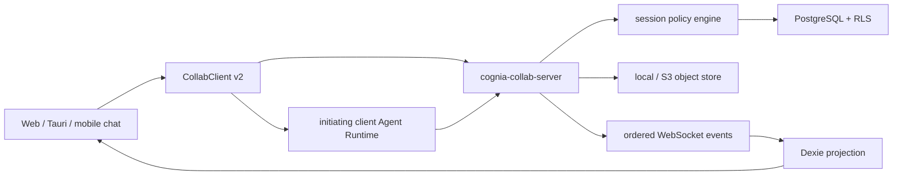

# Shared AI Chat

<Status variant="stable">Protocol v2 · rollout gated · private by default</Status>

<TLDR>
  Shared AI chat is a separate online collaboration plane. Local conversations remain private until
  their owner explicitly imports the complete history. The collaboration service owns membership,
  permission decisions, event order, Agent Run leases, approvals, attachment authorization, and
  audit. Web, Tauri, and Capacitor use the same renderer implementation and keep only a Dexie mirror.
</TLDR>

The service is the only authority for cross-person state; local model execution can publish only
through a short-lived device- and Run-bound lease token.

## Product behavior

- The private/shared badge opens the member and operations drawer.
- Conversion shows message and attachment counts and warns that invitees receive the complete history.
- Shared messages show stable authors and external Guest origin.
- Offline users may read cached history and keep drafts, but sends and Agent Runs require an online confirmation.
- Membership removal purges the revoked projection and closes the live stream; it does not delete unrelated private chats.
- Redacted content is shown as a tombstone. Raw content is absent from the normal client protocol.

## Runtime owners

| Layer | Owner |
|---|---|
| contracts and role matrix | `packages/agent-config-types/src/shared-chat.ts`, `lib/collab/session-permissions.ts` |
| HTTP/WebSocket client and synchronization | `lib/collab/client.ts`, `lib/collab/shared-chat-sync.ts` |
| explicit history conversion | `lib/collab/shared-chat-conversion.ts` |
| shared Run coordination | `lib/collab/shared-run-coordinator.ts` |
| product UI | `components/chat/shared-session-panel.tsx` |
| server policy/API/storage | `crates/cognia-collab-server/src/chat*.rs` |
| PostgreSQL schema | `crates/cognia-collab-server/migrations/0005_shared_chat.sql`, `0008_shared_chat_control.sql` |
| object bytes | `chat_attachment_store.rs` |

## Reading order

<Cards>
  <Card title="Permissions and data" href="./permissions-and-data" description="Roles, Guests, author identity, events, redaction, attachments, and trust boundaries." />
  <Card title="Runs, sync, and operations" href="./runs-sync-and-operations" description="Run leases, queues, approvals, reconnect, rollout flags, audit, and break-glass." />
</Cards>

## Rollout

Both flags must be enabled: `COLLAB_SHARED_CHAT_ENABLED=true` on the service and
`NEXT_PUBLIC_SHARED_CHAT_ENABLED=true` in the product build. Disabling either flag stops new shared
entry and writes without dropping tables, objects, mirrors, or private sessions. Health reports
protocol v2 and includes `shared-chat` only when the server flag is enabled.

The architecture decision and threat model are recorded in
`docs/plans/2026-08-29-server-authoritative-shared-ai-chat.md` and the 2026-08-29 supplement to ADR-0149.
