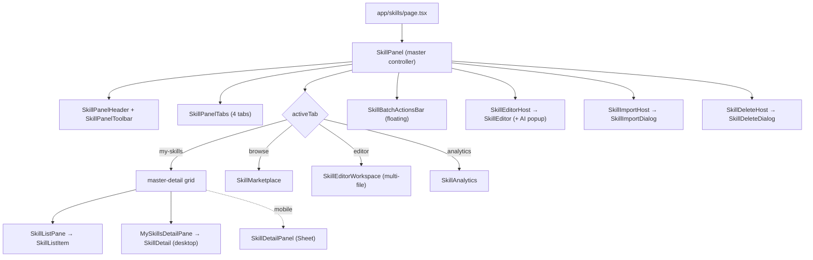
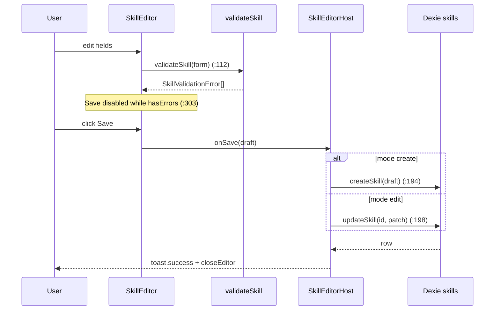

# Authoring & Workbench

<Status variant="stable">UI surface — components/skills (40+ files) · lib/skills authoring helpers · stores/skills</Status>

<TLDR>
  The Skills workbench is one route (`app/skills/page.tsx:6` mounts `<SkillPanel />`) split into four
  tabs — **My Skills · Browse · Editor · Analytics** — driven by an ephemeral Zustand store
  (`stores/skills/skills-store.ts:155`, **not persisted**). Authoring math lives in `lib/skills/`:
  `validate.ts:19` (library-free field validation), `categories.ts:27` (8 categories + 5 sources),
  `templates.ts:19` (4 starter templates), `batch-tags.ts:6` (tag set algebra), `ai-prompts.ts:39`
  (the AI-assist prompt builder), and `export-toast.ts:29` (pick-dir → serialize → toast). The persistent
  rows live in Dexie (`lib/db/skills.ts`); this layer is pure UI + pure helpers, so every save round-trips
  through `createSkill` / `updateSkill`. Shortcuts (`hooks/skills/use-skill-shortcuts.ts:30`) bind
  `/`, `Cmd/Ctrl+A`, `Esc`, `N`, and `Delete`.
</TLDR>

## Where the route lands

`app/skills/page.tsx` is a thin server component that drops the client `SkillPanel` into a full-height
shell:

```tsx
// app/skills/page.tsx
export default function SkillsRoutePage() {
  return (
    <div className="h-full w-full min-h-0 flex-1" data-bg-target="chat">
      <SkillPanel />
    </div>
  )
}
```

`SkillPanel` (`components/skills/skill-panel.tsx:45`) is the master controller. It reads `activeTab` from
the store and branches the body: `my-skills` renders the master-detail grid (`skill-panel.tsx:99`),
`browse` renders `<SkillMarketplace />` (`:118`), `editor` renders `<SkillEditorWorkspace />` (`:119`), and
`analytics` renders `<SkillAnalytics />` (`:120`). Three host sub-components — `SkillEditorHost`
(`:176`), `SkillImportHost` (`:260`), and `SkillDeleteHost` (`:287`) — sit at the bottom of the tree and
materialize the editor Sheet, the import dialog, and the delete confirm from store state.



<Callout type="info" title="Master-detail auto-select">
  On desktop the detail pane must always point at a visible row. The effect at `skill-panel.tsx:68`
  leaves a still-filtered selection alone; otherwise it selects the first filtered skill, or clears the
  selection when the list is empty. `detailSkillId` is read but deliberately excluded from the dependency
  array (`skill-panel.tsx:74`) so re-running on a selection write never fights a user click. The effect is
  skipped on mobile so the detail Sheet never opens unprompted.
</Callout>

## The authoring helpers (`lib/skills/`)

These modules are framework-free and unit-testable in isolation — the DB layer never reaches into them, so
the union/diff math and validation tree-shake cleanly.

| Module | Export(s) | Purpose |
| --- | --- | --- |
| `validate.ts:19` | `validateSkill`, `isValidSkill` (`:85`) | Per-field validation → `SkillValidationError[]` |
| `categories.ts:27` | `SKILL_CATEGORIES`, `getCategoryMeta` (`:80`) | 8 categories: icon + color + i18n labelKey |
| `categories.ts:90` | `SKILL_SOURCES`, `getSourceMeta` (`:100`) | 5 sources + badge variant |
| `templates.ts:19` | `SKILL_TEMPLATES`, `templateToSkillSeed` (`:115`) | 4 starter templates → create-editor seed |
| `batch-tags.ts:6` | `unionTag`, `withoutTag` (`:15`), `tagsAcrossSkills` (`:20`) | Pure tag-set algebra |
| `ai-prompts.ts:39` | `buildAiUserPrompt`, `buildAiSystemPrompt` (`:68`) | AI-assist prompt construction |
| `export-toast.ts:29` | `exportSkillsToDirWithFeedback` | Pick-dir → serialize → toast → log |

### Validation

`validateSkill` (`validate.ts:19`) accepts a `ValidatableSkill` (name / description / content / resources)
and returns a structured list so the editor can highlight individual fields. The bounds are constants at
the top of the file:

```ts
// lib/skills/validate.ts
const MAX_NAME_LEN = 64
const MAX_DESC_LEN = 1024
const NAME_PATTERN = /^[A-Za-z0-9][A-Za-z0-9\s_-]*$/
```

The codes it can emit:

| Code | Field | Trigger |
| --- | --- | --- |
| `missing-name` | `name` | Trimmed name empty (`validate.ts:22`) |
| `name-too-long` | `name` | Length over `MAX_NAME_LEN` (`validate.ts:29`) |
| `name-format` | `name` | Fails `NAME_PATTERN` (`validate.ts:36`) |
| `description-too-long` | `description` | Length over `MAX_DESC_LEN` (`validate.ts:45`) |
| `missing-content` | `content` | Trimmed body empty (`validate.ts:52`) |
| `resource-path-traversal` | resource id | Path contains `..` (`validate.ts:62`) |
| `duplicate-resource-path` | resource id | Two resources share a path, compared case-insensitively (`validate.ts:71`) |

The duplicate check lower-cases each path into a `Map` (`validate.ts:69`), so `Scripts/Run.sh` and
`scripts/run.sh` collide.

### Categories and sources

`SKILL_CATEGORIES` (`categories.ts:27`) is the single source of truth shared 1:1 with Cognia's skill
constants. Each entry carries a lucide icon, a Tailwind color snippet, and an i18n `labelKey` under
`skills.category.*`:

| Category | Icon | Color | labelKey |
| --- | --- | --- | --- |
| `creative-design` | Palette | pink | `creativeDesign` |
| `development` | Code2 | blue | `development` |
| `enterprise` | Briefcase | amber | `enterprise` |
| `productivity` | Package | emerald | `productivity` |
| `data-analysis` | Database | cyan | `dataAnalysis` |
| `communication` | MessageCircle | violet | `communication` |
| `meta` | Brain | slate | `meta` |
| `custom` | Sparkles | muted | `custom` |

`getCategoryMeta` (`categories.ts:80`) falls back to the `custom` entry for any unknown id.
`SKILL_SOURCES` (`categories.ts:90`) lists `builtin`, `custom`, `imported`, `generated`, and `marketplace`,
each with a badge variant; `getSourceMeta` (`categories.ts:100`) defaults to `custom`.

### Templates

`SKILL_TEMPLATES` (`templates.ts:19`) ships four ready-to-edit starting points; the catalog lives in code
(not the DB) so it versions with the app and costs no storage:

| Template | Category | Tags | Body |
| --- | --- | --- | --- |
| `blank` | custom | — | Section scaffold: When to use / Instructions / Examples |
| `code-review` | development | review, quality | Diff review checklist |
| `writing-style` | creative-design | writing, style | Prose tone / structure guide |
| `research-summary` | productivity | research, summary | Gather → verify → synthesize brief |

`templateToSkillSeed` (`templates.ts:115`) converts a template into a `Skill`-shaped seed with placeholder
id and timestamps; the `blank` template seeds an empty `name` so the user is forced to title it
(`templates.ts:118`). The seed is dropped into `createSeed` in the store and read only while
`editorTarget.mode === "create"`.

### Batch tags

`batch-tags.ts` keeps the set math out of the DB layer. `unionTag` (`:6`) trims + de-duplicates
(case-sensitive) via a `Set`; `withoutTag` (`:15`) filters; `tagsAcrossSkills` (`:20`) returns a **sorted**
union across a selection. The batch bar feeds these into `updateSkill` per skill.

### AI-assist prompts

`ai-prompts.ts` frames the model as a SKILL.md editor. `AiIntent` (`:9`) is one of
`optimize | simplify | expand | fixErrors`, each with an instruction string (`ai-prompts.ts:28`). The
system prompt (`ai-prompts.ts:20`) is strict about output:

```ts
// lib/skills/ai-prompts.ts
const SYSTEM_PROMPT = `You are an expert SKILL.md editor for Claude Code.
...
Respond with ONLY the rewritten markdown body — no preamble, no commentary, no fenced code wrapper.
...`.trim()
```

`buildAiUserPrompt` (`ai-prompts.ts:39`) feeds the name, description, current body, and — only for
`fixErrors` — the list of validation issues, so the model can rewrite the body until a re-validate comes
back clean.

### Export with feedback

`exportSkillsToDirWithFeedback` (`export-toast.ts:29`) is the shared "pick directory → write SKILL.md →
toast → log" flow used by both the batch bar and the panel toolbar. It returns an `ExportOutcome`
(`export-toast.ts:12`) of `{ ran, writtenCount, failedCount, total }`. The browser fallback returns a
`null` directory but `saveFilesToDir` still triggers per-file downloads, so the function does not bail out
(`export-toast.ts:42`). Partial failures raise `toast.warning` (`export-toast.ts:55`); everything routes
through `loggers.skills`.

## The store

`useSkillsStore` (`stores/skills/skills-store.ts:155`) holds **only ephemeral UI state** — it is not wired
to localStorage, by design (`skills-store.ts:1`). Persistent skill rows live in Dexie.

| Slice | Type | Notes |
| --- | --- | --- |
| `activeTab` | `SkillPanelTab` (`:43`) | `my-skills` / `browse` / `editor` / `analytics` |
| `filters` | `SkillFilters` (`:47`) | query / category / source / status / tag / sort |
| `selection` | `Set<string>` | Batch-selected skill ids |
| `detailSkillId` | `string` or `null` | Drives the desktop detail pane + mobile Sheet |
| `editorTarget` | create / edit target or `null` (`:68`) | Opens `SkillEditorHost` |
| `createSeed` | `Skill` or `null` | Template/import seed for the create editor |
| `importStaging` | `ImportStaging` or `null` (`:108`) | Staged import drafts + parse errors |
| `deleteTarget` | `{ skillId, name }` or `null` | Delete confirm payload |
| `editorWorkspace` | `EditorWorkspace` (`:29`) | VSCode-style multi-file editor state |

`openCreate` (`skills-store.ts:185`) sets `editorTarget` and clears `detailSkillId`; `openEdit` (`:187`)
opens edit mode. The `editorWorkspace` slice tracks `openFiles[]` of `EditorFile` (`skills-store.ts:16`),
each carrying both `draftContent` and `savedContent` — the diff between them is what the tabs and the
editor-tab badge count as "dirty".

## My Skills: list pane and rows

`SkillListPane` (`skill-list-pane.tsx:37`) mirrors the provider-settings sidebar: a search box, two compact
filter dropdowns, scrollable rows, and a stats bar.

- **Search** — the `Input` carries the `data-skill-search` attribute (`skill-list-pane.tsx:60`) so the `/`
  shortcut can focus it.
- **Source / Category dropdowns** (`skill-list-pane.tsx:69` / `:91`) — selecting one resets the other to
  `"all"` (`setFilters({ source, category: "all" })`), so the two filters never fight.
- **Rows** render `SkillListItem` (`skill-list-pane.tsx:131`); clicking a row calls `openDetail`.
- **Stats bar** (`skill-list-pane.tsx:144`) shows `{enabled}/{total} enabled`.

`SkillListItem` (`skill-list-item.tsx:29`) is `memo`-wrapped. The selection `Checkbox`
(`skill-list-item.tsx:44`) is a **sibling** of the row button, never nested, so toggling batch selection
doesn't open the row. The row button (`skill-list-item.tsx:49`) carries the category icon, name +
description, a red error-count `Badge` when `validationErrors.length > 0` (`:75`), a `disabled` status badge
(`:85`), and — only under Tauri — a `SyncDot` (`skill-list-item.tsx:90`) that is emerald when
`syncFingerprint` is set, destructive on `lastSyncError`, else muted (`skill-list-item.tsx:97`). The active
row gets a left-border accent and disabled rows go `opacity-60` (`skill-list-item.tsx:53`).

## My Skills: detail panel

`SkillDetail` (`skill-detail.tsx:30`) is the Sheet-agnostic detail view rendered inline on desktop
(`MySkillsDetailPane`, `skill-panel.tsx:145`) and inside a mobile Sheet (`SkillDetailPanel`). The header
(`skill-detail.tsx:75`) exposes:

| Action | Behavior | Disabled when |
| --- | --- | --- |
| Edit (`:108`) | `openEdit(skill.id)` | `skill.isBuiltIn` |
| Duplicate (`:118`) | `duplicateSkill` | — |
| Export (`:127`) | `saveFileAs` + `serializeSkill` | — |
| Toggle status (`:136`) | `setSkillStatus` enabled ⇄ disabled | — |
| Delete (`:145`) | `setDeleteTarget` | `skill.isBuiltIn` |

The tab strip (`skill-detail.tsx:159`) has five tabs:

- **Overview** (`:188`) — `SkillSyncSection` plus a metadata grid including `usageCount` / `lastUsedAt` /
  `allowedTools` (`skill-detail.tsx:209`).
- **Content** (`:191`) — the body via the chat `MarkdownRenderer`, so the skill gets Shiki highlighting,
  GFM tables, and math instead of streamdown's plain fallback (`skill-detail.tsx:250`).
- **Resources** (`:194`) — `SkillResourceManager` for CRUD over scripts / references / assets.
- **Security** (`:197`) — `SkillSecurityScanner` (Tauri).
- **Validation** (`:200`) — `SkillValidationSection` (`skill-validation-section.tsx:16`): a green check
  when clean (`:18`), otherwise findings grouped by field (`groupByField`, `:56`) with the raw error code
  shown inline.

## Header, toolbar, and tabs

`SkillPanelHeader` (`skill-panel-header.tsx:18`) lays out a back link to `/` (`:26`), a mobile-only
category-sheet button (`:31`), the title + filtered/total count (`:42`), the tabs slot at `lg+` (`:50`), a
filter button that opens `setFilterSheetOpen` (`:52`), and the `SkillPanelToolbar` (`skill-panel-header.tsx:64`).

`SkillPanelToolbar` (`skill-panel-toolbar.tsx`) carries the create / import / export / sync actions:

| Control | Line | Action |
| --- | --- | --- |
| **+ New** | `skill-panel-toolbar.tsx:352` | `openCreate()` |
| Import → Markdown | `:121` | `handleImportFromMarkdown` → `parseSkillMarkdown` → staging |
| Import → `.zip` bundle | `:174` | `handleImportFromBundleZip` → `loadBundle` |
| Import → folder (Tauri) | `:221` | `handleImportFromBundleFolder` |
| Import → Claude Code skills | `:274` | `handleImportFromClaudeCode` → `scanClaudeSkills` |
| **Export All** | `:333` (button `:439`) | `handleExportAll` → `exportSkillsToDirWithFeedback` |
| Sync → Push / Pull all | `:462` / `:466` | `useSkillSync` (Tauri-only) |
| Sync → Mirror Claude / Codex | `:478` / `:486` | Mirror targets |
| Sync → Empty trash | `:496` | `skillsEmptyTrash` |

`SkillPanelTabs` (`skill-panel-tabs.tsx:22`) drives the four tabs from `TAB_DEFS` (`:11`). The editor tab
carries a dirty-count `Badge` (`skill-panel-tabs.tsx:44`) computed from
`editorWorkspace.openFiles.filter(f => f.draftContent !== f.savedContent).length` (`:27`).

## The editor sheet

`SkillEditorHost` (`skill-panel.tsx:176`) opens a right-side Sheet for both create and edit, reading
`editorTarget` from the store. On save it dispatches to `createSkill` (`skill-panel.tsx:194`) or
`updateSkill` (`:198`), toasts, logs, and closes. The AI-assist callback is wired **only under Tauri**
(`skill-panel.tsx:241`): off the desktop the host passes `undefined`, which hides the AI button entirely.

`SkillEditor` (`skill-editor.tsx:96`) holds a `FormState` (`:49`) of name / description / content /
category / `allowedTools` (comma-separated) / tags / version / author / license. It validates in real time:

```ts
// components/skills/skill-editor.tsx — live per-field error map
validateSkill({
  name: form.name,
  description: form.description,
  content: form.content,
  resources,
})                                   // :112
```

The Save button is `disabled={saving || hasErrors}` (`skill-editor.tsx:303`), and the AI-assist trigger is
itself disabled until there is some name or content to work on (`skill-editor.tsx:235`).

`SkillEditorAiPopup` (`skill-editor-ai-popup.tsx:45`) renders the four intents from `INTENTS` (`:38`).
Clicking an intent calls `onAiAssist`, streams a diff preview into a `Card` (via `Streamdown`), then offers
Accept (`:125`) / Revert. The `fixErrors` intent is disabled when there are no validation errors
(`fixErrorsDisabled`, `skill-editor-ai-popup.tsx:74`).



## VSCode-style multi-file workspace

The **Editor** tab renders `SkillEditorWorkspace` (`editor/skill-editor-workspace.tsx`): a file-tree
sidebar (`skill-file-tree.tsx`), a dirty-aware tab strip (`skill-tab-strip.tsx`), a Monaco editor
(`skill-monaco-editor.tsx`), and a right-hand validation pane (`skill-validation-panel.tsx`). Its state is
the `editorWorkspace` slice in the store. The keyboard handler (`skill-editor-workspace.tsx:61`) binds:

```ts
// editor/skill-editor-workspace.tsx
const cmd = e.ctrlKey || e.metaKey
if (cmd && e.key === "s" && !e.shiftKey) { /* saveActive() */ }   // :62
else /* Ctrl+Shift+S */ { /* saveAll() */ }                       // :67
```

`openFile` / `closeFile` / `updateDraftContent` / `markSaved` (`skills-store.ts:211`–`:252`) keep the open
files in sync; `discardDrafts` (`:254`) resets every draft back to its saved content.

## Batch actions

`SkillBatchActionsBar` (`skill-batch-actions-bar.tsx:24`) appears only when the selection is non-empty. It
is a fixed bottom-center bar that slides up via `motion/react` (`skill-batch-actions-bar.tsx:135`,
`y: 24 → 0`). It offers Enable / Disable (`setSkillStatus` per skill), a Tags popover that applies
`unionTag` / `withoutTag` through `updateSkill` (`skill-batch-actions-bar.tsx:41`), Export
(`exportSkillsToDirWithFeedback`), Delete, and Clear selection. The live tag chips re-query the selection
via `listSkillsByIds` keyed on the id list (`skill-batch-actions-bar.tsx:38`).

## Analytics, resources, and discovery

- **`SkillAnalytics`** (`skill-analytics.tsx`) — summary cards (total / enabled / total usage / estimated
  tokens), a category-usage bar chart, a `SkillUsageTrend` line, and rows that open the detail.
- **`SkillResourceManager`** (`skill-resource-manager.tsx`) — CRUD over `script` (Terminal),
  `reference` (FileText), and `asset` (Image) resources via
  `createResource` / `updateResource` / `deleteResource`, with upload + paste.
- **`SkillDiscovery`** (`skill-discovery.tsx`) — Tauri-only: scans standard home-dir paths plus a custom
  path for `SKILL.md` files, lets the user checkbox-select, and parses the picks into `ImportStaging`.

## Keyboard shortcuts

`useSkillShortcuts(skills)` (`hooks/skills/use-skill-shortcuts.ts:30`) attaches a window `keydown` listener
while the panel is mounted. It uses `useSkillsStore.getState()` (`:33`) to read the store imperatively and
avoid re-renders, and guards on `isEditableTarget` (`:21`) so the keys type normally inside inputs.

| Key | Action | Line |
| --- | --- | --- |
| `Esc` | Clear selection, else close the detail — honored even in editable fields | `:37` |
| `Cmd/Ctrl + A` | Select every skill in the current filtered view | `:52` |
| `/` | Focus `[data-skill-search]` | `:60` |
| `N` | `openCreate()` | `:70` |
| `Delete` / `Backspace` | Open delete confirm when exactly one skill is selected | `:76` |

<Callout type="warn" title="Esc is special-cased">
  Every other shortcut bails when focus is inside an input / textarea / select / contenteditable
  (`use-skill-shortcuts.ts:48`). `Escape` is checked **before** that guard (`:37`), so it always drops the
  selection or closes the detail — even while the user is typing in the search box or the editor.
</Callout>

## Save round-trip summary

This layer never writes to Dexie directly. Every mutation funnels through `lib/db/skills.ts`:

- **Editor save** → `SkillEditor.onSave` → `createSkill` / `updateSkill` → toast (`skill-panel.tsx:190`).
- **Batch tags** → `unionTag` / `withoutTag` → `updateSkill` per skill (`skill-batch-actions-bar.tsx:41`).
- **AI assist** → `buildAiUserPrompt` → Claude → Accept applies the suggested body back into the form
  (`skill-editor-ai-popup.tsx:125`).
- **Export** → `exportSkillsToDirWithFeedback` → `serializeSkill` per skill → directory write + toast.

<Cards>
  <Card title="Skills overview" href="./index" />
  <Card title="Data model" href="./data-model" />
  <Card title="Bundle import" href="./bundle-import" />
  <Card title="Marketplace" href="./marketplace" />
</Cards>
