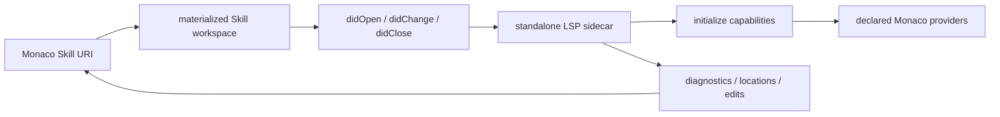

# Authoring and workbench

<Status variant="stable">Transactional multi-file editor with shared LSP</Status>

<TLDR>
  The desktop workbench edits `SKILL.md`, `agents/openai.yaml`, and resource files as one logical workspace. Dirty baselines provide content-level conflict detection; Save All commits atomically. Monaco models are mapped to materialized `file://` files before standalone LSP document events are sent.
</TLDR>

## Files and save state

The file tree always exposes `SKILL.md` and the virtual `agents/openai.yaml`, plus every resource at its true relative path. Each open file stores `draftContent`, `savedContent`, and one state: `clean`, `saving`, `saved`, `blocked`, `conflict`, or `error`.

`saveSkillWorkspace` compares the current Dexie content with the saved baseline. Metadata-only `updatedAt` changes do not create a false conflict. Runtime validation or invalid Codex YAML returns `blocked`; an external content change returns `conflict`; storage failures return `error`. Autosave keeps the draft and state so editing or the save shortcut retries it.

Save All validates every dirty file first and commits the body, Codex YAML, and resource changes in one transaction. A failure writes nothing and leaves every draft dirty. The “All saved” toast appears only after a real commit. The metadata settings sheet updates metadata only and never submits an unsaved body.

## Shared LSP workspace

`lsp-workspace-manager.ts` allocates one workspace per Skill, not per tab. It materializes:

- `SKILL.md`;
- `agents/openai.yaml` when present;
- every resource under its bundle-relative path.

Canvas and Artifact keep single-file synthetic workspaces. Project editors register their real project root and keep real `file://` document URIs.

The manager maintains bidirectional Monaco URI ↔ materialized URI maps. A Skill model such as `skill:///skill-id/scripts/a.ts` is sent to the server as its workspace `file://` URI; diagnostics, locations, and workspace edits are translated back before Monaco consumes them.

## Document lifecycle and providers

The workbench materializes a document before emitting open. Content changes are ordered, debounced, flushed to disk, then sent as `didChange`; close emits `didClose` and workspace teardown removes mappings and files.

The registry stores initialize capabilities and registers only declared Monaco providers: completion, hover, definition, references, signature help, rename, symbols, formatting, code actions, code lens, links, colors, folding, selection ranges, semantic tokens, inlay hints, call/type hierarchy, linked editing, inline completion, and workspace symbols. Stopping or crashing a server disposes its providers immediately.

For one language, user/project configuration wins over plugin servers; ties keep resolved configuration order, then server ID. A crashed active server falls back to the next running candidate. Dynamic workspace-folder servers receive `workspace/didChangeWorkspaceFolders`; other servers restart with the latest folder list. The binary trust gate remains unchanged, and web/mobile render no unavailable LSP controls.

