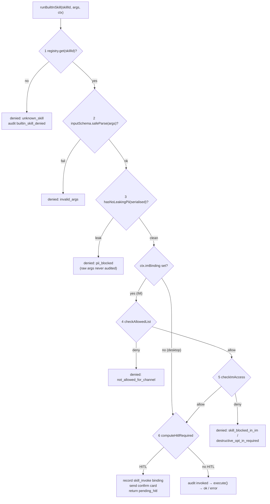

# Built-in skills

<Status variant="beta">ADR-0026 — lib/skills/built-in · 40 Lark skills · HITL via A2UI confirm cards</Status>

<TLDR>
  A built-in skill is a **typed MCP tool the model calls**, not a prompt snippet. Each one is a frozen
  `BuiltInSkill` (`types.ts:116`) that self-registers at module load (`registry.ts:115`) and declares a
  `mutation` tier (`read` / `write` / `destructive`) plus an `imAccess` tier. `buildBuiltInSkillManifest`
  (`manifest.ts:63`) projects the registry into MCP tool defs; `runBuiltInSkill` (`dispatcher.ts:58`) is the
  single never-throwing entry point that runs a 6-gate pipeline (registry → Zod → PII → allowlist → IM-access →
  mutation routing). Write/destructive skills render an A2UI confirm card, persist a `skill_invoke` callback
  binding (`a2ui-mapper.ts:171`), and re-enter via the connector bus (`bus.ts:893`) once the user clicks
  Confirm. The 40 Lark skills shell out to a user-installed `lark-cli` (`exec-lark-cli.ts:101`) with OAuth
  credentials pulled from the existing Lark connector (`auth-bridge.ts:86`). Runtime wiring lives in
  `build-options.ts:895` and `plugin-tool-ipc.ts:144`.
</TLDR>

<Callout type="warn" title="Not the same thing as seeded `skill_builtin_*` rows">
  This tier shares the word "built-in" with the five seeded Dexie skill rows (`skill_builtin_concise`,
  `skill_builtin_step_by_step`, …) documented in [Data model](./data-model). Those are **prompt snippets**
  appended to the system prompt at send time — the model never "calls" them. The skills on **this** page are
  **executable typed tools** the model invokes via MCP tool-use, with credentials, audit rows, and an HITL
  round-trip. They live in `lib/skills/built-in/`, never touch the `skills` / `skillResources` Dexie tables, and
  are filtered in/out per channel by the manifest builder — not by the seeder.
</Callout>

## Where it lives

| File | Responsibility |
| --- | --- |
| `lib/skills/built-in/types.ts` | `BuiltInSkill` contract, `BuiltInSkillContext`, `BuiltInSkillResult` |
| `lib/skills/built-in/registry.ts` | Map-backed registry + shared singleton + invariant enforcement |
| `lib/skills/built-in/manifest.ts` | Registry → MCP tool defs; per-channel filter pipeline; capability summary |
| `lib/skills/built-in/dispatcher.ts` | `runBuiltInSkill` — the 6-gate trust pipeline; never throws |
| `lib/skills/built-in/index.ts` | Public barrel; `import "./lark"` triggers all registrations |
| `lib/skills/built-in/lark/` | 40 Lark skills across 6 families + the lark-cli exec/auth bridge |
| `lib/claude/build-options.ts:895` | Gate + manifest build + fold into `allowedTools` / `pluginTools` |
| `lib/claude/plugin-tool-ipc.ts:144` | Renderer-side IPC fallback: MCP tool name → `runBuiltInSkill` |
| `lib/connectors/bus.ts:893` | `skill_invoke` callback short-circuit (HITL confirm re-fire) |
| `components/settings/built-in-skills/` | Settings shell + per-family / per-skill toggles |
| `components/inbox/overrides/conversation-override-form.tsx` | Per-conversation allowlist + HITL override UI |

## The skill contract

A skill is a frozen value implementing `BuiltInSkill<Args>` (`types.ts:116`). The Zod `inputSchema` doubles as
runtime arg validation **and** as the MCP tool's JSON-Schema (rendered via `z.toJSONSchema` in
`manifest.ts:78`). The single hard invariant: any `write` or `destructive` skill MUST ship a `hitlSurface`, or
registration throws (`registry.ts:50`).

```ts
// lib/skills/built-in/types.ts:116 — abridged
export interface BuiltInSkill<Args extends ZodTypeAny = ZodTypeAny> {
  id: string                         // "lark.calendar.list_events"
  family: string                     // "lark.calendar"
  label: BilingualString             // { en, "zh-CN" } — settings + prompt
  description: BilingualString
  platforms: readonly PlatformKind[] | "any"
  requires?: readonly Capability[]   // channel must declare these (e.g. "rich-card.lark")
  mutation: BuiltInSkillMutation     // "read" | "write" | "destructive"
  imAccess: BuiltInSkillImAccess     // "always" | "readonly" | "opt-in" | "blocked"
  mcpToolName: string                // "lark_calendar_list_events" — verbatim tool name
  inputSchema: Args                  // Zod — runtime validation + JSON-Schema source
  execute: (args: z.infer<Args>, ctx: BuiltInSkillContext) => Promise<unknown>
  hitlSurface?: (args: z.infer<Args>) => A2UISegmentContent  // required when mutation !== "read"
}
```

`BuiltInSkillResult` (`types.ts:100`) is a four-shape discriminated union — `ok` / `pending_hitl` / `denied` /
`error` — so the assistant tool-call result is always well-formed even on a gate denial or an `execute`
rejection.

### The two access dimensions

The trust model is governed by two orthogonal enums. `mutation` decides whether HITL is required;
`imAccess` decides whether the skill is even *visible* in an IM channel.

| `mutation` (`types.ts`) | HITL in IM | `imAccess` (`types.ts:54`) | Visible in IM |
| --- | --- | --- | --- |
| `read` | never | `always` | always (when allowlist permits) |
| `write` | unless `requireHitlForWrites === false` | `readonly` | only when channel sets any allowlist |
| `destructive` | always | `opt-in` | only when channel explicitly lists the id |
| — | — | `blocked` | never (desktop in-app chat only) |

## The registry

`createBuiltInSkillRegistry` (`registry.ts:35`) is a `Map<id, skill>` with an insertion-ordered family list,
modeled verbatim on `lib/ocr/registry.ts`. `register` throws on a duplicate id (`registry.ts:44`) and on a
missing `hitlSurface` for a write/destructive skill (`registry.ts:51`) — fail-fast so a destructive skill can
never reach an IM channel without a confirm card.

```ts
// lib/skills/built-in/registry.ts:50 — the load-bearing invariant
if (skill.mutation !== "read" && !skill.hitlSurface) {
  throw new Error(
    `BuiltInSkillRegistry: skill "${skill.id}" has mutation="${skill.mutation}" but no hitlSurface`
  )
}
```

The shared singleton is created at module scope (`registry.ts:112`); `registerBuiltInSkill` (`registry.ts:115`)
is the load-time entry point, `getSharedBuiltInSkillRegistry` (`registry.ts:119`) the read entry point, and
`__resetSharedBuiltInSkillRegistry` (`registry.ts:124`) the test helper. Importing `lib/skills/built-in`
(`index.ts:45`) runs `import "./lark"`, which fans out to all six family modules and populates the registry
before `build-options.ts` ever walks it.

## The manifest builder

`buildBuiltInSkillManifest` (`manifest.ts:63`) walks the registry and emits one `BuiltInSkillManifestEntry`
(`manifest.ts:42`) per surviving skill, all namespaced under the synthetic plugin id
`cognia-builtin-skills` (`manifest.ts:40`). It applies a three-stage filter (`manifest.ts:71-73`):

1. **Platform** (`passPlatformFilter`, `manifest.ts:122`) — non-IM (desktop) sessions see every skill; an
   IM session sees only skills whose `platforms` cover the bound platform.
2. **IM access** (`passImAccessFilter`, `manifest.ts:137`) — drops `blocked` in IM, and drops `readonly` /
   `opt-in` in IM unless the channel has curated an allowlist.
3. **Allowlist** (`passAllowedListFilter`, `manifest.ts:159`) — exact id match or `family.*` wildcard against
   `ConversationOverrideRow.allowedBuiltInSkillIds`.

```ts
// lib/skills/built-in/manifest.ts:75 — surviving skills become MCP tool defs
out.push({
  name: skill.mcpToolName,
  description: skill.description.en,
  jsonSchema: z.toJSONSchema(skill.inputSchema) as object,
  pluginId: BUILTIN_SKILLS_PLUGIN_ID,
  skillId: skill.id,
})
```

<Callout type="info" title="Mutation tier does NOT filter at the manifest level">
  Write and destructive skills are still exposed to the assistant — the model is allowed to *propose* them.
  The dispatcher decides at invocation time whether to render a confirm card. This keeps the model aware of
  what it can request while keeping the human in the loop for the actual side effect.
</Callout>

`summariseSkillCapabilities` (`manifest.ts:92`) distills the registry into a per-family
`PlatformSkillCapability[]` (mutation sets in stable `read → write → destructive` order) that adapters cache on
`AdapterInstanceRow.lastKnownSkillCapabilities` (`connector-types.ts:101`) at startup — so the hot send path
never re-walks the registry for capability prompts.

## The dispatcher pipeline

`runBuiltInSkill(skillId, args, ctx)` (`dispatcher.ts:58`) is the single entry point for every invocation —
both the assistant-driven first call and the callback-driven HITL re-fire. It **never throws**: `execute`
rejections are caught and surfaced as `{ status: "error" }` (`dispatcher.ts:230`). Every path writes a
`connectorAudit` row, and PII redaction runs on the args *before* they reach the audit log.



### Gate-by-gate

| # | Gate | Source | Denial reason on fail |
| --- | --- | --- | --- |
| 1 | Registry lookup | `dispatcher.ts:64` | `unknown_skill` |
| 2 | Zod arg validation | `dispatcher.ts:83` | `invalid_args` |
| 3 | PII gate (`hasNoLeakingPii`) | `dispatcher.ts:102` | `pii_blocked` |
| 4 | Channel allowlist (`checkAllowedList`) | `dispatcher.ts:124`, helper `:263` | `not_allowed_for_channel` / `channel_blocks_all_builtin_skills` |
| 5 | IM access (`checkImAccess`) | `dispatcher.ts:142`, helper `:295` | `skill_blocked_in_im` / `destructive_opt_in_required` / `readonly_requires_channel_curation` |
| 6 | Mutation routing (`computeHitlRequired`) | `dispatcher.ts:162`, helper `:338` | → execute or `pending_hitl` |

Gates 4 and 5 are no-ops for desktop in-app (non-IM) sessions (`dispatcher.ts:123`) — built-in skills are
always exposed in desktop chat because the user is already watching it. The PII gate reuses
`hasNoLeakingPii` from `packages/redact/src/index.ts` (`dispatcher.ts:36`), the same red-line that protects Twin,
Goal, and connector auto-mode.

```ts
// lib/skills/built-in/dispatcher.ts:338 — the mutation → HITL decision
function computeHitlRequired(skill, isImSession, requireHitlForWrites, bypass): boolean {
  if (bypass) return false                  // callback re-fire after Confirm
  if (!isImSession) return false            // desktop in-app: no confirm card
  if (skill.mutation === "read") return false
  if (skill.mutation === "destructive") return true   // always — channel toggle ignored
  return requireHitlForWrites !== false     // write: default true
}
```

### Audit kinds

Every dispatcher and bus path emits one of six audit kinds (`types/connectors/audit.ts:79-84`) so operators can
reconstruct exactly why a skill fired or didn't:

| Audit kind | Written at | Meaning |
| --- | --- | --- |
| `builtin_skill_invoked` | `dispatcher.ts:220` | read/auto-write executing |
| `builtin_skill_denied` | `dispatcher.ts:66`, `:86`, `:105`, `:126`, `:144` | a gate fired before execution |
| `builtin_skill_hitl_pending` | `dispatcher.ts:201` | confirm card sent, awaiting click |
| `builtin_skill_hitl_approved` | `dispatcher.ts:220` (bypass path) | user clicked Confirm, executing |
| `builtin_skill_hitl_rejected` | `bus.ts:899` | user clicked Cancel / dismissed |
| `builtin_skill_failed` | `dispatcher.ts:232`, `bus.ts:924` | `execute` threw |

## End-to-end: tool call to side effect

```mermaid
sequenceDiagram
  participant M as Model (sidecar)
  participant IPC as plugin_tool_exec IPC
  participant D as runBuiltInSkill (renderer)
  participant CLI as lark-cli (execFile)
  participant A as Lark adapter / IM channel
  participant U as User

  M->>IPC: tool_use lark_calendar_create_event(args)
  IPC->>D: handlePluginToolExec → resolve by mcpToolName
  Note over D: gates 1-5 pass; mutation=write → HITL
  D->>D: recordCallbackBinding(kind="skill_invoke", payload={skillId,args})
  D->>A: send A2UI confirm card (Confirm / Cancel)
  D-->>M: { status: "pending_hitl", bindingId }
  U->>A: clicks "Confirm"
  A->>D: dispatchConnectorCallback → bus skill_invoke short-circuit
  D->>D: runBuiltInSkill(skillId, args, { hitlBypass: true })
  Note over D: computeHitlRequired → false (bypass)
  D->>CLI: execFile lark-cli calendar +create-event --yes ...
  CLI-->>D: { status: "ok", data }
  D->>A: surfaces skill result through the chat loop
```

## The Lark CLI bridge

The 40 v1 skills are all Lark, grouped into six families that each `registerBuiltInSkill()` at module load
(`lark/index.ts:19-24`). The count is exact — 9 + 6 + 6 + 8 + 7 + 4 = **40** registrations.

| Family | Tools | Mutation tiers | Module |
| --- | --- | --- | --- |
| `lark.calendar` | 9 | read · write · destructive | `lark/calendar.ts` |
| `lark.doc` | 6 | read · write · destructive | `lark/doc.ts` |
| `lark.sheets` | 6 | read · write | `lark/sheets.ts` |
| `lark.base` (Bitable) | 8 | read · write · destructive | `lark/base.ts` |
| `lark.task` | 7 | read · write | `lark/task.ts` |
| `lark.wiki` | 4 | read · write | `lark/wiki.ts` |

Each family file uses two factories — a read maker and a write maker — to keep the per-skill body to the
lark-cli argv shape. The calendar family is the reference: `mkRead` (`calendar.ts:26`) sets `mutation: "read"`
and `imAccess: "always"`; `mkWrite` (`calendar.ts:56`) defaults to `write` / `always` but accepts overrides so
`delete_event` declares `mutation: "destructive"` and `imAccess: "opt-in"` (`calendar.ts:300-301`). The write
maker attaches a `hitlSurface` built from `buildConfirmSurface` (`_helpers.ts:59`).

### lark-cli execution

`execLarkCli` (`exec-lark-cli.ts:101`) spawns the user's installed `lark-cli` via `execFile` — **no shell
interpolation**. `argsToFlags` (`_helpers.ts:17`) maps the camelCase Zod arg shape to kebab-case
`--flag value` argv (repeating the flag for arrays). The identity flag is prepended (`exec-lark-cli.ts:132`)
and `--yes` is appended only when the caller marks the invocation confirmed (`exec-lark-cli.ts:135`).

```ts
// lib/skills/built-in/lark/exec-lark-cli.ts:142 — direct execFile, env-injected auth
const result = await execFileAsync(binary, argv, {
  env: { ...process.env, ...auth.env },     // OAuth creds, ephemeral
  timeout: timeoutMs,                        // clamped to 5-min max
  maxBuffer: MAX_STDOUT_BYTES,               // 1 MB
  windowsHide: true,                         // no console flash on Windows
})
```

Caps mirror the sidecar shell tool: 5-minute timeout clamp (`exec-lark-cli.ts:44,139`), 1 MB stdout cap
(`exec-lark-cli.ts:42`), `windowsHide` (`exec-lark-cli.ts:146`). Binary discovery
(`locateLarkCliBinary`, `exec-lark-cli.ts:172`) tries `LARK_CLI_BIN` → PATH → the Windows
`%APPDATA%\npm\lark-cli.cmd` shim. lark-cli's own confirm gate (exit code 10) is mapped to
`{ reason: "hitl_required" }` (`exec-lark-cli.ts:240`) so a skill invoked without `confirmed: true` surfaces a
clean structured error instead of a hang. `runLarkCli` (`_helpers.ts:118`) unwraps `ok` results and throws a
formatted error otherwise — the dispatcher captures the throw into the audit row and the tool-call result.

### Auth bridge — reuse the Lark connector OAuth

`resolveLarkAuth` (`auth-bridge.ts:86`) pulls credentials out of the existing Lark connector adapter rather
than forcing a second `lark-cli auth login`. It picks an adapter (explicit id → first enabled → any-for-precise-errors,
`auth-bridge.ts:177`), reads the app secret and user token from the keyring via `connectorsKeyringGet`
(`auth-bridge.ts:188`), prefers the narrow-scope user token (`auth-bridge.ts:128`), and falls back to a
tenant (bot) token via `getTenantAccessToken` (`auth-bridge.ts:148`). It **never throws** — six precise error
reasons (`auth-bridge.ts:58-64`) let the skill render an exact onboarding banner.

```ts
// lib/skills/built-in/lark/auth-bridge.ts:135 — env overlay passed to execFile
env: {
  LARK_APP_ID: appId,
  LARK_APP_SECRET: appSecret,                 // ephemeral env, never written to disk
  LARK_USER_ACCESS_TOKEN: userToken,          // or LARK_TENANT_ACCESS_TOKEN for bot identity
}
```

## Runtime wiring

### build-options gate and manifest fold

`resolveSendOptions` (`build-options.ts:895`) surfaces built-in skills only when the session is IM-bound
**or** the active character opted in via `Character.enableBuiltInSkills` (`lib/claude/types.ts:2210`). It lazily
imports `@/lib/skills/built-in` so registration runs (`build-options.ts:904`), builds the manifest
(`build-options.ts:906`), unions every tool name into `opts.allowedTools` (`build-options.ts:916-918`), and
later folds the manifest entries into the same `opts.pluginTools` stream the plugin-tools bridge produces
(`build-options.ts:1099-1108`). The sidecar exposes both via the synthetic `cognia-plugin-tools` MCP server and
routes calls by tool name — so the `cognia-builtin-skills` namespace co-exists with real plugin tools without
collision.

```ts
// lib/claude/build-options.ts:895 — gate
const builtInSkillsRequested =
  Boolean(session?.platformBinding?.adapterId) || character?.enableBuiltInSkills === true
```

### Renderer dispatch fallback

The sidecar proxies every `cognia-builtin-skills` tool call back over the existing `plugin_tool_exec` IPC
channel. `handlePluginToolExec` (`plugin-tool-ipc.ts:121`) tries the plugin registry first
(`plugin-tool-ipc.ts:131`), then falls back to the built-in skill registry: it resolves the tool by
`mcpToolName` and calls `runBuiltInSkill` with the session id (`plugin-tool-ipc.ts:144-149`). The discriminated
result (`ok` / `denied` / `pending_hitl` / `error`) is surfaced verbatim so the model sees the gate reason. The
IPC event arrives via `components/providers/plugin-tool-dispatch-provider.tsx`.

### HITL round-trip through the bus

When the dispatcher requires HITL it persists a callback binding via `recordCallbackBinding`
(`a2ui-mapper.ts:171`) with `kind: "skill_invoke"` and `payload: { skillId, args }` (`dispatcher.ts:191`); the
binding row id is `` `${adapterId}:${actionId}` `` with a default 30-day TTL (`a2ui-mapper.ts:169`). The
`skill_invoke` kind is one of eleven union members in `ConnectorCallbackBindingKind`
(`types/connectors/interaction.ts:189-200`, `skill_invoke` at `:194`).

When the user clicks a button, the adapter normalizes the callback and the connector bus short-circuits on the
binding kind (`bus.ts:893`): a `cancel` / dismiss audits `builtin_skill_hitl_rejected` (`bus.ts:899`),
otherwise it re-fires `runBuiltInSkill(skillId, args, { …, hitlBypass: true })` (`bus.ts:913-922`), with
errors audited as `builtin_skill_failed` (`bus.ts:924`).

```ts
// lib/connectors/bus.ts:893 — skill_invoke short-circuit
if (resolvedBinding?.kind === "skill_invoke") {
  const skillId = String(resolvedBinding.payload?.["skillId"] ?? "")
  const skillArgs = resolvedBinding.payload?.["args"]
  const cancelled = (event.value ?? "").toLowerCase() === "cancel" || event.actionType === "dismiss"
  // … cancelled → audit reject; else runBuiltInSkill(skillId, skillArgs, { hitlBypass: true })
}
```

## Per-conversation overrides and capability prompt

`ConversationOverrideRow` carries two skill-control fields (`lib/db/connector-types.ts`):
`allowedBuiltInSkillIds?: string[] | "all"` (`:426` — `undefined` inherits, `"all"`, `[]` blocks every skill,
or exact ids / `family.*` wildcards) and `requireHitlForWrites?: boolean` (`:434` — defaults to `true`;
destructive skills always require HITL regardless). The override editor
(`components/inbox/overrides/conversation-override-form.tsx`) exposes a tri-state mode (inherit / all /
whitelist) via `deriveSkillMode` (`:48`), a tokenizer `addSkillFromInput` (`:122`), and the HITL toggle
state (`:118-119`).

The capability prompt is appended to the system prompt by `buildCapabilityPromptSection`
(`capability-evaluator.ts:106`): line `:140` emits a sentence such as `Built-in skills available on this
channel: lark.calendar (read+write), …` so the model knows which families it may call on that channel — fed by
the cached `lastKnownSkillCapabilities`, not a live registry walk.

<Callout type="warn" title="Trust model in one line">
  read = always available, no confirm; write = HITL confirm card by default, channel may opt out via
  `requireHitlForWrites = false`; destructive = HITL **always** AND the channel must opt in by listing the id
  (or `family.*`) in `allowedBuiltInSkillIds`. The registry refuses to load a write/destructive skill without a
  `hitlSurface`, and the PII gate runs on serialised args before any execution or audit write.
</Callout>

<Callout type="info" title="Gotchas">
  - Credentials are ephemeral: the auth bridge passes `LARK_APP_SECRET` / tokens as env vars to `execFile` and
    never writes them to disk (`auth-bridge.ts:43`). v1 is env-only; an ephemeral-config fallback is a v2 hook.
  - lark-cli must be installed (`npm install -g lark-cli`) or `LARK_CLI_BIN` set — otherwise skills return a
    `binary_not_found` error (`exec-lark-cli.ts:118`), not a crash.
  - Audit is best-effort: `safeAppendAudit` (`dispatcher.ts:387`) swallows Dexie failures so a missing audit
    store never breaks a skill.
  - Desktop in-app chat runs write skills **without** a confirm card today (`dispatcher.ts:345`) — the user is
    already watching the chat; a desktop consent overlay is the documented future hook.
</Callout>

## Related

<Cards>
  <Card title="Skills overview" href="./index" />
  <Card title="Loading and injection" href="./loading-and-injection" />
  <Card title="Platform connectors" href="../platform-connectors/index" />
  <Card title="ADR-0026 — Built-in skills & Lark CLI bridge" href="../../adr/0026-builtin-skills-and-lark-cli-bridge" />
</Cards>
