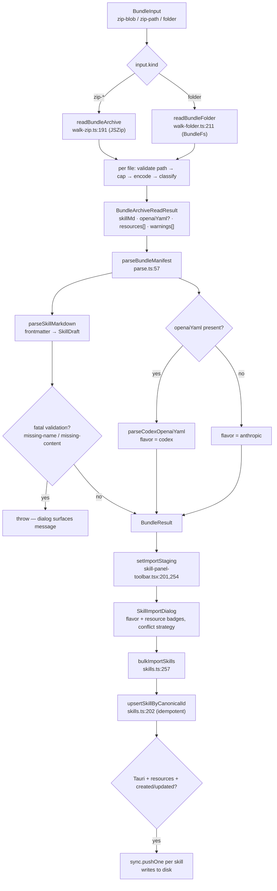
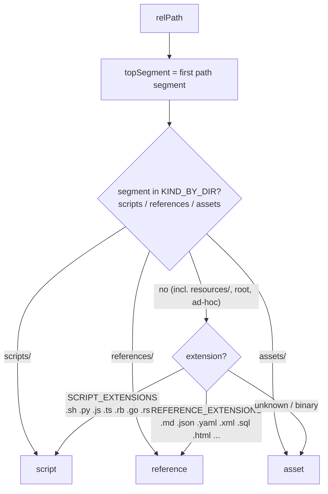

# Bundle import

<Status variant="stable">Import pipeline — lib/skills/bundle (6 modules) · zip / folder / Codex YAML</Status>

<TLDR>
  `loadBundle(input)` (`lib/skills/bundle/loader.ts:65`) is the single entry point. It accepts a
  `BundleInput` union (`loader.ts:26` — `zip-blob` / `zip-path` / `folder`), walks the files with
  `readBundleArchive` (`walk-zip.ts:191`) or `readBundleFolder` (`walk-folder.ts:211`), then parses the
  manifest layer with `parseBundleManifest` (`parse.ts:57`). Every non-SKILL.md file is classified by
  `inferResourceKind` (`classify.ts:93`) and capped by the shared `limits.ts` constants. The result is one
  `SkillDraft` + `resources[]`; the toolbar stages it (`skill-panel-toolbar.tsx:201`) and the dialog persists
  it through `bulkImportSkills` (`skill-import-dialog.tsx:68` → `lib/db/skills.ts:257`), which routes
  canonical-id drafts to the idempotent `upsertSkillByCanonicalId` (`skills.ts:202`). Codex `openai.yaml` is
  **import-only** and there is **no bundle (zip) export** — only per-skill `SKILL.md`.
</TLDR>

## Inputs and the loader

`loadBundle` is deliberately decoupled from persistence: nothing in `lib/skills/bundle/` writes to Dexie or
the filesystem (`loader.ts:13`). It composes the walkers with the parser and returns a `BundleResult`
(`loader.ts:31`).

```ts
// loader.ts:26 — three ways in, one BundleResult out
export type BundleInput =
  | { kind: "zip-blob"; bytes: Uint8Array | ArrayBuffer; fallbackName?: string }
  | { kind: "zip-path"; path: string; fallbackName?: string }
  | { kind: "folder"; path: string; fallbackName?: string; fs?: BundleFs }
```

| Input kind | Walker | Shell | Notes |
| --- | --- | --- | --- |
| `zip-blob` | `readBundleArchive` | web · mobile · Tauri | bytes already in memory (file picker) |
| `zip-path` | `readBundleArchive` | Tauri | reads the file lazily via `@tauri-apps/plugin-fs` (`loader.ts:54`) |
| `folder` | `readBundleFolder` | Tauri | walks a directory tree through the `BundleFs` adapter |

The body picks a walker per `input.kind`, derives a `fallbackName` (explicit → root dir name → basename of
the path), then feeds the walker's `skillMd` + optional `openaiYaml` into `parseBundleManifest`
(`loader.ts:110`). Fatal validation throws; everything non-fatal rides along on the draft and the
`warnings` / `nonFatalValidationErrors` arrays (`loader.ts:116`).

```ts
// loader.ts:31 — the unified output the dialog consumes
export interface BundleResult {
  draft: SkillDraft
  resources: Array<Omit<SkillResourceDraft, "skillId">>
  flavor: BundleFlavor              // "anthropic" | "codex"
  codexMeta?: CodexOpenaiMeta       // present only when agents/openai.yaml existed
  rootDirName?: string
  nonFatalValidationErrors: SkillValidationError[]
  warnings: string[]
}
```

## The pipeline



### Walking a zip — `walk-zip.ts`

`readBundleArchive` (`walk-zip.ts:191`) loads the archive with JSZip and accepts exactly two layouts: a flat
`SKILL.md` at the root, or a single-nested `<name>/SKILL.md`. Anything deeper is rejected so the bundle's
directory name stays unambiguous (`findSkillRoot:122`, throws at `walk-zip.ts:144`); the nested directory name
becomes `rootDirName` (`walk-zip.ts:212`).

- **Total cap.** `collectEntries` (`walk-zip.ts:96`) materialises every non-directory entry while enforcing
  `MAX_ZIP_TOTAL_BYTES` (`walk-zip.ts:107`); the raw buffer is also pre-checked before unzip (`walk-zip.ts:195`).
- **Side-car extraction.** `agents/openai.yaml` (or `.yml`) is pulled out separately as the Codex manifest and
  never treated as a resource (`walk-zip.ts:228`).
- **Per-file handling.** For each remaining entry the walker skips files outside the root (`walk-zip.ts:220`),
  runs `validateResourcePath` (`walk-zip.ts:234`), enforces the per-file `MAX_RESOURCE_BYTES_WEB` cap
  (`walk-zip.ts:241`), classifies it, warns when it lives outside the canonical dirs (`walk-zip.ts:252`), and
  stops once `MAX_RESOURCES_PER_SKILL` is reached (`walk-zip.ts:258`).
- **Encoding.** `encodeResource` (`walk-zip.ts:161`) decodes text-like extensions (`TEXT_EXTENSIONS:24`) as
  UTF-8 but falls back to base64 when the decode produces a replacement char (`walk-zip.ts:168`) — defensive
  against mis-named binaries. The base64 path uses a chunked, browser-safe `btoa` encoder (`walk-zip.ts:172`).

### Walking a folder — `walk-folder.ts`

The Tauri-side walker reaches the filesystem through a tiny adapter so tests can swap in an in-memory
implementation without mocking `@tauri-apps/plugin-fs`:

```ts
// walk-folder.ts:22 — the seam that makes the folder walker testable
export interface BundleFs {
  readDir(path: string): Promise<BundleFsEntry[]>
  readTextFile(path: string): Promise<string>
  readFile(path: string): Promise<Uint8Array>
  exists(path: string): Promise<boolean>
}
```

`readBundleFolder` (`walk-folder.ts:211`) requires `<root>/SKILL.md` and throws when it is missing
(`walk-folder.ts:218`); `agents/openai.yaml` is optional (`walk-folder.ts:223`). The default adapter is built
lazily from `@tauri-apps/plugin-fs` so the module stays jsdom-safe (`walk-folder.ts:113`). `recurse`
(`walk-folder.ts:151`) is a depth-first walk that skips `SKILL.md` and the Codex side-car (`walk-folder.ts:166`)
and applies the **same** caps, path validation, classification, and encoding as the zip walker. The two walkers
emit the identical `BundleArchiveReadResult` shape (`walk-folder.ts:237`) so the loader stitches either source
into the same draft.

## Classification

`inferResourceKind` (`classify.ts:93`) decides each file's `SkillResourceKind`. **Canonical subdir name wins**;
only when no canonical dir matches does it fall back to per-file extension, then `asset` as the floor.



| Signal | Source | Result |
| --- | --- | --- |
| `scripts/` dir | `KIND_BY_DIR` (`classify.ts:21`) | `script` |
| `references/` dir | `KIND_BY_DIR` | `reference` |
| `assets/` dir | `KIND_BY_DIR` | `asset` |
| executable extension | `SCRIPT_EXTENSIONS` (`classify.ts:28`) | `script` |
| doc / structured-text extension | `REFERENCE_EXTENSIONS` (`classify.ts:53`) | `reference` |
| anything else | fallback (`classify.ts:103`) | `asset` |

`isCanonicalBundleDir` (`classify.ts:84`) is the case-insensitive check the walkers use to decide whether to
attach a "lives outside scripts/ references/ assets/" soft warning. This is what lets a real-world bundle ship
a `resources/` directory (common in Claude Code skills) and still have its `.py` helpers land as `script`
rather than all being lumped under `asset`.

<Callout type="info" title="Classification is per-file outside the canonical dirs">
  A file under `references/build.sh` is a `reference` (the directory name is an explicit authoring signal and
  wins), but the same `build.sh` under `resources/` or at the bundle root is a `script` (extension-based). The
  directory convention is loose by design — classification never drops a file, it only re-buckets it.
</Callout>

## Limits and path safety

All caps live in one module (`limits.ts`) so the loader, the Dexie persistence layer, and the Rust ↔ TS disk
mirror agree on the same numbers (`limits.ts:1`).

| Constant | Value | Mirrors |
| --- | --- | --- |
| `MAX_ZIP_TOTAL_BYTES` (`limits.ts:21`) | 200 MB | the VSIX installer's total cap |
| `MAX_RESOURCE_BYTES_WEB` (`limits.ts:22`) | 16 MB per file | the web/mobile inline (Dexie) ceiling |
| `MAX_RESOURCE_BYTES_DISK` (`limits.ts:23`) | 2 MB per file | the Rust `MAX_RESOURCE_BYTES` native cap |
| `MAX_RESOURCES_PER_SKILL` (`limits.ts:24`) | 50 entries | the Rust per-skill cap |

`validateResourcePath` (`limits.ts:32`) is the single source-of-truth guard mirroring the Rust
`validate_resource_path` rules — it rejects empty paths, `..` traversal, leading absolute separators, and empty
or `.` segments. `validateDirName` (`limits.ts:48`) mirrors `validate_dir_name`: ASCII alphanumerics plus
`-` and `_`, length 1–64, no leading/trailing `-`.

<Callout type="warn" title="Two per-file caps, not one">
  The walkers enforce `MAX_RESOURCE_BYTES_WEB` (16 MB) at import time. The tighter 2 MB
  `MAX_RESOURCE_BYTES_DISK` is **not** enforced here — a bundle authored on the web can hold resources between
  2 and 16 MB. They only surface a per-resource `tooLargeForDisk` warning when the mirror push later writes
  them to a Tauri device. See [Native sync &amp; security](./native-sync-and-security).
</Callout>

## Parsing the manifest

`parseBundleManifest` (`parse.ts:57`) owns the conversion from "two text blobs" to "a `SkillDraft` plus typed
Codex metadata". It delegates the frontmatter parse to `parseSkillMarkdown` (`lib/claude/skills-io.ts`), which
recognizes `name`, `description`, `allowed-tools` / `allowedTools`, `tags`, `category`, `version`, `author`,
and `license`. The fatal-vs-non-fatal split mirrors `lib/skills/marketplace-install.ts`:

```ts
// parse.ts:38 — only these two refuse the import loudly
const FATAL_VALIDATION_CODES = new Set<SkillValidationError["code"]>([
  "missing-name",
  "missing-content",
])
```

`validateSkill` runs over the draft; a fatal code throws (`parse.ts:109`), everything else is filtered onto
`nonFatalValidationErrors` (`parse.ts:112`) and persisted on the resulting `Skill` row so the editor can flag
it. When `openaiYaml` is present, `flavor` flips to `"codex"` (`parse.ts:69`) and the Codex meta is folded in:

- **Display-name precedence** — SKILL.md frontmatter > Codex `interface.display_name` > filename fallback. The
  Codex display name only overrides when the markdown `name` equals the supplied fallback, signalling the user
  never set one (`parse.ts:77`).
- **Implicit-invocation warning** — `policy.allow_implicit_invocation === false` adds a warning that the skill
  is opt-in only (`parse.ts:82`).
- **MCP dependency warning** — `dependencies.tools[]` of `type === "mcp"` are surfaced as a warning; bundle
  import never auto-wires MCP servers (`parse.ts:88`).

### Codex `agents/openai.yaml`

`parseCodexOpenaiYaml` (`codex-yaml.ts:72`) reads the OpenAI Codex CLI skill side-car. It **never throws** on
unknown or unexpected shapes — every deviation lands in `result.warnings` (`codex-yaml.ts:65`) and a YAML load
failure is wrapped rather than propagated (`codex-yaml.ts:76`). The recognized schema uses snake_case keys
(`codex-yaml.ts:43`: `display_name`, `short_description`, `allow_implicit_invocation`, `dependencies.tools`),
which the parser maps to the camelCase `CodexOpenaiMeta`:

```ts
// codex-yaml.ts:36 — the typed projection of openai.yaml
export interface CodexOpenaiMeta {
  interface?: CodexInterfaceMeta      // displayName, shortDescription, icons, brandColor, defaultPrompt
  policy?: CodexPolicyMeta            // allowImplicitInvocation
  toolDependencies: CodexToolDependency[]
  warnings: string[]
}
```

<Callout type="warn" title="Codex YAML is read-only — no round-trip">
  cognia treats the in-app `Skill` row as canonical. `agents/openai.yaml` is parsed once on import and never
  re-serialized; there is no Codex export. Unknown top-level keys produce a loud warning
  (`codex-yaml.ts:103`) but the parse still succeeds.
</Callout>

## Staging and persistence

The toolbar exposes four import entry points, each of which builds drafts and calls `setImportStaging`:

| Action | Handler | Path |
| --- | --- | --- |
| From markdown | `handleImportFromMarkdown` (`skill-panel-toolbar.tsx:121`) | plain `.md` via `parseSkillMarkdown` directly |
| From bundle zip | `handleImportFromBundleZip` (`:174`) | `loadBundle({ kind: "zip-blob" })` (`:184`), `flavor` extracted (`:205`) |
| From bundle folder | `handleImportFromBundleFolder` (`:221`) | Tauri directory picker → `loadBundle({ kind: "folder" })` (`:236`) |
| From Claude Code | `handleImportFromClaudeCode` (`:274`) | scans `~/.claude/skills`, tags every draft `"claude-code"` (`:294`) |

Bundle imports stamp a `canonicalId` on the draft — `bundle:zip:<slug>` (`:196`) or `bundle:folder:<slug>`
(`:248`) — which is what makes re-import idempotent. Everything stages through `setImportStaging`
(`:201`, `:254`) and is handed to `SkillImportDialog`.

The dialog shows a flavor badge (`skill-import-dialog.tsx:132`), a resource-count badge (`:141`), and a
conflict-strategy radio group — `skip` / `duplicate` / `overwrite` (`:190`). Apply calls `bulkImportSkills`
(`:68`). For Tauri imports that produced resources and created or updated at least one row, the dialog then
re-looks-up each skill by `canonicalId` and fires `sync.pushOne` per skill to materialise the bundle on disk
(`:84`).

```ts
// skill-import-dialog.tsx:84 — auto-mirror bundle imports to disk on Tauri
if (isTauri() && hasResources && (report.created > 0 || report.updated > 0)) {
  // re-lookup by canonicalId (the dialog never saw the row id) → push each
  for (const id of targetIds) {
    if (!(await getSkill(id))) continue
    await sync.pushOne(id)
  }
}
```

### `bulkImportSkills` and the canonical-id upsert

`bulkImportSkills` (`lib/db/skills.ts:257`) splits on whether a draft carries a `canonicalId`. Canonical drafts
take the idempotent upsert path (`skills.ts:280`); drafts without one fall through to the name-collision
strategy (`skills.ts:290`–`323`).

```ts
// skills.ts:280 — bundle / marketplace drafts never duplicate
if (draft.canonicalId) {
  const { skill, created } = await upsertSkillByCanonicalId({
    draft,
    canonicalId: draft.canonicalId,
  })
  byName.set(skill.name.toLowerCase(), skill)
  if (created) result.created += 1
  else result.updated += 1
  continue
}
```

`upsertSkillByCanonicalId` (`skills.ts:202`) finds an existing row by `canonicalId`, updates it in place — so
`Skill.id` stays stable across re-imports — and, crucially, calls `replaceResourcesForSkill` (`skills.ts:230`),
which replaces the **entire** resource set. The contract is "what's in the zip is what's in the DB": dropping a
file from the bundle and re-importing removes it from the row. The same `replaceResourcesForSkill` runs on the
`overwrite` name-collision path (`skills.ts:313`).

<Callout type="info" title="Shared with the marketplace and plugin paths">
  The canonical-id upsert is the single re-import seam: `lib/skills/marketplace-install.ts` reuses the same
  `parseSkillMarkdown` + `validateSkill` + `upsertSkillByCanonicalId` chain (see [Marketplace](./marketplace)),
  and plugin-shipped `archive` skills call `loadBundle({ kind: "zip-path" })` (`lib/claude/skills-io.ts:309`)
  at send time to extract SKILL.md — re-extracted on every resolution, with no caching layer.
</Callout>

## Export — single-file only

There is **no bundle (zip) export**. The only export path is per-skill `SKILL.md`:
`exportSkillsToDirWithFeedback` (`lib/skills/export-toast.ts:29`) serializes each skill via `serializeSkill`
(`lib/claude/skills-io.ts:94`) to a kebab-case `.md` filename.

```ts
// skills-io.ts:94 — what gets serialized (and what doesn't)
const data: Record<string, unknown> = { name: skill.name }
// description, allowed-tools, tags, category, version, author, license …
// id / canonicalId / marketplaceSkillId are intentionally NOT emitted
```

Omitting `id` / `canonicalId` / `marketplaceSkillId` is deliberate: a re-imported export comes back in as a
plain `custom` skill rather than re-binding to its original row. Combined with the import asymmetries above,
the round-trip story is intentionally lossy in a few places:

<Callout type="warn" title="Dormant / one-way pieces">
  - **No zip export.** Resources stay inline in Dexie; the only way out is the disk mirror (Tauri) — there is
    no "export bundle" button.
  - **Codex YAML is import-only** — `agents/openai.yaml` never round-trips.
  - **Plugin archive skills are re-extracted on every resolution** (`skills-io.ts:309`) — no cache.
  - **Folder import is Tauri-only** — outside Tauri the handler toasts `importFromClaudeDesktopOnly`
    (`skill-panel-toolbar.tsx:222`).
</Callout>

<Cards>
  <Card title="Skills overview" href="./index" />
  <Card title="Data model" href="./data-model" />
  <Card title="Native sync &amp; security" href="./native-sync-and-security" />
  <Card title="Marketplace" href="./marketplace" />
</Cards>
