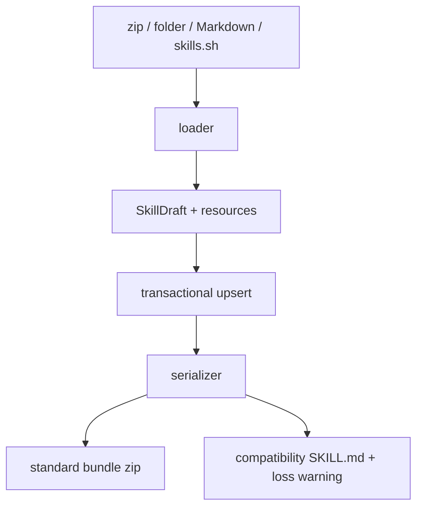

# Bundle import and export

<Status variant="stable">Symmetric zip loader and serializer</Status>

<TLDR>
  Cognia imports a zip, local folder, Markdown file, native Skill, marketplace snapshot, or skills.sh file set into one `SkillDraft` plus resources. Standard export writes a real bundle zip; compatibility export writes only `SKILL.md` and warns before omitting files.
</TLDR>

## Parsing and compatibility

`lib/claude/skills-io.ts` implements Agent Skills frontmatter:

- `name` becomes the portable slug; Cognia display name is restored from `metadata.cognia.display-name`.
- `description` is required for portable export.
- `compatibility` is limited to 500 characters.
- `metadata` accepts string keys and values.
- `allowed-tools` exports as a space-separated string and imports arrays, commas, whitespace, and newlines.

Cognia keeps `author`, `version`, `category`, `tags`, inline-resource paths, display name, and invocation policy under `metadata`. Known edited fields win during serialization; unknown YAML fields remain in `frontmatterExtensions` with their YAML value semantics.

Claude `disable-model-invocation` and Codex `allow_implicit_invocation` map to `invocationPolicy`. Other Claude activation fields remain preserved without gaining Cognia runtime behavior.

## Codex YAML

When `agents/openai.yaml` exists, the loader parses interface, policy, and dependency hints but also stores the original text in `codexOpenAiYaml`. Dependencies are visible and exportable; Cognia never installs MCP servers or broadens MCP permissions automatically. Editing the virtual YAML file requires a mapping root and valid YAML. Unknown mappings remain present when known policy fields are synchronized.

## Standard export

`lib/skills/bundle/serializer.ts` writes:

```text
<slug>/SKILL.md
<slug>/agents/openai.yaml
<slug>/scripts/...
<slug>/references/...
<slug>/assets/...
```

Base64 resources are decoded to binary bytes. A single Skill downloads as `<slug>.zip`. A batch downloads as one date-named zip with one root directory per Skill. Duplicate roots and portability errors stop export before a file is saved.

The serializer and loader share JSZip and the existing binary save bridge. A load → export → load cycle preserves body, resource paths and bytes, inline flags, standard metadata, unknown frontmatter, and Codex YAML semantics.

## Compatibility Markdown export

The detail menu retains single-file Markdown export. If resources or `agents/openai.yaml` would be omitted, a confirmation dialog lists those losses first. Use bundle export for a portable, lossless package.

## Persistence semantics

Import staging sends canonical bundles to `upsertSkillByCanonicalId`. Resource replacement and the Skill row update share one transaction. `resources: undefined` preserves resources, while `resources: []` clears them. skills.sh uses the same path and recognizes `agents/openai.yaml` as vendor configuration instead of an asset.


