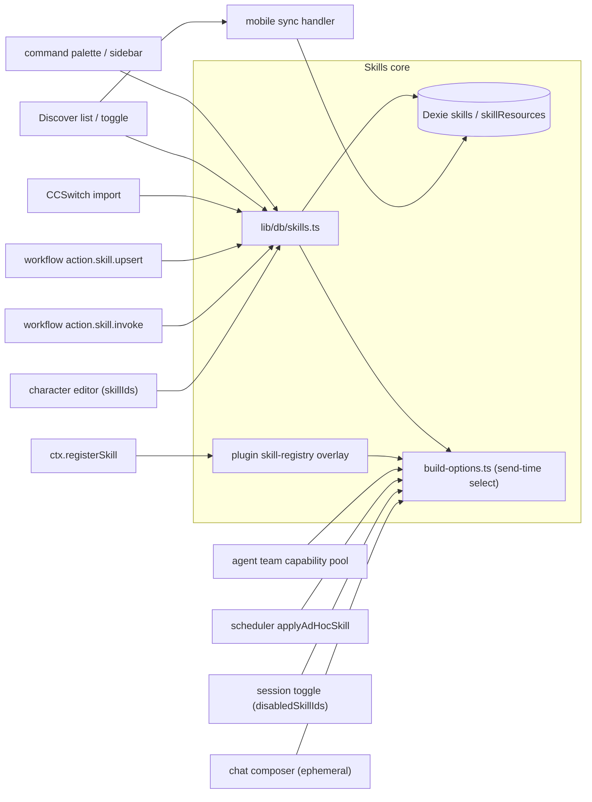

# Consumption Surfaces

<Status variant="stable">Integration map — 10 surfaces consume the skills table and bridge</Status>

<TLDR>
  Beyond Settings → Skills, ten surfaces read or write the `skills` Dexie table (and the plugin
  skill-registry overlay). Two **chat** surfaces attach skills per-send (ephemeral picker) and disable
  them per-session (`disabledSkillIds`). The **character editor** binds a persistent `skillIds` set via a
  real multi-select. **Workflow nodes** resolve (`action.skill.invoke`) and author (`action.skill.upsert`)
  skills. The **scheduler** splices one ad-hoc skill plus per-task disables onto the same
  `resolveSendOptions` pipeline. **CCSwitch** is a second importer; **Discover** lists + toggles + syncs;
  the **command palette / sidebar** route to the manager; **plugins** contribute overlay skills; **agent
  teams** resolve per-teammate capability pools; and the **mobile sync handler** ships the table to the
  device. All read paths converge on `lib/db/skills.ts` and the send-time selection in
  `lib/claude/build-options.ts`.
</TLDR>



## Chat composer (ephemeral attach)

`components/chat/skill-picker.tsx:28` is a multi-select `CommandDialog` over `listSkills()` (`:30`),
filtering to enabled, non-builtin rows (`:31`) and toggling ids through `onChange` (`:33-35`). The picks
render as removable chips above the input via `components/chat/composer/skill-chip-row.tsx:19`, which
resolves names with `listSkillsByIds(ids)` (`:22`) and exposes a per-chip remove button (`:32-41`).
`composer.tsx` mounts `SkillChipRow` for the active draft.

The selected ids live in the chat store's `ephemeralSkillIds` and are consumed once — they are folded into
the send and cleared after the message goes out (the send-time fold is covered in
[Loading & injection](./loading-and-injection)).

## Session toggle (persistent per-session disable)

`components/chat/chat-header.tsx:128` reads the active character's bound skills with
`useSkillsByIds(character?.skillIds)` and the per-session disable set from `session.disabledSkillIds`
(`:129-132`). When the character has skills, the header renders a `SkillsBadge` (`:433`) whose
`onToggle` adds/removes an id in `disabledSkillIds` and persists it with `updateSession` (`:437-444`):

```tsx title="components/chat/chat-header.tsx:437"
onToggle={async (skillId, nextDisabled) => {
  const current = new Set(session.disabledSkillIds ?? [])
  if (nextDisabled) current.add(skillId)
  else current.delete(skillId)
  await updateSession(session.id, { disabledSkillIds: [...current] })
}}
```

A disabled id is a soft mute: the skill stays bound to the character but is filtered out at send time.

## Character editor

`components/settings/characters-section.tsx:189` loads the catalog with `useLiveQuery(listSkills())` and
passes it down as `skillsCatalog`. The edit dialog seeds its form `skillIds` from `character.skillIds`
(`:707`, type `EditingCharacter` at `:1317`) and renders a **real picker** — an `ItemMultiSelect` whose
`selectedIds`/`onChange` drive the bound set:

```tsx title="components/settings/characters-section.tsx:1890"
<ItemMultiSelect
  label={tEditor("skills")}
  helpText={tEditor("skillsHint")}
  items={skillsCatalog.map((sk) => ({ id: sk.id, name: sk.name, description: sk.description }))}
  selectedIds={s.skillIds}
  onChange={(ids) => setS({ ...s, skillIds: ids })}
/>
```

The list row shows a read-only summary — skill count plus the first names — at `:744-748` / `:904-907`.

<Callout type="info" title="The character → skill binding is fully wired">
  Earlier drafts of this subsystem only persisted `skillIds` with no UI control. That gap is closed: the
  edit dialog ships the `ItemMultiSelect` above, and the bound set is what `resolveSendOptions` reads on
  every turn (interactive, scheduled, and teammate dispatch alike). There is no dormant field here.
</Callout>

## Workflow nodes

`lib/workflow/nodes/built-ins.ts` registers two skill nodes; their inspector schemas live in
`lib/workflow/nodes/params-schemas.ts`.

**`action.skill.invoke` (`built-ins.ts:744`)** resolves a comma-separated `skillIds` param (`:747`) into
one concatenated markdown body for downstream AI nodes to splice into a `systemPrompt`. An empty list
returns an empty result rather than throwing (`:752-754`); ids that miss the Dexie table fall back to the
plugin overlay via `getPluginSkill` (`:771`). It records usage best-effort so the manager's "Recent" sort
updates (`:781`):

```ts title="lib/workflow/nodes/built-ins.ts:779"
const markdown = resolved.map((s) => `### ${s.name}\n\n${s.markdown}`).join("\n\n")
void recordSkillUsage(ids).catch(() => undefined)
return { output: { skills: resolved.map((s) => ({ id: s.id, name: s.name })), markdown } }
```

**`action.skill.upsert` (`built-ins.ts:918`)** lets a workflow keep a skill in sync idempotently: with a
`skillId` it patches an existing row via `updateSkill` (`:928-940`, throws non-retryable when the id is
unknown); without one it requires `name` + `content` (`:942`) and creates via `createSkill` (`:947`).

## Scheduler

Skill-style scheduled tasks reach full parity with interactive chat. Before resolution, the executor
splices any per-task `disabledSkillIds` onto a synthetic session clone so `resolveSendOptions` reads them
directly (`lib/scheduler/executors/index.ts:378-383`). After resolution it appends one **ad-hoc** skill on
top of the character's own set with `applyAdHocSkill` (`:306`, called at `:403`):

```ts title="lib/scheduler/executors/index.ts:311"
const skills = await listEnabledSkillsByIds([skillId])
if (skills.length === 0) return base
out.systemPrompt = renderSkillsSection(skills) // spliced onto resolved prompt
out.allowedTools = unionStrings(out.allowedTools, skills.flatMap((s) => s.allowedTools ?? []))
```

The effect: a scheduled run gets the same character skills, session disables, and one extra task-scoped
skill that the composer would have produced.

## CCSwitch import

`components/settings/ccswitch/tabs/skills-tab.tsx:26` lists CCSwitch's skills table
(`useCcswitchStatus` at `:29`, `useCcswitchSkills` at `:30-35`). It default-selects only **inline** rows —
external-file rows (body stored on disk, `content` empty) are flagged and unselectable (`:42-45`). Submit
calls `importCcswitchSkills(importable)` (`:67`) and prints a summary (`:69-73`).

`lib/ccswitch/import.ts:138` maps each `CcswitchSkill` to a fresh row through `createSkill` (`:165`),
skipping external-file rows and name collisions (`:153-163`). The data crosses the Tauri boundary via
`ccswitchListSkills` → `ccswitch_list_skills` (`lib/ccswitch/client.ts`), and the shape is
`CcswitchSkill { id, name, description?, content, sourcePath? }` (`types/ccswitch/content.ts`).

The tab is desktop-only — web mode shows a `SettingsAlert` instead (`skills-tab.tsx:80-84`).

## Discover

`hooks/discover/use-discover-query.ts:115` subscribes to `listSkills()` for the `"skills"` category and
favorites view. The filter/sort branch keeps an enabled-only option (`status !== "disabled"`, `:195`) and
sorts alphabetically (`:196`), emitting `DiscoverItem` rows of kind `"skill"` (`:197`). The grid uses the
`emptySkills` empty-state key (`components/discover/discover-grid.tsx:42`) and the category is registered
in `lib/discover/categories.ts:55` (Sparkles icon, `agents` group).

The inspector routes a skill item to `SkillInspector` (`discover-inspector.tsx:128` / `:201`). Its toggle
flips status via `setSkillStatus` (`:206`) **and** enqueues an outbound mobile-sync command so the change
propagates to the device (`:207-211`):

```tsx title="components/discover/discover-inspector.tsx:204"
const onToggle = (next: boolean) => {
  void setSkillStatus(skill.id, next ? "enabled" : "disabled")
  void enqueue({ command: "skill_set_enabled", payload: { id: skill.id, enabled: next }, label: ... })
}
```

## Command palette & sidebar

`components/desktop/command-palette.tsx:268` adds a "Manage Skills" command that routes to the Skills
settings section (`handleSettings("skills")`). The shell sidebar exposes the same destination — the
`skills` icon is mapped in `lib/shell/sidebar-nav.ts:42`, and the Discover category metadata carries the
`skills` entry (`lib/discover/categories.ts:55`). Both are pure navigation, not data consumers.

## Plugins

Plugins shipping the `skills` capability call `ctx.registerSkill(def)` (`lib/plugin/core/context.ts:742`),
which writes into the overlay registry (`lib/plugin/registries/skill-registry.ts:19`, built on
`createOverlayRegistry`). On disable the manager calls `unregisterSkillsByPlugin(pluginId)` to drop every
skill the plugin contributed in one shot. Overlay skills are **not** in Dexie — they resolve at send time
through the skills bridge, where a plugin id wins over a Dexie row on collision (see
[Loading & injection](./loading-and-injection)).

Character packs contribute skills indirectly: `defineCharacterPack` (`lib/plugin/sdk/define-character-pack.ts`,
ADR-0030) overlays characters whose own `skillIds` are honored by `resolveSendOptions`, so a pack character
pulls in skills the same way an authored character does.

## Agent teams

Each teammate gets a lazily-computed capability pool. `team-run-context.ts:64` holds a
`resolvedCapabilities` map (skills + MCP + native tools + character + subagents + a2ui), populated on first
dispatch by `resolveTeammateCapabilities` (comment `:57-62`). Because teammate dispatch goes through
`resolveSendOptions`, a teammate character's bound `skillIds` apply exactly as they do in interactive chat
(persona resolution — system prompt, model, allowed tools, skills, MCP — noted in
`lib/ai/agent/agent-executor.ts:88-89`).

## Mobile sync

`lib/sync/handlers/skills.ts:8` exports `syncSkills(transport, cursor)`, registering the `skills` table on
the unified Dexie-sync transport so rows ride to the mobile shell:

```ts title="lib/sync/handlers/skills.ts:8"
export function syncSkills(transport: Transport, cursor: SyncCursor): Promise<SyncOutcome> {
  return runSyncHandler<Skill>({ table: "skills", getTable: () => getDb().skills }, transport, cursor)
}
```

Outbound status changes are enqueued from the Discover inspector (`skill_set_enabled`, see above), so a
toggle made on desktop reconciles on the device.

## Backup / export & external agents

Two more touchpoints feed off the same data:

- **Backup domain** — the transfer manifest exposes a single `skills` domain that exports **user skills +
  their resources only**, filtering built-ins in memory (`lib/data/domain/index.ts:128-137`). Details in
  [Data model](./data-model).
- **External agents** — the external-CLI instruction stack builds a progressive skills prompt via
  `buildProgressiveSkillsPrompt` (`lib/ai/instructions/external-agent-instruction-stack.ts:122-124`) for
  Codex / Claude Code / Gemini, and the Codex disk mirror syncs to `~/.agents/skills`. See
  [Loading & injection](./loading-and-injection) and [Native sync & security](./native-sync-and-security).

## ADR cross-references

| ADR | Topic |
| --- | --- |
| [0026 — Built-in skills & lark CLI bridge](../../adr/0026-builtin-skills-and-lark-cli-bridge) | The skills subsystem foundation and built-in seeding |
| [0011 — Workflows subsystem](../../adr/0011-workflows-subsystem) | The node runtime the skill nodes register into |
| [0034 — Workflow editor completeness & plugin parity](../../adr/0034-workflow-editor-completeness-and-plugin-parity) | Node inspector schemas and plugin node parity |
| [0022 — Agent team runtime hardening](../../adr/0022-agent-team-runtime-hardening) | Teammate dispatch and capability resolution |
| [0032 — Agent team plugin integration](../../adr/0032-agent-team-plugin-integration) | Per-teammate plugin capability pools |
| [0027 — Mobile offline & discovery](../../adr/0027-mobile-offline-and-discovery) | The Discover surface and the mobile sync transport |

## Related

<Cards>
  <Card title="Skills overview" href="./index" description="What a skill is and how the subsystem is structured." />
  <Card title="Loading & injection" href="./loading-and-injection" description="Where ephemeral, session, character, plugin, and external-agent skills converge at send time." />
  <Card title="Visual workflows" href="../visual-workflows/index" description="The node runtime behind action.skill.invoke / upsert." />
  <Card title="Plugin system" href="../plugin-system/index" description="How plugins register overlay skills and character packs." />
</Cards>
