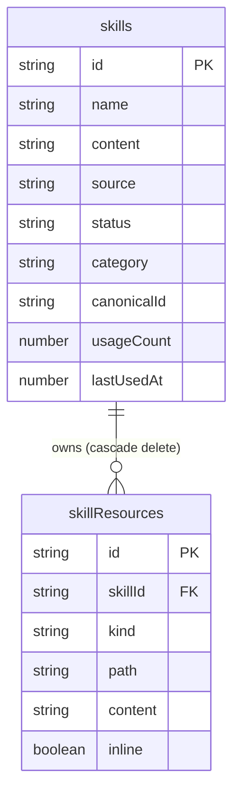
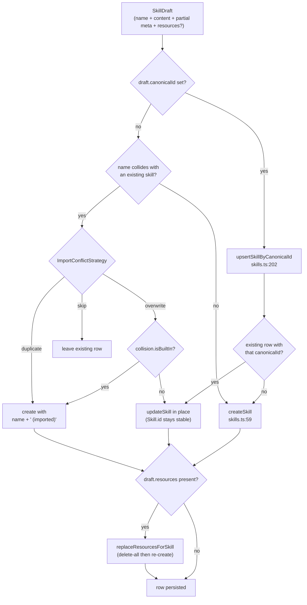

# Data model

<Status variant="stable">Core data layer — lib/claude/types.ts · lib/db/skills.ts · Dexie v8 tables</Status>

<TLDR>
  A skill is one IndexedDB row (`Skill`, `lib/claude/types.ts:2362`) plus zero or more bundled files
  (`SkillResource`, `types.ts:2441`) in a sibling table. Both live in the `skills` /
  `skillResources` stores declared at Dexie **v8** (`lib/db/schema.ts:461`). All writes go through
  `lib/db/skills.ts`: `createSkill:59` / `updateSkill:91` / `deleteSkill:98` cascade resources;
  `upsertSkillByCanonicalId:202` is the idempotent re-import path. Five read-only built-ins seed lazily
  (`seedBuiltInSkills:344`), usage telemetry is bumped fire-and-forget from
  `lib/claude/build-options.ts:402`, and backup exports user rows only (`lib/data/domain/index.ts:128`).
</TLDR>

## The two row types

A skill is **pure markdown** plus metadata; it has no filesystem side effects in this version. The body is
appended verbatim under a `## <name>` heading at send time (`renderSkillsSection`, `skills.ts:339`). Resources
are an optional bundle of scripts, references, and assets stored inline in IndexedDB.

```ts
// lib/claude/types.ts:2362 — abridged
export interface Skill {
  id: string
  name: string
  content: string                  // markdown body, appended under "## <name>"
  allowedTools?: string[]          // unioned with the character's whitelist
  isBuiltIn?: boolean              // back-compat; prefer source === "builtin"
  source?: SkillSource             // default "custom"
  status?: SkillStatus             // default "enabled"; "disabled" hides at send time
  category?: SkillCategory         // default "custom"
  canonicalId?: string             // cross-source identity, e.g. "registry:ai-elements"
  usageCount?: number              // bumped each time the skill is sent
  lastUsedAt?: number              // indexed → drives the "recent" sort
  // ...createdAt, updatedAt
}
```

### Skill fields

| Field | Type | Default | Notes |
| --- | --- | --- | --- |
| `id` | `string` | generated | `skill_` prefix (`skills.ts:9`); stays stable across re-imports |
| `name` | `string` | `"Untitled skill"` | trimmed on create (`skills.ts:63`) |
| `description?` | `string` | — | shown in the manager UI |
| `content` | `string` | — | markdown body appended verbatim under `## <name>` |
| `allowedTools?` | `string[]` | — | unioned with the character whitelist at send time |
| `tags?` | `string[]` | — | free-form labels |
| `isBuiltIn?` | `boolean` | — | seeded built-ins are read-only; kept for back-compat |
| `source?` | `SkillSource` | `"custom"` | preferred origin discriminant over `isBuiltIn` |
| `status?` | `SkillStatus` | `"enabled"` | `"disabled"` hides the skill at send time without deleting |
| `category?` | `SkillCategory` | `"custom"` | drives the UI sidebar and icons |
| `version?` `author?` `license?` | `string` | — | SKILL.md frontmatter metadata |
| `usageCount?` | `number` | `0` | analytics counter, unindexed |
| `lastUsedAt?` | `number` | — | indexed, drives the recent sort |
| `validationErrors?` | `SkillValidationError[]` | — | non-fatal, from `lib/skills/validate.ts` |
| `canonicalId?` | `string` | — | cross-source identity for dedup on re-import |
| `marketplaceSkillId?` | `string` | — | marketplace item this row was installed from |
| `nativeDirectory?` | `string` | — | `~/.claude/skills/<dir>` when synced to disk |
| `syncOrigin?` | `SkillSyncOrigin` | `"frontend"` | which source last wrote the row |
| `syncFingerprint?` | `string` | — | hash of frontmatter, body, and resources |
| `lastSyncedAt?` `lastSyncError?` | `number` / `string null` | — | sync bookkeeping |
| `createdAt` `updatedAt` | `number` | `Date.now()` | epoch ms |

### Type aliases (`types.ts:2418`)

| Alias | Members |
| --- | --- |
| `SkillCategory` | creative-design, development, enterprise, productivity, data-analysis, communication, meta, custom |
| `SkillSource` | builtin, custom, imported, generated, marketplace |
| `SkillStatus` | enabled, disabled, error, loading |
| `SkillSyncOrigin` | frontend, builtin, native, marketplace |
| `SkillResourceKind` | script, reference, asset |

### SkillResource (`types.ts:2441`)

A `SkillResource` is one file bundled with a skill: a `script` (executable), a `reference` (markdown/text
companion), or an `asset` (image, json, anything else). Text is stored inline; binary assets store an opaque
base64 payload.

| Field | Type | Notes |
| --- | --- | --- |
| `id` | `string` | `skres_` prefix (`skill-resources.ts:9`) |
| `skillId` | `string` | owning skill, always set by the persister |
| `kind` | `SkillResourceKind` | script, reference, or asset |
| `name` | `string` | display name in the resource manager |
| `path` | `string` | relative, e.g. `scripts/foo.sh`; case-insensitive unique per skill |
| `content` | `string` | utf-8 text or base64 |
| `encoding?` | `"utf-8" \| "base64"` | defaults to `"utf-8"` (`skill-resources.ts:60`) |
| `mimeType?` `size?` | `string` / `number` | derived if omitted |
| `inline?` | `boolean` | when true, body is inlined into the system prompt at send time |
| `createdAt` `updatedAt` | `number` | epoch ms |

<Callout type="info" title="Validation is advisory, not a write gate">
  `SkillValidationError` (`types.ts:2461`) carries a `code` discriminant —
  `missing-name`, `name-too-long`, `name-format`, `missing-content`, `description-too-long`,
  `duplicate-resource-path`, `resource-path-traversal`, `frontmatter-parse`, `unknown`. These come from
  `lib/skills/validate.ts` and are stored on the row as `validationErrors`; they are **non-fatal**. The only
  hard gate at write time is the path-traversal / case-insensitive uniqueness check inside `createResource`
  (`skill-resources.ts:38` and `:47`).
</Callout>



## Dexie tables and indexes

Both stores are declared in the `CogniaDB` class (`schema.ts:128`) and first materialised at version **8**
(`schema.ts:453`). The current database is at **v72** (`schema.ts:1815`); no version between 9 and 72 has
changed these two index strings — they are copied forward unchanged.

```ts
// lib/db/schema.ts:461 — the v8 store declaration
skills: "id, name, updatedAt, isBuiltIn, category, source, status, lastUsedAt, canonicalId",
skillResources: "id, skillId, [skillId+kind], [skillId+path], updatedAt",
```

| Store | Primary key | Secondary indexes |
| --- | --- | --- |
| `skills` | `id` | `name`, `updatedAt`, `isBuiltIn`, `category`, `source`, `status`, `lastUsedAt`, `canonicalId` |
| `skillResources` | `id` | `skillId`, `[skillId+kind]`, `[skillId+path]`, `updatedAt` |

The v8 `.upgrade()` hook (`schema.ts:467`) backfills legacy rows so the new discriminants are always present:

```ts
// schema.ts:471 — backfill on upgrade to v8
.modify((row) => {
  if (!row.source) row.source = row.isBuiltIn ? "builtin" : "custom"
  if (!row.status) row.status = "enabled"
  if (!row.category) row.category = row.isBuiltIn ? "meta" : "custom"
  if (typeof row.usageCount !== "number") row.usageCount = 0
})
```

<Callout type="warn" title="isBuiltIn is indexed but filtered in memory">
  IndexedDB does not index boolean values reliably, so although `isBuiltIn` appears in the index string,
  every "user skills only" filter is done in memory — see `inferSource`/`inferCategory` (`skills.ts:174`) and
  the backup domain (`lib/data/domain/index.ts:130`). Treat the `isBuiltIn` index as descriptive, not
  queryable.
</Callout>

## The CRUD layer

`lib/db/skills.ts` is the single write surface. `SkillDraft` (`skills.ts:27`) is the input shape every
creator/importer takes: `Pick<Skill, "name" | "content">` plus a `Partial` of the metadata, plus an optional
`resources?` bundle whose `skillId` the persister fills in.

| Function | Line | Behaviour |
| --- | --- | --- |
| `listSkills` | 13 | all rows, ordered by `name` |
| `getSkill` / `listSkillsByIds` | 17 / 21 | single / bulk fetch |
| `createSkill` | 59 | generates `id`, defaults source/status/category, cascades `replaceResourcesForSkill` |
| `updateSkill` | 91 | patches + bumps `updatedAt`; cannot touch `id`, `createdAt`, `isBuiltIn` |
| `deleteSkill` | 98 | throws on built-ins; cascade-deletes resources first |
| `duplicateSkill` | 109 | adds `" (copy)"`, resets to `custom` source, clears all sync fields |
| `setSkillStatus` | 139 | toggle enabled/disabled (built-ins may be disabled, not deleted) |
| `recordSkillUsage` | 147 | transactional `usageCount++` and `lastUsedAt`, fire-and-forget |
| `listEnabledSkillsByIds` | 168 | only `status === "enabled"` (or undefined, back-compat) |
| `upsertSkillByCanonicalId` | 202 | idempotent find-by-canonicalId then update-in-place or create |
| `bulkImportSkills` | 257 | batch import with a name-collision strategy |
| `renderSkillsSection` | 339 | joins selected skills into the system-prompt suffix |
| `seedBuiltInSkills` | 344 | idempotent first-run seeder |

### Draft to row lifecycle



### Idempotent re-import by canonicalId

`upsertSkillByCanonicalId` (`skills.ts:202`) is the seam shared by marketplace install and bundle import. It
looks the row up by `canonicalId`, and either updates it in place — keeping `Skill.id` stable so
`TeamCapabilityBundle.skillIds` and workflow node refs survive re-import — or creates a new one. When the draft
carries `resources`, the resource set is rewritten via `replaceResourcesForSkill` (delete-all then re-create,
`skill-resources.ts:114`), matching the bundle-loader's "what is in the zip is what lives in Dexie" rule.

```ts
// skills.ts:208 — find by canonicalId, update in place keeping id stable
const existing = (await db.skills.toArray()).find((s) => s.canonicalId === canonicalId)
if (existing) {
  await updateSkill(existing.id, { /* ...merged draft, canonicalId */ })
  if (draft.resources) await replaceResourcesForSkill(existing.id, draft.resources)
  const refreshed = await db.skills.get(existing.id)
  return { skill: refreshed ?? existing, created: false }
}
const created = await createSkill({ ...draft, canonicalId })
return { skill: created, created: true }
```

`bulkImportSkills` (`skills.ts:257`) delegates any draft with a `canonicalId` to this path (`skills.ts:280`);
only canonical-less drafts run the name-collision `ImportConflictStrategy` (`skills.ts:240` —
`skip | duplicate | overwrite`). Overwrite of a built-in is forbidden and silently falls back to the
`duplicate` path with a `" (imported)"` suffix (`skills.ts:301`, `:320`).

## Built-in seeding

`seedBuiltInSkills` (`skills.ts:344`) seeds five read-only skills and is idempotent: on re-run it preserves the
user's `status` toggle, `usageCount`, `lastUsedAt`, and `createdAt`, while refreshing `content`/`category` from
the shipped copy (`skills.ts:418`).

| id | name | category | tag |
| --- | --- | --- | --- |
| `skill_builtin_concise` | Concise answers | communication | style |
| `skill_builtin_step_by_step` | Step-by-step reasoning | meta | reasoning |
| `skill_builtin_cite` | Cite sources | meta | accuracy |
| `skill_builtin_code_review` | Code review checklist | development | engineering |
| `skill_builtin_plain_english` | Plain-English explainer | communication | style |

Seeding runs lazily once per process from `getDb()` via `seedBuiltIns` (`lib/db/seed.ts:19`), in parallel with
characters, presets, workflow templates, and goal templates. Because seeds use stable ids and `put`, reseeding
never duplicates rows.

## Backup and export

The transfer manifest exposes a single `skills` domain (`lib/data/domain/index.ts:128`). It exports **user
skills only** — built-ins are filtered in memory (`!s.isBuiltIn`, `index.ts:132`) — plus the
`skillResources` belonging to those user ids. Built-ins re-seed locally on import, so they never ship in the
file. The default import strategy for this domain is `"skip"`.

```ts
// lib/data/domain/index.ts:131 — booleans filtered in memory, resources scoped by id
const userSkills = allSkills.filter((s) => !s.isBuiltIn)
const userIds = userSkills.map((s) => s.id)
const resources = allResources.filter((r) => userIds.includes(r.skillId))
return { skills: userSkills, skillResources: resources }
```

## Usage telemetry

`recordSkillUsage` (`skills.ts:147`) bumps `usageCount` and stamps `lastUsedAt` inside a single `rw`
transaction. It is called fire-and-forget from the send-time path — `build-options.ts:402`, right after
`listEnabledSkillsByIds` selects what to inject (`build-options.ts:396`):

```ts
// lib/claude/build-options.ts:396 — select enabled skills, then record usage
skills = await listEnabledSkillsByIds(wantedIds)
// ...
void recordSkillUsage(skills.map((s) => s.id)).catch(() => undefined)
```

`lastUsedAt` is indexed (drives the manager's "recent" sort); `usageCount` is unindexed and read only by the
analytics tab.

<Callout type="info" title="Plugin skills track usage in a separate table">
  First-party `Skill` rows and plugin-provided skills are distinct. Plugin skill usage is recorded in a
  parallel store, `pluginSkillUsage` (added at Dexie v37, `schema.ts:1212`; CRUD in
  `lib/db/plugin-skill-usage.ts`), keyed by `pluginSkillId`. The send-time selection and injection of both
  kinds is covered in [Loading and injection](./loading-and-injection).
</Callout>

## Related

<Cards>
  <Card title="Skills overview" href="./index" />
  <Card title="Loading and injection" href="./loading-and-injection" />
  <Card title="Bundle import" href="./bundle-import" />
  <Card title="Storage and backup" href="../../data/storage" />
</Cards>
