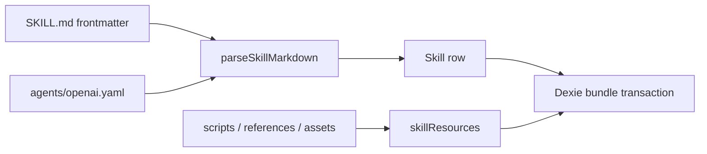

# Data model

<Status variant="stable">Portable Agent Skills model · Dexie v154</Status>

<TLDR>
  `Skill.name` is the localized display name. `Skill.slug` is the stable Agent Skills `name` and bundle directory. Standard fields, Cognia metadata, unknown frontmatter, and the original Codex YAML are stored separately so import and export can round-trip without conflating display and portable identity.
</TLDR>

## Skill identity and fields

`packages/agent-config-types/src/index.ts` defines the public row. The portability additions are:

| Field | Purpose |
| --- | --- |
| `slug` | Lowercase kebab-case portable name, 1–64 characters |
| `compatibility` | Runtime/environment requirements, at most 500 characters |
| `metadata` | Agent Skills string-to-string metadata |
| `invocationPolicy` | `implicit` or `explicit` |
| `frontmatterExtensions` | YAML values for fields Cognia does not model |
| `codexOpenAiYaml` | Original `agents/openai.yaml` text |

`name` remains a user-facing display name and may contain non-ASCII text. Existing IDs, character references, status, and native directories are not derived from the slug.

## Migration

Dexie v154 backfills `slug` without adding an index. Rows are processed in stable `createdAt`, then `id`, order. The candidate order is:

1. a valid `nativeDirectory` basename;
2. a valid existing slug;
3. a normalized display name;
4. `skill-` plus an ID suffix.

Collisions receive `-2`, `-3`, and later suffixes while remaining within 64 characters. The migration is idempotent and does not rename external directories.

## Validation classes

`lib/skills/validate.ts` assigns every issue one severity:

- `runtime`: missing body, resource traversal, or duplicate paths; blocks loading or saving.
- `portability`: missing description, invalid slug, incompatible directory name, invalid metadata, or length violations; blocks standard bundle export but does not disable a legacy row.
- `warning`: compatibility findings that do not block persistence or execution.

New rows created in the Skills form must pass runtime and portability validation. Tolerant imports keep legacy data and persist portability findings for repair.

## Transactional persistence

`lib/db/skills.ts` treats one Skill row and its `skillResources` as one bundle. Create, canonical upsert, overwrite, duplicate, and delete use a Dexie transaction over both stores. Omitting `resources` preserves the current set; passing an empty array clears it. Batch import commits each Skill independently, so one rejected bundle does not roll back successful siblings.

Duplicate copies metadata, Codex YAML, extensions, and all resources, then allocates a fresh display name and collision-free slug. Editing a synced row clears `syncFingerprint`; the next explicit push migrates the native directory and mirrors safely.

## Related

<Cards>
  <Card title="Bundle import and export" href="./bundle-import" />
  <Card title="Loading and injection" href="./loading-and-injection" />
  <Card title="Authoring and workbench" href="./authoring-and-workbench" />
</Cards>
