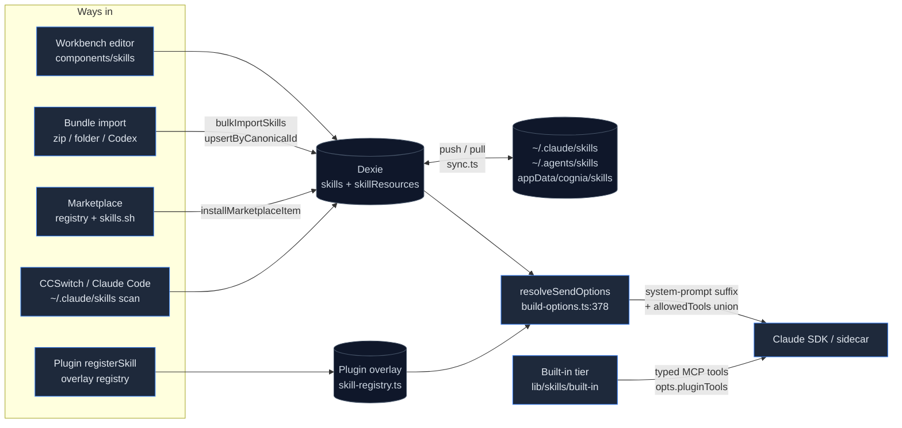

# Skills Subsystem

<Status variant="stable">Stable · skills + skillResources tables since Dexie v8 (DB v72) · ADR-0026 built-in tier at schema v43</Status>

<TLDR>
  A **Skill** is a `SKILL.md`-shaped row — name, Markdown body, optional `allowedTools`, plus bundled
  `scripts/` / `references/` / `assets/` resources. The browser source of truth is Dexie
  (`lib/db/skills.ts`); everything else is a pipeline in or out of that table: a **bundle importer**
  (`lib/skills/bundle/loader.ts:65`) for zip / folder / OpenAI-Codex layouts, a **two-source
  marketplace** (`skills-lock.json` registry + the skills.sh directory), a **three-target native sync**
  (`lib/skills/sync.ts:145` → `skills_install_mirrored` writing cognia / `~/.claude/skills` /
  `~/.agents/skills`), and the **send-time injector** (`lib/claude/build-options.ts:378`) that appends
  enabled skills to the system prompt and **unions** their `allowedTools`. A separate ADR-0026 tier —
  `lib/skills/built-in/` — exposes 40 typed Lark skills as **agent tools** with PII, allowlist, and
  HITL gates; those never touch the Dexie table.
</TLDR>

<StatGrid>
  <Stat label="Source files" value="100+" hint="lib/skills (61) + components/skills (40+) + stores/skills + hooks/skills + src-tauri/src/skills (7 Rust)" />
  <Stat label="Dexie tables" value="2" hint="skills + skillResources — introduced at v8, index strings unchanged through v72" />
  <Stat label="Tauri commands" value="13" hint="scan / install_mirrored / trash / registry / remote fetch / security scan — lib/claude/ipc.ts:381-440" />
  <Stat label="Import paths" value="5" hint="markdown files · zip bundle · folder · Claude Code scan · discovery — skill-panel-toolbar.tsx" />
  <Stat label="Marketplace sources" value="2" hint="registry (skills-lock.json, 6 entries) + skills.sh directory (anonymous search/install; optional skillsShToken unlocks leaderboards)" />
  <Stat label="Built-in tool skills" value="40" hint="ADR-0026 tier — 6 Lark families, read/write/destructive, HITL confirm cards" />
  <Stat label="Security scan rules" value="9" hint="advisory regex scan — src-tauri/src/skills/scanner.rs:60" />
</StatGrid>

Two very different things both answer to the name "skill" in this codebase, and this section keeps
them strictly apart:

1. **Prompt skills** — Dexie rows whose Markdown body is appended to the system prompt at send time.
   Authored in the workbench, imported, synced, sold on the marketplace. They are *never executed*.
2. **Built-in tool skills** — code-reviewed TypeScript modules (`lib/skills/built-in/`) registered as
   MCP-shaped tools the model *calls*, wrapping `lark-cli` with a six-gate dispatcher. ADR-0026.

The original design rationale lives in
[ADR-0026](../../adr/0026-builtin-skills-and-lark-cli-bridge) for the built-in tier; the prompt-skill
side grew organically and is documented here module by module, against the current implementation.

## Where it lives

```
lib/skills/
  validate.ts            # pure validator — name pattern, lengths, resource paths
  categories.ts          # 8 categories + icons + i18n keys
  templates.ts           # 4 starter templates for the create editor
  batch-tags.ts          # tag set ops for the batch-actions bar
  ai-prompts.ts          # optimize / simplify / expand / fixErrors AI-assist prompts
  export-toast.ts        # per-skill SKILL.md export with toast feedback
  executor.ts            # buildProgressiveSkillsPrompt + executeSkill stub
  sync.ts                # push / pull engine, SHA-256 fingerprints, 3 mirror targets
  marketplace-*.ts       # types · registry adapter · skills.sh adapter · install
  skillssh-*.ts          # skills.sh: CORS-routed http · multi-file install · update check · install-from-URL
  bundle/                # loader · walk-zip · walk-folder · classify · parse · codex-yaml · limits
  built-in/              # ADR-0026 tier: types · registry · manifest · dispatcher · lark/ (40 skills)

lib/db/skills.ts         # Dexie CRUD + SkillDraft + upsertByCanonicalId + renderSkillsSection + seeding
lib/db/skill-resources.ts# skillResources CRUD (replaceResourcesForSkill)
lib/claude/skills-io.ts  # serializeSkill / parseSkillMarkdown / resolveSkillMarkdown (plugin sources)
lib/claude/skills-bridge.ts # merges Dexie skills with plugin-overlay skills at send time
lib/claude/build-options.ts # the send-time hot path (ids → filter → render → union tools)

components/skills/       # workbench: panel · list pane · detail · editor · Monaco workspace · marketplace
stores/skills/skills-store.ts  # Zustand UI state (tabs, filters, selection, editor workspace)
hooks/skills/            # use-skill-shortcuts · use-skill-sync · use-skill-marketplace · use-skill-ai
app/skills/page.tsx      # thin route mounting SkillPanel

src-tauri/src/skills/    # native.rs · install.rs · registry.rs · remote.rs · scanner.rs · types.rs
skills-lock.json         # bundled marketplace registry (repo root, manually maintained)
```

## The lifecycle at a glance



## Section map

| Page | Covers |
| --- | --- |
| [Data model](./data-model) | `Skill` / `SkillResource` types, Dexie v8 indexes, `SkillDraft`, `upsertSkillByCanonicalId`, the 5 seeded prompt built-ins, backup domain, usage telemetry |
| [Authoring & workbench](./authoring-and-workbench) | `validate.ts` rules, 8 categories, 4 templates, AI assist, the master-detail panel, Monaco multi-file editor workspace, batch actions, keyboard shortcuts |
| [Bundle import](./bundle-import) | `loadBundle` over zip / folder, resource classification, limits (200 MB zip · 50 resources · 16 MB web / 2 MB disk), OpenAI-Codex `agents/openai.yaml` sidecar, staging dialog |
| [Native sync & security](./native-sync-and-security) | SHA-256 fingerprint push/pull, conflict rules, the three mirror targets + trash, all 13 Tauri commands, the 9-rule advisory security scanner |
| [Marketplace](./marketplace) | `skills-lock.json` registry vs the skills.sh directory, anonymous search/download/audit + optional token-gated leaderboards, CORS-routed transport, multi-file install + content hash, update detection, install-from-URL, Dexie v78 SkillsMP migration |
| [Built-in skills (ADR-0026)](./built-in-skills) | The typed tool tier: registry, manifest filter chain, six-gate dispatcher, 40 Lark skills, lark-cli exec + auth bridge, HITL confirm-card round-trip |
| [Loading & injection](./loading-and-injection) | The send-time hot path: id collection, triple enabled-filter, system-prompt section order, `allowedTools` **union**, plugin-skill bridge, container skills |
| [Consumption surfaces](./consumption-surfaces) | Composer chips, session toggles, character editor, workflow nodes, scheduler, CCSwitch, Discover, plugins, teams, mobile sync |

## Key invariants

- **Skills are prompt suffixes, not programs.** Nothing in Cognia executes a skill's `scripts/`;
  the security scanner (`scanner.rs:16`) is a pre-save hygiene check for scripts you might run
  *elsewhere*, and it never blocks a save.
- **`allowedTools` is a union.** Character ∪ every active skill ∪ plugin skills ∪ agent mode
  (`build-options.ts:823-836`). If nobody declares anything, the field is omitted and the SDK
  default (everything) applies. Older docs described an intersection — that was never the
  shipped behavior.
- **`canonicalId` is the identity spine.** Marketplace installs, bundle re-imports, and uninstall
  all converge on `upsertSkillByCanonicalId` (`lib/db/skills.ts:202`), which keeps `Skill.id`
  stable so session references and workflow nodes survive re-installation.
- **Built-ins come in two unrelated flavors.** The 5 seeded Dexie rows (`skill_builtin_*`) are
  ordinary prompt skills that cannot be deleted; the 40 ADR-0026 skills are tools and never
  appear in the `skills` table.
- **Web mode degrades, never breaks.** Sync, security scan, folder import, and the registry IPC
  are desktop-only; the workbench falls back to bundled JSON and disables the buttons.

## Related

<Cards>
  <Card title="Chat, Characters, Skills & Teams" href="../../chat/chat-and-skills" description="Where characters reference skillIds and sessions toggle them." />
  <Card title="Built-in agent" href="../../chat/built-in-agent" description="The runtime that receives the rendered system prompt and pluginTools stream." />
  <Card title="Plugin system" href="../plugin-system" description="Plugins contribute skills through the overlay registry." />
  <Card title="Platform connectors" href="../platform-connectors" description="IM channels gate built-in tool skills per conversation." />
</Cards>
