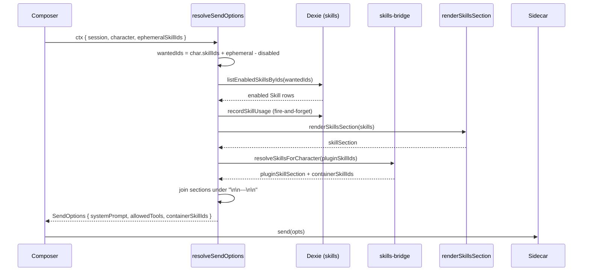
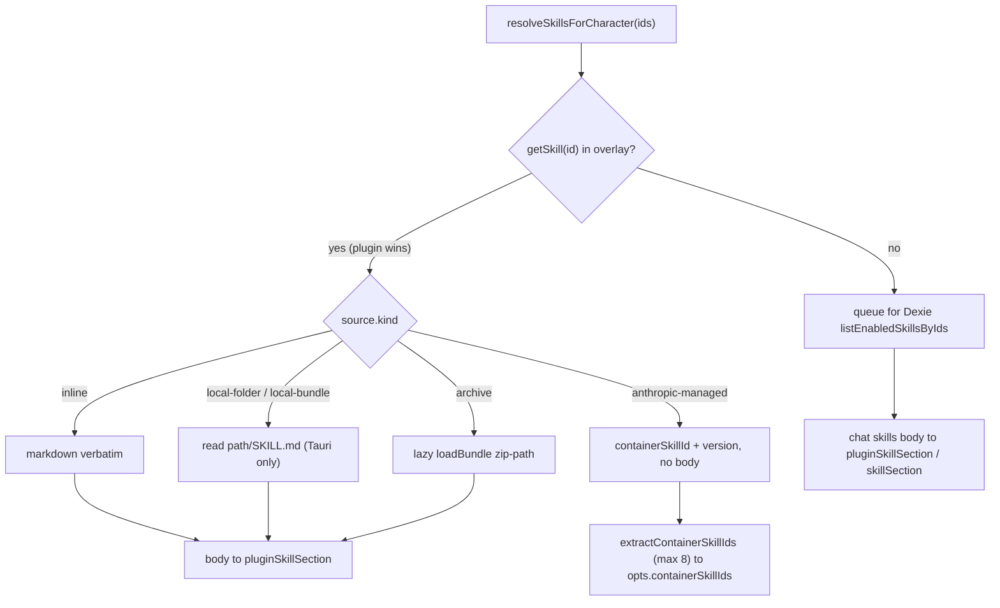

# Loading & injection

<Status variant="stable">Send-time hot path — lib/claude/build-options.ts · skills-bridge · skills-io</Status>

<TLDR>
  Skills are **system-prompt suffixes, never executed**. On every send, `resolveSendOptions`
  (`lib/claude/build-options.ts:364`) collects ids from `character.skillIds ∪ ctx.ephemeralSkillIds`
  minus `session.disabledSkillIds` (`:378-398`), keeps only `status === "enabled"` rows
  (`listEnabledSkillsByIds:396`), renders them via `renderSkillsSection` (`lib/db/skills.ts:339`), and
  appends the block to the system prompt in a fixed order (`:755-765`). Plugin skills resolve through
  `skills-bridge.ts:71` — `inline` / `local-folder` become markdown, `anthropic-managed` become
  `containerSkillIds` (max 8, `skills-bridge.ts:126`) forwarded to the sidecar. `allowedTools` is a
  **union** across character + skills + plugin skills + agent mode (`:823-836`), not an intersection.
  `executeSkill` (`lib/skills/executor.ts:35`) is a deliberate stub.
</TLDR>

## The one semantic that explains everything

A skill never runs. There is no skill VM, no tool dispatch, no separate execution call. A skill is a
markdown body that gets concatenated onto the system prompt of the next request. Everything on this
page is plumbing around that single fact:

1. **Skills are system-prompt suffixes.** The body is rendered under a `## <name>` heading and joined
   onto the prompt under a `\n\n---\n\n` separator (`renderSkillsSection`, `lib/db/skills.ts:339-342`).
2. **A triple enabled-filter** decides what is appended: the per-skill `status`, the per-session
   `disabledSkillIds`, and the character/ephemeral attach set (`build-options.ts:378-398`).
3. **`allowedTools` is a UNION**, not an intersection — across the character, every appended skill,
   every plugin skill, and the active agent mode (`:823-836`). Older docs called this an intersection;
   that is wrong.
4. **Plugin skills override Dexie skills** on id collision — the overlay registry is the source of
   truth for plugin-contributed entities (`skills-bridge.ts:76`).
5. **Anthropic-managed skills bypass markdown** entirely; they flow as `containerSkillIds` (max 8) to
   the sidecar, which attaches them at request time (`skills-bridge.ts:82-87`, `:133-150`).

## Send-time sequence



## Step 1 — collecting chat-skill ids

`resolveSendOptions` (`build-options.ts:364`) builds the wanted-id set from two sources, then subtracts
the session disables. The comment at `:378` states the contract verbatim:

```ts
// build-options.ts:378-398 — "Honour the per-skill status flag — disabled
// skills don't get appended even if the character references them or the
// user attached them ad-hoc."
let skills: Skill[] = []
const characterSkillIds = character?.skillIds ?? []
const ephemeralIds = ctx.ephemeralSkillIds ?? []
if (characterSkillIds.length || ephemeralIds.length) {
  const disabled = new Set(session?.disabledSkillIds ?? [])
  const seen = new Set<string>()
  const wantedIds: string[] = []
  for (const id of [...characterSkillIds, ...ephemeralIds]) {
    if (disabled.has(id)) continue
    if (seen.has(id)) continue
    seen.add(id)
    wantedIds.push(id)
  }
  if (wantedIds.length) {
    skills = await listEnabledSkillsByIds(wantedIds)
  }
}
```

`listEnabledSkillsByIds` (`:396`) is the second filter: it returns only rows whose `status` is
`"enabled"` (a missing/legacy status is treated as enabled). So an id survives to the prompt only if
it is (a) referenced by the character or attached ephemerally, (b) **not** in
`session.disabledSkillIds`, and (c) backed by an enabled row. Usage counters are bumped
fire-and-forget for the survivors (`recordSkillUsage`, `:401-402`).

## Step 2 — the system-prompt assembly order

The chat-skill block (`skillSection`, `:685`) and plugin-skill block (`pluginSkillSection`, `:718`)
are folded into one prompt with a fixed section order (`:755-765`). Empty strings are filtered, and
everything is joined under `\n\n---\n\n`.

| Order | Section | Source | Notes |
| --- | --- | --- | --- |
| 1 | `baseSystem` | character / app default | The persona or app base prompt |
| 2 | `personaSection` | `character.persona` | Tone + personality (`:743-753`) |
| 3 | `memorySection` | memory runtime | Recalled long-term memory |
| 4 | `modeSection` | active agent mode | Template-expanded (`:689-696`) |
| 5 | `skillSection` | Dexie chat skills | `renderSkillsSection(skills)` (`:685`) |
| 6 | `pluginSkillSection` | plugin overlay | `renderResolvedSkillsSection` (`:718`) |

```ts
// build-options.ts:755-765
const systemPrompt = [
  baseSystem,
  personaSection,
  memorySection,
  modeSection,
  skillSection,
  pluginSkillSection,
]
  .filter((p) => p && p.trim().length > 0)
  .join("\n\n---\n\n")
if (systemPrompt) opts.systemPrompt = systemPrompt
```

`renderSkillsSection` (`lib/db/skills.ts:339-342`) is the chat-skill formatter: each row becomes
`## <name>` followed by its trimmed `content`, joined by blank lines.

```ts
// lib/db/skills.ts:339-342
export function renderSkillsSection(skills: Skill[]): string {
  if (skills.length === 0) return ""
  return skills.map((s) => `## ${s.name}\n\n${s.content.trim()}`).join("\n\n")
}
```

## Step 3 — the allowedTools union

The whitelist is assembled as a `Set` and is genuinely additive (`build-options.ts:823-836`). The
member override **replaces** the character's base list, but skills, plugin skills, and the agent mode
still union their declared tools on top so an override never strips a skill's required permissions. If
nothing declares any tool, the field is omitted — which the SDK reads as "everything".

```ts
// build-options.ts:827-836
const allowed = new Set<string>()
const baseAllowed = memberOverride?.allowedToolsOverride ?? character?.allowedTools
for (const t of baseAllowed ?? []) allowed.add(t)
for (const sk of skills) for (const t of sk.allowedTools ?? []) allowed.add(t)
for (const t of pluginAllowedTools) allowed.add(t)        // plugin skills
for (const t of activeMode?.tools ?? []) allowed.add(t)   // agent mode
```

## The plugin-skill bridge

Plugin skills live in an in-memory overlay registry, not Dexie. When the character carries
`pluginSkillIds`, `build-options.ts:709-737` lazy-imports `skills-bridge.ts` and resolves them. Each
id is resolved by `source.kind`:



### resolveSkillsForCharacter (skills-bridge.ts:71-119)

For each id, `getSkill(id)` (`:76`) checks the overlay **first** — on collision the plugin entry wins
(comment at `:24-27`). An `anthropic-managed` skill carries no body, only a `containerSkillId` +
`version` (`:82-87`); every other source goes through `resolveSkillMarkdown` (`:86`). Ids not found in
the overlay fall back to Dexie `listEnabledSkillsByIds` (`:105`). Resolution is fail-soft — a Dexie
outage or a missing `SKILL.md` degrades the prompt rather than blocking the send.

### resolveSkillMarkdown (skills-io.ts:273-326)

The per-source loader. **Every arm fails soft**: a read error logs `console.warn` and returns
`undefined`, never throws.

| `source.kind` | Behaviour | Line |
| --- | --- | --- |
| `inline` | returns `source.markdown` verbatim | `:277` |
| `anthropic-managed` | returns `undefined` (container handles it) | `:279` |
| `local-folder` / `local-bundle` | reads `<path>/SKILL.md`, Tauri-only; browser warns + `undefined` | `:281-298` |
| `archive` | lazy `loadBundle({ kind: "zip-path" })` | `:300-316` |

### Container skills (anthropic-managed)

`extractContainerSkillIds` (`skills-bridge.ts`) filters the resolved set down to entries that carry a
`containerSkillId` and maps them to `{ skill_id, version? }`, capped at `MAX_CONTAINER_SKILLS = 8`.

> **Not currently deliverable.** The Claude Agent SDK exposes **no `query()` option to attach uploaded
> (managed) skill_ids** — verified against sdk `0.3.x`: no runtime reads `containerSkillIds`, `SdkBeta`
> has no skills value, and no `container.skills` request is built. The sidecar dispatcher therefore no
> longer forwards `containerSkillIds` (and the inert `skills-2025-10-02` beta header was removed), and
> `resolveSendOptions` now **warns** when a managed skill is selected instead of silently dropping it.
> `inline` / `local-folder` plugin skills are unaffected — they fold into the system prompt as markdown.
> `extractContainerSkillIds` and the `SendOptions.containerSkillIds` type are retained (`@deprecated`)
> only so a future SDK with the capability can be re-wired without a schema change. Running uploaded
> skills today would require an SDK feature or a direct Messages-API bypass (out of scope).

```ts
// skills-bridge.ts:158-162 — body-bearing plugin skills render like chat skills
export function renderResolvedSkillsSection(resolved: ResolvedSkill[]): string {
  const renderable = resolved.filter((s) => s.body && s.body.trim().length > 0)
  if (renderable.length === 0) return ""
  return renderable.map((s) => `## Skill: ${s.name}\n\n${s.body!.trim()}`).join("\n\n---\n\n")
}
```

## Session & ephemeral toggles

Two orthogonal session-scoped overrides feed the id collector.

**Per-session disables** — `ChatSession.disabledSkillIds?: string[]` (`lib/claude/types.ts:680`,
documented as "Skills the user has temporarily disabled for this session only"). These are subtracted
inside the collector (`build-options.ts:386-393`). The chat-header `SkillsBadge` toggles them: it
memoizes a `Set` from `session.disabledSkillIds` (`chat-header.tsx:129-131`) and, on toggle, persists
the new set back to Dexie via `updateSession` (`chat-header.tsx:437-444`).

**Per-message ephemeral picks** — `ephemeralSkillIds` on the chat store (`stores/chat/chat-store.ts:81`).
These are unioned with the character's `skillIds` for the **next send only**, then cleared:

| Action | Line | Effect |
| --- | --- | --- |
| `setEphemeralSkillIds` | `chat-store.ts:235` | Replace the whole set |
| `toggleEphemeralSkill` | `chat-store.ts:236-241` | Add/remove one id |
| `clearEphemeralSkillIds` | `chat-store.ts:242` | Reset to `[]` |
| reset on new session | `chat-store.ts` (init `[]`) | Picks don't leak across sessions |

The composer's `SkillPicker` (multi-select dialog) and `skill-chip-row` (removable chips) drive
`ephemeralSkillIds`; they are consumed and cleared by the send pipeline in `use-claude-chat.ts`.

## The executor stub

<Callout type="warn">
  `executeSkill` (`lib/skills/executor.ts:35-37`) is a deliberate **stub** that returns
  `{ output: "" }`. Skills in cognia are prompt-appended, not separately executed; the symbol exists
  only for upstream external-agent compatibility. There is no separate execution call to wire.
</Callout>

```ts
// lib/skills/executor.ts:35-37 — skills are prompt-appended, not executed
export async function executeSkill(_ctx: SkillExecutionContext): Promise<SkillExecutionResult> {
  return { output: "" }
}
```

`buildProgressiveSkillsPrompt` (`executor.ts:50-54`) is a thin wrapper around `renderSkillsSection`.

<Callout type="warn">
  The `maxTokens` parameter on `buildProgressiveSkillsPrompt` is **advisory only** — there is no
  tokenizer-aware truncation today. Passing a budget does not trim the rendered block.
</Callout>

## External-agent instruction stack

External agents (Codex / Claude Code / Gemini / …) assemble their own prompt through
`lib/ai/instructions/external-agent-instruction-stack.ts`. It accepts `activeSkills?` and
`maxSkillsTokens?` (`:18-25`), calls `buildProgressiveSkillsPrompt` (default budget `4000`,
`:121-125`), and — unlike the chat path — **unshifts** the skills block to the very front of the
sections array (`:139`) so skills lead, ahead of the base / custom / project / knowledge sections.
Sections are joined with `\n\n` (`:144`).

```ts
// external-agent-instruction-stack.ts:121-139
const { prompt: skillsPrompt } = buildProgressiveSkillsPrompt(
  activeSkills,
  input.maxSkillsTokens || 4000
)
// ...
if (skillsPrompt) {
  sections.unshift(skillsPrompt.trim())   // skills FIRST for external agents
}
```

## Scheduler & workflow consumption

The scheduler resolves skills through the same `resolveSendOptions` pipeline. A per-task disabled list
is spliced onto a cloned session before resolution (`lib/scheduler/executors/index.ts:378-391`) so it
unions with the session's own disables. The `skill` task type additionally appends one ad-hoc skill via
`applyAdHocSkill` (`:306-326`): it fetches a single enabled skill, appends `renderSkillsSection` under
`\n\n---\n\n`, and unions its `allowedTools`.

```ts
// lib/scheduler/executors/index.ts:306-324 — one ad-hoc skill on top of the character set
async function applyAdHocSkill(base: SendOptions, skillId: string | undefined): Promise<SendOptions> {
  if (!skillId) return base
  const skills = await listEnabledSkillsByIds([skillId])
  if (skills.length === 0) return base
  const out: SendOptions = { ...base }
  const skillSection = renderSkillsSection(skills)
  if (skillSection) {
    out.systemPrompt = out.systemPrompt ? `${out.systemPrompt}\n\n---\n\n${skillSection}` : skillSection
  }
  const skillTools = skills.flatMap((s) => s.allowedTools ?? [])
  if (skillTools.length > 0) out.allowedTools = unionStrings(out.allowedTools, skillTools)
  return out
}
```

The visual-workflow `action.skill.invoke` node (`lib/workflow/nodes/built-ins.ts:738-781`) resolves
through the same `resolveSkillsForCharacter` path and bumps `recordSkillUsage` (`:781`) — see
[Consumption surfaces](./consumption-surfaces).

## Plugin registry & telemetry

The overlay registry (`lib/plugin/registries/skill-registry.ts:14-33`) is the plugin-skill source of
truth: `registerSkill` (`:19`, called from the plugin context on enable), `unregisterSkillsByPlugin`
(`:23`, the manager's disable path), `getSkill` (`:25`), `getSkillEntry` (`:27`), `listSkillIds`
(`:29`).

Telemetry is split by storage. Chat skills bump their Dexie `usageCount` / `lastUsedAt` via
`recordSkillUsage`. Plugin skills — which have no Dexie row — record into a separate v37 table through
`recordPluginSkillUsage` (`lib/db/plugin-skill-usage.ts:25-54`), which increments `usageCount`,
stamps `lastUsedAt`, and backfills the owning `pluginId` when first known. Reads go through
`getPluginSkillUsage` (`:56`) / `listPluginSkillUsage` (`:62`); cleanup on uninstall uses
`deletePluginSkillUsageByPlugin` (`:70`). Both write paths are fire-and-forget in
`build-options.ts` (`:401-402` chat, `:735-737` plugin) so a failed counter never blocks a send.

## Who calls what

| Caller | Function | Path |
| --- | --- | --- |
| Chat composer | `resolveSendOptions` | `lib/claude/build-options.ts:364` |
| `resolveSendOptions` | `listEnabledSkillsByIds` | `lib/db/skills.ts` |
| `resolveSendOptions` | `renderSkillsSection` | `lib/db/skills.ts:339` |
| `resolveSendOptions` | `resolveSkillsForCharacter` | `lib/claude/skills-bridge.ts:71` |
| `resolveSkillsForCharacter` | `resolveSkillMarkdown` | `lib/claude/skills-io.ts:273` |
| `resolveSendOptions` | `recordSkillUsage` / `recordPluginSkillUsage` | `lib/db/skills.ts` · `plugin-skill-usage.ts:25` |
| External-agent stack | `buildProgressiveSkillsPrompt` | `lib/skills/executor.ts:50` |
| Scheduler `skill` task | `applyAdHocSkill` | `lib/scheduler/executors/index.ts:306` |
| Workflow `action.skill.invoke` | `resolveSkillsForCharacter` | `lib/workflow/nodes/built-ins.ts:738` |

<Cards>
  <Card title="Overview" href="./index" />
  <Card title="Data model" href="./data-model" />
  <Card title="Built-in skills" href="./built-in-skills" />
  <Card title="Consumption surfaces" href="./consumption-surfaces" />
</Cards>
