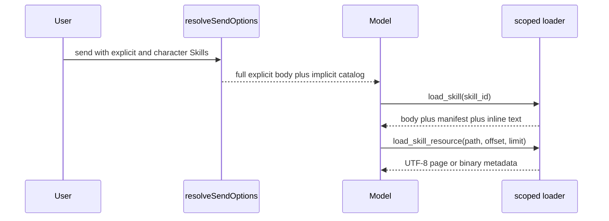

# Loading and injection

<Status variant="stable">Hybrid progressive loading on desktop chat</Status>

<TLDR>
  Skills attached for the current message are injected in full. Character and surface Skills are advertised as a compact catalog and loaded on demand through session-scoped, read-only tools. Explicit-only Skills never enter the implicit catalog.
</TLDR>

## Effective set

`resolveSendOptions` first resolves enabled Skills from character references and ephemeral message attachments. Session-disabled rows are removed. `invocationPolicy: explicit` removes a character Skill from implicit discovery; the same Skill remains usable when the user attaches it explicitly.

The effective `allowedTools` set is the union from only:

- explicitly attached Skills; and
- Skills present in the implicit catalog.

`disallowedTools` is applied later and always wins.

## Hybrid prompt

Explicit attachments include the full body, a resource manifest, and UTF-8 resources marked `inline`. Implicit Skills contribute only ID, slug, display name, and description. The catalog instructs the model to call `load_skill` before following an unloaded Skill.

Inline resource text across one Skill is capped at 64 KiB. Files beyond the cap remain in the manifest for on-demand reads.

## Scoped loader tools

Every send creates an in-memory context keyed by session. It contains only Skills available in that turn. The context is replaced on the next send and released when the turn completes.

`load_skill` returns the body, resource manifest, inline text, and a hint when non-inline text exists. `load_skill_resource` accepts `skill_id`, a normalized relative path, and optional byte `offset` and `limit`. A page is at most 64 KiB and never splits a UTF-8 code point. Binary resources return MIME type and size only; base64 content is never dumped into model context.

Guessing another Skill ID, traversing a path, or reading a resource owned by another Skill is rejected. Both tools are registered as non-side-effecting host tools only when progressive loading is active; the resource reader is omitted when the effective set has no resources.

## Usage accounting

An explicit attachment records one use when the send is assembled. An implicit catalog entry records no use merely for being listed; its first successful `load_skill` call records one use. Repeated loads in the same turn do not increment again.

