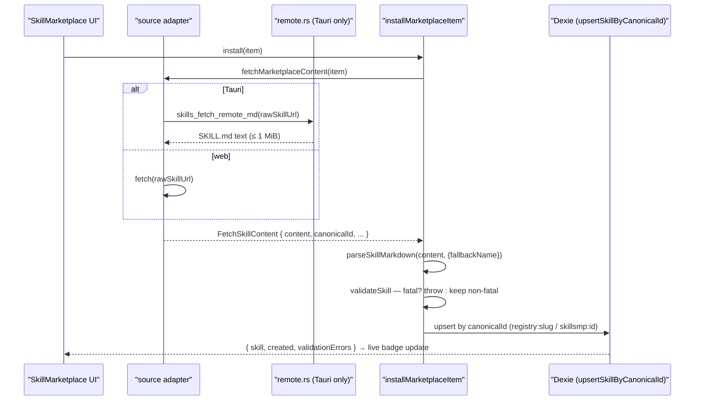
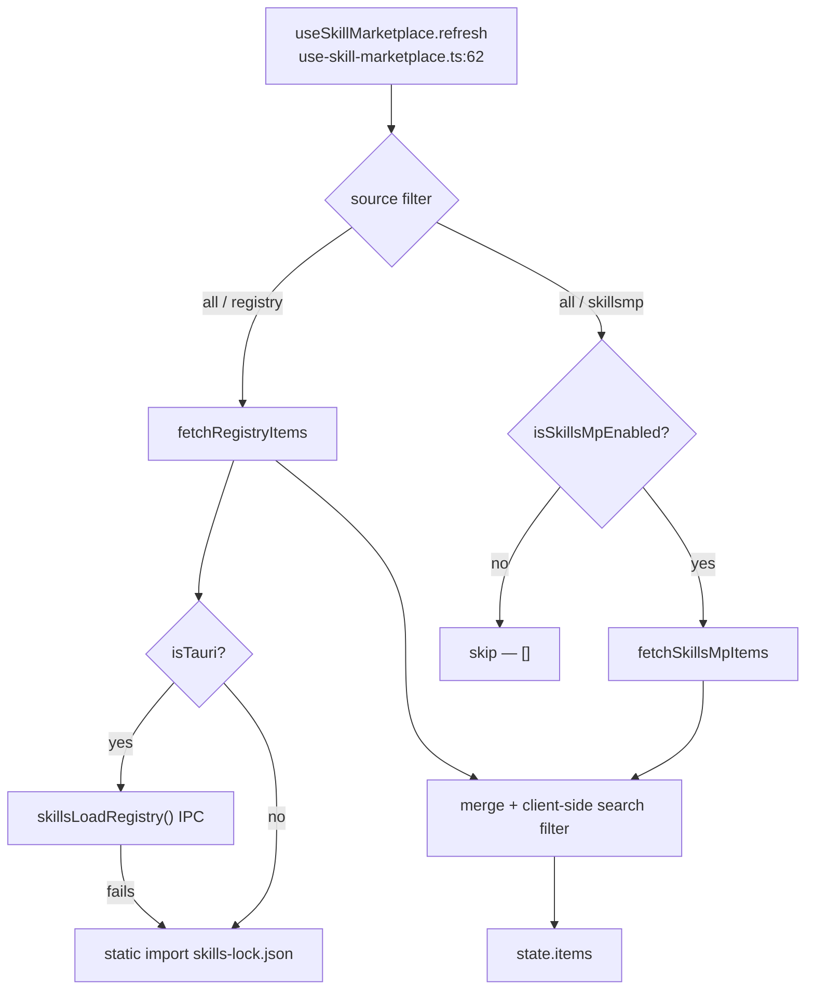

# Marketplace

<Status variant="stable">Two sources — bundled registry (skills-lock.json) plus optional SkillsMP API</Status>

<TLDR>
  Two adapters normalise their wire formats to one `MarketplaceItem` (`marketplace-types.ts:8`): the
  always-on **registry** reads the bundled `skills-lock.json` (`marketplace-registry.ts:74` — Tauri IPC or static
  import fallback) and the optional **SkillsMP** API reads `AppSettings.skillsMpBaseUrl`
  (`marketplace-skillsmp.ts:59`, silently disabled when unset). SKILL.md is fetched lazily per item
  (`marketplace-install.ts:14`); in Tauri the renderer CSP blocks arbitrary hosts so the fetch is proxied by the
  Rust command `skills_fetch_remote_md` (`remote.rs:15` — http(s) only, 1 MiB cap, 15 s). `installMarketplaceItem`
  (`marketplace-install.ts:37`) parses → validates → idempotently upserts by canonical id (`registry:<slug>` /
  `skillsmp:<id>`). The `useSkillMarketplace` hook (`use-skill-marketplace.ts:41`) merges both sources in parallel
  and derives the installed set live from Dexie. There is **no caching, no pagination, and no settings form** for
  the SkillsMP base URL.
</TLDR>

## Two sources, one item shape

Both adapters output the same `MarketplaceItem` so the UI never branches on provenance except for the source
badge. The `id` is globally unique (`source` + `sourceId`), and `rawSkillUrl` is the deferred lazy-fetch URL
resolved only when the user opens or installs the item.

```ts
// marketplace-types.ts:8 — the normalised item both adapters produce
export interface MarketplaceItem {
  id: string                 // `registry:ai-elements` | `skillsmp:1234`
  source: MarketplaceSourceId // "registry" | "skillsmp"  (marketplace-types.ts:6)
  sourceId: string           // slug for registry, integer/UUID for SkillsMP
  name: string
  description?: string
  author?: string
  category?: SkillCategory
  tags?: string[]
  repository?: string        // `owner/repo` (registry) or full HTTPS URL (SkillsMP)
  license?: string
  iconUrl?: string
  rawSkillUrl?: string       // deferred — resolved lazily on open/install
  stars?: number
  downloads?: number
  installed?: boolean
}
```

| | Registry | SkillsMP |
| --- | --- | --- |
| Adapter | `marketplace-registry.ts` | `marketplace-skillsmp.ts` |
| Always on? | yes (bundled) | only when `skillsMpBaseUrl` set |
| `id` prefix | `registry:<slug>` | `skillsmp:<id>` |
| List source | `skills-lock.json` (IPC or static import) | `GET <base>/skills?q=&category=&page=&sort=` |
| Default category | `development` (`marketplace-registry.ts:58`) | `custom` (`marketplace-skillsmp.ts:86`) |
| `rawSkillUrl` | `entry.rawSkillUrl` or built from `owner/repo`@`main` | `item.skillmdUrl` |
| Content fetch | `fetchRegistrySkillContent` (`marketplace-registry.ts:107`) | `fetchSkillsMpSkillContent` (`marketplace-skillsmp.ts:140`) |

`FetchSkillContent` (`marketplace-types.ts:32`) is what the install path consumes: `{ content, canonicalId?,
marketplaceSkillId?, rawUrl? }`. Both adapters supply `canonicalId` (`registry:<sourceId>` /
`skillsmp:<sourceId>`) so the upsert dedupes re-installs.

## The registry adapter (bundled `skills-lock.json`)

`fetchRegistryItems` (`marketplace-registry.ts:74`) is the list entry point. In Tauri it calls the
`skillsLoadRegistry()` IPC (which reads the production-bundled lockfile copy); in web mode it statically imports
`@/skills-lock.json` (`marketplace-registry.ts:11`). On any IPC failure it **silently falls back** to the bundled
JSON (`marketplace-registry.ts:80`), so the Browse tab always has registry content.

Each lockfile entry is mapped by `fromRegistryEntry` (`marketplace-registry.ts:50`). An unrecognised `category`
is normalised by `normaliseCategory` (`marketplace-registry.ts:44`) against the eight `VALID_CATEGORIES`
(`marketplace-registry.ts:33`) and falls back to `development`. When `rawSkillUrl` is absent, `buildRawUrl`
(`marketplace-registry.ts:66`) synthesises a `raw.githubusercontent.com/<source>/main/<skillPath>` URL — this
assumes the default branch is `main`, which the lockfile can override per entry.

```ts
// marketplace-registry.ts:66 — best-effort raw URL when the lockfile omits one
function buildRawUrl(source: string, sourceType: string, skillPath?: string): string | undefined {
  if (sourceType !== "github" || !skillPath) return undefined
  // owner/repo + assumed `main` branch; override via rawSkillUrl when wrong.
  return `https://raw.githubusercontent.com/${source}/main/${skillPath}`
}
```

### The lockfile

`skills-lock.json` at the repo root is `{ version: 2, skills: {...} }`. It currently ships **six entries** —
`ai-elements` (`vercel/ai-elements`), `ai-sdk` (`vercel/ai`), `find-skills` (`vercel-labs/skills`),
`next-best-practices` (`vercel-labs/next-skills`), `shadcn` (`shadcn/ui`), and `streamdown`
(`vercel/streamdown`). Each carries `source`, `sourceType: "github"`, `skillPath`, `computedHash`, and the
optional display fields (`displayName`, `description`, `category`, `tags`, `author`, `rawSkillUrl`).

<Callout type="warn" title="The lockfile is maintained by hand">
  There is **no generator script** in `scripts/` for `skills-lock.json` — entries are added and `computedHash`
  is updated manually. Entries that omit `displayName` / `category` (e.g. `ai-sdk`, `find-skills`, `streamdown`)
  render with the slug as the name and `development` as the category. `skillPath` is assumed to live on the
  `main` branch; a repo on another default branch needs an explicit `rawSkillUrl`.
</Callout>

`fetchRegistrySkillContent` (`marketplace-registry.ts:107`) **throws** if the item has no `rawSkillUrl`. In Tauri
it routes through `skillsFetchRemoteMd` (the Rust proxy); in web mode it uses plain `fetch` and throws on a
non-OK status.

## The SkillsMP adapter (optional API)

`getSkillsMpBaseUrl` (`marketplace-skillsmp.ts:59`) reads `AppSettings.skillsMpBaseUrl`, trims trailing slashes,
and returns `null` when empty; `isSkillsMpEnabled` (`marketplace-skillsmp.ts:67`) is just that check. When the
base is unset, `fetchSkillsMpItems` returns `[]` immediately (`marketplace-skillsmp.ts:115`) — the source is
silently absent rather than erroring.

The list call is `GET <base>/skills` with `q`, `category`, `page`, `pageSize`, and `sort`
(`popular`|`recent`|`stars`) query params (`marketplace-skillsmp.ts:113`). The response is tolerant: it accepts
either an `items` or a `data` array (`marketplace-skillsmp.ts:124`). `fromSkillsMp`
(`marketplace-skillsmp.ts:77`) maps a listing to `skillsmp:<id>` with a `custom` category fallback.
`fetchSkillsMpItem` (`marketplace-skillsmp.ts:128`) fetches a single listing (returns `null` on error), and
`fetchSkillsMpSkillContent` (`marketplace-skillsmp.ts:140`) uses the same dual Tauri/web fetch path as the
registry. `httpJson` (`marketplace-skillsmp.ts:97`) throws on non-OK with a 200-char body excerpt.

```ts
// marketplace-skillsmp.ts:59 — empty/unset disables the whole source
export function getSkillsMpBaseUrl(): string | null {
  const settings = useSettingsStore.getState().settings
  const url = settings?.skillsMpBaseUrl
  if (!url) return null
  const trimmed = url.trim().replace(/\/+$/, "")
  return trimmed || null
}
```

<Callout type="warn" title="No settings form for the base URL">
  `AppSettings.skillsMpBaseUrl` is documented (`lib/claude/types.ts:1208`) and the empty state links to
  `/settings?section=skills-marketplace` (`skill-marketplace-empty.tsx:26`), **but no dedicated settings form
  component writes that field** — a `skillsMpBaseUrl` reference exists only in `lib/claude/types.ts` and the
  marketplace files, never in `components/settings/`. Today the SkillsMP source can only be enabled by writing
  the setting another way; the "Configure" button is a dangling link. Treat this as a known gap.
</Callout>

## Install / uninstall flow

`installMarketplaceItem` (`marketplace-install.ts:37`) is source-agnostic: it dispatches the lazy content fetch
through `fetchMarketplaceContent` (`marketplace-install.ts:14`, exhaustive `switch` on `item.source`), parses the
SKILL.md, validates, and upserts.



Validation is two-tier (`marketplace-install.ts:44`). The `missing-name` / `missing-content` codes are **fatal**
and throw (`marketplace-install.ts:51`) so the UI surfaces the failure via a toast rather than storing a broken
row. Any other validation error is non-fatal: the row is stored with `status: "error"`
(`marketplace-install.ts:60`) so it stays out of the send-time enabled-skills query until the user fixes it.

```ts
// marketplace-install.ts:60 — non-fatal errors land on the row, not a throw
const status: SkillStatus = validationErrors.length > 0 ? "error" : "enabled"
// canonicalId from the adapter, or synthesised so the row still lands stably
const canonicalId = fetched.canonicalId ?? `${item.source}:${item.sourceId ?? item.id}`
const { skill, created } = await upsertSkillByCanonicalId({
  draft: { /* … */ source: "marketplace", marketplaceSkillId: fetched.marketplaceSkillId, status },
  canonicalId,
})
```

`uninstallMarketplaceItem` (`marketplace-install.ts:95`) finds the row by `canonicalId` and `deleteSkill`s it
(cascading resources); it returns `false` when nothing matches. Because built-ins carry no `canonicalId`, they
can never be hit by uninstall. `listInstalledCanonicalIds` (`marketplace-install.ts:106`) returns the `Set` of
canonical ids currently in Dexie — the primer for the installed badges.

## Source resolution and shell fallbacks



The `useSkillMarketplace` hook (`use-skill-marketplace.ts:41`) holds the `source` filter (`all` | `registry` |
`skillsmp`), the search `query`, and `{ loading, items, error }` state. `refresh` (`use-skill-marketplace.ts:62`)
fetches both sources in parallel via `Promise.all`, skips SkillsMP when disabled, catches each source's failure
independently, then applies a **client-side** name/description/tags filter (`use-skill-marketplace.ts:83`). The
installed set is derived live from `useLiveQuery(listSkills)` (`use-skill-marketplace.ts:53`) so install/uninstall
toggles update badges instantly.

<Callout type="warn" title="No caching, no pagination, no debounce">
  The hook re-fetches on every `[source, query]` change with **no cache** and **no debounce** — each keystroke
  can re-hit the SkillsMP API. The API supports `page` / `pageSize`, but the hook flattens results and exposes
  **no pagination UI**; only the first server page is shown.
</Callout>

## The remote-fetch Rust proxy

`skills_fetch_remote_md` (`remote.rs:15`) exists because the Tauri renderer's CSP blocks arbitrary outbound
fetches, so the registry/SkillsMP adapters proxy SKILL.md downloads through Rust. It accepts only `http(s)` URLs
(`remote.rs:16`), caps the response at `MAX_BYTES` = 1 MiB (`remote.rs:11`), uses a 15 s timeout (`remote.rs:12`),
and sends the UA `cognia-next-skills/0.1` (`remote.rs:22`).

```rust
// remote.rs:15 — the Tauri-only SKILL.md proxy (CSP-blocked in the renderer)
#[tauri::command]
pub async fn skills_fetch_remote_md(url: String) -> Result<String, String> {
    let lower = url.to_lowercase();
    if !(lower.starts_with("https://") || lower.starts_with("http://")) {
        return Err("unsupported scheme: must be http(s)".into());
    }
    // … reqwest client (15 s timeout, UA), GET, status check,
    //   1 MiB cap, UTF-8 decode …
}
```

The 1 MiB cap is intentional: skills with large bundled scripts must be installed via the bundle-import / native
sync path, not raw remote fetch.

## The marketplace UI

`SkillMarketplace` (`skill-marketplace.tsx:20`) is a master-detail layout. The desktop detail pane is never blank:
`selectedItem` (`skill-marketplace.tsx:32`) re-points an explicit pick onto the refreshed result object and
otherwise defaults to the first item; mobile keeps the raw pick so the Sheet only opens on tap. Install and
uninstall are wired through `handleInstall` / `handleUninstall` (`skill-marketplace.tsx:42`,
`skill-marketplace.tsx:61`) with `toast` + `loggers.skills` logging. The source toggle disables the SkillsMP
button when the source is off (`skill-marketplace.tsx:153`), and a hint banner appears when SkillsMP is
unconfigured (`skill-marketplace.tsx:80`).

| Component | Role | file:line |
| --- | --- | --- |
| `SkillMarketplace` | master-detail shell, source toggle, search, install handlers | `skill-marketplace.tsx:20` |
| `SkillMarketplaceListItem` | memoised left-pane row — category icon, name, installed check | `skill-marketplace-list-item.tsx:22` |
| `SkillMarketplaceDetailContent` | header, badges, install button, lazy SKILL.md render | `skill-marketplace-detail-content.tsx:30` |
| `SkillMarketplaceDetail` | mobile Sheet wrapper around the detail content | `skill-marketplace-detail.tsx:27` |
| `SkillMarketplaceEmpty` | teaser cards + "Configure" link when unconfigured | `skill-marketplace-empty.tsx:13` |

`SkillMarketplaceDetailContent` (`skill-marketplace-detail-content.tsx:30`) lazily fetches SKILL.md on item
change via `fetchMarketplaceContent` (`skill-marketplace-detail-content.tsx:45`), renders header
(`detail-content.tsx:73`) and badges (`detail-content.tsx:101`), an install/uninstall button with a spinner
(`detail-content.tsx:123`), and the readme through `Streamdown` (`detail-content.tsx:151`). The installed check
in the list row lives at `skill-marketplace-list-item.tsx:52`.

### Teasers (the unconfigured empty state)

When SkillsMP is unconfigured and no items are present, `SkillMarketplaceEmpty` (`skill-marketplace-empty.tsx:13`)
renders four static `MARKETPLACE_TEASERS` (`marketplace-teasers.ts:15`) plus a "Configure" button to
`/settings?section=skills-marketplace` (`skill-marketplace-empty.tsx:26`).

| Teaser | Category | id |
| --- | --- | --- |
| Code Reviewer | development | `teaser-code-reviewer` |
| Meeting Notetaker | productivity | `teaser-meeting-notetaker` |
| SQL Explainer | data-analysis | `teaser-sql-explainer` |
| Email Rewriter | communication | `teaser-email-rewriter` |

The teasers are display-only — they are not installable items, just illustrative cards that route the user to the
(currently missing) settings form.

<Cards>
  <Card title="Skills overview" href="./index" />
  <Card title="Bundle import" href="./bundle-import" />
  <Card title="Data model" href="./data-model" />
  <Card title="Consumption surfaces" href="./consumption-surfaces" />
</Cards>
