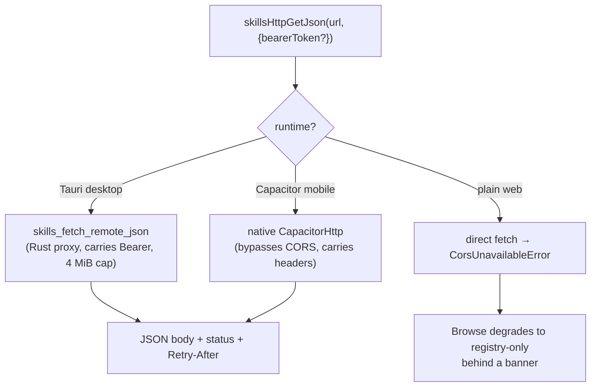
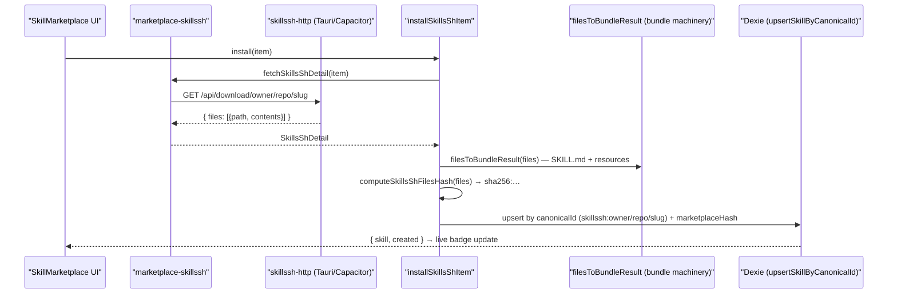
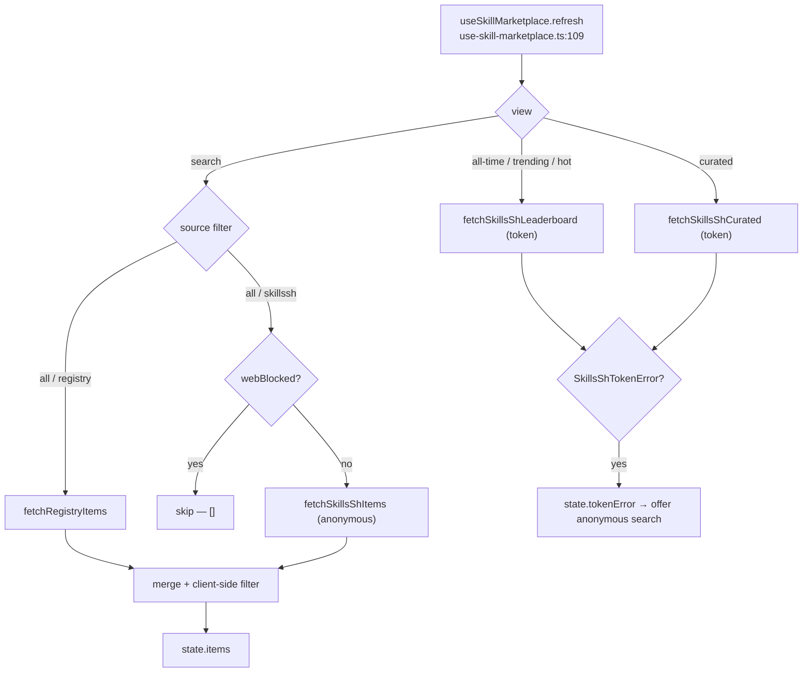

# Marketplace

<Status variant="stable">Two sources — bundled registry (skills-lock.json) plus the skills.sh directory</Status>

<TLDR>
  Two adapters normalise their wire formats to one `MarketplaceItem` (`marketplace-types.ts:8`): the
  always-on **registry** reads the bundled `skills-lock.json` (`marketplace-registry.ts:74` — Tauri IPC or static
  import fallback) and the **skills.sh** adapter (`marketplace-skillssh.ts`) talks to the real
  [skills.sh](https://skills.sh) directory. skills.sh is **anonymous-first**: search, snapshot download, and
  multi-provider security audits work with zero configuration (the same endpoints the `npx skills` CLI uses). An
  **optional Vercel OIDC token** (`AppSettings.skillsShToken`) unlocks the `/api/v1` leaderboard and curated
  views. skills.sh sends no CORS headers, so every request routes through `skillssh-http.ts` (Tauri Rust proxy /
  CapacitorHttp / blocked in plain web). Installs are multi-file: a snapshot's `{files:[{path,contents}]}` set
  becomes skill + resources via the bundle machinery, with a client-computed `sha256:` hash stored for the
  explicit "Check for updates" action. `MarketplaceSourceId = "registry" | "skillssh"`; canonical ids are
  `registry:<slug>` / `skillssh:owner/repo/slug`.
</TLDR>

## Two sources, one item shape

Both adapters output the same `MarketplaceItem` so the UI never branches on provenance except for the source
badge. The `id` is globally unique (`source` + `sourceId`); for skills.sh the `sourceId` is the
`owner/repo/slug` triple.

```ts
// marketplace-types.ts:8 — the normalised item both adapters produce
export interface MarketplaceItem {
  id: string                 // `registry:ai-elements` | `skillssh:owner/repo/slug`
  source: MarketplaceSourceId // "registry" | "skillssh"  (marketplace-types.ts:6)
  sourceId: string           // slug for registry, `owner/repo/slug` triple for skills.sh
  name: string
  description?: string
  author?: string
  category?: SkillCategory
  tags?: string[]
  repository?: string        // `owner/repo` (registry) or the skill's source URL (skills.sh)
  license?: string
  iconUrl?: string
  rawSkillUrl?: string       // deferred — resolved lazily on open/install (registry only)
  stars?: number
  downloads?: number
  installed?: boolean
}
```

| | Registry | skills.sh |
| --- | --- | --- |
| Adapter | `marketplace-registry.ts` | `marketplace-skillssh.ts` |
| Always on? | yes (bundled) | yes (anonymous); token unlocks extra views |
| `id` prefix | `registry:<slug>` | `skillssh:<owner/repo/slug>` |
| List source | `skills-lock.json` (IPC or static import) | `GET https://skills.sh/api/search?q=&limit=` |
| Default category | `development` (`marketplace-registry.ts:58`) | `custom` (`marketplace-skillssh.ts:177`) |
| Install shape | single SKILL.md via `rawSkillUrl` | multi-file snapshot via `fetchSkillsShDetail` |
| Content fetch | `fetchRegistrySkillContent` (`marketplace-registry.ts:107`) | `fetchSkillsShDetail` / `fetchSkillsShSkillContent` (`marketplace-skillssh.ts:271`, `:387`) |

`FetchSkillContent` (`marketplace-types.ts:32`) is what the single-file install path consumes: `{ content,
canonicalId?, marketplaceSkillId?, rawUrl? }`. The skills.sh install path is **multi-file** and bypasses it
(see [Multi-file install](#multi-file-install) below).

## The registry adapter (bundled `skills-lock.json`)

`fetchRegistryItems` (`marketplace-registry.ts:74`) is the list entry point. In Tauri it calls the
`skillsLoadRegistry()` IPC (which reads the production-bundled lockfile copy); in web mode it statically imports
`@/skills-lock.json` (`marketplace-registry.ts:11`). On any IPC failure it **silently falls back** to the bundled
JSON (`marketplace-registry.ts:80`), so the Browse tab always has registry content.

Each lockfile entry is mapped by `fromRegistryEntry` (`marketplace-registry.ts:50`). An unrecognised `category`
is normalised by `normaliseCategory` (`marketplace-registry.ts:44`) against the eight `VALID_CATEGORIES`
(`marketplace-registry.ts:33`) and falls back to `development`. When `rawSkillUrl` is absent, `buildRawUrl`
(`marketplace-registry.ts:66`) synthesises a `raw.githubusercontent.com/<source>/main/<skillPath>` URL — this
assumes the default branch is `main`, which the lockfile can override per entry.

```ts
// marketplace-registry.ts:66 — best-effort raw URL when the lockfile omits one
function buildRawUrl(source: string, sourceType: string, skillPath?: string): string | undefined {
  if (sourceType !== "github" || !skillPath) return undefined
  // owner/repo + assumed `main` branch; override via rawSkillUrl when wrong.
  return `https://raw.githubusercontent.com/${source}/main/${skillPath}`
}
```

### The lockfile

`skills-lock.json` at the repo root is `{ version: 2, skills: {...} }`. It currently ships **six entries** —
`ai-elements` (`vercel/ai-elements`), `ai-sdk` (`vercel/ai`), `find-skills` (`vercel-labs/skills`),
`next-best-practices` (`vercel-labs/next-skills`), `shadcn` (`shadcn/ui`), and `streamdown`
(`vercel/streamdown`). Each carries `source`, `sourceType: "github"`, `skillPath`, `computedHash`, and the
optional display fields (`displayName`, `description`, `category`, `tags`, `author`, `rawSkillUrl`).

<Callout type="warn" title="The lockfile is maintained by hand">
  There is **no generator script** in `scripts/` for `skills-lock.json` — entries are added and `computedHash`
  is updated manually. Entries that omit `displayName` / `category` (e.g. `ai-sdk`, `find-skills`, `streamdown`)
  render with the slug as the name and `development` as the category. `skillPath` is assumed to live on the
  `main` branch; a repo on another default branch needs an explicit `rawSkillUrl`.
</Callout>

`fetchRegistrySkillContent` (`marketplace-registry.ts:107`) **throws** if the item has no `rawSkillUrl`. In Tauri
it routes through `skillsFetchRemoteMd` (the Rust proxy); in web mode it uses plain `fetch` and throws on a
non-OK status.

## The skills.sh adapter (the Agent Skills Directory)

`marketplace-skillssh.ts` talks to the public [skills.sh](https://skills.sh) directory. It is **anonymous-first**
— search, snapshot download, and security audits need no configuration — with a thin token-gated tier layered on
top. Two base hosts are involved: `SKILLS_SH_BASE_URL = "https://skills.sh"` and the audit service
`AUDIT_BASE_URL = "https://add-skill.vercel.sh"` (`marketplace-skillssh.ts:20`).

### Anonymous endpoints (zero config)

These are the same endpoints the official `npx skills` CLI hits, so they work for every user without a token.

| Call | Endpoint | Returns |
| --- | --- | --- |
| Search | `GET https://skills.sh/api/search?q=&limit=` | `{ skills: [{ id, name, source, installs }] }` → `MarketplaceItem[]` (`fetchSkillsShItems`, `marketplace-skillssh.ts:197`) |
| Snapshot download | `GET https://skills.sh/api/download/{owner}/{repo}/{slug}` | `{ files: [{ path, contents }] }` (`fetchSkillsShDetail`, `marketplace-skillssh.ts:271`) |
| Security audit | `GET https://add-skill.vercel.sh/audit?source={owner/repo}&skills={slug}` | per-provider risk map → `SkillsShAudit` (`fetchSkillsShAudit`, `marketplace-skillssh.ts:341`) |

`fetchSkillsShItems` returns `[]` for queries shorter than two characters (`marketplace-skillssh.ts:199`) so the
list stays empty until the search is meaningful. The audit endpoint aggregates multiple partners — Socket, Snyk,
ZeroLeaks, Agent Trust Hub (`ath`), Runlayer (`ANONYMOUS_PROVIDER_LABELS`, `marketplace-skillssh.ts:329`) — and
each provider's `risk` is normalised to one of `safe | low | medium | high | critical | unknown`
(`normaliseRisk`, `marketplace-skillssh.ts:299`). A missing audit (404) returns `null` rather than throwing
(`marketplace-skillssh.ts:376`).

### Token-gated `/api/v1` views (optional)

Pasting a **Vercel OIDC token** into the inline teaser card stores it in `AppSettings.skillsShToken`
(`lib/claude/types.ts:1304` — a plain short-lived setting, not the keyring) and unlocks the OIDC-protected
`/api/v1` surface via the `v1Get` helper (`marketplace-skillssh.ts:209`), which attaches the token as a Bearer
header.

| View | Endpoint | Helper |
| --- | --- | --- |
| Leaderboard (all-time / trending / hot) | `GET /api/v1/skills?view=&page=&per_page=` | `fetchSkillsShLeaderboard` (`marketplace-skillssh.ts:230`) — paginated, `hasMore` drives "Load more" |
| Curated collections | `GET /api/v1/skills/curated` | `fetchSkillsShCurated` (`marketplace-skillssh.ts:254`) — owners with their skills |
| Detail with hash | `GET /api/v1/skills/{owner}/{repo}/{slug}` | `fetchSkillsShDetail` (preferred when a token is present) |
| Audit | `GET /api/v1/skills/audit/{owner}/{repo}/{slug}` | `fetchSkillsShAudit` (preferred when a token is present) |

```ts
// marketplace-skillssh.ts:209 — every /api/v1 call needs a token; a 401 is typed
async function v1Get<T>(path: string): Promise<T> {
  const token = getSkillsShToken()
  if (!token) {
    throw new SkillsShTokenError("skills.sh /api/v1 requires a Vercel OIDC token")
  }
  try {
    return await skillsHttpGetJson<T>(`${SKILLS_SH_BASE_URL}${path}`, { bearerToken: token })
  } catch (err) {
    if (err instanceof SkillsHttpError && err.status === 401) {
      throw new SkillsShTokenError("skills.sh token rejected (expired or invalid)")
    }
    throw err
  }
}
```

A rejected token surfaces as the typed `SkillsShTokenError` (`marketplace-skillssh.ts:51`). The hook catches it
on leaderboard/curated refresh and sets `state.tokenError`, so the UI offers a one-tap return to anonymous
search (`use-skill-marketplace.ts:140`, `skill-marketplace.tsx:109`). Detail and audit calls **degrade
gracefully**: when a token is present they try `/api/v1` first, and on a token error fall through to the
anonymous endpoint (`marketplace-skillssh.ts:281`, `:355`) — viewing a skill never requires configuration.

<Callout type="warn" title="No SkillsMP base URL anymore">
  The speculative **SkillsMP** protocol (and its `AppSettings.skillsMpBaseUrl` field) was **removed**. The
  marketplace now points at the real skills.sh directory; the only optional setting is `skillsShToken`, written
  through the inline teaser card. Legacy `skillsmp:*` installs are detached by a Dexie migration (see
  [Legacy migration](#legacy-skillsmp-migration)).
</Callout>

## Transport: CORS routing

skills.sh and `add-skill.vercel.sh` send **no CORS headers**, so a plain browser `fetch` is blocked. Every
request goes through `skillssh-http.ts`, which picks a CORS-free path per runtime:



- **Tauri desktop** → the Rust command `skills_fetch_remote_json` (`src-tauri/src/skills/remote.rs:75`). Unlike
  the SKILL.md proxy it **returns** non-2xx statuses in the response struct (so the frontend can branch on
  401/404/429), carries the optional Bearer token, surfaces `Retry-After`, and caps the body at
  `MAX_JSON_BYTES` = 4 MiB (`remote.rs:13`).
- **Capacitor mobile** → native `CapacitorHttp` (`getViaCapacitor`, `skillssh-http.ts:70`), which is exempt from
  CORS and forwards the `Authorization` header.
- **Plain web** → a direct `fetch`; a network/CORS rejection becomes the typed `CorsUnavailableError`
  (`skillssh-http.ts:37`). `isSkillsShWebBlocked()` (`skillssh-http.ts:50`) is true here, and the Browse pane
  degrades to **registry-only** behind a banner (`skill-marketplace.tsx:229`).

`skillsHttpGetJson` (`skillssh-http.ts:120`) throws a typed `SkillsHttpError` carrying the HTTP `status` (and
`retryAfter`) on any non-2xx response — that status is exactly what the adapter inspects to map 401 → token
error and 404 → "no audit / slug required".

## The remote-fetch Rust proxies

`src-tauri/src/skills/remote.rs` exposes **two** Tauri commands, both rejecting non-`http(s)` schemes
(`validate_scheme`, `remote.rs:16`) with the UA `cognia-next-skills/0.1` and a 15 s timeout:

- `skills_fetch_remote_md` (`remote.rs:24`) — the original SKILL.md proxy for the **registry** adapter. Capped
  at `MAX_BYTES` = 1 MiB (`remote.rs:11`); non-2xx becomes `Err`.
- `skills_fetch_remote_json` (`remote.rs:75`) — the marketplace JSON proxy for **skills.sh**. Capped at 4 MiB,
  carries the Bearer token, and returns non-2xx statuses (`RemoteGetResponse { status, body, retryAfter }`)
  instead of erroring, so the renderer can branch on the status.

```rust
// remote.rs:75 — JSON proxy; non-2xx is RETURNED, not Err, so the UI can branch
#[tauri::command]
pub async fn skills_fetch_remote_json(req: RemoteGetRequest) -> Result<RemoteGetResponse, String> {
    validate_scheme(&req.url)?;
    // … reqwest client (15 s, UA), optional bearer_auth, Accept header …
    //   capture status + Retry-After, cap body at MAX_JSON_BYTES (4 MiB), UTF-8 decode …
}
```

The 1 MiB / 4 MiB caps are intentional: skills with very large bundled scripts must come through the
bundle-import / native sync path, not a single remote fetch.

## Multi-file install

A skills.sh skill is a **file set**, not one SKILL.md, so `installMarketplaceItem` (`marketplace-install.ts:72`)
takes a dedicated branch for `source === "skillssh"` (`installSkillsShItem`, `marketplace-install.ts:34`) that
reuses the existing bundle machinery instead of the single-file parser:

1. `fetchSkillsShDetail(item)` downloads the snapshot `{ files: [{ path, contents }] }`.
2. `filesToBundleResult` (`skillssh-install.ts:63`) finds `SKILL.md`, runs it through `parseBundleManifest`
   (frontmatter + fatal validation), and classifies every other file with `inferResourceKind`
   (script / reference / asset) — exactly the shape the bundle importer produces.
3. `computeSkillsShFilesHash` (`skillssh-install.ts:98`) hashes the canonical (path-sorted) file set and stores
   it on `Skill.marketplaceHash`, prefixed `sha256:` so the comparator never mixes client-computed hashes with
   server `/api/v1` hashes.
4. The draft is upserted by `canonicalId = skillssh:<owner/repo/slug>` via `upsertSkillByCanonicalId`, so a
   re-install replaces content, resources, and hash in place (idempotent).



The detail pane lazily fetches the **file manifest** (`buildSkillsShFileTree`, `skillssh-install.ts:36` —
SKILL.md first, then alphabetical) and the **security audit badges** only when an item is opened
(`fetchFileTree` / `fetchAudit`, `use-skill-marketplace.ts:271`, `:259`), keyed by item id so each is fetched
once.

### Registry install (unchanged single-file path)

The registry branch still parses a single SKILL.md. `fetchMarketplaceContent` (`marketplace-install.ts:15`)
switches on `item.source`; validation is two-tier — `missing-name` / `missing-content` are **fatal** and throw
so the UI toasts the failure, while any other validation error is non-fatal and lands on the row with
`status: "error"` (`marketplace-install.ts:99`), keeping it out of the send-time enabled-skills query until
fixed.

## Update detection

There is **no background polling**. The user triggers an explicit "Check for updates" toolbar action, wired
through `useSkillUpdate` (`hooks/skills/use-skill-update.ts`):

- `checkAll` calls `checkSkillsShUpdates` (`skillssh-updates.ts:56`), which re-downloads each `skillssh:`
  install's current snapshot, recomputes `computeSkillsShFilesHash`, and compares it to the stored
  `marketplaceHash`. Because both the install-time and check-time hashes are client-computed over the file set,
  they are directly comparable regardless of token presence. Per-skill failures land in `error` instead of
  aborting the whole run.
- Skills that drifted are flagged into the skills store (`setUpdateAvailable`); list rows show an "Update
  available" badge and the detail Overview gets a one-click **Update** banner.
- `updateOne` re-runs the idempotent `installMarketplaceItem` for that skill, replacing content/resources/hash
  in place and clearing the flag (`use-skill-update.ts:56`).

## Direct install from URL

The "Install from URL" dialog (`components/skills/skill-url-install-dialog.tsx`, opened from the Browse search
row's link button or the toolbar) parses free-form input via `parseSkillsShInput` (`skillssh-github.ts:29`) and
resolves it through the anonymous download endpoint (`resolveSkillsShRef`, `skillssh-github.ts:79`). Accepted
forms:

| Input | Behaviour |
| --- | --- |
| `https://skills.sh/{owner}/{repo}/{slug}` | full triple from the page URL (also `www.skills.sh`) |
| `owner/repo/slug` | full triple |
| `owner/repo` | slug defaults to the repo name; a 404 raises `SkillsShSlugRequiredError` with guidance |
| `https://github.com/{owner}/{repo}` | github.com repo URL — its path matches the repo-only form |

Because resolution goes through `fetchSkillsShDetail`, a GitHub repo that publishes a skill installs without any
GitHub API descent. A repo-only ref whose `owner/repo/repo` snapshot 404s produces a guidance error telling the
user to append the slug or paste the skills.sh page URL (`skillssh-github.ts:59`).

## Source resolution and shell fallbacks



The `useSkillMarketplace` hook (`use-skill-marketplace.ts:77`) holds the `view`
(`search` | `all-time` | `trending` | `hot` | `curated`), the `source` filter
(`all` | `registry` | `skillssh`), the search `query`, and `{ loading, items, error, hasMore, loadingMore,
tokenError }` state. In **search** view it fetches the registry and the anonymous skills.sh search in parallel
via `Promise.all`, skips skills.sh when `webBlocked`, catches each source's failure independently, then applies a
**client-side** name/description/tags/repository filter (`use-skill-marketplace.ts:174`). The view toggle and
the token teaser only appear when a token is configured / reachable (`skill-marketplace.tsx:179`). The installed
set is derived live from `useLiveQuery(listSkills)` (`use-skill-marketplace.ts:100`) so install/uninstall toggles
update badges instantly.

<Callout type="warn" title="No caching or debounce; leaderboard pagination only">
  The hook re-fetches on every `[source, query, view]` change with **no cache** and **no debounce** — each
  keystroke can re-hit the skills.sh search API. Pagination ("Load more") exists **only** for the token-gated
  leaderboard views (`loadMore`, `use-skill-marketplace.ts:205`); search and curated results are flattened with
  no paging.
</Callout>

## Legacy SkillsMP migration

Dexie **v78** (`lib/db/schema.ts:1890`) detaches installs that came from the defunct SkillsMP source. Its
`upgrade` clears `canonicalId` and `marketplaceSkillId` on any row whose `canonicalId` carries the `skillsmp:`
prefix, turning those rows into plain local skills (they keep working) instead of phantom marketplace installs
whose "installed" badge and update checks would never resolve against the new `skillssh:owner/repo/slug` scheme.
The migration is idempotent — only `skillsmp:`-prefixed rows are touched.

## The marketplace UI

`SkillMarketplace` (`skill-marketplace.tsx:26`) is a master-detail layout. The desktop detail pane is never
blank: `selectedItem` (`skill-marketplace.tsx:48`) re-points an explicit pick onto the refreshed result object
and otherwise defaults to the first item; mobile keeps the raw pick so the Sheet only opens on tap. Install and
uninstall are wired through `handleInstall` / `handleUninstall` (`skill-marketplace.tsx:58`, `:77`) with `toast`
+ `loggers.skills` logging. The view toggle (search / leaderboards / curated) appears only with a token
(`skill-marketplace.tsx:179`); the source toggle (All / registry / skills.sh) disables skills.sh when
`webBlocked` (`skill-marketplace.tsx:223`); a web-blocked banner appears when skills.sh is unreachable
(`skill-marketplace.tsx:229`).

| Component | Role | file:line |
| --- | --- | --- |
| `SkillMarketplace` | master-detail shell, view + source toggles, search, URL-install + refresh, install handlers | `skill-marketplace.tsx:26` |
| `SkillMarketplaceListItem` | memoised left-pane row — category icon, name, installed check | `skill-marketplace-list-item.tsx:22` |
| `SkillMarketplaceDetailContent` | header, badges, install button, file-manifest preview, lazy audit badges, update banner | `skill-marketplace-detail-content.tsx` |
| `SkillMarketplaceDetail` | mobile Sheet wrapper around the detail content | `skill-marketplace-detail.tsx` |
| `SkillMarketplaceTokenTeaser` | inline unlock card — paste a Vercel OIDC token to enable leaderboards | `skill-marketplace-token-teaser.tsx:17` |
| `SkillUrlInstallDialog` | "Install from URL" dialog (skills.sh / triple / GitHub repo) | `skill-url-install-dialog.tsx:29` |

### The token teaser (anonymous-first unlock card)

When no token is configured and the user is in the search view with no query, the list pane shows
`SkillMarketplaceTokenTeaser` (`skill-marketplace-token-teaser.tsx:17`). It explains that search and install
already work without configuration, and offers a password input to paste a Vercel OIDC token — saved straight to
`AppSettings.skillsShToken` via `useSettingsStore.save` — which unlocks the leaderboard and curated views. It
replaces the old static `SkillMarketplaceEmpty` teaser cards (and `marketplace-teasers.ts`), both of which were
deleted along with the SkillsMP base-URL setting.

<Cards>
  <Card title="Skills overview" href="./index" />
  <Card title="Bundle import" href="./bundle-import" />
  <Card title="Data model" href="./data-model" />
  <Card title="Consumption surfaces" href="./consumption-surfaces" />
</Cards>
