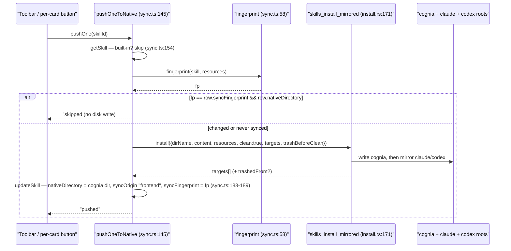
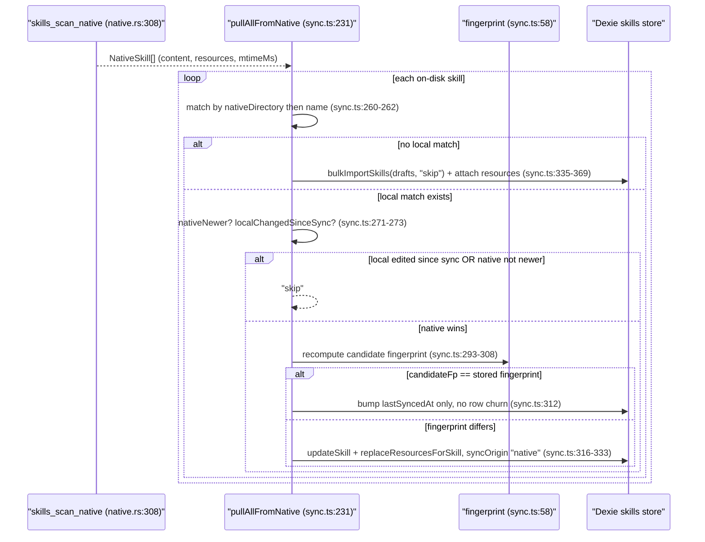
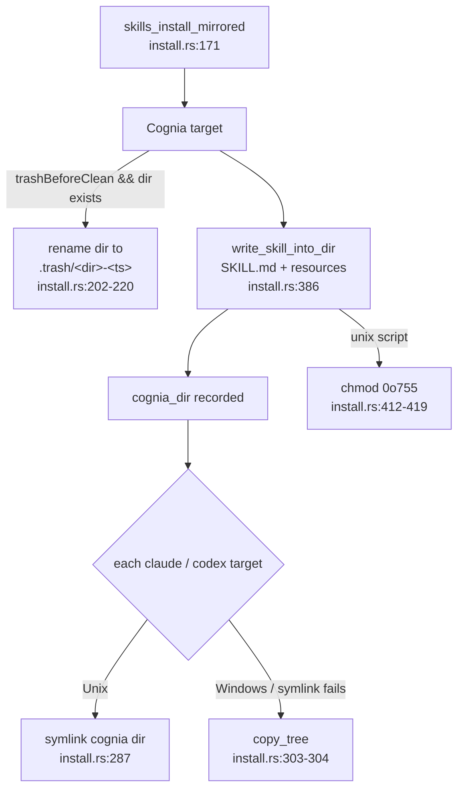

# Native sync & security

<Status variant="stable">Desktop only — lib/skills/sync.ts · src-tauri/src/skills (7 files, 13 commands)</Status>

<TLDR>
  The Dexie skill store is the source of truth; the on-disk `SKILL.md` tree is what other Claude
  tooling actually reads. `lib/skills/sync.ts` pushes rows out and pulls disk edits back in, matching by
  `nativeDirectory` then name slug (`sync.ts:260-262`) and gating every direction with a SHA-256
  `fingerprint` (`sync.ts:58-86`). The Rust side (`src-tauri/src/skills/`) writes the canonical copy under
  `<appData>/cognia/skills/` and projects it to `~/.claude/skills/` + `~/.agents/skills/` as **symlinks on
  Unix, copies on Windows** (`install.rs:226-304`), moving prior copies to `.trash/` on fingerprint change.
  A 13-command IPC surface (`lib/claude/ipc.ts:381-440`, registered `lib.rs:398-410`) covers scan, install,
  trash, remote-fetch, registry, and an **advisory-only** 9-rule regex security scanner (`scanner.rs:59-126`).
  Everything no-ops in the browser — `isTauri()` guards return an `(env)` error (`sync.ts:147-148`).
</TLDR>

## Why two copies exist

Cognia stores skills as IndexedDB rows (see [data model](./data-model)), but Claude Code, the Codex CLI,
and Cognia's own sidecar all read skills from disk as `~/.claude/skills/<dir>/SKILL.md`. Native sync
reconciles the two views so a skill authored in the app is discoverable verbatim by those CLIs, and a
skill an external CLI wrote is importable back into Dexie without a manual conversion step
(`native.rs:1-5`).

| Plane | Where | Role |
| --- | --- | --- |
| Dexie store | IndexedDB `skills` / `skillResources` | Source of truth — edited in the app |
| Cognia canonical | `<appData>/cognia/skills/<dir>/` | The on-disk copy Cognia owns; basis for mirrors |
| Claude mirror | `~/.claude/skills/<dir>/` | Symlink (Unix) / copy (Windows) — read by Claude Code |
| Codex mirror | `~/.agents/skills/<dir>/` | Symlink (Unix) / copy (Windows) — read by Codex CLI |

On-disk layout under each `<dir>/`: `SKILL.md` (frontmatter + body) plus optional `scripts/`,
`references/`, and `assets/` subdirs — the resource kinds the walker recognises (`native.rs:45-49`).

<Callout type="warn" title="Desktop only">
  Every public entry point short-circuits on web. `pushOneToNative` / `pushAllToNative` /
  `pullAllFromNative` return `errors: [{ name: "(env)", error: "Desktop only." }]` when `isTauri()` is
  false (`sync.ts:147-148`, `:213-214`, `:233-235`); `useSkillSync` raises a `"Sync requires desktop
  mode."` toast before ever calling them (`use-skill-sync.ts:24-26`).
</Callout>

## The fingerprint — the idempotency hook

Both directions hinge on `fingerprint(skill, resources)` (`sync.ts:58-86`): a stable JSON of
`serializeSkill(skill)` plus every resource's `{path, kind, size, encoding, content}` **sorted by path**
(`sync.ts:60-71`), hashed with SHA-256 via `crypto.subtle`. When WebCrypto is unavailable (e.g. a test
harness), it falls back to a non-cryptographic FNV-like rolling hash so the function is still callable
(`sync.ts:80-85`).

```ts
// sync.ts:58 — same canonical shape feeds both push and pull, so an unchanged
// skill produces a byte-identical fingerprint in either direction.
export async function fingerprint(skill: Skill, resources: SkillResource[]): Promise<string> {
  const md = serializeSkill(skill)
  const stable = JSON.stringify({
    md,
    res: resources
      .map((r) => ({ path: r.path, kind: r.kind, size: r.size, encoding: r.encoding, content: r.content }))
      .sort((a, b) => a.path.localeCompare(b.path)),
  })
  // ...SHA-256 over `stable`, hex fallback when crypto.subtle is missing
}
```

## Push — Dexie → disk

`pushOneToNative(skillId)` (`sync.ts:145-199`) is the per-skill writer; `pushAllToNative` (`sync.ts:211-224`)
loops it over `listSkills()`. Built-ins are skipped (`sync.ts:154-155`) because they are not user-edited
content. The crucial step is the **fingerprint precheck** at `sync.ts:164`: if the row's stored
`syncFingerprint` already matches a fresh compute *and* a `nativeDirectory` is recorded, the disk write is
skipped entirely and counts as `skipped`. This is what makes "re-import the same zip ⇒ nothing happens"
and "Sync now spam" cheap.



`trashBeforeClean` is set only when the row was synced before and the fingerprint actually changed
(`sync.ts:176`), so the prior cognia copy is preserved in `.trash/` before being overwritten. After a
successful install the cognia outcome is preferred as the row's canonical `nativeDirectory` — the other
mirrors are throwaway projections (`sync.ts:181-182`).

### Active mirror targets

`activeMirrorTargets()` (`sync.ts:122-129`) always includes `"cognia"`; `"claude"` and `"codex"` are added
only when their per-user toggle in `AppSettings.skillBundleMirrors` is on (default both `true`):

```ts
// sync.ts:122
export function activeMirrorTargets(): SkillsTarget[] {
  const flags = resolveSkillBundleMirrors(useSettingsStore.getState().settings)
  const targets: SkillsTarget[] = ["cognia"]
  if (flags.claude) targets.push("claude")
  if (flags.codex) targets.push("codex")
  return targets
}
```

## Pull — disk → Dexie

`pullAllFromNative()` (`sync.ts:231-382`) scans `~/.claude/skills/` via `skillsScanNative`, parses each
`SKILL.md`, and matches it to a local row by `nativeDirectory` first then name slug (`sync.ts:260-262`).
It **never deletes local rows** — drift only ever adds or updates. Conflict resolution decides whether the
on-disk version or the in-app edit wins:

```ts
// sync.ts:269-273 — the conflict gate, with a clock-skew fudge
const nativeMtime = skill.mtimeMs || 0
const lastSynced = existing.lastSyncedAt ?? 0
const localChangedSinceSync = (existing.updatedAt ?? 0) > lastSynced + TIMESTAMP_FUDGE_MS
const nativeNewer = nativeMtime > 0 ? nativeMtime > lastSynced + TIMESTAMP_FUDGE_MS : true
if (!nativeNewer || localChangedSinceSync) { result.skipped += 1; continue }
```



Three subtleties:

- **`mtimeMs === 0` ⇒ conservative pull.** When the filesystem cannot expose a modified time, `nativeNewer`
  defaults to `true` (`sync.ts:272`) so the disk version is reconsidered rather than silently dropped.
- **Second fingerprint gate.** Even when mtime says "native is newer", a recomputed fingerprint that matches
  the stored one means only the timestamp moved (a `touch`); the code bumps `lastSyncedAt` and skips the
  row + resource rewrite (`sync.ts:293-315`).
- **No deletions.** A skill missing from disk is never removed from Dexie; pull is strictly additive.

<Callout type="warn" title="Clock-skew fudge">
  `TIMESTAMP_FUDGE_MS = 1000` (`sync.ts:37`) is added to `lastSyncedAt` on both sides of the comparison so a
  sub-second clock wobble between the write timestamp and the recorded sync time does not falsely flag a
  conflict. The same constant guards both "native is newer" and "local changed since sync".
</Callout>

## The Rust install layer — mirror targets, symlink-or-copy, trash

`skills_install_mirrored` (`install.rs:171-260`) is the multi-target writer. `SkillsTarget`
(`install.rs:81-87`, serde-lowercase `Cognia` / `Claude` / `Codex`) maps to roots via `resolve_target_root`
(`install.rs:128-154`):

| Target | Root |
| --- | --- |
| `cognia` | `<appData>/cognia/skills/` |
| `claude` | `~/.claude/skills/` |
| `codex` | `~/.agents/skills/` |

Cognia is always written verbatim through `write_skill_into_dir` (`install.rs:226-234`, `:386-425`); Claude
and Codex are then projected from that canonical copy by `link_or_copy_mirror` (`install.rs:267-305`) —
**a directory symlink on Unix** (`install.rs:287`), or a recursive `copy_tree` on Windows / when the symlink
call fails (`install.rs:303-304`). A target whose home dir cannot be resolved is recorded with a
`note: "home directory unavailable; mirror skipped"` rather than failing the whole install
(`install.rs:188-195`).



`write_skill_into_dir` (`install.rs:386-425`) optionally wipes the dir (`clean`), writes `SKILL.md`, then
for each resource: validates the relative path (`validate_resource_path`, `install.rs:47-57`), creates the
parent, writes (base64-decoding when `encoding == "base64"`), and `chmod 0o755`s Unix `script` resources
so Bash can execute them (`install.rs:412-419`). `validate_dir_name` (`install.rs:29-45`) keeps directory
names to `[A-Za-z0-9_-]`, 1–64 chars, no leading/trailing `-`. Base64 is hand-rolled
(`base64_encode` `native.rs:196-223` / `base64_decode` `install.rs:455-482`, RFC 4648) to avoid pulling an
extra crate for a couple of call sites.

### The trash

When a re-import would overwrite an existing cognia copy, the prior directory is moved to
`<appData>/cognia/skills/.trash/<dir>-<ts>/` (`install.rs:202-220`) — there is no automatic retention sweep,
so trash grows until the user clears it. `skills_list_trash` (`install.rs:362`) returns the `<dir>-<ts>`
basenames for a count badge; `skills_empty_trash` (`install.rs:333`) removes every entry and returns the
count. `skills_move_to_trash` (`native.rs:274`) is the standalone equivalent used by the bundle-import flow,
validating that `dir_name` contains no `/`, `\`, or `..` first.

## Reading disk — the scanner

`read_skill_dir` (`native.rs:26-67`) requires a `SKILL.md` (else `None`), records its mtime in milliseconds
(0 when unavailable, `native.rs:40-43`), and walks `scripts/` / `references/` / `assets/`. `walk_resources`
(`native.rs:69-133`) enforces the bundle limits and security boundary:

- **`MAX_RESOURCE_BYTES = 2 MB`** per file (`native.rs:13`) — oversize files are recorded with empty content
  but real size (`native.rs:110-111`).
- **`MAX_RESOURCES_PER_SKILL = 50`** (`native.rs:14`) — the walker stops once the cap is hit.
- **Symlinks are rejected unconditionally** (`native.rs:87-88`) — `symlink_metadata` reports the link itself,
  so a `scripts/inner → /etc` link cannot leak files from outside the skill dir into the bundle.
- Text extensions (`native.rs:135-167`) are read UTF-8; everything else is base64-encoded
  (`native.rs:118-121`), with a MIME guess from extension (`native.rs:169-191`).

`skills_scan_native` resolves `~/.claude/skills/` (`native.rs:308`), `skills_scan_codex` resolves
`~/.agents/skills/` returning an empty Vec when absent (`native.rs:254`), and `skills_scan_dir`
(`native.rs:229`) scans any user-supplied folder — all sorted by `dir_name`. `skills_uninstall_native`
(`native.rs:328`) removes `~/.claude/skills/<dir>/` after the same `/` `\` `..` guard.

## The IPC surface — 13 commands

All declared in `lib/claude/ipc.ts` and dispatched through `transport.call()`; registered in
`src-tauri/src/lib.rs:398-410`.

| TS function | Rust command | file:line (TS) | Rust |
| --- | --- | --- | --- |
| `skillsScanNative` | `skills_scan_native` | `ipc.ts:381` | `native.rs:308` |
| `skillsScanDir` | `skills_scan_dir` | `ipc.ts:385` | `native.rs:229` |
| `skillsScanCodex` | `skills_scan_codex` | `ipc.ts:389` | `native.rs:254` |
| `skillsMoveToTrash` | `skills_move_to_trash` | `ipc.ts:393` | `native.rs:274` |
| `skillsListTrash` | `skills_list_trash` | `ipc.ts:397` | `install.rs:362` |
| `skillsEmptyTrash` | `skills_empty_trash` | `ipc.ts:401` | `install.rs:333` |
| `skillsInstallNative` | `skills_install_native` | `ipc.ts:405` | `install.rs:60` |
| `skillsInstallMirrored` | `skills_install_mirrored` | `ipc.ts:411` | `install.rs:171` |
| `skillsUninstallNative` | `skills_uninstall_native` | `ipc.ts:417` | `native.rs:328` |
| `skillsFetchRemoteMd` | `skills_fetch_remote_md` | `ipc.ts:425` | `remote.rs:15` |
| `skillsLoadRegistry` | `skills_load_registry` | `ipc.ts:429` | `registry.rs:65` |
| `skillsScanSecurity` | `skills_scan_security` | `ipc.ts:433` | `scanner.rs:16` |
| `skillsScanResources` | `skills_scan_resources` | `ipc.ts:437` | `scanner.rs:24` |

The wire types live in `types.rs` (all serde camelCase): `NativeSkill` (`types.rs:20-34`,
`{dirName, filePath, content, resources, mtimeMs}`), `NativeSkillResource` (`types.rs:8-18`,
`{kind, path, name, content, encoding, mimeType?, size}`), `ScanIssue` (`types.rs:74-81`), and
`RegistryEntry` (`types.rs:59-72`).

<Callout type="info" title="Legacy single-target command">
  `skills_install_native` (`install.rs:60`) is the pre-mirror writer that targets `~/.claude/skills/` only.
  The push pipeline uses `skills_install_mirrored` exclusively; the single-target version is kept reachable
  for back-compat and is `void`-referenced in `sync.ts:204` so the import doesn't tree-shake away. Both
  share `write_skill_into_dir`, so validation never drifts between them.
</Callout>

## Remote fetch & registry

`skills_fetch_remote_md` (`remote.rs:15`) proxies a `SKILL.md` fetch through Rust because Tauri's CSP blocks
the renderer from fetching arbitrary hosts. It accepts **http/https only** (`remote.rs:16-19`), caps the
response at **1 MiB** (`remote.rs:11`), times out after **15s** (`remote.rs:12`), and sends a
`cognia-next-skills/0.1` User-Agent — large script bundles must come through Native sync, not raw fetch.

`skills_load_registry` (`registry.rs:65`) reads the bundled `skills-lock.json`, searching
`../skills-lock.json` (production resource dir) → `skills-lock.json` (repo root, dev) →
`../../skills-lock.json` (`registry.rs:51-62`), returning an empty Vec when none is found. The registry
shape and its consumers are covered on the marketplace page.

## The security scanner — advisory only

`skills_scan_security` (`scanner.rs:16`) scans a `SKILL.md` body; `skills_scan_resources` (`scanner.rs:24`)
scans a `Vec<(label, content)>` of bundled scripts. `build_rules` (`scanner.rs:60-126`) compiles **9**
regexes, evaluated line-by-line with 1-indexed line numbers (`scanner.rs:32-50`):

| Pattern | Severity | Kind |
| --- | --- | --- |
| recursive `rm -rf` at filesystem root | high | `shell-rmrf` |
| fork bomb | high | `shell-forkbomb` |
| `curl` piped into a shell | high | `shell-curl-sh` |
| `wget` piped into a shell | high | `shell-wget-sh` |
| `sudo rm` | medium | `shell-sudo-rm` |
| `eval(` | medium | `code-eval` |
| `DROP TABLE` | medium | `sql-drop-table` |
| `AKIA[0-9A-Z]{16}` | high | `leaked-aws-key` |
| embedded RSA / EC / OPENSSH private key header | high | `leaked-private-key` |

```rust
// scanner.rs:32 — line-by-line, every rule, 1-indexed line numbers
for (line_no, line) in input.content.lines().enumerate() {
    for rule in &rules {
        if rule.pattern.is_match(line) {
            out.push(ScanIssue {
                severity: rule.severity.to_string(),
                kind: rule.kind.to_string(),
                message: format!("{}: {}", input.label, rule.message),
                line: Some((line_no as u32) + 1),
            });
        }
    }
}
```

<Callout type="warn" title="The scanner never blocks">
  This is **pre-save hygiene, not a sandbox**. The scan result is advisory: it never blocks a save or a push,
  and the regexes are not meant to stop a motivated attacker — the user voluntarily installed the skill
  (`scanner.rs:1-4`). Critically, a skill's "execution" only ever appends its markdown to the system prompt;
  Cognia itself never runs the bundled scripts, so a flagged `rm -rf /` is a warning about what an external
  CLI *might* do, not something Cognia will execute.
</Callout>

## UI triggers

`useSkillSync` (`use-skill-sync.ts:20-72`) exposes `{ busy, push, pull, pushOne }`, each desktop-guarded with
a toast on web (`use-skill-sync.ts:24-26`) and summarised via `summariseSync` (`use-skill-sync.ts:74-87`).
The toolbar sync dropdown wires push-all / pull-all / mirror toggles / empty-trash; the bundle import dialog
auto-pushes after import; and the security scanner panel auto-scans on mount (desktop) plus a manual button.

<Cards>
  <Card title="Overview" href="./index" description="The skills subsystem at a glance." />
  <Card title="Bundle import" href="./bundle-import" description="Zip / folder import and the idempotent upsert path." />
  <Card title="Data model" href="./data-model" description="The Skill / SkillResource rows and Dexie v8 tables." />
  <Card title="Consumption surfaces" href="./consumption-surfaces" description="How skills reach the system prompt and the agent." />
</Cards>
